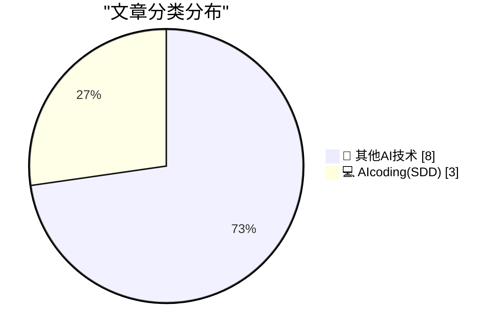
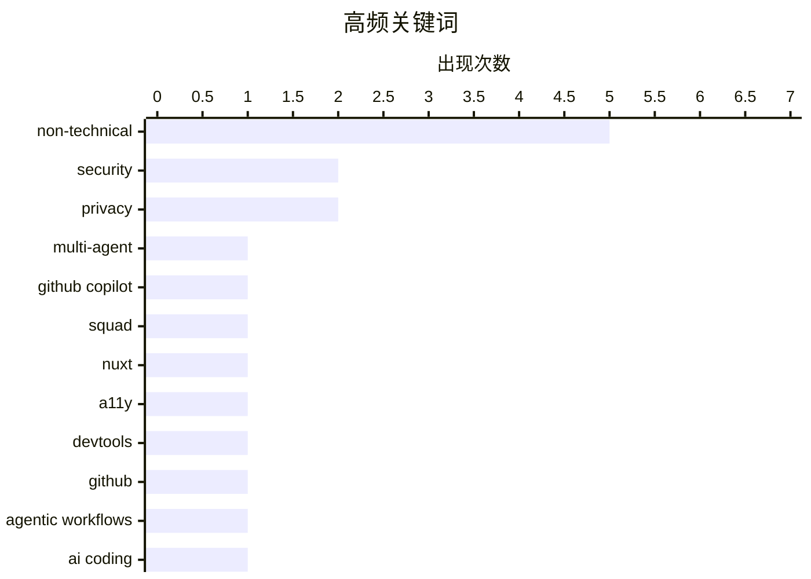

# 📰 AI 博客每日精选 — 2026-04-05

> 来自 98 个技术博客和社交媒体源，AI 精选 Top 11

## 📝 今日看点

今日技术圈聚焦于AI开发工具的协同化与低门槛趋势。多智能体协作系统正简化配置，向仓库内原生和可视化检查演进，同时自动化工作流进一步降低，允许用Markdown等自然语言形式定义任务。另一方面，数据安全与隐私问题持续引发关注，从云平台统一防护到AI服务的隐私争议，凸显了效率提升与安全合规之间的行业张力。

---

## 🏆 今日必读

🥇 **Squad：在仓库内运行可协作、可检查的多智能体工作流**

[Single-prompt AI workflows often hit a performance plateau. Multi-agent systems can push past it, but they usually require a massive amount of setup. ...](https://x.com/github/status/2040777736076034264) — 𝕏 @GitHub · 8 小时前 · 💻 AIcoding(SDD)

> 单提示 AI 工作流常遇性能瓶颈，多智能体系统能突破瓶颈但配置复杂。Squad 是一个基于 GitHub Copilot 的开源项目，可在仓库内直接初始化预配置的 AI 团队。它旨在运行可检查、可预测且可协作的多智能体工作流，简化了传统多智能体系统所需的大量设置工作。该项目展示了如何通过协调的 AI 代理提升开发自动化任务的效率与可控性。

💡 **为什么值得读**: 为开发者提供了无需复杂配置即可在熟悉环境中（代码仓库）部署和调试多 AI 代理协作的实践方案，是提升自动化工作流能力的实用工具。

🏷️ Multi-Agent, GitHub Copilot, Squad

🥈 **Nuxt DevTools 现可实现实时无障碍（A11y）检查**

[Real-time accessibility checks directly in Nuxt DevTools are now a reality. Check out the Nuxt A11y module. It’s built on axe-core and scans your app...](https://x.com/github/status/2040852222544687447) — 𝕏 @GitHub · 3 小时前 · 💻 AIcoding(SDD)

> Nuxt A11y 模块将实时无障碍检查直接集成到 Nuxt DevTools 中。该模块基于 axe-core 构建，在开发者导航应用时进行扫描，直接在页面上高亮显示 WCAG 合规性问题，且对生产环境零影响。通过帮助团队在早期发现问题，该模块有潜力让无数 Nuxt 应用默认变得更具有包容性。这改变了开发过程中发现和修复无障碍问题的传统滞后流程。

💡 **为什么值得读**: 将无障碍测试左移并无缝集成到开发工具中，能极大提升开发效率并降低修复成本，是构建包容性 Web 应用的重要实践。

🏷️ Nuxt, A11y, DevTools

🥉 **GitHub 智能体工作流：用 Markdown 自动化仓库操作**

[Writing code to automate your repo? Great. Writing Markdown to do it? Pretty sick. GitHub Agentic Workflows: now in technical preview.](https://x.com/github/status/2040546623818711278) — 𝕏 @GitHub · 23 小时前 · 💻 AIcoding(SDD)

> GitHub Agentic Workflows 已进入技术预览阶段，它允许用户使用 Markdown 而非代码来编写自动化仓库工作流。这意味着开发者可以用更接近自然语言的 Markdown 语法来定义和执行复杂的仓库自动化任务。该功能旨在降低自动化脚本的编写门槛，提升可读性和易用性。它代表了 AI 驱动的工作流自动化向更直观、更易访问的方向演进。

💡 **为什么值得读**: 通过降低自动化脚本的编写门槛（使用 Markdown），让更多开发者能便捷地利用 AI 能力提升仓库管理效率，是低代码/无代码理念在 DevOps 领域的新体现。

🏷️ GitHub, Agentic Workflows, AI Coding, Automation

4️⃣ **特朗普在个人博客发布针对伊朗的激烈言论**

[An Easter Morning Message of Hope From the Winner of the FIFA Peace Prize](https://truthsocial.com/@realDonaldTrump/posts/116351998782539414) — daringfireball.net · 5 小时前 · 🔬 其他AI技术

> 美国时任总统唐纳德·特朗普在其个人博客上发布了一条针对伊朗的激烈信息，声称周二将是“发电厂日”和“桥梁日”，并使用了攻击性语言要求伊朗“打开海峡”。日本伊朗大使馆引用了该言论，并批评其“文明和智力水平低下”以及“可耻的热情”。这是一条具有高度挑衅性和争议性的政治声明，引发了外交层面的批评。

💡 **为什么值得读**: 展示了时任国家元首通过非传统渠道（个人博客）发布极具争议性外交声明的罕见案例，反映了数字时代政治沟通的复杂性。

🏷️ Politics, Non-Technical

5️⃣ **Material Security：统一云工作空间安全**

[Material Security](https://material.security/lp-cloud-office-security?utm_source=third-party&amp;utm_medium=email&amp;utm_campaign=20260330-daringfireball) — daringfireball.net · 20 小时前 · 🔬 其他AI技术

> Material Security 是一家云办公安全解决方案提供商，其核心观点是大多数安全团队面临的不是人才问题，而是警报噪音问题。该平台将电子邮件、文件和账户的安全检测与响应统一到一个地方，旨在弥补 Google 和 Microsoft 原生安全方案的不足。它专注于自动化处理手动网络钓鱼修复、追踪高风险 OAuth 权限和审计文件共享等繁琐任务。其目标是提供真正有效的安全方案，减少企业安全团队的手动工作量。

💡 **为什么值得读**: 针对云办公环境安全运营中普遍存在的“警报疲劳”问题，提供了一个集成的自动化解决方案，对提升企业安全运营效率有直接参考价值。

🏷️ Security, Non-Technical

---

## 📊 数据概览

| 扫描源 | 抓取文章 | 时间范围 | 精选 |
|:---:|:---:|:---:|:---:|
| 74/98 | 2450 篇 → 11 篇 | 24h | **11 篇** |

### 分类分布



### 高频关键词



<details>
<summary>📈 纯文本关键词图（终端友好）</summary>

```
non-technical  │ ████████████████████ 5
security       │ ████████░░░░░░░░░░░░ 2
privacy        │ ████████░░░░░░░░░░░░ 2
multi-agent    │ ████░░░░░░░░░░░░░░░░ 1
github copilot │ ████░░░░░░░░░░░░░░░░ 1
squad          │ ████░░░░░░░░░░░░░░░░ 1
nuxt           │ ████░░░░░░░░░░░░░░░░ 1
a11y           │ ████░░░░░░░░░░░░░░░░ 1
devtools       │ ████░░░░░░░░░░░░░░░░ 1
github         │ ████░░░░░░░░░░░░░░░░ 1
```

</details>

### 🏷️ 话题标签

**non-technical**(5) · **security**(2) · **privacy**(2) · multi-agent(1) · github copilot(1) · squad(1) · nuxt(1) · a11y(1) · devtools(1) · github(1) · agentic workflows(1) · ai coding(1) · automation(1) · politics(1) · sponsorship(1) · ios(1) · perplexity(1) · lawsuit(1) · reflection(1) · email(1)

---

====================

## 🔬 其他AI技术

### 1. 特朗普在个人博客发布针对伊朗的激烈言论

[An Easter Morning Message of Hope From the Winner of the FIFA Peace Prize](https://truthsocial.com/@realDonaldTrump/posts/116351998782539414) — **daringfireball.net** · 5 小时前 · ⭐ 5/25

> 美国时任总统唐纳德·特朗普在其个人博客上发布了一条针对伊朗的激烈信息，声称周二将是“发电厂日”和“桥梁日”，并使用了攻击性语言要求伊朗“打开海峡”。日本伊朗大使馆引用了该言论，并批评其“文明和智力水平低下”以及“可耻的热情”。这是一条具有高度挑衅性和争议性的政治声明，引发了外交层面的批评。

🏷️ Politics, Non-Technical

📌 其他AI技术

---

### 2. Material Security：统一云工作空间安全

[Material Security](https://material.security/lp-cloud-office-security?utm_source=third-party&amp;utm_medium=email&amp;utm_campaign=20260330-daringfireball) — **daringfireball.net** · 20 小时前 · ⭐ 5/25

> Material Security 是一家云办公安全解决方案提供商，其核心观点是大多数安全团队面临的不是人才问题，而是警报噪音问题。该平台将电子邮件、文件和账户的安全检测与响应统一到一个地方，旨在弥补 Google 和 Microsoft 原生安全方案的不足。它专注于自动化处理手动网络钓鱼修复、追踪高风险 OAuth 权限和审计文件共享等繁琐任务。其目标是提供真正有效的安全方案，减少企业安全团队的手动工作量。

🏷️ Security, Non-Technical

📌 其他AI技术

---

### 3. Daring Fireball 网站赞助机会开放

[Sponsorship Openings for Daring Fireball](https://daringfireball.net/feeds/sponsors/) — **daringfireball.net** · 20 小时前 · ⭐ 5/25

> Daring Fireball（DF）博客的赞助位销售近期非常活跃，原计划下一次开放要到七月底。由于日程调整，下周（发布时）突然出现了一个空位。该博客受众是对高质量和好设计着迷的人群。公告鼓励拥有相关产品或服务的潜在赞助商联系，特别是能够快速行动锁定下周空位的商家。这反映了该技术博客的商业影响力和受众价值。

🏷️ Sponsorship, Non-Technical

📌 其他AI技术

---

### 4. iOS 26 比 iOS 18 感觉更快：系统动画提速

[iOS 26 Feels Faster Than iOS 18](https://daringfireball.net/linked/2026/04/03/ios-18-update-for-holdouts) — **daringfireball.net** · 20 小时前 · ⭐ 5/25

> 作者在将主力机从运行 iOS 26 的 iPhone 换回运行 iOS 18.7.7 的 iPhone 后，明显感觉到前者更快。这种速度差异主要源于 iOS 26 在去年夏季测试周期后期对大量系统级动画进行了提速，例如从屏幕底部上滑返回主屏幕的动画。虽然用户当时已注意到这一变化，但后续讨论不多。实际对比使用旧系统后，这种性能提升的感知变得尤为强烈。

🏷️ iOS, Non-Technical

📌 其他AI技术

---

### 5. 集体诉讼称 Perplexity 的“无痕模式”是“骗局”

[Class Action Lawsuit Says Perplexity’s ‘Incognito Mode’ Is a ‘Sham’](https://arstechnica.com/tech-policy/2026/04/perplexitys-incognito-mode-is-a-sham-lawsuit-says/) — **daringfireball.net** · 20 小时前 · ⭐ 5/25

> 一项集体诉讼指控 AI 搜索公司 Perplexity 的“无痕模式”是虚假的。诉讼通过开发者工具发现，即使用户启用该模式，初始提示和后续点击的跟进问题仍会被共享。对于非订阅用户，隐私问题更严重，其整个对话可通过一个 URL 被第三方（如 Meta 和 Google）访问。更令人不安的是，聊天内容还会被分享给 Perplexity 员工的个人 Slack 频道。这严重违背了其宣称的隐私承诺。

🏷️ Perplexity, Privacy, Lawsuit

📌 其他AI技术

---

### 6. 事情没那么复杂

[It's not that deep](https://idiallo.com/blog/its-not-that-deep?src=feed) — **idiallo.com** · 13 小时前 · ⭐ 5/25

> 作者反思了自己在周日夜晚独自思考人生和灵感的习惯。他回忆起年轻时可以不顾一切地将涌现的想法付诸实践，但现在因家庭责任而变得更加审慎。文章探讨了创意激情与成人责任之间的平衡，以及如何应对那些“本可以”但未实施的想法的感受。核心观点是，并非每个灵感都需要或应该被立即行动，接受生活的现状和优先级也是一种成熟。

🏷️ Reflection, Non-Technical

📌 其他AI技术

---

### 7. BrowserStack 内部有人在泄露用户邮箱地址

[Someone at BrowserStack is Leaking Users' Email Address](https://shkspr.mobi/blog/2026/04/someone-at-browserstack-is-leaking-users-email-address/) — **shkspr.mobi** · 9 小时前 · ⭐ 5/25

> 作者通过为每个注册服务使用唯一邮箱地址的方法，追踪到其 BrowserStack 注册邮箱收到了非 BrowserStack 发来的营销邮件，从而推断 BrowserStack 内部有人员泄露了用户邮箱。这种方法能有效验证邮件来源合法性、防止凭证填充攻击，并能精确定位数据泄露方。此次事件暴露了该服务提供商可能存在内部数据管理或安全控制问题。

🏷️ Privacy, Email, Security

📌 其他AI技术

---

### 8. Stamp It! All Programs Must Report Their Version

[Stamp It! All Programs Must Report Their Version](https://michael.stapelberg.ch/posts/2026-04-05-stamp-it-all-programs-must-report-their-version/) — **michael.stapelberg.ch** · 7 小时前 · ⭐ 5/25

> Click here to expand the full nix derivation show output if you are curious

🏷️ Versioning, Nix

📌 其他AI技术

---

## 💻 AIcoding(SDD)

### 9. Squad：在仓库内运行可协作、可检查的多智能体工作流

[Single-prompt AI workflows often hit a performance plateau. Multi-agent systems can push past it, but they usually require a massive amount of setup. ...](https://x.com/github/status/2040777736076034264) — **𝕏 @GitHub** · 8 小时前 · ⭐ 22/25

> 单提示 AI 工作流常遇性能瓶颈，多智能体系统能突破瓶颈但配置复杂。Squad 是一个基于 GitHub Copilot 的开源项目，可在仓库内直接初始化预配置的 AI 团队。它旨在运行可检查、可预测且可协作的多智能体工作流，简化了传统多智能体系统所需的大量设置工作。该项目展示了如何通过协调的 AI 代理提升开发自动化任务的效率与可控性。

🏷️ Multi-Agent, GitHub Copilot, Squad

📌 AIcoding(SDD)

---

### 10. Nuxt DevTools 现可实现实时无障碍（A11y）检查

[Real-time accessibility checks directly in Nuxt DevTools are now a reality. Check out the Nuxt A11y module. It’s built on axe-core and scans your app...](https://x.com/github/status/2040852222544687447) — **𝕏 @GitHub** · 3 小时前 · ⭐ 20/25

> Nuxt A11y 模块将实时无障碍检查直接集成到 Nuxt DevTools 中。该模块基于 axe-core 构建，在开发者导航应用时进行扫描，直接在页面上高亮显示 WCAG 合规性问题，且对生产环境零影响。通过帮助团队在早期发现问题，该模块有潜力让无数 Nuxt 应用默认变得更具有包容性。这改变了开发过程中发现和修复无障碍问题的传统滞后流程。

🏷️ Nuxt, A11y, DevTools

📌 AIcoding(SDD)

---

### 11. GitHub 智能体工作流：用 Markdown 自动化仓库操作

[Writing code to automate your repo? Great. Writing Markdown to do it? Pretty sick. GitHub Agentic Workflows: now in technical preview.](https://x.com/github/status/2040546623818711278) — **𝕏 @GitHub** · 23 小时前 · ⭐ 20/25

> GitHub Agentic Workflows 已进入技术预览阶段，它允许用户使用 Markdown 而非代码来编写自动化仓库工作流。这意味着开发者可以用更接近自然语言的 Markdown 语法来定义和执行复杂的仓库自动化任务。该功能旨在降低自动化脚本的编写门槛，提升可读性和易用性。它代表了 AI 驱动的工作流自动化向更直观、更易访问的方向演进。

🏷️ GitHub, Agentic Workflows, AI Coding, Automation

📌 AIcoding(SDD)

---

====================

*生成于 2026-04-05 21:30 | 扫描 74 源 → 获取 2450 篇 → 精选 11 篇*
*基于 [Hacker News Popularity Contest 2025](https://refactoringenglish.com/tools/hn-popularity/) RSS 源列表，由 [Andrej Karpathy](https://x.com/karpathy) 推荐*
*由「懂点儿AI」制作，欢迎关注同名微信公众号获取更多 AI 实用技巧 💡*
