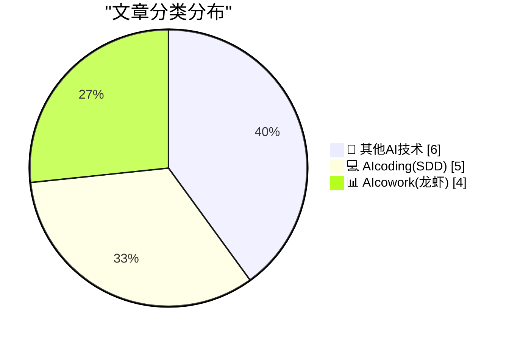
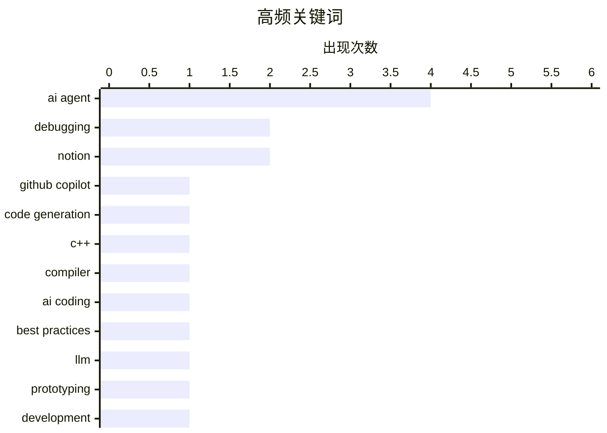

# 📰 AI 博客每日精选 — 2026-04-06

> 来自 98 个技术博客和社交媒体源，AI 精选 Top 15

## 📝 今日看点

今日技术圈聚焦于AI驱动的开发协作与底层算力挑战两大核心趋势。AI编程助手正从代码生成向全流程智能协作演进，深度融入云端开发、原型设计与工作流优化。与此同时，行业对AI生成代码的可靠性保持审慎，强调人工理解与把控的必要性。而算力紧缺的宏观压力，正成为制约AI发展的关键瓶颈，预示未来将进入资源配给与成本博弈的新阶段。

---

## 🏆 今日必读

🥇 **GitHub Copilot 云端代理变得更灵活**

[GitHub Copilot cloud agent just got a lot more flexible ✨ You can now it use it to research, plan, and make code changes without needing to open a pu...](https://x.com/github/status/2041206961945940170) — 𝕏 @GitHub · 4 小时前 · 💻 AIcoding(SDD)

> GitHub Copilot 云端代理功能升级，支持在无需先创建拉取请求的情况下进行研究、规划和代码变更。用户现在可以直接在云端环境中，利用 Copilot 进行代码探索和修改。这一改进旨在简化开发流程，将 AI 辅助编程的环节前置。核心是让开发者能更自由、更早地借助 AI 进行代码构思与实施。

💡 **为什么值得读**: 对于希望提升开发前期效率、探索 AI 辅助编程新工作流的开发者，此文介绍了 Copilot 一项降低使用门槛的重要功能更新。

🏷️ GitHub Copilot, AI Agent, Code Generation

🥈 **学习阅读 C++ 编译器错误：眼前没有 -> 时却报错非法使用 ->**

[Learning to read C++ compiler errors: Illegal use of -> when there is no -> in sight](https://devblogs.microsoft.com/oldnewthing/20260406-00/?p=112208) — devblogs.microsoft.com/oldnewthing · 7 小时前 · 💻 AIcoding(SDD)

> 文章探讨了 C++ 编译器中一种令人困惑的错误信息场景：编译器报告使用了 `->` 运算符，但代码中并未直接出现。关键在于错误可能源于宏展开或模板实例化等底层过程。作者指出，当编译器抱怨你没有写的东西时，应该去找到真正写入这些代码的‘元凶’。核心观点是理解编译器错误的根源，需要追踪代码在预处理和编译后的真实形态。

💡 **为什么值得读**: 这篇文章提供了一个诊断复杂 C++ 编译错误的实用思路，能帮助开发者节省大量调试时间。

🏷️ C++, Compiler, Debugging

🥉 **AI 用 12 分钟完成，我花了 10 小时修复**

[AI Did It in 12 Minutes. It Took Me 10 Hours to Fix It](https://idiallo.com/blog/it-took-me-10-hours-to-fix-ai-code?src=feed) — idiallo.com · 8 小时前 · 💻 AIcoding(SDD)

> 作者分享了一次使用 AI 生成代码后，耗费大量时间进行修复和理解的亲身经历。AI 虽然能快速产出代码，但生成的代码可能存在隐藏问题、不符合特定需求或难以理解。作者坚持在个人项目中深入理解每一行代码，这导致项目进度缓慢，但也避免了技术债务。结论是，盲目接受 AI 生成的代码可能带来更长的后期调试成本，理解与适配至关重要。

💡 **为什么值得读**: 这是一个关于 AI 编程工具实际成本与风险的清醒案例，提醒开发者平衡效率与代码质量。

🏷️ AI Coding, Debugging, Best Practices

4️⃣ **使用大语言模型进行原型设计**

[Prototyping with LLMs](https://blog.jim-nielsen.com/2026/prototyping-with-llm/) — blog.jim-nielsen.com · 2 小时前 · 💻 AIcoding(SDD)

> 文章探讨了如何利用大语言模型（LLM）进行快速原型设计。作者引用《圣经》段落类比，强调在投入大量资源前进行评估和规划的重要性。使用 LLM 可以快速生成想法、代码片段或设计草图，从而低成本地验证概念可行性。核心观点是将 LLM 视为一个强大的头脑风暴和快速验证工具，而非直接生产最终产品的解决方案。

💡 **为什么值得读**: 它为如何策略性地将 LLM 融入创意和开发工作流，提供了一个具体且富有哲理的视角。

🏷️ LLM, Prototyping, Development

5️⃣ **Notion 内部实际使用的智能体系列：首期“消息废话雷达”**

[RT Hurley: Starting a weekly series of Agents we actually use at @NotionHQ. First up is "Messaging BS Radar". Drop in any doc, message, file, or image...](https://x.com/NotionHQ/status/2041203642477535403) — 𝕏 @NotionHQ · 4 小时前 · 📊 AIcowork(龙虾)

> Notion 团队开始分享其内部实际使用的 AI 智能体（Agent），首个智能体名为“消息废话雷达”。该智能体能从 skeptical customer（持怀疑态度的客户）视角，批判性地分析任何文档、消息、文件或图像。它能标记模糊的声明、微弱的差异化表述以及任何站不住脚的内容，并提供重写建议。其分析能力基于用户研究报告、客户通话记录、实时用户画像和竞争情报等多源数据。

💡 **为什么值得读**: 通过了解 Notion 内部如何用 AI 提升内容质量，可以为构建企业级实用 AI 工具提供直接灵感。

🏷️ AI Agent, Content Critique, Notion

---

## 📊 数据概览

| 扫描源 | 抓取文章 | 时间范围 | 精选 |
|:---:|:---:|:---:|:---:|
| 74/98 | 2294 篇 → 18 篇 | 24h | **15 篇** |

### 分类分布



### 高频关键词



<details>
<summary>📈 纯文本关键词图（终端友好）</summary>

```
ai agent        │ ████████████████████ 4
debugging       │ ██████████░░░░░░░░░░ 2
notion          │ ██████████░░░░░░░░░░ 2
github copilot  │ █████░░░░░░░░░░░░░░░ 1
code generation │ █████░░░░░░░░░░░░░░░ 1
c++             │ █████░░░░░░░░░░░░░░░ 1
compiler        │ █████░░░░░░░░░░░░░░░ 1
ai coding       │ █████░░░░░░░░░░░░░░░ 1
best practices  │ █████░░░░░░░░░░░░░░░ 1
llm             │ █████░░░░░░░░░░░░░░░ 1
```

</details>

### 🏷️ 话题标签

**ai agent**(4) · **debugging**(2) · **notion**(2) · github copilot(1) · code generation(1) · c++(1) · compiler(1) · ai coding(1) · best practices(1) · llm(1) · prototyping(1) · development(1) · content critique(1) · fine-tuning(1) · claude(1) · code(1) · leak(1) · typescript(1) · ai compute(1) · infrastructure(1)

---

====================

## 🔬 其他AI技术

### 1. 算力紧缺的下一步是什么？

[What next for the compute crunch?](https://martinalderson.com/posts/what-next-for-the-compute-crunch/?utm_source=rss&amp;utm_medium=rss&amp;utm_campaign=feed) — **martinalderson.com** · 21 小时前 · ⭐ 16/25

> 文章指出，AI 对计算能力的需求呈指数级增长，而供应限制正严重加剧。未来 18-24 个月，算力领域将由短缺、配给和价格发现所定义。核心问题是供需之间的巨大缺口正在形成。结论是，算力紧缺将成为塑造 AI 行业发展轨迹的关键制约因素。

🏷️ AI Compute, Infrastructure, Trends

📌 其他AI技术

---

### 2. OpenAI 宣布启动安全研究员计划，支持AI安全与对齐的独立研究

[Introducing the OpenAI Safety Fellowship, a new program supporting independent research on AI safety and alignment—and the next generation of talent....](https://x.com/OpenAI/status/2041202511647019251) — **𝕏 @OpenAI** · 4 小时前 · ⭐ 11/25

> OpenAI 正式推出“安全研究员”计划，旨在资助AI安全与对齐领域的独立研究并培养下一代人才。该计划将为外部研究人员提供资金和资源，以探索减轻AI系统风险的创新方法。其核心目标是支持那些可能无法获得传统资助渠道、但对AI安全至关重要的研究项目。这表明OpenAI正试图通过外部协作来应对其模型带来的长期安全挑战。

🏷️ AI Safety, Fellowship, Research

📌 其他AI技术

---

### 3. OpenAI 首席财务官：公司尚未做好2026年IPO准备，收入恐难支撑支出承诺

[News: OpenAI CFO Doesn't Believe Company Ready For IPO, Unsure Revenue Will Support Commitments](https://www.wheresyoured.at/openai-cfo-news/) — **wheresyoured.at** · 6 小时前 · ⭐ 10/25

> OpenAI首席财务官莎拉·弗莱尔表示，公司预计在2026年仍不具备上市条件。主要原因在于公司庞大的支出承诺存在风险，且不确定未来的收入增长能否支撑这些开支。这一内部评估揭示了这家AI巨头在追求AGI（通用人工智能）的宏伟目标与维持商业可持续性之间面临的现实压力。

🏷️ OpenAI, Finance, IPO

📌 其他AI技术

---

### 4. Zed：一个为广泛读者需求而生的字体超级家族

[[Sponsor] Zed, a Font Superfamily](https://www.typotheque.com/blog/zed-a-sans-for-the-needs-of-21century/?utm_source=df) — **daringfireball.net** · 2 小时前 · ⭐ 5/25

> Zed是一个以“读者实际需要什么”为核心问题从头设计的字体系统。它在法国一家眼科医院与视障患者进行的测试中，其“Zed Text”版本在所有患者组别的阅读速度上都超越了Helvetica。该字体系统包含针对正文和展示两种不同功能优化的光学版本，并拥有四个可变轴。其设计目标不是追求样本美观，而是为最广泛的读者群体提供实用性。

🏷️ Font, Typography, Accessibility

📌 其他AI技术

---

### 5. 苹果“小访达”角色主演九支新视频，登陆TikTok与YouTube

[Little Finder Guy Stars in Nine New Videos on TikTok and YouTube](https://www.macrumors.com/2026/04/02/little-finder-guy-tiktok-youtube/) — **daringfireball.net** · 4 小时前 · ⭐ 5/25

> 苹果本周发布了九支以经典Mac OS“小访达”角色为主角的短视频，并在TikTok和YouTube平台同步上线。在TikTok上，这些视频的缩略图可以拼合成一个完整的“小访达”马赛克图案。此举是苹果利用复古品牌元素进行社交媒体营销的最新案例。

🏷️ Marketing, Video, Apple

📌 其他AI技术

---

### 6. 你的老板想用监控数据来削减你的工资

[Pluralistic: Your boss wants to use surveillance data to cut your wages (06 Apr 2026)](https://pluralistic.net/2026/04/06/empiricism-washing/) — **pluralistic.net** · 12 小时前 · ⭐ 5/25

> 文章核心揭露了职场中一种新兴趋势：雇主利用日益精细的员工监控数据（如工作效率、键盘活动等）作为降低薪酬的依据。作者将这种现象称为“实证主义洗涤”，指出其本质是将监控技术包装成客观管理工具，实则侵犯劳工权利。这标志着技术权利与劳工权利的斗争进入了新阶段，算法管理正成为加剧职场不公的新手段。

🏷️ AI Ethics, Labor, Surveillance

📌 其他AI技术

---

## 💻 AIcoding(SDD)

### 7. GitHub Copilot 云端代理变得更灵活

[GitHub Copilot cloud agent just got a lot more flexible ✨ You can now it use it to research, plan, and make code changes without needing to open a pu...](https://x.com/github/status/2041206961945940170) — **𝕏 @GitHub** · 4 小时前 · ⭐ 23/25

> GitHub Copilot 云端代理功能升级，支持在无需先创建拉取请求的情况下进行研究、规划和代码变更。用户现在可以直接在云端环境中，利用 Copilot 进行代码探索和修改。这一改进旨在简化开发流程，将 AI 辅助编程的环节前置。核心是让开发者能更自由、更早地借助 AI 进行代码构思与实施。

🏷️ GitHub Copilot, AI Agent, Code Generation

📌 AIcoding(SDD)

---

### 8. 学习阅读 C++ 编译器错误：眼前没有 -> 时却报错非法使用 ->

[Learning to read C++ compiler errors: Illegal use of -> when there is no -> in sight](https://devblogs.microsoft.com/oldnewthing/20260406-00/?p=112208) — **devblogs.microsoft.com/oldnewthing** · 7 小时前 · ⭐ 22/25

> 文章探讨了 C++ 编译器中一种令人困惑的错误信息场景：编译器报告使用了 `->` 运算符，但代码中并未直接出现。关键在于错误可能源于宏展开或模板实例化等底层过程。作者指出，当编译器抱怨你没有写的东西时，应该去找到真正写入这些代码的‘元凶’。核心观点是理解编译器错误的根源，需要追踪代码在预处理和编译后的真实形态。

🏷️ C++, Compiler, Debugging

📌 AIcoding(SDD)

---

### 9. AI 用 12 分钟完成，我花了 10 小时修复

[AI Did It in 12 Minutes. It Took Me 10 Hours to Fix It](https://idiallo.com/blog/it-took-me-10-hours-to-fix-ai-code?src=feed) — **idiallo.com** · 8 小时前 · ⭐ 21/25

> 作者分享了一次使用 AI 生成代码后，耗费大量时间进行修复和理解的亲身经历。AI 虽然能快速产出代码，但生成的代码可能存在隐藏问题、不符合特定需求或难以理解。作者坚持在个人项目中深入理解每一行代码，这导致项目进度缓慢，但也避免了技术债务。结论是，盲目接受 AI 生成的代码可能带来更长的后期调试成本，理解与适配至关重要。

🏷️ AI Coding, Debugging, Best Practices

📌 AIcoding(SDD)

---

### 10. 使用大语言模型进行原型设计

[Prototyping with LLMs](https://blog.jim-nielsen.com/2026/prototyping-with-llm/) — **blog.jim-nielsen.com** · 2 小时前 · ⭐ 21/25

> 文章探讨了如何利用大语言模型（LLM）进行快速原型设计。作者引用《圣经》段落类比，强调在投入大量资源前进行评估和规划的重要性。使用 LLM 可以快速生成想法、代码片段或设计草图，从而低成本地验证概念可行性。核心观点是将 LLM 视为一个强大的头脑风暴和快速验证工具，而非直接生产最终产品的解决方案。

🏷️ LLM, Prototyping, Development

📌 AIcoding(SDD)

---

### 11. Anthropic 意外泄露整个 Claude Code CLI 源代码

[Anthropic Accidentally Leaked the Entire Claude Code CLI Source Code](https://arstechnica.com/ai/2026/03/entire-claude-code-cli-source-code-leaks-thanks-to-exposed-map-file/) — **daringfireball.net** · 2 小时前 · ⭐ 17/25

> Anthropic 在发布 Claude Code npm 包版本 2.1.88 时，意外包含了一个源代码映射文件。该文件可被用于访问 Claude Code CLI 的完整源代码，涉及近 2000 个 TypeScript 文件和超过 51.2 万行代码。安全研究员 Chaofan Shou 率先在 X 上公开指出了这一问题，并提供了包含这些文件的存档链接。随后，代码库被上传至代码托管平台，引发了关于 AI 代码工具安全性和知识产权保护的讨论。

🏷️ Claude, Code, Leak, TypeScript

📌 AIcoding(SDD)

---

## 📊 AIcowork(龙虾)

### 12. Notion 内部实际使用的智能体系列：首期“消息废话雷达”

[RT Hurley: Starting a weekly series of Agents we actually use at @NotionHQ. First up is "Messaging BS Radar". Drop in any doc, message, file, or image...](https://x.com/NotionHQ/status/2041203642477535403) — **𝕏 @NotionHQ** · 4 小时前 · ⭐ 20/25

> Notion 团队开始分享其内部实际使用的 AI 智能体（Agent），首个智能体名为“消息废话雷达”。该智能体能从 skeptical customer（持怀疑态度的客户）视角，批判性地分析任何文档、消息、文件或图像。它能标记模糊的声明、微弱的差异化表述以及任何站不住脚的内容，并提供重写建议。其分析能力基于用户研究报告、客户通话记录、实时用户画像和竞争情报等多源数据。

🏷️ AI Agent, Content Critique, Notion

📌 AIcowork(龙虾)

---

### 13. Notion 自定义智能体新增清晰可见性，便于微调

[New: clearer visibility into your Custom Agents, so you can fine-tune them without the guesswork. (Perfect time to experiment, they're free through Ma...](https://x.com/NotionHQ/status/2041199084573475178) — **𝕏 @NotionHQ** · 4 小时前 · ⭐ 20/25

> Notion 为其自定义智能体（Custom Agents）功能推出了更清晰的可视化界面。这一更新让用户能够更直观地了解智能体的运行情况，从而进行精细调整，无需再靠猜测。官方同时提醒，该功能在 5 月 3 日前免费，是进行实验的绝佳时机。此举旨在降低用户使用和优化自定义 AI 工作流的门槛。

🏷️ AI Agent, Fine-tuning, Notion

📌 AIcowork(龙虾)

---

### 14. Google Workspace 与 Gemini 助力 SPH Media 提升新闻编辑室效率

[📰 What if AI helped you tell better stories, faster? At SPH Media, Google Workspace with Gemini and @NotebookLM cut translation time in half and de...](https://x.com/GoogleWorkspace/status/2041245308273725700) — **𝕏 @GoogleWorkspace** · 1 小时前 · ⭐ 15/25

> 新加坡报业控股（SPH Media）利用 Google Workspace 集成 Gemini 和 NotebookLM，显著提升了新闻生产效率。具体成果包括将翻译时间缩短了一半，以及在使用简单提示生成视觉效果时取得了 99% 的成功率。这些 AI 工具正在帮助新闻编辑部更快地讲述更好的故事。案例展示了 AI 在内容创作和本地化流程中的实际应用价值。

🏷️ Gemini, Google Workspace, Productivity

📌 AIcowork(龙虾)

---

### 15. Slack：AI 智能体的真实影响力源于真实用例

[AI agents promise transformation, but real impact comes from real use cases. Join us to see how industry leaders are driving business results with par...](https://x.com/SlackHQ/status/2041185707641712661) — **𝕏 @SlackHQ** · 5 小时前 · ⭐ 14/25

> Slack 强调，AI 智能体的真正影响力来自于解决实际业务场景，而非空谈转型。他们通过一场活动，分享了行业领袖如何利用合作伙伴的 AI 智能体在 Slack 内驱动业务成果。这些用例涵盖简化工作流、加速客户支持和提升销售生产力等方面。来自 Vercel、Notion 和 Slack 的专家将分享经过验证的策略和可操作的见解。活动旨在帮助团队识别正确的 AI 智能体机会并衡量其影响。

🏷️ AI Agent, Slack, Business Use Case

📌 AIcowork(龙虾)

---

====================

*生成于 2026-04-06 21:37 | 扫描 74 源 → 获取 2294 篇 → 精选 15 篇*
*基于 [Hacker News Popularity Contest 2025](https://refactoringenglish.com/tools/hn-popularity/) RSS 源列表，由 [Andrej Karpathy](https://x.com/karpathy) 推荐*
*由「懂点儿AI」制作，欢迎关注同名微信公众号获取更多 AI 实用技巧 💡*
