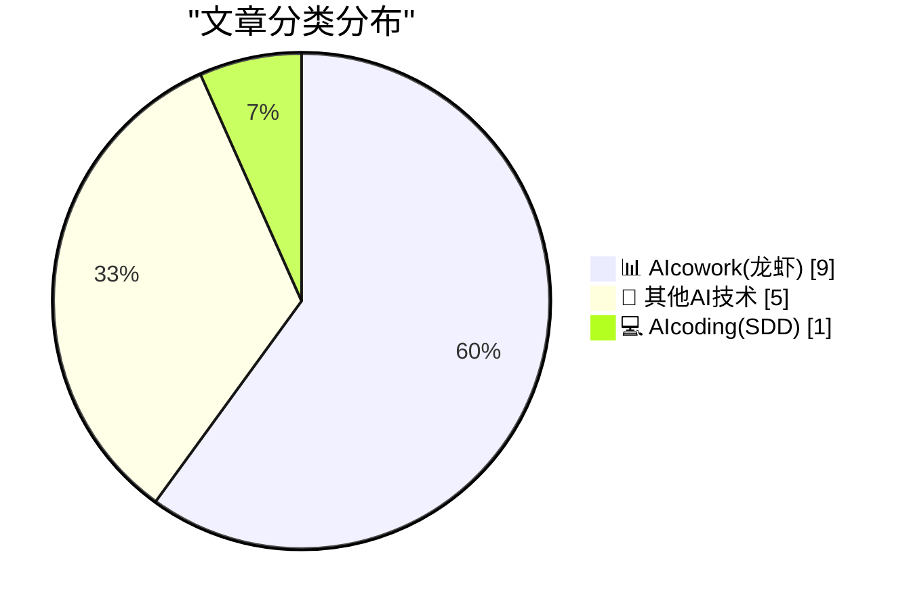
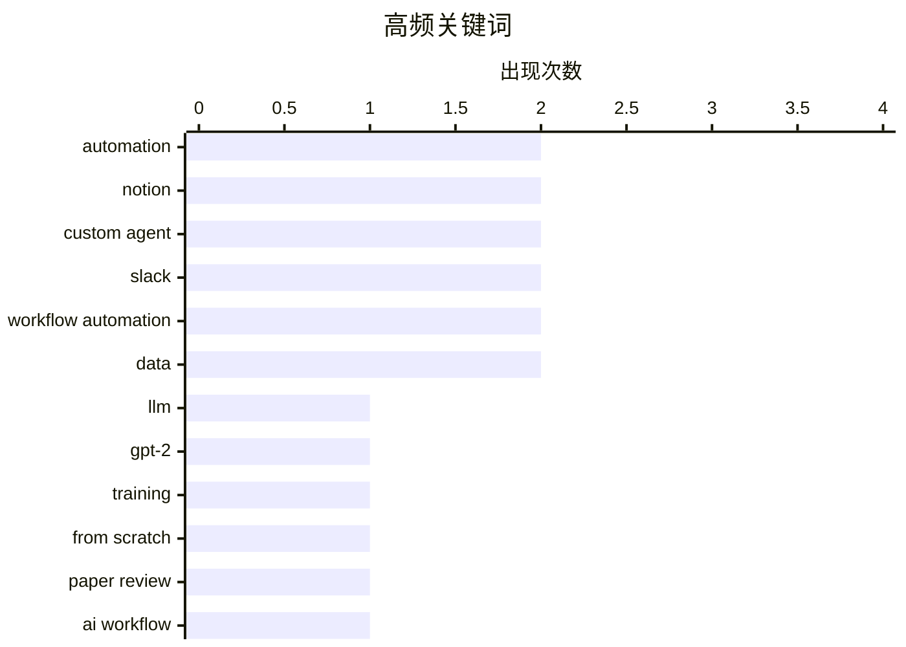

# 📰 AI 博客每日精选 — 2026-04-07

> 来自 98 个技术博客和社交媒体源，AI 精选 Top 15

## 📝 今日看点

今日技术圈的核心焦点在于AI与工作流的深度融合。一方面，AI正从单纯的生成工具演变为具备记忆与持续交互能力的智能工作伙伴，致力于提升专业场景下的产出质量与严谨性。另一方面，以Notion为代表的平台数据显示，通过连接器构建跨工具自动化流程已成为主流趋势，技术瓶颈正从代码编写转向对现有系统和数据的智能访问与集成能力。

---

## 🏆 今日必读

🥇 **从零开始构建大语言模型，第32i部分——干预：噪声中隐藏着什么？**

[Writing an LLM from scratch, part 32i -- Interventions: what is in the noise?](https://www.gilesthomas.com/2026/04/llm-from-scratch-32i-interventions-what-is-in-the-noise) — gilesthomas.com · 41 分钟前 · 💻 AIcoding(SDD)

> 作者基于Sebastian Raschka的书籍，在本地RTX 3090上从头训练了一个1.63亿参数的GPT-2风格模型。文章的核心是探讨模型输出中的“噪声”成分及其可解释性，通过干预实验来分析这些看似随机的输出是否包含潜在模式或信息。作者试图区分模型生成中的“信号”与纯粹的随机性，以深入理解模型内部的工作机制。最终，作者旨在揭示即使是看似无意义的输出，也可能反映模型的某些内部状态或学习偏差。

💡 **为什么值得读**: 对于想深入理解语言模型内部机制、而非仅仅将其视为黑盒的研究者或开发者，这篇文章提供了宝贵的、基于亲手实践的分析视角。

🏷️ LLM, GPT-2, Training, From Scratch

🥈 **Prism推出新功能：用于审阅技术科学论文的AI工作流**

[RT Kevin Weil 🇺🇸: 💥 New in Prism today: Paper Review, an AI workflow for reviewing technical and scientific papers. This is the opposite of A...](https://x.com/OpenAI/status/2041581000120267067) — 𝕏 @OpenAI · 3 小时前 · 📊 AIcowork(龙虾)

> OpenAI旗下产品Prism推出了名为“Paper Review”的新AI工作流，专门用于审阅技术和科学论文。该功能旨在利用AI提升科学研究的严谨性、正确性和可复现性，与生成低质量内容的“AI垃圾”截然相反。它通过结构化的工作流程，辅助研究者进行深入的论文评审工作。这代表了AI工具正从内容生成向高质量、高严谨性的专业分析辅助角色拓展。

💡 **为什么值得读**: 它展示了AI在提升专业领域工作质量而非制造信息噪音方面的前沿应用，对科研人员和学术工作者具有直接参考价值。

🏷️ Paper Review, AI Workflow, Scientific Rigor

🥉 **Notion公布数据：超过30万个自定义Agent中最常用的5大连接器**

[The data’s in…🥁 We looked across 300,000+ Custom Agents to find the top 5 connectors teams use to automate work across their tools. Here’s how t...](https://x.com/NotionHQ/status/2041551293010075861) — 𝕏 @NotionHQ · 5 小时前 · 📊 AIcowork(龙虾)

> Notion通过分析其平台上超过30万个自定义Agent的使用数据，揭示了用户最常用来跨工具自动化工作的五大连接器。这些数据反映了团队如何利用这些连接器将不同工具串联起来，构建自动化工作流。Notion自身团队也在使用这些连接器来提升效率。该分析为其他团队如何选择和配置自动化工具提供了实际的数据参考和最佳实践范例。

💡 **为什么值得读**: 基于海量真实用户数据得出的工具集成趋势，为规划企业自动化架构和选择集成方案提供了可靠的决策依据。

🏷️ Custom Agents, Automation, Connectors, Notion

4️⃣ **Notion自定义Agent与Slack深度集成，实现工作流自动化**

[Custom Agents 🤝 @SlackHQ Connect your Custom Agent to Slack to monitor channels for requests, extract action items from threads, and route messages...](https://x.com/NotionHQ/status/2041274543470448724) — 𝕏 @NotionHQ · 23 小时前 · 📊 AIcowork(龙虾)

> Notion的自定义Agent功能现已与Slack实现深度连接。用户可以将Agent连接到Slack，以监控频道中的请求、从讨论线程中提取待办事项，并自动将消息路由到正确的工作流中。这种集成旨在减少手动切换和分配任务的操作，提升团队沟通与任务执行的自动化水平。它使得基于对话的协作能够直接触发和执行复杂的后端工作流程。

💡 **为什么值得读**: 清晰地展示了如何将流行的协作工具与AI智能体结合，解决日常工作中信息过载和任务分发的实际痛点。

🏷️ Custom Agent, Slack, Workflow Automation

5️⃣ **RT Notion: Custom Agents 🤝 @SlackHQ Connect your Custom Agent to Slack to monitor channels for requests, extract action items from threads, and rou...**

[RT Notion: Custom Agents 🤝 @SlackHQ Connect your Custom Agent to Slack to monitor channels for requests, extract action items from threads, and rou...](https://x.com/SlackHQ/status/2041560376957861925) — 𝕏 @SlackHQ · 23 小时前 · 📊 AIcowork(龙虾)

> RT Notion<br>Custom Agents 🤝 @SlackHQ <br><br>Connect your Custom Agent to Slack to monitor channels for requests, extract action items from threads, and route messages to the right workflows automat

🏷️ Custom Agent, Slack, Workflow Automation

---

## 📊 数据概览

| 扫描源 | 抓取文章 | 时间范围 | 精选 |
|:---:|:---:|:---:|:---:|
| 73/98 | 2281 篇 → 26 篇 | 24h | **15 篇** |

### 分类分布



### 高频关键词



<details>
<summary>📈 纯文本关键词图（终端友好）</summary>

```
automation          │ ████████████████████ 2
notion              │ ████████████████████ 2
custom agent        │ ████████████████████ 2
slack               │ ████████████████████ 2
workflow automation │ ████████████████████ 2
data                │ ████████████████████ 2
llm                 │ ██████████░░░░░░░░░░ 1
gpt-2               │ ██████████░░░░░░░░░░ 1
training            │ ██████████░░░░░░░░░░ 1
from scratch        │ ██████████░░░░░░░░░░ 1
```

</details>

### 🏷️ 话题标签

**automation**(2) · **notion**(2) · **custom agent**(2) · slack(2) · workflow automation(2) · data(2) · llm(1) · gpt-2(1) · training(1) · from scratch(1) · paper review(1) · ai workflow(1) · scientific rigor(1) · custom agents(1) · connectors(1) · microsoft copilot(1) · context memory(1) · productivity(1) · google vids(1) · ai avatars(1)

---

====================

## 📊 AIcowork(龙虾)

### 1. Prism推出新功能：用于审阅技术科学论文的AI工作流

[RT Kevin Weil 🇺🇸: 💥 New in Prism today: Paper Review, an AI workflow for reviewing technical and scientific papers. This is the opposite of A...](https://x.com/OpenAI/status/2041581000120267067) — **𝕏 @OpenAI** · 3 小时前 · ⭐ 21/25

> OpenAI旗下产品Prism推出了名为“Paper Review”的新AI工作流，专门用于审阅技术和科学论文。该功能旨在利用AI提升科学研究的严谨性、正确性和可复现性，与生成低质量内容的“AI垃圾”截然相反。它通过结构化的工作流程，辅助研究者进行深入的论文评审工作。这代表了AI工具正从内容生成向高质量、高严谨性的专业分析辅助角色拓展。

🏷️ Paper Review, AI Workflow, Scientific Rigor

📌 AIcowork(龙虾)

---

### 2. Notion公布数据：超过30万个自定义Agent中最常用的5大连接器

[The data’s in…🥁 We looked across 300,000+ Custom Agents to find the top 5 connectors teams use to automate work across their tools. Here’s how t...](https://x.com/NotionHQ/status/2041551293010075861) — **𝕏 @NotionHQ** · 5 小时前 · ⭐ 21/25

> Notion通过分析其平台上超过30万个自定义Agent的使用数据，揭示了用户最常用来跨工具自动化工作的五大连接器。这些数据反映了团队如何利用这些连接器将不同工具串联起来，构建自动化工作流。Notion自身团队也在使用这些连接器来提升效率。该分析为其他团队如何选择和配置自动化工具提供了实际的数据参考和最佳实践范例。

🏷️ Custom Agents, Automation, Connectors, Notion

📌 AIcowork(龙虾)

---

### 3. Notion自定义Agent与Slack深度集成，实现工作流自动化

[Custom Agents 🤝 @SlackHQ Connect your Custom Agent to Slack to monitor channels for requests, extract action items from threads, and route messages...](https://x.com/NotionHQ/status/2041274543470448724) — **𝕏 @NotionHQ** · 23 小时前 · ⭐ 21/25

> Notion的自定义Agent功能现已与Slack实现深度连接。用户可以将Agent连接到Slack，以监控频道中的请求、从讨论线程中提取待办事项，并自动将消息路由到正确的工作流中。这种集成旨在减少手动切换和分配任务的操作，提升团队沟通与任务执行的自动化水平。它使得基于对话的协作能够直接触发和执行复杂的后端工作流程。

🏷️ Custom Agent, Slack, Workflow Automation

📌 AIcowork(龙虾)

---

### 4. RT Notion: Custom Agents 🤝 @SlackHQ Connect your Custom Agent to Slack to monitor channels for requests, extract action items from threads, and rou...

[RT Notion: Custom Agents 🤝 @SlackHQ Connect your Custom Agent to Slack to monitor channels for requests, extract action items from threads, and rou...](https://x.com/SlackHQ/status/2041560376957861925) — **𝕏 @SlackHQ** · 23 小时前 · ⭐ 21/25

> RT Notion<br>Custom Agents 🤝 @SlackHQ <br><br>Connect your Custom Agent to Slack to monitor channels for requests, extract action items from threads, and route messages to the right workflows automat

🏷️ Custom Agent, Slack, Workflow Automation

📌 AIcowork(龙虾)

---

### 5. Microsoft Copilot新功能：记住上下文，无需从头开始

[Stop starting from scratch. Tell Copilot to remember and pick up right where you left off.](https://x.com/Microsoft365/status/2041561670699332033) — **𝕏 @Microsoft365** · 4 小时前 · ⭐ 21/25

> Microsoft 365 Copilot推出了一项新特性，能够记住用户的工作上下文。用户现在可以指示Copilot从上次中断的地方继续，而无需每次重复指令或从头开始解释任务。这项功能旨在让AI助手更像一个连贯的协作伙伴，理解工作的延续性。它通过减少重复性交互，显著提升了使用AI辅助完成长篇或复杂任务时的流畅度和效率。

🏷️ Microsoft Copilot, Context Memory, Productivity

📌 AIcowork(龙虾)

---

### 6. Google Vids推出定制虚拟形象功能，满足多样化场景需求

[Look the part with custom avatars. 👔 Need a distinguished avatar in a tuxedo for a gala invite or a relaxed speaker in a company-branded zip-up for...](https://x.com/GoogleWorkspace/status/2041562399300297180) — **𝕏 @GoogleWorkspace** · 4 小时前 · ⭐ 19/25

> Google Workspace的视频创作工具Google Vids推出了自定义虚拟形象功能。用户可以根据不同场合（如正式晚宴邀请或公司内部全员会议）的需求，为虚拟形象选择相应的着装，例如燕尾服或公司品牌的连帽衫。该功能允许企业用符合品牌形象的虚拟形象来制作视频内容。这使得视频创作更具个性化和专业性，无需真人出镜即可制作高质量视频。

🏷️ Google Vids, AI Avatars, Brand Customization

📌 AIcowork(龙虾)

---

### 7. Notion观点：AI时代软件开发的瓶颈已从编码转向访问层

[RT Notion Developers: For a long time, software was limited by how fast people could write code, and how good that code was. As models have improved, ...](https://x.com/NotionHQ/status/2041562647385272827) — **𝕏 @NotionHQ** · 4 小时前 · ⭐ 18/25

> Notion开发者提出，传统软件开发的瓶颈在于编码速度和质量，但随着AI模型的进步，这一约束已基本消失。当前的核心瓶颈转变为“访问”能力，即智能体能够实际触达和交互的应用界面与数据表面。这些交互层位于编码智能体之上，是将提示词转化为真实影响的关键。Notion的自定义Agent正是通过扩展这些交互层，使其能适应用户工作风格，从而突破这一新瓶颈。

🏷️ AI Agents, Automation, Notion

📌 AIcowork(龙虾)

---

### 8. RT Hannah Swann: Slow to respond, personalizing my @NotionHQ AI

[RT Hannah Swann: Slow to respond, personalizing my @NotionHQ AI](https://x.com/NotionHQ/status/2041548665060487179) — **𝕏 @NotionHQ** · 7 小时前 · ⭐ 10/25

> RT Hannah Swann<br>Slow to respond, personalizing my @NotionHQ AI<br> RT Salesforce Admins<br>🤝 Learn directly from the #AwesomeAdmin community at #TDX26.<br><br>Get real-world tips on flows, Agentforce, data, and more to help you level up faster.<br><br>Add these sess

🏷️ Salesforce, Agentforce, Community Learning

📌 AIcowork(龙虾)

---

## 🔬 其他AI技术

### 10. Om Malik 与 Ben Thompson 谈 OpenAI 收购 TBPN：宣传鼓动大师 2.0

[Om Malik and Ben Thompson on OpenAI Buying TBPN](https://om.co/2026/04/02/openai-masters-of-agitprop-2-0/) — **daringfireball.net** · 4 小时前 · ⭐ 5/25

> 文章将 OpenAI 的公关策略与列宁关于报纸作为“集体宣传员、鼓动员和组织者”的论述进行类比，揭示了其独特的沟通方式。核心论点是，OpenAI 首席执行官 Fidji Simo 声称公司“非典型”且正在推动重大技术变革，这使其可以脱离标准的公关准则。作者暗示，这种定位使 OpenAI 能够像现代“真理报”一样，塑造叙事并组织公众认知。结论是，OpenAI 正在运用一种新型的、强大的宣传与组织策略来推进其技术议程。

🏷️ OpenAI, Acquisition, News

📌 其他AI技术

---

### 11. Flighty 机场延误实时地图

[Flighty Airports Meltdown Map](https://flighty.com/airports) — **daringfireball.net** · 4 小时前 · ⭐ 5/25

> 这是一个提供北美主要机场实时延误数据的工具。用户可以通过网页版（包含一个出色的“电视模式”）或 Flighty 应用程序访问该地图。该工具直观地展示了各机场的当前延误时间，便于旅客快速规划行程。其核心价值在于将复杂的空中交通数据可视化，转化为易于理解的实时信息。

🏷️ Flight, Map, Data

📌 其他AI技术

---

### 12. 数据可视化：每一款 iPhone

[The Data Drop: Every iPhone](https://sheets.works/data-viz/every-iphone) — **daringfireball.net** · 5 小时前 · ⭐ 5/25

> 这是一份由 Sheets.works 咨询公司制作的关于历代 iPhone 的数据可视化作品。该公司专门使用 Google Sheets 进行数据分析和可视化。该作品以美观、清晰的方式呈现了 iPhone 自诞生以来所有型号的关键数据。它展示了如何利用常见的办公软件工具创造出具有专业水准的信息图表。

🏷️ iPhone, Data, Visualization

📌 其他AI技术

---

### 13. 多元主义：瑞士的“金发姑娘”光纤模式（2026年4月7日）

[Pluralistic: Switzerland's Goldilocks fiber (07 Apr 2026)](https://pluralistic.net/2026/04/07/swisscom/) — **pluralistic.net** · 14 小时前 · ⭐ 5/25

> 文章以瑞士的“金发姑娘”光纤网络为例，探讨了公共基础设施提供的分层模式。核心论点是，公共供给并非“全有或全无”的二元选择，而是可以像瑞士一样，在政府主导的骨干网和私人竞争的最后接入层之间找到平衡点。这种混合模式既保证了基础网络的普遍性和效率，又在下游激发了服务创新和竞争。结论是，公共提供是一个复杂的、分层次的问题，需要根据具体国情设计精巧的混合模型。

🏷️ Fiber, Policy, EU

📌 其他AI技术

---

### 14. WordPress VIP 泄露了我的电话号码吗？

[Did WordPress VIP leak my phone number?](https://shkspr.mobi/blog/2026/04/did-wordpress-vip-leak-my-phone-number/) — **shkspr.mobi** · 10 小时前 · ⭐ 5/25

> 作者揭露其个人电话号码可能通过 WordPress VIP（归属于 Parse.ly 公司）泄露给了数据经纪公司 Apollo.io。根据 Apollo.io 的回复，电话号码来源被指认为参与其“客户贡献者网络”的 Parse.ly/WPVIP。文章详细追踪了这条数据泄露的可能路径，将矛头指向了企业间用户数据共享的灰色链条。这起事件凸显了在复杂的第三方服务生态中，个人数据如何在不经意间被流转和滥用。

🏷️ WordPress, Privacy, Data Leak

📌 其他AI技术

---

## 💻 AIcoding(SDD)

### 15. 从零开始构建大语言模型，第32i部分——干预：噪声中隐藏着什么？

[Writing an LLM from scratch, part 32i -- Interventions: what is in the noise?](https://www.gilesthomas.com/2026/04/llm-from-scratch-32i-interventions-what-is-in-the-noise) — **gilesthomas.com** · 41 分钟前 · ⭐ 21/25

> 作者基于Sebastian Raschka的书籍，在本地RTX 3090上从头训练了一个1.63亿参数的GPT-2风格模型。文章的核心是探讨模型输出中的“噪声”成分及其可解释性，通过干预实验来分析这些看似随机的输出是否包含潜在模式或信息。作者试图区分模型生成中的“信号”与纯粹的随机性，以深入理解模型内部的工作机制。最终，作者旨在揭示即使是看似无意义的输出，也可能反映模型的某些内部状态或学习偏差。

🏷️ LLM, GPT-2, Training, From Scratch

📌 AIcoding(SDD)

---

====================

*生成于 2026-04-07 21:41 | 扫描 73 源 → 获取 2281 篇 → 精选 15 篇*
*基于 [Hacker News Popularity Contest 2025](https://refactoringenglish.com/tools/hn-popularity/) RSS 源列表，由 [Andrej Karpathy](https://x.com/karpathy) 推荐*
*由「懂点儿AI」制作，欢迎关注同名微信公众号获取更多 AI 实用技巧 💡*
