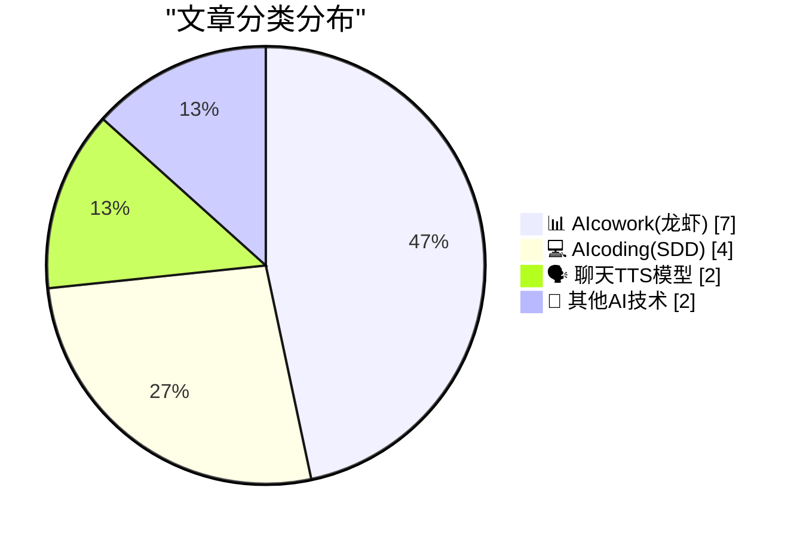
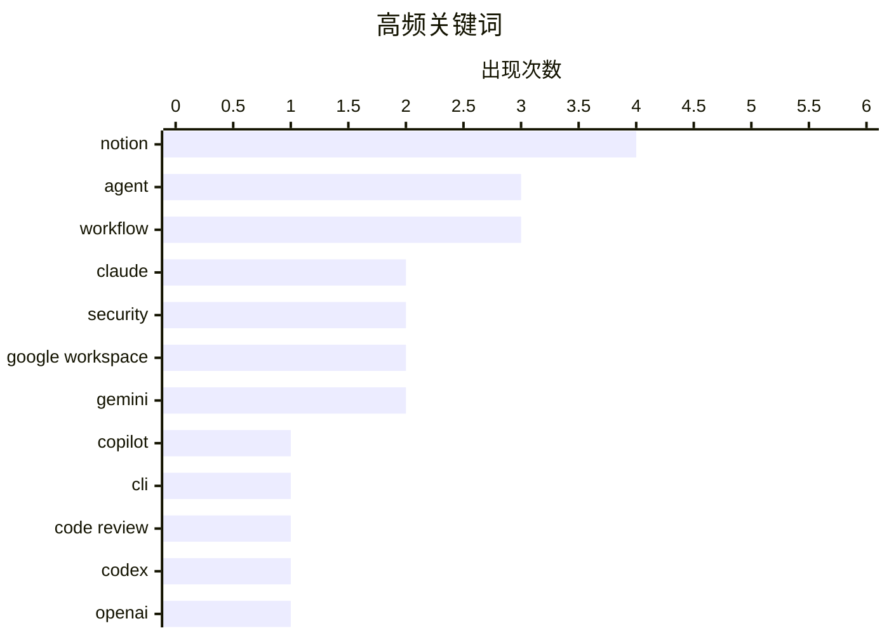

# 📰 AI 博客每日精选 — 2026-04-08

> 来自 98 个技术博客和社交媒体源，AI 精选 Top 15

## 📝 今日看点

今日技术圈的核心焦点是AI代理正深度融入工作流与开发环节。Notion等协作平台通过集成Claude AI，致力于成为团队部署和使用AI代理的一站式平台，大幅降低了使用门槛。同时，AI编程工具在加速普及的同时，其背后的安全与架构问题，如代码审查的多模型策略和软件包依赖风险，也引发了更多关注。

---

## 🏆 今日必读

🥇 **GitHub Research 发布 Copilot CLI “橡皮鸭”代理**

[RT Burke Holland: The @GitHub Research folks released a "Rubber Duck" agent for the Copilot CLI. Automatically get a review from a model from a differ...](https://x.com/github/status/2041643933789515862) — 𝕏 @GitHub · 23 小时前 · 💻 AIcoding(SDD)

> GitHub Research 为 Copilot CLI 发布了一个名为“橡皮鸭”的代码审查代理。该代理的核心功能是自动使用不同 AI 模型家族的模型对代码进行审查。官方数据显示，这种跨模型家族的审查方式确实有效，并且效果相当显著。

💡 **为什么值得读**: 了解如何通过跨模型审查这一创新方法，有效提升AI辅助编程的代码质量。

🏷️ Copilot, CLI, Code Review, Agent

🥈 **OpenAI Codex 周活用户达三百万，并重置速率限制**

[RT Tibo: Three million people are now using Codex weekly - up from two million a little under a month ago. Incredible to see the growth. Thank you to ...](https://x.com/OpenAI/status/2041657179133112592) — 𝕏 @OpenAI · 22 小时前 · 💻 AIcoding(SDD)

> OpenAI 宣布其代码生成模型 Codex 的周活跃用户数已达到 300 万，较不到一个月前的 200 万大幅增长。为庆祝这一里程碑，OpenAI 重置了 API 速率限制，以支持开发者持续构建。公司计划在用户数每新增 100 万时都重置一次速率限制，直至达到 1000 万用户。

💡 **为什么值得读**: 追踪顶级代码生成模型的采用增长趋势，并了解 OpenAI 为支持开发者生态采取的具体激励措施。

🏷️ Codex, OpenAI, Usage Growth

🥉 **Notion 正式引入 Claude AI 代理**

[Introducing @claudeai agents in Notion. Your task board is Claude’s to-do list. @AnthropicAI runs the model and the agent harness. Notion is the orch...](https://x.com/NotionHQ/status/2041982872698155398) — 𝕏 @NotionHQ · 46 分钟前 · 📊 AIcowork(龙虾)

> Notion 宣布集成 Claude AI 代理，用户可直接在 Notion 工作区内将任务委派给 Claude 处理。在该架构中，Anthropic 负责运行模型和代理框架，而 Notion 则作为编排层，提供上下文、用户界面以及团队协作审查和启动 Claude 工作流的共享空间。目前该功能已开放等待列表申请。

💡 **为什么值得读**: 洞察领先的生产力工具如何深度集成AI代理，重构团队的人机协作工作流。

🏷️ Claude, Notion, Agent, Workflow

4️⃣ **深度解析：Claude 新 API 如何为 AI 栈带来模块化革新**

[RT Geoffrey Litt: I think it’s easy to miss the importance of this new Claude API! My team has been working on integrating it into Notion. Here's why...](https://x.com/NotionHQ/status/2041955876828017050) — 𝕏 @NotionHQ · 2 小时前 · 📊 AIcowork(龙虾)

> Claude 新 API 的发布为 AI 技术栈引入了一种新型的模块化设计。这种模块化同时惠及终端用户和应用开发者，允许团队在 Notion 等工作空间内直接将工作委派给 Claude 执行。该集成支持数十个任务并行运行，并让整个团队能够协作处理输出结果，目前处于私密测试阶段。

💡 **为什么值得读**: 从技术架构层面理解 Claude API 的模块化设计如何赋能下一代AI应用开发。

🏷️ Claude API, Notion, Integration, Modularity

5️⃣ **Notion 集成 Claude 代理，旨在成为团队部署AI代理的最佳平台**

[RT Eric Liu: We're bringing Claude agents to Notion! Use Claude natively within Notion, just like working with a teammate We want Notion to be the bes...](https://x.com/NotionHQ/status/2041944754754351342) — 𝕏 @NotionHQ · 3 小时前 · 📊 AIcowork(龙虾)

> Notion 通过原生集成 Claude 代理，使用户能像与队友协作一样在 Notion 内使用 Claude。其目标是让 Notion 成为团队部署代理并完成工作的最佳平台。此次集成是实现这一愿景的关键步骤，团队可直接在工作区内委派工作，并行处理大量任务并协作审查输出。

💡 **为什么值得读**: 了解 Notion 如何通过深度AI集成，战略性地定位自己为未来团队协作的中心枢纽。

🏷️ Claude, Notion, Agent, Teamwork

---

## 📊 数据概览

| 扫描源 | 抓取文章 | 时间范围 | 精选 |
|:---:|:---:|:---:|:---:|
| 74/98 | 2293 篇 → 24 篇 | 24h | **15 篇** |

### 分类分布



### 高频关键词



<details>
<summary>📈 纯文本关键词图（终端友好）</summary>

```
notion           │ ████████████████████ 4
agent            │ ███████████████░░░░░ 3
workflow         │ ███████████████░░░░░ 3
claude           │ ██████████░░░░░░░░░░ 2
security         │ ██████████░░░░░░░░░░ 2
google workspace │ ██████████░░░░░░░░░░ 2
gemini           │ ██████████░░░░░░░░░░ 2
copilot          │ █████░░░░░░░░░░░░░░░ 1
cli              │ █████░░░░░░░░░░░░░░░ 1
code review      │ █████░░░░░░░░░░░░░░░ 1
```

</details>

### 🏷️ 话题标签

**notion**(4) · **agent**(3) · **workflow**(3) · claude(2) · security(2) · google workspace(2) · gemini(2) · copilot(1) · cli(1) · code review(1) · codex(1) · openai(1) · usage growth(1) · claude api(1) · integration(1) · modularity(1) · teamwork(1) · ai agent(1) · e-commerce(1) · customer service(1)

---

====================

## 📊 AIcowork(龙虾)

### 1. Notion 正式引入 Claude AI 代理

[Introducing @claudeai agents in Notion. Your task board is Claude’s to-do list. @AnthropicAI runs the model and the agent harness. Notion is the orch...](https://x.com/NotionHQ/status/2041982872698155398) — **𝕏 @NotionHQ** · 46 分钟前 · ⭐ 20/25

> Notion 宣布集成 Claude AI 代理，用户可直接在 Notion 工作区内将任务委派给 Claude 处理。在该架构中，Anthropic 负责运行模型和代理框架，而 Notion 则作为编排层，提供上下文、用户界面以及团队协作审查和启动 Claude 工作流的共享空间。目前该功能已开放等待列表申请。

🏷️ Claude, Notion, Agent, Workflow

📌 AIcowork(龙虾)

---

### 2. 深度解析：Claude 新 API 如何为 AI 栈带来模块化革新

[RT Geoffrey Litt: I think it’s easy to miss the importance of this new Claude API! My team has been working on integrating it into Notion. Here's why...](https://x.com/NotionHQ/status/2041955876828017050) — **𝕏 @NotionHQ** · 2 小时前 · ⭐ 20/25

> Claude 新 API 的发布为 AI 技术栈引入了一种新型的模块化设计。这种模块化同时惠及终端用户和应用开发者，允许团队在 Notion 等工作空间内直接将工作委派给 Claude 执行。该集成支持数十个任务并行运行，并让整个团队能够协作处理输出结果，目前处于私密测试阶段。

🏷️ Claude API, Notion, Integration, Modularity

📌 AIcowork(龙虾)

---

### 3. Notion 集成 Claude 代理，旨在成为团队部署AI代理的最佳平台

[RT Eric Liu: We're bringing Claude agents to Notion! Use Claude natively within Notion, just like working with a teammate We want Notion to be the bes...](https://x.com/NotionHQ/status/2041944754754351342) — **𝕏 @NotionHQ** · 3 小时前 · ⭐ 20/25

> Notion 通过原生集成 Claude 代理，使用户能像与队友协作一样在 Notion 内使用 Claude。其目标是让 Notion 成为团队部署代理并完成工作的最佳平台。此次集成是实现这一愿景的关键步骤，团队可直接在工作区内委派工作，并行处理大量任务并协作审查输出。

🏷️ Claude, Notion, Agent, Teamwork

📌 AIcowork(龙虾)

---

### 4. 用户盛赞：Notion 自定义代理是目前最易用的 AI 代理平台

[RT Josh Gonsalves: Wow. @NotionHQ Custom Agents is incredibly underrated. It's probably the most approachable AI Agent platform out there today. I jus...](https://x.com/NotionHQ/status/2041720494202958134) — **𝕏 @NotionHQ** · 18 小时前 · ⭐ 20/25

> 用户评价 Notion 自定义代理功能被严重低估，可能是目前最易上手的 AI 代理平台。一个实际案例是，用户仅用 Notion 就为一家电商公司构建了完整的客户服务代理，该代理能回复所有邮件、向客户推荐产品和尺码，并处理退换货请求。相比之下，实现类似功能的 Shopify 应用月费高达 300 至 800 美元。

🏷️ Notion, AI Agent, E-commerce, Customer Service

📌 AIcowork(龙虾)

---

### 5. 利用 Google Workspace Studio 与 Gemini 自动化跨 Workspace 任务

[Google Workspace Studio can automate cross-Workspace tasks with Gemini. Learn what the key components are and how you can get started with creating yo...](https://x.com/GoogleWorkspace/status/2041924784133468404) — **𝕏 @GoogleWorkspace** · 4 小时前 · ⭐ 17/25

> Google Workspace Studio 能够利用 Gemini 模型自动化处理跨 Google Workspace 应用的任务。文章介绍了该功能的关键组件，并提供了如何开始创建自定义工作流的指南。

🏷️ Google Workspace, Gemini, Automation, Workflow

📌 AIcowork(龙虾)

---

### 6. Notion 将联合 Ramp 拆解企业如何真正实现 AI 原生转型

[RT Hurley: Tomorrow we’re breaking down how companies actually become AI-native. Using the AI Transformation Model + a real case study from Ramp. Ben...](https://x.com/NotionHQ/status/2041675327957823567) — **𝕏 @NotionHQ** · 21 小时前 · ⭐ 12/25

> 这是一场关于企业如何实现 AI 原生转型的线上研讨会预告。Notion 将联合金融科技公司 Ramp，通过其“AI 转型模型”和一个真实的 Ramp 案例研究来拆解这一过程。Ramp 的 AI 负责人 Ben Levick 将从内部视角分享他们的实践经验。研讨会旨在为正在探索 AI 转型路径的公司和个人提供可操作的路线图。

🏷️ AI-native, Transformation, Case Study

📌 AIcowork(龙虾)

---

### 7. Ajax Systems 如何利用 Google Workspace 与 Gemini 保障客户安全

[For @ajax_systems, client safety starts with internal excellence. See how they leverage Google Workspace with Gemini to streamline processes and maint...](https://x.com/GoogleWorkspace/status/2041985182467514673) — **𝕏 @GoogleWorkspace** · 37 分钟前 · ⭐ 12/25

> 安全系统公司 Ajax Systems 将其内部流程的卓越性视为客户安全的起点。他们通过整合 Google Workspace 和 Gemini 人工智能来优化内部流程。这一技术组合帮助他们维持了客户所依赖的高安全标准。案例展示了 AI 如何赋能企业强化内部运营，从而间接提升对外服务的安全性与可靠性。

🏷️ Google Workspace, Gemini, Workflow

📌 AIcowork(龙虾)

---

## 💻 AIcoding(SDD)

### 8. GitHub Research 发布 Copilot CLI “橡皮鸭”代理

[RT Burke Holland: The @GitHub Research folks released a "Rubber Duck" agent for the Copilot CLI. Automatically get a review from a model from a differ...](https://x.com/github/status/2041643933789515862) — **𝕏 @GitHub** · 23 小时前 · ⭐ 21/25

> GitHub Research 为 Copilot CLI 发布了一个名为“橡皮鸭”的代码审查代理。该代理的核心功能是自动使用不同 AI 模型家族的模型对代码进行审查。官方数据显示，这种跨模型家族的审查方式确实有效，并且效果相当显著。

🏷️ Copilot, CLI, Code Review, Agent

📌 AIcoding(SDD)

---

### 9. OpenAI Codex 周活用户达三百万，并重置速率限制

[RT Tibo: Three million people are now using Codex weekly - up from two million a little under a month ago. Incredible to see the growth. Thank you to ...](https://x.com/OpenAI/status/2041657179133112592) — **𝕏 @OpenAI** · 22 小时前 · ⭐ 20/25

> OpenAI 宣布其代码生成模型 Codex 的周活跃用户数已达到 300 万，较不到一个月前的 200 万大幅增长。为庆祝这一里程碑，OpenAI 重置了 API 速率限制，以支持开发者持续构建。公司计划在用户数每新增 100 万时都重置一次速率限制，直至达到 1000 万用户。

🏷️ Codex, OpenAI, Usage Growth

📌 AIcoding(SDD)

---

### 10. 如何向活跃的 MsgWaitForMultipleObjects 添加或移除句柄？

[How do you add or remove a handle from an active Msg­Wait­For­Multiple­Objects?](https://devblogs.microsoft.com/oldnewthing/20260408-00/?p=112218) — **devblogs.microsoft.com/oldnewthing** · 7 小时前 · ⭐ 19/25

> 文章探讨了 Windows 编程中一个具体的技术问题：无法直接向一个正在执行的 `MsgWaitForMultipleObjects` 调用动态添加或移除等待句柄。核心解决方案是，通过安排等待者（waiter）自身来间接完成这个操作。

🏷️ Windows API, Programming, Concurrency

📌 AIcoding(SDD)

---

### 11. AI 代理的软件包安全问题

[Package Security Problems for AI Agents](https://nesbitt.io/2026/04/08/package-security-problems-for-ai-agents.html) — **nesbitt.io** · 11 小时前 · ⭐ 18/25

> 文章聚焦于 AI 代理所依赖的庞大软件包生态所带来的独特安全挑战。其核心观点是，安全问题存在于“层层嵌套的软件包”之中，而风险则随着“不断升级的代理”能力向上传递。这揭示了 AI 代理在享受开源生态便利的同时，也继承了其复杂的安全债务。

🏷️ AI Agents, Security, Packages

📌 AIcoding(SDD)

---

## 🗣️ 聊天TTS模型

### 12. ElevenLabs 语音代理连接复古转盘电话，亮相伦敦 AI 工程师峰会

[RT Boris Starkov: i connected elevenlabs voice agent to a retro rotary phone, and put it in a red british telephone box its currently exhibited at Lon...](https://x.com/ElevenLabs/status/2041939480299630942) — **𝕏 @ElevenLabs** · 5 小时前 · ⭐ 18/25

> 开发者将 ElevenLabs 的语音代理连接到了一部复古转盘电话上，并将其置于一个经典的红色英国电话亭中。该装置目前正在伦敦 AI 工程师峰会上展出，其功能是与参会者互动， quiz 他们关于英国 AI 历史的知识。

🏷️ Voice Agent, ElevenLabs, Interactive

📌 聊天TTS模型

---

### 13. Anthropic 的新模型 Claude Mythos 在发现和利用漏洞方面表现过于出色，因此不向公众发布

[Anthropic’s New Claude Mythos Is So Good at Finding and Exploiting Vulnerabilities That They’re Not Releasing It to the Public](https://red.anthropic.com/2026/mythos-preview/) — **daringfireball.net** · 5 小时前 · ⭐ 14/25

> Anthropic 发布了新的通用语言模型 Claude Mythos Preview，该模型在计算机安全任务上展现出惊人的能力。其安全能力如此突出，以至于 Anthropic 决定不向公众发布该模型。为此，公司启动了“玻璃翼项目”，旨在利用 Mythos Preview 来帮助保护全球最关键软件的安全，并引导行业为应对未来的网络攻击做好准备。这标志着 AI 在网络安全领域的双重潜力——既是强大的防御工具，也可能成为未被约束的攻击武器。

🏷️ LLM, Security, Anthropic

📌 聊天TTS模型

---

## 🔬 其他AI技术

### 14. 从月球背面看到的日食

[Solar Eclipse From the Far Side of the Moon](https://kottke.org/26/04/solar-eclipse-far-side-of-the-moon) — **daringfireball.net** · 23 小时前 · ⭐ 10/25

> 文章分享了一张由 Artemis II 任务拍摄的、从月球远端视角观测到的日食照片。作者形容这张照片是他见过的最令人惊叹的天文照片之一。这张照片捕捉到了月球完全遮挡太阳的罕见地外视角。图像本身及其带来的震撼是内容的核心。

🏷️ NASA, Astronomy

📌 其他AI技术

---

### 15. AI 真的非常奇怪

[AI Is Really Weird](https://www.wheresyoured.at/ai-is-really-weird/) — **wheresyoured.at** · 5 小时前 · ⭐ 10/25

> 这是一篇关于人工智能“怪异”特性的独立分析与评论文章。作者旨在探讨 AI 技术中那些反直觉、难以解释或超出常规预期的行为和现象。文章通常篇幅较长，在 5000 到 18000 字之间，提供深度的洞察。内容来自作者的付费订阅通讯，支持其独立报道。

🏷️ AI Analysis, Commentary

📌 其他AI技术

---

====================

*生成于 2026-04-08 21:40 | 扫描 74 源 → 获取 2293 篇 → 精选 15 篇*
*基于 [Hacker News Popularity Contest 2025](https://refactoringenglish.com/tools/hn-popularity/) RSS 源列表，由 [Andrej Karpathy](https://x.com/karpathy) 推荐*
*由「懂点儿AI」制作，欢迎关注同名微信公众号获取更多 AI 实用技巧 💡*
