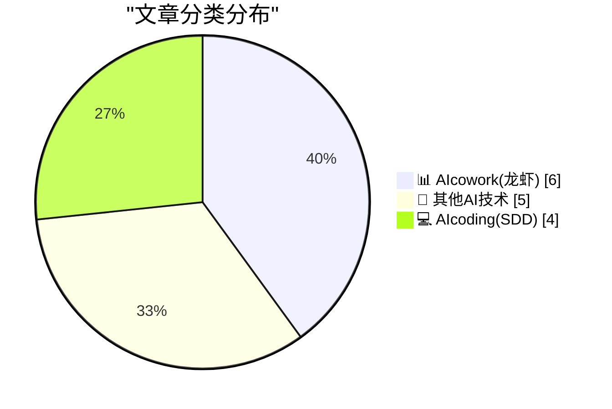
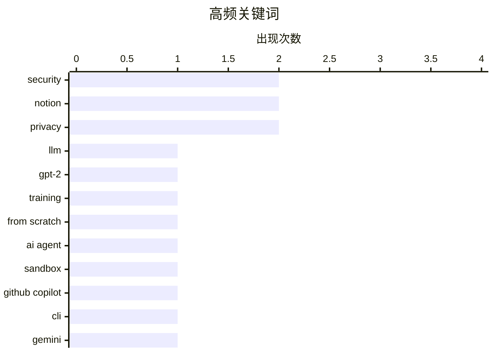

# 📰 AI 博客每日精选 — 2026-04-09

> 来自 98 个技术博客和社交媒体源，AI 精选 Top 15

## 📝 今日看点

今日技术圈的核心焦点在于AI正从工具演变为深度集成的生产力伙伴。一方面，AI编码助手持续进化，从本地模型训练、智能体安全到终端安全扫描，开发者工具链的智能化与安全加固成为关键趋势。另一方面，AI正全面融入协同办公场景，Notion、Google、Microsoft等平台竞相推出智能体生态与自动化功能，致力于通过AI无缝处理日程协调、任务管理与创意构思，以彻底解放团队的生产力。

---

## 🏆 今日必读

🥇 **从零开始编写LLM，第32j部分——干预措施：尝试在云端训练一个更好的模型**

[Writing an LLM from scratch, part 32j -- Interventions: trying to train a better model in the cloud](https://www.gilesthomas.com/2026/04/llm-from-scratch-32j-interventions-trying-to-train-a-better-model-in-the-cloud) — gilesthomas.com · 1 小时前 · 💻 AIcoding(SDD)

> 作者基于Sebastian Raschka的书籍，在本地RTX 3090上从头训练了一个1.63亿参数的GPT-2风格模型。自二月初以来，作者开始尝试各种干预措施，旨在提升这个基础模型的性能。这些云端训练实验的目标是优化模型，以降低其原始3.944的损失值。核心在于通过实践探索模型训练中的调优策略与效果。

💡 **为什么值得读**: 对于想深入理解大语言模型训练细节和调优实践的开发者而言，这是一份宝贵的一手实战记录。

🏷️ LLM, GPT-2, Training, From Scratch

🥈 **AI智能体的软件包安全防御**

[Package Security Defenses for AI Agents](https://nesbitt.io/2026/04/09/package-security-defenses-for-ai-agents.html) — nesbitt.io · 11 小时前 · 💻 AIcoding(SDD)

> 文章聚焦于保障AI智能体运行环境安全的核心防御机制。提出了三种关键防御措施：锁定依赖版本的锁文件（Lockfiles）、隔离运行环境的沙箱（Sandboxes），以及防止滥用或无限循环的冷却计时器（Cooldown timers）。这些措施共同构成了防止供应链攻击、权限越权和资源耗尽的基础安全框架。其核心观点是，必须为自主运行的AI智能体构建系统性的安全边界。

💡 **为什么值得读**: 为日益普及的AI智能体应用提供了清晰、可落地的安全架构思路，直击生产部署中的核心风险。

🏷️ AI Agent, Security, Sandbox

🥉 **GitHub Copilot CLI：在终端中自动化安全分类**

[Every dev knows security debt piles up fast ... and every repo has a few hidden vulnerabilities. 😅 With GitHub Copilot CLI, you can automate your s...](https://x.com/github/status/2042008695035355537) — 𝕏 @GitHub · 23 小时前 · 💻 AIcoding(SDD)

> GitHub Copilot CLI推出新功能，旨在帮助开发者高效处理代码仓库中积累的安全债务与漏洞。该工具允许开发者直接从终端运行完整的安全扫描，并将发现的问题映射到OWASP Top 10安全风险框架。更重要的是，它能自动批量创建GitHub Issues来跟踪这些安全问题，从而实现安全分类流程的自动化。这为开发者提供了一个改进的、自动化的工作流来处理安全漏洞。

💡 **为什么值得读**: 将安全左移并集成到开发者日常终端工作流中，能显著提升漏洞发现和修复的效率。

🏷️ GitHub Copilot, Security, CLI

4️⃣ **Gmail中的“帮我安排”功能现已支持群组日程安排**

[Help me schedule in @gmail has now expanded to support group scheduling. Gemini in Gmail automatically pulls the best time slots for everyone based on...](https://x.com/GoogleWorkspace/status/2042226775212589427) — 𝕏 @GoogleWorkspace · 8 小时前 · 📊 AIcowork(龙虾)

> Gmail中的Gemini AI功能“帮我安排”进行了重要升级，新增了对群组日程安排的支持。该功能能够基于用户的日历和电子邮件上下文，自动为所有参与者提取最佳的空闲时间段。此举旨在将用户从手动协调多人会议时间的繁琐工作中解放出来。这体现了AI在提升日常办公协作效率方面的具体应用。

💡 **为什么值得读**: 展示了AI如何切实解决多人日程协调这一普遍痛点，是生产力工具智能化的一个典型用例。

🏷️ Gemini, Gmail, Group Scheduling, AI Assistant

5️⃣ **1000个智能体，尽在掌中**

[1,000 agents, in your pocket.](https://x.com/NotionHQ/status/2042269576474583394) — 𝕏 @NotionHQ · 5 小时前 · 📊 AIcowork(龙虾)

> Notion发布简短预告，宣称将“1000个智能体”置于用户口袋中。这暗示其平台可能正在集成或发布一个规模庞大的AI智能体生态系统。视频内容进一步展示了这一概念，预示着Notion将从笔记工具向一个集成了大量AI能力的平台演进。其核心是让用户能便捷地访问和使用多样化的AI助手。

💡 **为什么值得读**: 暗示了Notion产品未来的重大AI化方向，对关注生产力工具和AI应用生态的用户具有强烈吸引力。

🏷️ Notion, AI Agents, Product

---

## 📊 数据概览

| 扫描源 | 抓取文章 | 时间范围 | 精选 |
|:---:|:---:|:---:|:---:|
| 72/98 | 2255 篇 → 24 篇 | 24h | **15 篇** |

### 分类分布



### 高频关键词



<details>
<summary>📈 纯文本关键词图（终端友好）</summary>

```
security       │ ████████████████████ 2
notion         │ ████████████████████ 2
privacy        │ ████████████████████ 2
llm            │ ██████████░░░░░░░░░░ 1
gpt-2          │ ██████████░░░░░░░░░░ 1
training       │ ██████████░░░░░░░░░░ 1
from scratch   │ ██████████░░░░░░░░░░ 1
ai agent       │ ██████████░░░░░░░░░░ 1
sandbox        │ ██████████░░░░░░░░░░ 1
github copilot │ ██████████░░░░░░░░░░ 1
```

</details>

### 🏷️ 话题标签

**security**(2) · **notion**(2) · **privacy**(2) · llm(1) · gpt-2(1) · training(1) · from scratch(1) · ai agent(1) · sandbox(1) · github copilot(1) · cli(1) · gemini(1) · gmail(1) · group scheduling(1) · ai assistant(1) · ai agents(1) · product(1) · ai scheduling(1) · microsoft 365(1) · automation(1)

---

====================

## 📊 AIcowork(龙虾)

### 1. Gmail中的“帮我安排”功能现已支持群组日程安排

[Help me schedule in @gmail has now expanded to support group scheduling. Gemini in Gmail automatically pulls the best time slots for everyone based on...](https://x.com/GoogleWorkspace/status/2042226775212589427) — **𝕏 @GoogleWorkspace** · 8 小时前 · ⭐ 20/25

> Gmail中的Gemini AI功能“帮我安排”进行了重要升级，新增了对群组日程安排的支持。该功能能够基于用户的日历和电子邮件上下文，自动为所有参与者提取最佳的空闲时间段。此举旨在将用户从手动协调多人会议时间的繁琐工作中解放出来。这体现了AI在提升日常办公协作效率方面的具体应用。

🏷️ Gemini, Gmail, Group Scheduling, AI Assistant

📌 AIcowork(龙虾)

---

### 2. 1000个智能体，尽在掌中

[1,000 agents, in your pocket.](https://x.com/NotionHQ/status/2042269576474583394) — **𝕏 @NotionHQ** · 5 小时前 · ⭐ 17/25

> Notion发布简短预告，宣称将“1000个智能体”置于用户口袋中。这暗示其平台可能正在集成或发布一个规模庞大的AI智能体生态系统。视频内容进一步展示了这一概念，预示着Notion将从笔记工具向一个集成了大量AI能力的平台演进。其核心是让用户能便捷地访问和使用多样化的AI助手。

🏷️ Notion, AI Agents, Product

📌 AIcowork(龙虾)

---

### 3. 又一个提示已安排，又少了一项待办事项

[Another prompt scheduled, another task off my plate.](https://x.com/Microsoft365/status/2042271318117130344) — **𝕏 @Microsoft365** · 5 小时前 · ⭐ 17/25

> Microsoft 365展示了其AI功能在任务自动化方面的应用。用户可以通过安排提示（prompt），将特定任务交由AI处理，从而减轻自己的工作负担。视频演示了该功能如何将用户从重复性任务中解放出来。这体现了微软将AI深度融入Office套件，以提升用户效率的产品策略。

🏷️ AI Scheduling, Microsoft 365, Automation

📌 AIcowork(龙虾)

---

### 4. 向时区头痛说再见：Google日历新更新

[Say goodbye to the time zone headache. We've all been there: endlessly scrolling to find the right time zone for a meeting. As Tom's Guide highlights,...](https://x.com/GoogleWorkspace/status/2042317372170596630) — **𝕏 @GoogleWorkspace** · 2 小时前 · ⭐ 17/25

> Google日历推出了一项更新，旨在彻底解决跨时区安排会议时选择正确时区的繁琐问题。新功能允许用户直接输入城市名称来设置时区，无需再在冗长的列表中滚动查找。Tom‘s Guide指出，这一简单修复使全球协作变得更加顺畅。这是针对一个普遍痛点的高效用户体验改进。

🏷️ Google Calendar, Time Zone, Productivity

📌 AIcowork(龙虾)

---

### 5. 在Notion中，用Claude直接“捣鼓”你的想法

[RT Frank: in your @NotionHQ, latent in the space between your notes, plans, and transcriptions, are your ideas. now imagine you could @claudeai and ju...](https://x.com/NotionHQ/status/2042078198696177783) — **𝕏 @NotionHQ** · 18 小时前 · ⭐ 16/25

> Notion转发了关于其与Claude AI深度集成的愿景。其理念是，用户的想法潜藏在笔记、计划和转录文本之间的空间里，而未来用户可以直接在Notion中调用Claude来对这些想法进行即时的“捣鼓”和探索。目标是缩小思考与构建之间的差距，实现“在思考的地方直接捣鼓”。这预示着Notion正从被动的内容仓库向主动的创意协作平台转变。

🏷️ Notion, Claude, Ideation

📌 AIcowork(龙虾)

---

### 6. Notion转发：如何在中型至大型公司中真正让AI变得有用

[RT Daniel Gilbert: Everyone's talking about AI. Solopreneurs are showing off impressive demos. Consultants are publishing frameworks. But nobody is sh...](https://x.com/NotionHQ/status/2042254857982345491) — **𝕏 @NotionHQ** · 7 小时前 · ⭐ 13/25

> 文章指出当前AI讨论多集中于炫酷演示和理论框架，但缺乏在中大型企业落地的实用指南。作者分享了其团队花费数千小时，将Brainlabs公司重建为“AI原生”组织的实践经验。视频内容承诺展示一个实用的分步指南，解决企业规模化应用AI的真实挑战。核心在于弥合AI潜力与企业内部实际效用之间的差距。

🏷️ AI-Native, Enterprise, Workflow

📌 AIcowork(龙虾)

---

## 🔬 其他AI技术

### 7. AI在国际象棋中击败人类后，这项游戏反而变得更好了

[After AI beat humans at chess, the game only got better 💪. Learn what this classic strategy game can teach leaders about AI transformation. → http...](https://x.com/GoogleWorkspace/status/2042272080201175139) — **𝕏 @GoogleWorkspace** · 5 小时前 · ⭐ 8/25

> 文章探讨了AI（如Deep Blue）在国际象棋领域超越人类后，这项经典策略游戏如何为领导者提供AI转型的启示。核心观点是，AI的胜利并未终结象棋，反而通过提供新的分析工具和训练对手，提升了人类棋手的整体水平与战略思维。这揭示了AI并非简单替代人类，而是作为增强人类能力的“副驾驶”。结论是，企业领导者应将AI视为战略赋能工具，专注于人机协作以创造新价值，而非恐惧被取代。

🏷️ AI Strategy, Leadership, Chess

📌 其他AI技术

---

### 8. Adobe擅自修改你的 /etc/hosts 文件

[Adobe Diddles With Your /etc/hosts File](https://old.reddit.com/r/webdev/comments/1sb6hzk/adobe_wrote_to_my_hosts_file_ive_never_had_an_app/oe1ap9h/) — **daringfireball.net** · 1 小时前 · ⭐ 5/25

> 文章揭露了Adobe Creative Cloud安装程序在未经明确同意的情况下，会修改用户系统级的hosts文件。具体做法是添加一条DNS记录（detect-ccd.creativecloud.adobe.com指向127.0.0.1），用于在其官网上通过JavaScript加载特定图片来检测用户是否已安装Creative Cloud。这种技术手段绕过了常规的权限询问，引发了关于软件权限过界和隐私安全的争议。核心观点是，即使是知名软件厂商，也可能采用具有侵入性的技术来实现其商业目的。

🏷️ Adobe, Privacy, DNS

📌 其他AI技术

---

### 9. 本周马屁精：托德·布兰奇

[Lickspittle of the Week: Todd Blanche](https://politicalwire.com/2026/04/09/extra-bonus-quote-of-the-day-1022/) — **daringfireball.net** · 4 小时前 · ⭐ 5/25

> 文章摘录并讽刺了美国代理司法部长托德·布兰奇对总统特朗普的一段极其谄媚的公开表态。布兰奇称其为“一生的最大荣誉”，并表示即使被替换也会感恩戴德。评论者尖锐地指出，布兰奇真正想说的台词是“谢谢您，先生，请再给我一次（惩罚）”。这揭示了政治环境中一种令人不适的奴性忠诚文化。核心观点是通过这段具体言论，批判了某些官员丧失独立人格与职业尊严的现象。

🏷️ Politics, News

📌 其他AI技术

---

### 10. 多元主义：辛迪·科恩的“隐私捍卫者”（2026年4月9日）

[Pluralistic: Cindy Cohn's "Privacy's Defender" (09 Apr 2026)](https://pluralistic.net/2026/04/09/bernstein-2/) — **pluralistic.net** · 10 小时前 · ⭐ 5/25

> 本文是科里·多克托罗（Cory Doctorow）的每日链接合集，核心是推介电子前沿基金会（EFF）执行董事辛迪·科恩的著作《隐私的捍卫者》，该书梳理了从起源到当下的数字权利运动史。当日链接还涵盖了关税与垄断、纽约警察局手册泄露、零工经济冲突等多个科技与政治交叉领域的热点话题。文章体现了多克托罗一贯的关注点：技术垄断、公民自由和阶级斗争。结论是数字权利斗争历史悠久且仍在激烈进行中，需要持续关注和行动。

🏷️ Privacy, Digital Rights, Policy

📌 其他AI技术

---

### 11. 书评：《微小的慰藉》作者：伊亚·根伯格 ★★☆☆☆

[Book Review: Small Comfort by Ia Genberg ★★☆☆☆](https://shkspr.mobi/blog/2026/04/book-review-small-comfort-by-ia-genberg/) — **shkspr.mobi** · 10 小时前 · ⭐ 5/25

> 这篇书评对瑞典作家伊亚·根伯格的小说《微小的慰藉》给出了两星（满分五星）的较低评价。评论者欣赏其概念——一系列以不同风格讲述的相互关联的故事，类似于电影《罗拉快跑》，包含一箱现金、一群道德模糊的角色以及关于经济救赎本质的哲学讨论。然而，作者认为书中天真与愤世嫉俗的粗暴结合并未产生预期的深刻效果，整体叙事令人感到不够信服。核心结论是，尽管创意有趣，但执行未能达到预期，导致阅读体验平平。

🏷️ Book Review, Literature

📌 其他AI技术

---

## 💻 AIcoding(SDD)

### 12. 从零开始编写LLM，第32j部分——干预措施：尝试在云端训练一个更好的模型

[Writing an LLM from scratch, part 32j -- Interventions: trying to train a better model in the cloud](https://www.gilesthomas.com/2026/04/llm-from-scratch-32j-interventions-trying-to-train-a-better-model-in-the-cloud) — **gilesthomas.com** · 1 小时前 · ⭐ 22/25

> 作者基于Sebastian Raschka的书籍，在本地RTX 3090上从头训练了一个1.63亿参数的GPT-2风格模型。自二月初以来，作者开始尝试各种干预措施，旨在提升这个基础模型的性能。这些云端训练实验的目标是优化模型，以降低其原始3.944的损失值。核心在于通过实践探索模型训练中的调优策略与效果。

🏷️ LLM, GPT-2, Training, From Scratch

📌 AIcoding(SDD)

---

### 13. AI智能体的软件包安全防御

[Package Security Defenses for AI Agents](https://nesbitt.io/2026/04/09/package-security-defenses-for-ai-agents.html) — **nesbitt.io** · 11 小时前 · ⭐ 22/25

> 文章聚焦于保障AI智能体运行环境安全的核心防御机制。提出了三种关键防御措施：锁定依赖版本的锁文件（Lockfiles）、隔离运行环境的沙箱（Sandboxes），以及防止滥用或无限循环的冷却计时器（Cooldown timers）。这些措施共同构成了防止供应链攻击、权限越权和资源耗尽的基础安全框架。其核心观点是，必须为自主运行的AI智能体构建系统性的安全边界。

🏷️ AI Agent, Security, Sandbox

📌 AIcoding(SDD)

---

### 14. GitHub Copilot CLI：在终端中自动化安全分类

[Every dev knows security debt piles up fast ... and every repo has a few hidden vulnerabilities. 😅 With GitHub Copilot CLI, you can automate your s...](https://x.com/github/status/2042008695035355537) — **𝕏 @GitHub** · 23 小时前 · ⭐ 20/25

> GitHub Copilot CLI推出新功能，旨在帮助开发者高效处理代码仓库中积累的安全债务与漏洞。该工具允许开发者直接从终端运行完整的安全扫描，并将发现的问题映射到OWASP Top 10安全风险框架。更重要的是，它能自动批量创建GitHub Issues来跟踪这些安全问题，从而实现安全分类流程的自动化。这为开发者提供了一个改进的、自动化的工作流来处理安全漏洞。

🏷️ GitHub Copilot, Security, CLI

📌 AIcoding(SDD)

---

### 15. OpenAI更新ChatGPT Pro和Plus订阅，引入新100美元专业版

[Our existing $200 Pro tier still remains our highest usage option. And as a thank you to our existing Pro users on the $200 tier, we’re extending our...](https://x.com/OpenAI/status/2042296046009626989) — **𝕏 @OpenAI** · 4 小时前 · ⭐ 13/25

> OpenAI宣布更新ChatGPT Pro和Plus订阅服务，以更好地支持Codex使用量的增长。在保留原有200美元最高用量专业版的同时，引入了一个新的100美元/月的专业版。新层级提供比Plus版多5倍的Codex使用量，适合轻到中度用户。作为对现有200美元层级用户的感谢，OpenAI将其2倍Codex用量促销延长至5月31日，并再次重置了其Codex速率限制。

🏷️ OpenAI, Codex, API

📌 AIcoding(SDD)

---

====================

*生成于 2026-04-09 21:45 | 扫描 72 源 → 获取 2255 篇 → 精选 15 篇*
*基于 [Hacker News Popularity Contest 2025](https://refactoringenglish.com/tools/hn-popularity/) RSS 源列表，由 [Andrej Karpathy](https://x.com/karpathy) 推荐*
*由「懂点儿AI」制作，欢迎关注同名微信公众号获取更多 AI 实用技巧 💡*
