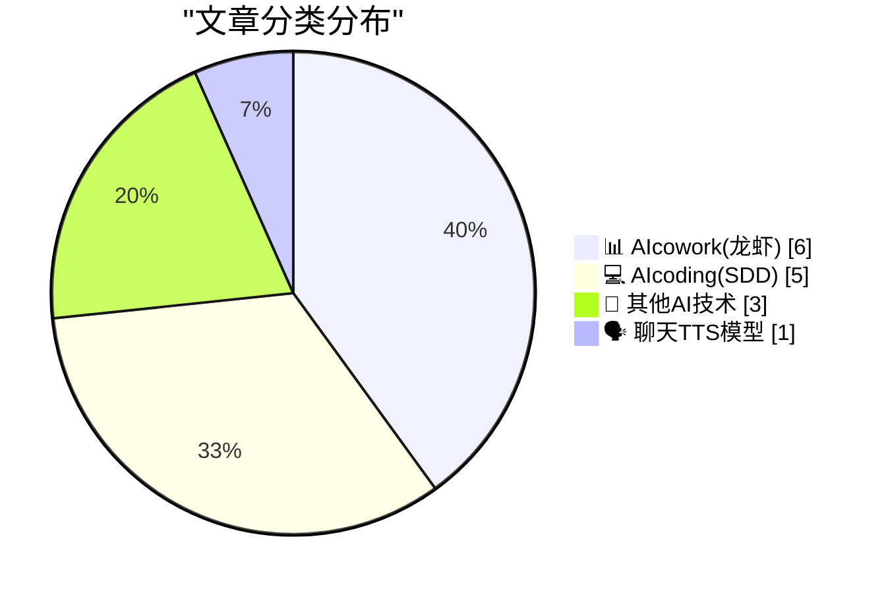
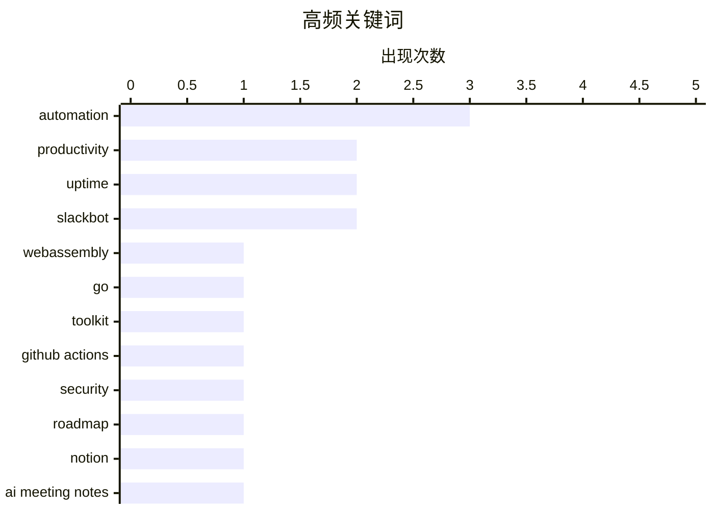

# 📰 AI 博客每日精选 — 2026-04-10

> 来自 98 个技术博客和社交媒体源，AI 精选 Top 15

## 📝 今日看点

今日技术圈聚焦于AI如何深度重塑工作流与开发安全。以Notion、Outlook和Slack为代表的AI协作工具正全面自动化会议管理、日程优化与事故处理，将智能助理深度嵌入日常工作。同时，开发安全成为核心议题，GitHub Actions明确将默认安全设为未来路线图，而开发者则通过硬件创新等手段主动应对工具使用中的盲点。此外，WebAssembly等底层工具生态持续向多语言扩展，展现出基础技术的活力。

---

## 🏆 今日必读

🥇 **watgo - 用于 Go 的 WebAssembly 工具包**

[watgo - a WebAssembly Toolkit for Go](https://eli.thegreenplace.net/2026/watgo-a-webassembly-toolkit-for-go/) — eli.thegreenplace.net · 19 小时前 · 🔬 其他AI技术

> 作者宣布了纯 Go 语言实现的 WebAssembly 工具包 watgo 正式发布。该项目定位与 C++ 的 wabt 和 Rust 的 wasm-tools 类似，但完全用 Go 编写且零依赖。它为 Go 开发者提供了原生、便捷的 WebAssembly 二进制文件处理能力。watgo 的推出填补了 Go 生态在底层 WebAssembly 工具链上的空白。

💡 **为什么值得读**: 对于希望用 Go 语言处理或生成 WebAssembly 的开发者，这是一个轻量级且符合 Go 习惯的原生工具选择。

🏷️ WebAssembly, Go, Toolkit

🥈 **GitHub Actions 2026 安全路线图：将安全行为设为默认**

[The GitHub Actions 2026 security roadmap covers three layers in a shift toward making secure behavior the default. Here’s what’s coming next, and wh...](https://x.com/github/status/2042360669849182337) — 𝕏 @GitHub · 23 小时前 · 💻 AIcoding(SDD)

> GitHub 公布了其 Actions 产品 2026 年的安全路线图，核心目标是让安全行为成为默认设置。该路线图涵盖三个层面的改进，旨在系统性提升 CI/CD 管道的安全性。路线图详细列出了即将推出的功能及其预计上线时间。这表明 GitHub 正致力于将安全左移并内建于开发工作流之中。

💡 **为什么值得读**: 了解 GitHub Actions 未来的安全增强方向，有助于团队提前规划并构建更安全的 DevOps 流程。

🏷️ GitHub Actions, Security, Roadmap

🥉 **Notion AI 会议笔记：自动处理会议后续工作**

[For anyone constantly stuck in back-to-back meetings, Notion can automatically do all the follow ups. Just use AI meeting notes. Format a skill, hook ...](https://x.com/NotionHQ/status/2042623726559301831) — 𝕏 @NotionHQ · 6 小时前 · 📊 AIcowork(龙虾)

> Notion 推出 AI 会议笔记功能，旨在自动处理连轴会议后的繁琐跟进工作。用户只需配置一项技能并将其连接到 Notion 邮箱，后续所有会议的纪要、行动项和跟进任务即可自动生成和处理。该功能通过 AI 理解会议内容，并自动在 Notion 中创建结构化文档和待办事项。这能显著减少会后手动整理和跟进的认知负荷与时间成本。

💡 **为什么值得读**: 对于会议密集的团队或个人，此功能能极大提升会议效率，将精力从记录整理转向决策与执行。

🏷️ Notion, AI Meeting Notes, Automation

4️⃣ **日程过满？让 Outlook 中的 Copilot 来清理你的日历**

[Chronically over-scheduled? Ask Copilot in Outlook to clear your calendar.](https://x.com/Microsoft365/status/2042709206759846027) — 𝕏 @Microsoft365 · 36 分钟前 · 📊 AIcowork(龙虾)

> 微软为 Outlook 中的 Copilot 增加了智能清理日历的功能。用户可以直接要求 Copilot 分析并清理过于拥挤的日程安排。该功能能识别并建议取消、推迟或合并会议，以优化时间管理。这是 AI 助手向主动式日程管理迈出的一步。

💡 **为什么值得读**: 为深受会议困扰的职场人士提供了一个利用 AI 主动优化工作日程的实用解决方案。

🏷️ Copilot, Outlook, Calendar, Productivity

5️⃣ **通过 Apple CarPlay 在汽车仪表盘上单手安全加入 Google Meet 通话**

[Safely join calls hands-free with a single tap directly from your car’s dashboard using new Google Meet for Apple CarPlay. Meetings are audio-only, s...](https://x.com/GoogleWorkspace/status/2042656865356525855) — 𝕏 @GoogleWorkspace · 4 小时前 · 📊 AIcowork(龙虾)

> Google Workspace 为 Apple CarPlay 推出了新的 Google Meet 集成。用户只需在汽车仪表盘上轻点一下，即可免提、安全地加入会议。为确保驾驶安全，会议仅为音频模式，让驾驶员在保持连接、不错过重要讨论的同时专注于路况。

💡 **为什么值得读**: 为需要频繁在路途中参加会议的移动办公者提供了兼顾安全与效率的官方解决方案。

🏷️ Google Meet, CarPlay, Hands-Free, Productivity

---

## 📊 数据概览

| 扫描源 | 抓取文章 | 时间范围 | 精选 |
|:---:|:---:|:---:|:---:|
| 73/98 | 2281 篇 → 28 篇 | 24h | **15 篇** |

### 分类分布



### 高频关键词



<details>
<summary>📈 纯文本关键词图（终端友好）</summary>

```
automation     │ ████████████████████ 3
productivity   │ █████████████░░░░░░░ 2
uptime         │ █████████████░░░░░░░ 2
slackbot       │ █████████████░░░░░░░ 2
webassembly    │ ███████░░░░░░░░░░░░░ 1
go             │ ███████░░░░░░░░░░░░░ 1
toolkit        │ ███████░░░░░░░░░░░░░ 1
github actions │ ███████░░░░░░░░░░░░░ 1
security       │ ███████░░░░░░░░░░░░░ 1
roadmap        │ ███████░░░░░░░░░░░░░ 1
```

</details>

### 🏷️ 话题标签

**automation**(3) · **productivity**(2) · **uptime**(2) · slackbot(2) · webassembly(1) · go(1) · toolkit(1) · github actions(1) · security(1) · roadmap(1) · notion(1) · ai meeting notes(1) · copilot(1) · outlook(1) · calendar(1) · google meet(1) · carplay(1) · hands-free(1) · windows api(1) · synchronization(1)

---

====================

## 📊 AIcowork(龙虾)

### 1. Notion AI 会议笔记：自动处理会议后续工作

[For anyone constantly stuck in back-to-back meetings, Notion can automatically do all the follow ups. Just use AI meeting notes. Format a skill, hook ...](https://x.com/NotionHQ/status/2042623726559301831) — **𝕏 @NotionHQ** · 6 小时前 · ⭐ 20/25

> Notion 推出 AI 会议笔记功能，旨在自动处理连轴会议后的繁琐跟进工作。用户只需配置一项技能并将其连接到 Notion 邮箱，后续所有会议的纪要、行动项和跟进任务即可自动生成和处理。该功能通过 AI 理解会议内容，并自动在 Notion 中创建结构化文档和待办事项。这能显著减少会后手动整理和跟进的认知负荷与时间成本。

🏷️ Notion, AI Meeting Notes, Automation

📌 AIcowork(龙虾)

---

### 2. 日程过满？让 Outlook 中的 Copilot 来清理你的日历

[Chronically over-scheduled? Ask Copilot in Outlook to clear your calendar.](https://x.com/Microsoft365/status/2042709206759846027) — **𝕏 @Microsoft365** · 36 分钟前 · ⭐ 20/25

> 微软为 Outlook 中的 Copilot 增加了智能清理日历的功能。用户可以直接要求 Copilot 分析并清理过于拥挤的日程安排。该功能能识别并建议取消、推迟或合并会议，以优化时间管理。这是 AI 助手向主动式日程管理迈出的一步。

🏷️ Copilot, Outlook, Calendar, Productivity

📌 AIcowork(龙虾)

---

### 3. 通过 Apple CarPlay 在汽车仪表盘上单手安全加入 Google Meet 通话

[Safely join calls hands-free with a single tap directly from your car’s dashboard using new Google Meet for Apple CarPlay. Meetings are audio-only, s...](https://x.com/GoogleWorkspace/status/2042656865356525855) — **𝕏 @GoogleWorkspace** · 4 小时前 · ⭐ 20/25

> Google Workspace 为 Apple CarPlay 推出了新的 Google Meet 集成。用户只需在汽车仪表盘上轻点一下，即可免提、安全地加入会议。为确保驾驶安全，会议仅为音频模式，让驾驶员在保持连接、不错过重要讨论的同时专注于路况。

🏷️ Google Meet, CarPlay, Hands-Free, Productivity

📌 AIcowork(龙虾)

---

### 4. 事故难免发生，但 Slackbot 能帮你处理分析、高管摘要和客户沟通

[Incidents happen. 😕 But Slackbot can take care of the analysis, executive summary, and customer comms so you can move forward with confidence. 💪](https://x.com/SlackHQ/status/2042653431165276544) — **𝕏 @SlackHQ** · 4 小时前 · ⭐ 17/25

> Slack 展示了其 Slackbot 在事故处理（Incident Response）中的自动化能力。当事故发生时，Slackbot 能够自动分析聊天记录、生成执行摘要并起草客户沟通内容。这旨在减轻团队在高压事故处理过程中的认知负担，让他们能更自信、快速地推进解决流程。该功能将对话历史直接转化为可操作的信息和对外沟通草案。

🏷️ Slackbot, Incident Analysis, Automation

📌 AIcowork(龙虾)

---

### 5. Slack 中的每份事故报告都是一个数据点：Slackbot 消除复盘认知负荷

[Every incident report in Slack is a data point. 📝 Slackbot eliminates the cognitive load of retrospectives, turning your channel history into techn...](https://x.com/SlackHQ/status/2042369805802504371) — **𝕏 @SlackHQ** · 23 小时前 · ⭐ 17/25

> Slack 强调其平台内的事故报告对话都是宝贵的数据点。Slackbot 能够自动消除进行事故复盘（Retrospective）时的认知负荷，快速将频道聊天历史转化为结构化的技术简报。这实现了从混乱的沟通记录到清晰复盘文档的瞬间转换。该功能旨在帮助团队更轻松地从每次事故中学习并改进。

🏷️ Slackbot, Incident Report, Automation

📌 AIcowork(龙虾)

---

### 6. 不要错过#TDX26主题演讲：学习如何构建你的智能体企业

[RT Salesforce Developers: Don’t miss the #TDX26 Main Keynote. 🤖 Join Patrick Stokes, Joe Inzerillo, and an amazing speaker lineup to learn how to ...](https://x.com/SlackHQ/status/2042630014378623255) — **𝕏 @SlackHQ** · 6 小时前 · ⭐ 13/25

> 这是一条活动预告推文，宣传Salesforce年度开发者大会TDX26的主题演讲。演讲将由Patrick Stokes、Joe Inzerillo等高管和专家主持，核心内容是教导开发者如何利用Salesforce平台构建“智能体企业”。活动将于4月15日太平洋时间上午10点在Moscone West会场举行，并可通过Salesforce+线上直播。这反映了企业软件巨头正在全力推动AI智能体技术在其生态中的落地和应用。

🏷️ Salesforce, Agentic Enterprise, Keynote

📌 AIcowork(龙虾)

---

## 💻 AIcoding(SDD)

### 7. GitHub Actions 2026 安全路线图：将安全行为设为默认

[The GitHub Actions 2026 security roadmap covers three layers in a shift toward making secure behavior the default. Here’s what’s coming next, and wh...](https://x.com/github/status/2042360669849182337) — **𝕏 @GitHub** · 23 小时前 · ⭐ 22/25

> GitHub 公布了其 Actions 产品 2026 年的安全路线图，核心目标是让安全行为成为默认设置。该路线图涵盖三个层面的改进，旨在系统性提升 CI/CD 管道的安全性。路线图详细列出了即将推出的功能及其预计上线时间。这表明 GitHub 正致力于将安全左移并内建于开发工作流之中。

🏷️ GitHub Actions, Security, Roadmap

📌 AIcoding(SDD)

---

### 8. 如何向活跃的 WaitForMultipleObjects 添加或移除句柄？（第二部分）

[How do you add or remove a handle from an active Wait­For­Multiple­Objects?, part 2](https://devblogs.microsoft.com/oldnewthing/20260410-00/?p=112223) — **devblogs.microsoft.com/oldnewthing** · 7 小时前 · ⭐ 18/25

> 这是关于 Windows API `WaitForMultipleObjects` 动态管理句柄系列文章的第二部分。本篇深入探讨了核心难点：如何让正在等待的线程感知并确认句柄列表的变更。文章解释了实现这一机制所需的技术细节和同步逻辑。这解决了在多线程编程中动态调整等待对象集的一个经典问题。

🏷️ Windows API, Synchronization, Programming

📌 AIcoding(SDD)

---

### 9. 我造了一个物理通知设备，防止 GitHub Copilot 在等待输入时被遗忘

[RT JP（Junpei Tsuchida）| ピザ窯職人: I built a physical notification device to prevent the tragedy of GitHub Copilot getting stuck waiting for user i...](https://x.com/github/status/2042697067156717724) — **𝕏 @GitHub** · 7 小时前 · ⭐ 17/25

> 开发者 JP 构建了一个名为“GitHub Copilot 物理通知器”的硬件设备。当检测到 Copilot 处于“等待用户输入”状态但被其他窗口遮挡时，该设备会通过摇头和环顾四周的物理动作提醒用户。项目完全开源，提供了 3D 模型、固件和详细的搭建指南。这个创意项目以实体交互的方式解决了 IDE 中 AI 助手提示容易被忽略的痛点。

🏷️ GitHub Copilot, Hardware, Notification

📌 AIcoding(SDD)

---

### 10. 为GitHub糟糕的运行时间辩护

[In defense of GitHub's poor uptime](https://evanhahn.com/in-defense-of-githubs-poor-uptime/) — **evanhahn.com** · 21 小时前 · ⭐ 14/25

> 文章针对GitHub频繁的服务中断问题进行了理性分析。作者承认GitHub的宕机确实令人沮丧，且未达到行业常见的“四个九”（99.99%）可用性标准（即每周仅允许约1分钟中断）。然而，他指出单纯的“运行时间”百分比具有误导性，因为短暂、频繁的中断比一次长中断对用户体验的影响更小。最终结论是，GitHub的服务质量更像一个“D”而非“F”，其实际影响可能没有表面数据看起来那么糟糕。

🏷️ GitHub, Uptime, DevOps

📌 AIcoding(SDD)

---

### 11. 软件包注册中心与分页

[Package Registries and Pagination](https://nesbitt.io/2026/04/10/package-registries-and-pagination.html) — **nesbitt.io** · 11 小时前 · ⭐ 14/25

> 文章聚焦于软件包生态系统（如npm、PyPI）中元数据管理的规模与效率挑战。核心问题在于，当单个软件包拥有海量版本时，其元数据（文中举例为10,451个版本对应100MB数据）的查询和传输会成为性能瓶颈。作者探讨了传统分页（Pagination）技术在处理此类大规模、不断增长的数据集时的局限性。文章旨在引发对软件包注册中心API设计如何更好地支持大规模数据访问的思考。

🏷️ Package Registry, Pagination, Metadata

📌 AIcoding(SDD)

---

## 🔬 其他AI技术

### 12. watgo - 用于 Go 的 WebAssembly 工具包

[watgo - a WebAssembly Toolkit for Go](https://eli.thegreenplace.net/2026/watgo-a-webassembly-toolkit-for-go/) — **eli.thegreenplace.net** · 19 小时前 · ⭐ 22/25

> 作者宣布了纯 Go 语言实现的 WebAssembly 工具包 watgo 正式发布。该项目定位与 C++ 的 wabt 和 Rust 的 wasm-tools 类似，但完全用 Go 编写且零依赖。它为 Go 开发者提供了原生、便捷的 WebAssembly 二进制文件处理能力。watgo 的推出填补了 Go 生态在底层 WebAssembly 工具链上的空白。

🏷️ WebAssembly, Go, Toolkit

📌 其他AI技术

---

### 13. macOS 在连续运行 49 天后似乎会崩溃——这或许是 Tahoe 版本独有的“特性”

[MacOS Seemingly Crashes After 49 Days of Uptime — a ‘Feature’ Perhaps Exclusive to Tahoe](https://sixcolors.com/link/2026/04/macs-crash-after-49-days-of-uptime/) — **daringfireball.net** · 23 小时前 · ⭐ 17/25

> 软件开发者 Photon 发现 macOS 存在一个严重的隐藏 Bug：在连续运行 49 天 17 小时 2 分 47 秒后，系统会因内核 TCP 时间戳时钟的 32 位无符号整数溢出而冻结。除 ICMP (ping) 外，所有网络功能均会失效，唯一解决方法是重启。该问题可能由苹果 XNU 内核中的溢出引起，且似乎是特定版本（代号 Tahoe）独有的现象。这个 Bug 对需要长期不重启运行 Mac 的服务构成了严重威胁。

🏷️ macOS, Bug, Uptime

📌 其他AI技术

---

### 14. RSS俱乐部：你为什么用RSS而不是Atom？

[[RSS Club] Why do you use RSS rather than Atom?](https://shkspr.mobi/blog/2026/04/rss-club-why-do-you-use-rss-rather-than-atom/) — **shkspr.mobi** · 10 小时前 · ⭐ 14/25

> 文章探讨了RSS与Atom这两种XML格式的Web内容订阅协议的选择问题。作者指出，尽管其项目名为“RSS俱乐部”，但更准确的名称应是“基于XML的分布式订阅俱乐部”，暗示两者在技术本质上的相似性。文章还分享了作者为博客文章添加本地化、隐私友好的阅读次数追踪的实验，以分析不同来源（如Hacker News、谷歌）的流量。其核心观点是，RSS与Atom之争有时被过度关注，关键在于它们都能实现内容分发的核心功能。

🏷️ RSS, Atom, Feed

📌 其他AI技术

---

## 🗣️ 聊天TTS模型

### 15. 与机器人一起为机器人编程：当下的顶级AGI/科幻体验

[RT Thomas Wolf: favorite AGI/sci-fi vibe these days is coding a robot code together with the robot here vibe-pluging @ElevenLabs in @reachymini for a ...](https://x.com/ElevenLabs/status/2042679664884490694) — **𝕏 @ElevenLabs** · 3 小时前 · ⭐ 14/25

> 这是一条转发推文，展示了人机协作编程的前沿场景。Thomas Wolf描述其目前最喜爱的AGI/科幻体验是“与机器人一起为机器人编写代码”。推文附有一段视频，演示了如何将ElevenLabs的语音技术集成到Reachy Mini机器人中，为其准备一场演讲。这体现了当前AI与机器人技术融合的一个具体应用：通过自然语言或代码与物理实体进行交互和赋能。

🏷️ TTS, Robot, Voice

📌 聊天TTS模型

---

====================

*生成于 2026-04-10 21:36 | 扫描 73 源 → 获取 2281 篇 → 精选 15 篇*
*基于 [Hacker News Popularity Contest 2025](https://refactoringenglish.com/tools/hn-popularity/) RSS 源列表，由 [Andrej Karpathy](https://x.com/karpathy) 推荐*
*由「懂点儿AI」制作，欢迎关注同名微信公众号获取更多 AI 实用技巧 💡*
