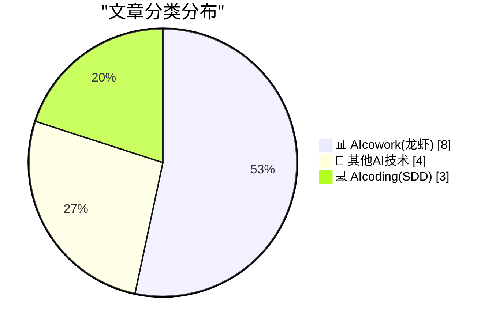
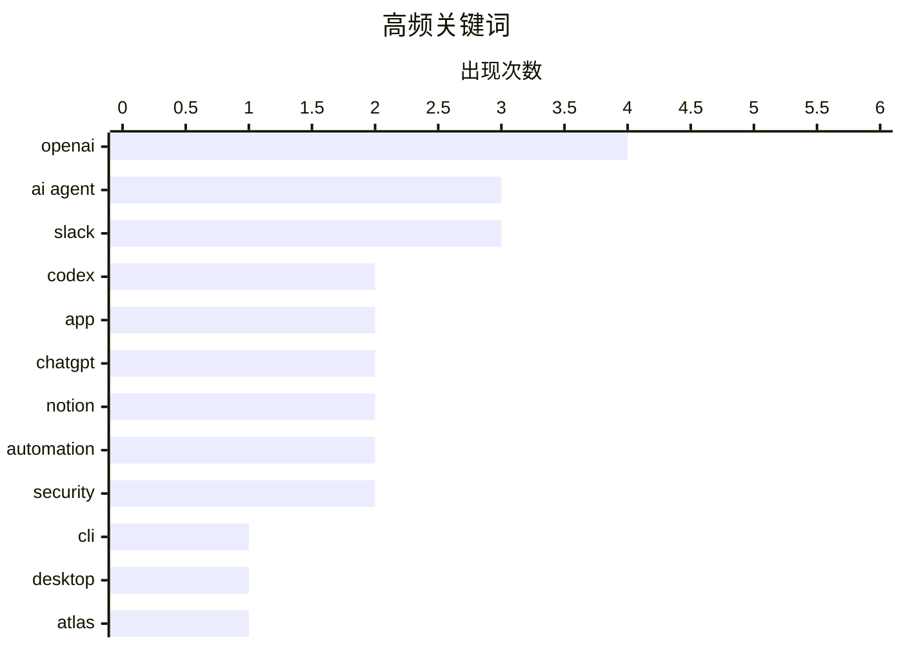

# 📰 AI 博客每日精选 — 2026-04-11

> 来自 98 个技术博客和社交媒体源，AI 精选 Top 15

## 📝 今日看点

今日技术圈的核心动向是AI正深度融入开发与协作的每一个环节。一方面，AI编程助手正从模型能力走向终端集成与场景化应用，让代码生成与调试变得无处不在。另一方面，AI智能体正全面进驻主流协作平台，在Slack、Notion等场景中化身个人工作代理，推动工作流向自动化与智能化快速演进。

---

## 🏆 今日必读

🥇 **Codex CLI**

[Re 🔗 Codex CLI: https://developers.openai.com/codex/cli](https://x.com/OpenAI/status/2042780056804811115) — 𝕏 @OpenAI · 19 小时前 · 💻 AIcoding(SDD)

> OpenAI 发布了 Codex 的命令行界面工具。该工具允许开发者直接在终端中调用 Codex 模型，用于代码生成、补全或解释等任务。通过 CLI，开发者可以更高效地将 AI 编程能力集成到本地工作流和自动化脚本中。这标志着 OpenAI 正将其 AI 编程工具向更底层的开发环境渗透。

💡 **为什么值得读**: 对于希望将 AI 编程能力深度集成到本地工作流和自动化流程中的开发者来说，这是一个提升效率的直接工具。

🏷️ Codex, CLI, OpenAI

🥈 **Codex 应用**

[Re 🔗 Codex App: https://chatgpt.com/codex/](https://x.com/OpenAI/status/2042780055559114993) — 𝕏 @OpenAI · 19 小时前 · 💻 AIcoding(SDD)

> OpenAI 推出了基于 ChatGPT 的 Codex 应用。这是一个专注于代码任务的交互式界面，用户可以通过自然语言对话来生成、解释、调试或重构代码。该应用将强大的 Codex 模型封装在更易用的聊天体验中，降低了 AI 辅助编程的使用门槛。它旨在成为开发者日常编码的智能伙伴。

💡 **为什么值得读**: 为不熟悉命令行或希望以更直观对话方式使用 AI 编程助手的开发者，提供了一个开箱即用的解决方案。

🏷️ Codex, App, OpenAI

🥉 **ChatGPT 桌面版**

[Re 🔗 ChatGPT Desktop: https://chatgpt.com/download/](https://x.com/OpenAI/status/2042780054015611373) — 𝕏 @OpenAI · 19 小时前 · 📊 AIcowork(龙虾)

> OpenAI 提供了 ChatGPT 的官方桌面应用程序供用户下载。桌面版旨在提供比网页版更快速、更稳定且功能可能更集成的使用体验。用户可以直接在操作系统层面访问 ChatGPT，无需打开浏览器。这反映了 ChatGPT 正从纯粹的网页服务向原生桌面体验扩展。

💡 **为什么值得读**: 追求更高响应速度、更少浏览器干扰以及希望将 ChatGPT 深度融入桌面工作环境的用户值得下载体验。

🏷️ ChatGPT, Desktop, App

4️⃣ **Atlas**

[Re 🔗 Atlas: https://chatgpt.com/atlas](https://x.com/OpenAI/status/2042780058075672703) — 𝕏 @OpenAI · 19 小时前 · 📊 AIcowork(龙虾)

> OpenAI 推出了名为“Atlas”的新产品或功能。根据命名和上下文推测，Atlas 可能是一个用于探索、导航或管理 AI 模型、项目或知识的平台或工具。它标志着 OpenAI 在构建更复杂的 AI 生态系统和开发者工具链方面的新举措。具体功能需访问链接进一步了解。

💡 **为什么值得读**: 关注 OpenAI 生态系统最新动态和工具演进的开发者或研究者，应查看此链接以了解其可能带来的新能力。

🏷️ Atlas, ChatGPT, Knowledge

5️⃣ **Notion 代理应用移动端更新：可创建真实代理**

[RT Jamal Hinton: The new update in @NotionHQ agent app allows you to create actual agents from mobile. Just added my Mercury MCP along with some notio...](https://x.com/NotionHQ/status/2043039483168460895) — 𝕏 @NotionHQ · 6 小时前 · 📊 AIcowork(龙虾)

> Notion 代理应用的最新更新允许用户直接从移动设备创建功能完整的 AI 代理。用户 Jamal Hinton 演示了如何添加 Mercury MCP 和一些 Notion 工作器，构建了一个能处理预算、平衡等所有财务任务的“预算代理”。这显示了 Notion 将其 AI 代理能力从桌面端扩展到移动端，提升了便捷性和即时性。

💡 **为什么值得读**: 展示了如何在移动场景下快速构建实用型个人 AI 代理，为移动端自动化工作流提供了具体范例。

🏷️ Notion, AI Agent, MCP

---

## 📊 数据概览

| 扫描源 | 抓取文章 | 时间范围 | 精选 |
|:---:|:---:|:---:|:---:|
| 72/98 | 2281 篇 → 18 篇 | 24h | **15 篇** |

### 分类分布



### 高频关键词



<details>
<summary>📈 纯文本关键词图（终端友好）</summary>

```
openai     │ ████████████████████ 4
ai agent   │ ███████████████░░░░░ 3
slack      │ ███████████████░░░░░ 3
codex      │ ██████████░░░░░░░░░░ 2
app        │ ██████████░░░░░░░░░░ 2
chatgpt    │ ██████████░░░░░░░░░░ 2
notion     │ ██████████░░░░░░░░░░ 2
automation │ ██████████░░░░░░░░░░ 2
security   │ ██████████░░░░░░░░░░ 2
cli        │ █████░░░░░░░░░░░░░░░ 1
```

</details>

### 🏷️ 话题标签

**openai**(4) · **ai agent**(3) · **slack**(3) · codex(2) · app(2) · chatgpt(2) · notion(2) · automation(2) · security(2) · cli(1) · desktop(1) · atlas(1) · knowledge(1) · mcp(1) · ai coding(1) · agents(1) · adoption(1) · deployment(1) · github(1) · ai triage(1)

---

====================

## 📊 AIcowork(龙虾)

### 1. ChatGPT 桌面版

[Re 🔗 ChatGPT Desktop: https://chatgpt.com/download/](https://x.com/OpenAI/status/2042780054015611373) — **𝕏 @OpenAI** · 19 小时前 · ⭐ 23/25

> OpenAI 提供了 ChatGPT 的官方桌面应用程序供用户下载。桌面版旨在提供比网页版更快速、更稳定且功能可能更集成的使用体验。用户可以直接在操作系统层面访问 ChatGPT，无需打开浏览器。这反映了 ChatGPT 正从纯粹的网页服务向原生桌面体验扩展。

🏷️ ChatGPT, Desktop, App

📌 AIcowork(龙虾)

---

### 2. Atlas

[Re 🔗 Atlas: https://chatgpt.com/atlas](https://x.com/OpenAI/status/2042780058075672703) — **𝕏 @OpenAI** · 19 小时前 · ⭐ 22/25

> OpenAI 推出了名为“Atlas”的新产品或功能。根据命名和上下文推测，Atlas 可能是一个用于探索、导航或管理 AI 模型、项目或知识的平台或工具。它标志着 OpenAI 在构建更复杂的 AI 生态系统和开发者工具链方面的新举措。具体功能需访问链接进一步了解。

🏷️ Atlas, ChatGPT, Knowledge

📌 AIcowork(龙虾)

---

### 3. Notion 代理应用移动端更新：可创建真实代理

[RT Jamal Hinton: The new update in @NotionHQ agent app allows you to create actual agents from mobile. Just added my Mercury MCP along with some notio...](https://x.com/NotionHQ/status/2043039483168460895) — **𝕏 @NotionHQ** · 6 小时前 · ⭐ 19/25

> Notion 代理应用的最新更新允许用户直接从移动设备创建功能完整的 AI 代理。用户 Jamal Hinton 演示了如何添加 Mercury MCP 和一些 Notion 工作器，构建了一个能处理预算、平衡等所有财务任务的“预算代理”。这显示了 Notion 将其 AI 代理能力从桌面端扩展到移动端，提升了便捷性和即时性。

🏷️ Notion, AI Agent, MCP

📌 AIcowork(龙虾)

---

### 4. 在 Slack 中快速构建和部署 AI 代理

[Discover how to build and deploy AI agents in Slack, having them ready for real-world use in no time at all. 🚀 #TDX26 Explore the session: https://...](https://x.com/SlackHQ/status/2042737915474698698) — **𝕏 @SlackHQ** · 22 小时前 · ⭐ 18/25

> Slack 在 TDX26 大会上展示了如何在 Slack 平台内快速构建和部署可用于真实场景的 AI 代理。该会话旨在指导开发者利用 Slack 的生态系统，将 AI 代理集成到团队协作流程中。目标是让 AI 代理能够迅速投入实际使用，提升工作效率和自动化水平。这体现了 Slack 将 AI 能力深度融入其工作流核心的战略。

🏷️ Slack, AI Agent, Deployment

📌 AIcowork(龙虾)

---

### 5. Slackbot 已演进为你的个人 AI 代理

[See how Slackbot has evolved into your personal AI agent — helping you find, create, and automate work where you're already working. ⚡ #TDX26 Explor...](https://x.com/SlackHQ/status/2042736912494919859) — **𝕏 @SlackHQ** · 22 小时前 · ⭐ 18/25

> Slack 宣布其内置的 Slackbot 已进化为个人 AI 代理，能够在用户已有的工作场景中帮助查找信息、创建内容和自动化任务。这一演进旨在让 AI 辅助变得无处不在且上下文相关，直接在 Slack 工作区中提升个人生产力。它标志着 Slack 从简单的通知机器人向主动、智能的工作伙伴转型。

🏷️ Slack, AI Agent, Automation

📌 AIcowork(龙虾)

---

### 6. GitHub 利用 AI 打破无障碍工作的分类瓶颈

[Accessibility work often gets stuck at triage. GitHub's team found a way to let AI handle that part. Now there's a continuous loop: feedback comes in,...](https://x.com/github/status/2043031580185129450) — **𝕏 @GitHub** · 3 小时前 · ⭐ 15/25

> GitHub 团队利用 AI 解决了无障碍反馈工单在分类阶段经常停滞的问题。他们建立了一个持续循环的工作流：用户反馈进来，AI 自动进行分类和初步处理，从而显著加快了修复的交付速度。这一内部工作流的转变，极大地改善了对无障碍体验有日常依赖的用户的产品体验。具体方法在其博客文章中详细阐述。

🏷️ GitHub, AI Triage, Accessibility

📌 AIcowork(龙虾)

---

### 7. 从工作流到完全定制化应用：打造更丰富的 Slack 体验

[Explore how to go from workflows to fully customized apps and create richer, more interactive Slack experiences. 💫 #TDX26 Explore the session: http...](https://x.com/SlackHQ/status/2042737915483046087) — **𝕏 @SlackHQ** · 22 小时前 · ⭐ 14/25

> Slack 的 TDX26 会话探讨了如何从其基础的工作流功能进阶到构建完全定制化的应用程序。目标是指导开发者创建更丰富、交互性更强的 Slack 体验，超越预置的自动化步骤。这涉及利用 Slack 更高级的 API 和开发框架，实现深度集成和复杂逻辑。此举旨在扩展 Slack 作为应用平台的能力边界。

🏷️ Slack, Workflow, Automation

📌 AIcowork(龙虾)

---

### 8. Notion官方账号发布神秘预告

[👀](https://x.com/NotionHQ/status/2043008824286810224) — **𝕏 @NotionHQ** · 4 小时前 · ⭐ 8/25

> Notion官方社交媒体账号发布了一条仅包含“👀”表情和一段视频的动态，内容神秘未作具体说明。视频展示了一个未明确指代的产品或功能界面。有用户在评论区询问其含义，但未获直接回复。这是一条典型的悬念式产品预告，旨在引发社区关注和猜测。

🏷️ Notion, Teaser

📌 AIcowork(龙虾)

---

## 🔬 其他AI技术

### 9. 关于Axios开发者工具安全事件的透明度声明

[Re The security and privacy of your information are a top priority. We’re committed to being transparent and taking quick action when issues arise. W...](https://x.com/OpenAI/status/2042780059363336237) — **𝕏 @OpenAI** · 19 小时前 · ⭐ 13/25

> OpenAI就涉及第三方库Axios的安全事件发布声明，强调用户信息安全是首要任务。该事件是更广泛行业安全事件的一部分，OpenAI表示未发现其用户数据被访问、系统被入侵或软件被篡改的证据。公司承诺保持透明并迅速采取行动，已在官网分享更多技术细节和常见问题解答。核心结论是，尽管事件影响第三方库，但OpenAI自身系统与用户数据未受影响。

🏷️ Security, Privacy, OpenAI

📌 其他AI技术

---

### 10. OpenAI针对macOS应用安全认证的预防性措施

[We recently identified a security issue involving the third-party developer library Axios that was part of a broader industry incident. We found no ev...](https://x.com/OpenAI/status/2042780052669239782) — **𝕏 @OpenAI** · 19 小时前 · ⭐ 9/25

> OpenAI在第三方库Axios安全事件后，出于高度谨慎采取了额外的安全强化措施。重点在于保护其macOS应用程序的合法性认证流程，为此更新了安全认证机制。这一更新将要求所有macOS用户进行相应的更新操作，以确保应用来源的真实性与安全性。此举旨在主动防范潜在风险，尽管未发现系统被直接入侵的证据。

🏷️ Security, Incident, OpenAI

📌 其他AI技术

---

### 11. 泛美航空复古行李标签设计作品集

[Pan American Luggage Labels](https://ellafreire.com/collections/pan-american-luggage-labels) — **daringfireball.net** · 4 小时前 · ⭐ 5/25

> 这是一篇分享设计师Ella Freire创作的复古风格艺术品的短文。作品主题是重新设计经典的泛美航空行李标签，作者盛赞其色彩、字体和形状设计都达到了“极致精美”的程度。文章将其定位为“周末的平面设计趣闻”，并通过Dan Cederholm的《Studio Notes》推荐发现。核心是欣赏和分享一系列具有怀旧美感的视觉设计作品。

🏷️ Graphic Design, Art

📌 其他AI技术

---

### 12. 你的朋友正在对你隐藏他们最好的想法

[Your friends are hiding their best ideas from you](https://idiallo.com/blog/your-friends-are-hiding-their-ideas?src=feed) — **idiallo.com** · 20 小时前 · ⭐ 5/25

> 文章通过作者大学时小组合作开发“珊瑚礁餐厅”网站的经历引出核心观点：人们常常在想法未成熟或自认为不够好时，选择向朋友隐藏。在那个项目中，团队因害怕被嘲笑而未曾分享各自更宏大、更具野心的原始创意，最终只实现了一个安全但平庸的方案。作者指出，这种因恐惧评判而产生的自我审查，阻碍了真正创新想法的诞生与碰撞。结论是，创造一个允许分享“半成品”想法且免于评判的安全环境至关重要。

🏷️ Web Development, College Project

📌 其他AI技术

---

## 💻 AIcoding(SDD)

### 13. Codex CLI

[Re 🔗 Codex CLI: https://developers.openai.com/codex/cli](https://x.com/OpenAI/status/2042780056804811115) — **𝕏 @OpenAI** · 19 小时前 · ⭐ 23/25

> OpenAI 发布了 Codex 的命令行界面工具。该工具允许开发者直接在终端中调用 Codex 模型，用于代码生成、补全或解释等任务。通过 CLI，开发者可以更高效地将 AI 编程能力集成到本地工作流和自动化脚本中。这标志着 OpenAI 正将其 AI 编程工具向更底层的开发环境渗透。

🏷️ Codex, CLI, OpenAI

📌 AIcoding(SDD)

---

### 14. Codex 应用

[Re 🔗 Codex App: https://chatgpt.com/codex/](https://x.com/OpenAI/status/2042780055559114993) — **𝕏 @OpenAI** · 19 小时前 · ⭐ 23/25

> OpenAI 推出了基于 ChatGPT 的 Codex 应用。这是一个专注于代码任务的交互式界面，用户可以通过自然语言对话来生成、解释、调试或重构代码。该应用将强大的 Codex 模型封装在更易用的聊天体验中，降低了 AI 辅助编程的使用门槛。它旨在成为开发者日常编码的智能伙伴。

🏷️ Codex, App, OpenAI

📌 AIcoding(SDD)

---

### 15. 中心存在偏见

[The Center Has a Bias](https://lucumr.pocoo.org/2026/4/11/the-center-has-a-bias/) — **lucumr.pocoo.org** · 21 小时前 · ⭐ 18/25

> 文章探讨了人们对新技术（尤其是 AI 编程代理）常陷入两极分化的争论现象。作者指出，许多对 AI 编码工具的批评是合理的，但批评者往往缺乏有意义的直接使用经验。这种“中心偏见”导致讨论被没有亲身体验的极端观点所主导，阻碍了基于实际效用的理性评估。作者呼吁在评价新技术时，应更多依据一手经验而非预设立场。

🏷️ AI Coding, Agents, Adoption

📌 AIcoding(SDD)

---

====================

*生成于 2026-04-11 21:31 | 扫描 72 源 → 获取 2281 篇 → 精选 15 篇*
*基于 [Hacker News Popularity Contest 2025](https://refactoringenglish.com/tools/hn-popularity/) RSS 源列表，由 [Andrej Karpathy](https://x.com/karpathy) 推荐*
*由「懂点儿AI」制作，欢迎关注同名微信公众号获取更多 AI 实用技巧 💡*
