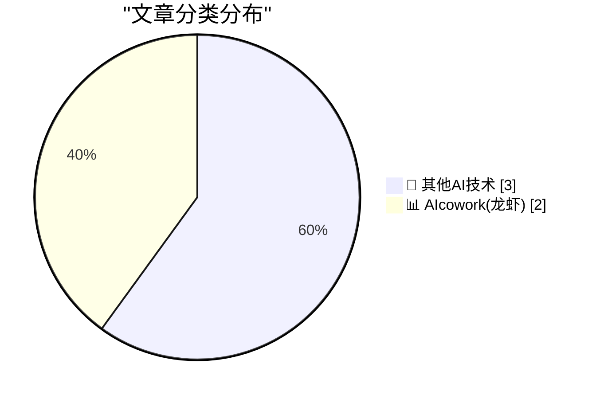
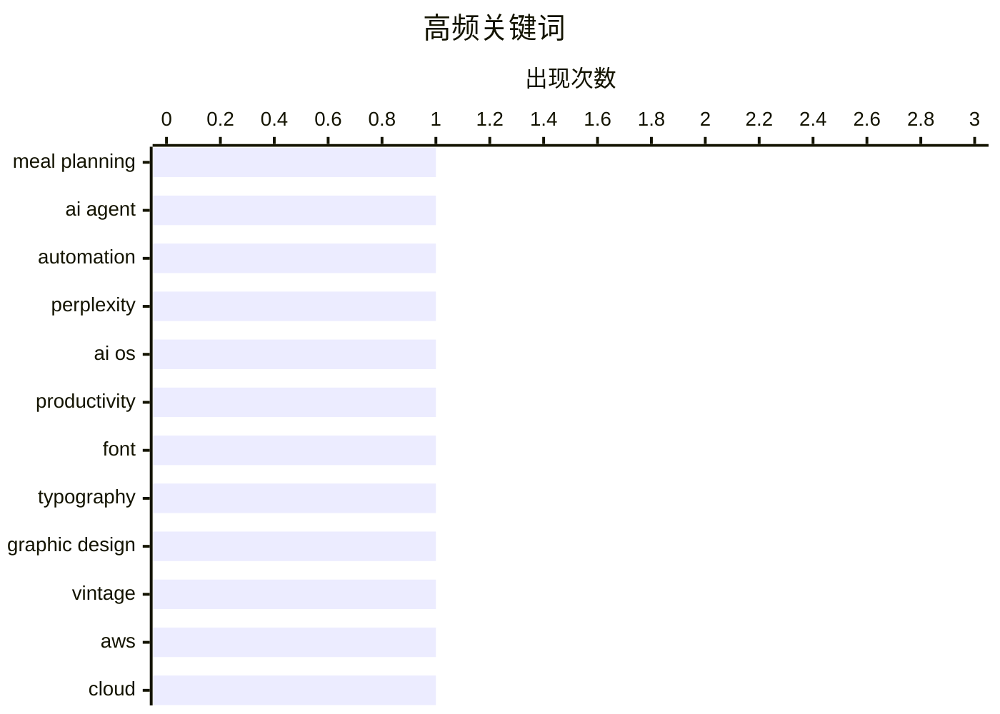

# 📰 AI 博客每日精选 — 2026-04-12

> 来自 98 个技术博客和社交媒体源，AI 精选 Top 5

## 📝 今日看点

今日技术圈聚焦于AI与日常工具的深度融合。一方面，AI正从独立应用走向系统级集成，以“AI优先”理念重塑操作系统与工作流。另一方面，开发者正致力于让AI助手更“贴心”，通过结合环境与历史数据提供高度个性化的生活服务。与此同时，对用户体验的极致追求也体现在基础工具层面，例如专为现代阅读优化的字体设计，反映出技术正回归以人为本的核心。

---

## 🏆 今日必读

🥇 **升级我的膳食计划机器人：结合天气与饮食记忆以优化建议**

[RT Geoffrey Litt: Made some upgrades to my meal planning bot - now it looks up the weather and remembers what we’ve recently eaten to make better sug...](https://x.com/NotionHQ/status/2043394393949036949) — 𝕏 @NotionHQ · 3 小时前 · 📊 AIcowork(龙虾)

> 一位开发者分享了其个人膳食计划机器人的功能升级。该机器人现在能够查询实时天气数据，并记忆用户近期的饮食记录。通过结合这两类信息，它能为用户即将到来的一周生成更个性化、更合理的膳食建议。这展示了如何将外部数据（天气）与内部历史数据（饮食记录）结合，以提升AI助手的实用性和上下文感知能力。

💡 **为什么值得读**: 这是一个将AI助手与具体生活场景（膳食规划）深度结合、并利用多源数据提升决策质量的生动实践案例，为构建更智能的个人化工具提供了思路。

🏷️ Meal Planning, AI Agent, Automation

🥈 **Perplexity PC：将AI深度集成到操作系统中的“AI优先”机器**

[Have you heard about the new Perplexity PC? 👀 They’re taking a standard Mac mini and integrating their AI directly into the OS. Instead of switchi...](https://x.com/github/status/2043388860529336472) — 𝕏 @GitHub · 3 小时前 · 📊 AIcowork(龙虾)

> Perplexity公司推出了一款名为“Perplexity PC”的概念产品，其核心是将AI深度集成到操作系统层面。该产品基于标准的Mac mini硬件，但通过系统级集成，使AI助手能够始终在线并在原生环境中工作，无需用户在不同应用或标签页间切换。这代表了从“AI作为应用”到“AI作为环境”的范式转变，旨在提供无缝、持续的AI辅助体验。

💡 **为什么值得读**: 它提出了一个关于未来个人计算形态的前瞻性构想，即AI如何从孤立工具转变为无处不在的系统级伙伴，值得关注人机交互演进趋势的读者思考。

🏷️ Perplexity, AI OS, Productivity

🥉 **Zed —— 一个为21世纪阅读需求而生的字体超级家族**

[Zed — A Font Superfamily](https://www.typotheque.com/blog/zed-a-sans-for-the-needs-of-21century/?utm_source=df) — daringfireball.net · 2 小时前 · 🔬 其他AI技术

> Typotheque发布了全新的字体超级家族Zed，其设计核心是解决“读者真正需要什么”，而非仅仅追求视觉样本的美观。Zed是一个完整的字体系统，旨在为最广泛的读者群体提供最佳的阅读体验。在法国一家眼科医院与视障患者进行的测试中，Zed Text字体在所有患者组别的阅读速度测试上都超越了经典的Helvetica字体。这证明了其以用户为中心的设计理念在功能性上的成功。

💡 **为什么值得读**: 该文章通过严谨的临床测试数据，展示了优秀字体设计如何切实提升可访问性和阅读效率，对设计师、开发者和任何关心信息传达效率的人都有启发。

🏷️ Font, Typography

4️⃣ **黄金车票：20世纪40-50年代密尔沃基公交票的平面设计珍藏**

[Golden Tickets](https://www.presentandcorrect.com/blogs/blog/golden-tickets) — daringfireball.net · 3 小时前 · 🔬 其他AI技术

> 文章展示了一批来自20世纪40年代末至50年代初的美国密尔沃基公交周票的收藏。这些车票在色彩和字体排版上呈现出惊人的多样性，同时又通过统一的设计语言保持了系列感。其设计体现了当时设计者每周持续创作的用心与热情，将公交周票这种日常用品变成了充满趣味和活力的图形表达。这反映了在一个特定历史时期，商业印刷品中所蕴含的设计关怀与艺术价值。

💡 **为什么值得读**: 它从一个独特的微观视角，揭示了日常物品中容易被忽视的设计美学和历史价值，能带给读者关于设计持久魅力与细节之美的欣赏乐趣。

🏷️ Graphic Design, Vintage

5️⃣ **你的AWS认证让你成了AWS的销售员**

[Your AWS Certificate Makes You an AWS Salesman](https://idiallo.com/byte-size/we-are-aws-salesmen?src=feed) — idiallo.com · 4 小时前 · 🔬 其他AI技术

> 作者以自身经历指出，AWS庞大而复杂的服务生态和控制台界面，对开发者并不友好，甚至阻碍了服务发现。例如，在控制台内搜索“网络托管”无法直接找到相应服务，最终需要通过网络搜索才得知应使用EC2实例。他认为，AWS的认证体系在教会开发者使用其服务的同时，也无形中让开发者承担了在复杂迷宫中导航并推广AWS解决方案的角色。文章的核心观点是，AWS的复杂性本身成为了一种商业策略，而认证者则成为了帮助他人克服这种复杂性的“销售员”。

💡 **为什么值得读**: 本文尖锐地指出了主流云平台在用户体验与商业策略之间存在的矛盾，为所有云服务使用者提供了一个反思工具复杂性与供应商锁定的批判性视角。

🏷️ AWS, Cloud

---

## 📊 数据概览

| 扫描源 | 抓取文章 | 时间范围 | 精选 |
|:---:|:---:|:---:|:---:|
| 72/98 | 2264 篇 → 5 篇 | 24h | **5 篇** |

### 分类分布



### 高频关键词



<details>
<summary>📈 纯文本关键词图（终端友好）</summary>

```
meal planning  │ ████████████████████ 1
ai agent       │ ████████████████████ 1
automation     │ ████████████████████ 1
perplexity     │ ████████████████████ 1
ai os          │ ████████████████████ 1
productivity   │ ████████████████████ 1
font           │ ████████████████████ 1
typography     │ ████████████████████ 1
graphic design │ ████████████████████ 1
vintage        │ ████████████████████ 1
```

</details>

### 🏷️ 话题标签

**meal planning**(1) · **ai agent**(1) · **automation**(1) · perplexity(1) · ai os(1) · productivity(1) · font(1) · typography(1) · graphic design(1) · vintage(1) · aws(1) · cloud(1)

---

====================

## 🔬 其他AI技术

### 1. Zed —— 一个为21世纪阅读需求而生的字体超级家族

[Zed — A Font Superfamily](https://www.typotheque.com/blog/zed-a-sans-for-the-needs-of-21century/?utm_source=df) — **daringfireball.net** · 2 小时前 · ⭐ 5/25

> Typotheque发布了全新的字体超级家族Zed，其设计核心是解决“读者真正需要什么”，而非仅仅追求视觉样本的美观。Zed是一个完整的字体系统，旨在为最广泛的读者群体提供最佳的阅读体验。在法国一家眼科医院与视障患者进行的测试中，Zed Text字体在所有患者组别的阅读速度测试上都超越了经典的Helvetica字体。这证明了其以用户为中心的设计理念在功能性上的成功。

🏷️ Font, Typography

📌 其他AI技术

---

### 2. 黄金车票：20世纪40-50年代密尔沃基公交票的平面设计珍藏

[Golden Tickets](https://www.presentandcorrect.com/blogs/blog/golden-tickets) — **daringfireball.net** · 3 小时前 · ⭐ 5/25

> 文章展示了一批来自20世纪40年代末至50年代初的美国密尔沃基公交周票的收藏。这些车票在色彩和字体排版上呈现出惊人的多样性，同时又通过统一的设计语言保持了系列感。其设计体现了当时设计者每周持续创作的用心与热情，将公交周票这种日常用品变成了充满趣味和活力的图形表达。这反映了在一个特定历史时期，商业印刷品中所蕴含的设计关怀与艺术价值。

🏷️ Graphic Design, Vintage

📌 其他AI技术

---

### 3. 你的AWS认证让你成了AWS的销售员

[Your AWS Certificate Makes You an AWS Salesman](https://idiallo.com/byte-size/we-are-aws-salesmen?src=feed) — **idiallo.com** · 4 小时前 · ⭐ 5/25

> 作者以自身经历指出，AWS庞大而复杂的服务生态和控制台界面，对开发者并不友好，甚至阻碍了服务发现。例如，在控制台内搜索“网络托管”无法直接找到相应服务，最终需要通过网络搜索才得知应使用EC2实例。他认为，AWS的认证体系在教会开发者使用其服务的同时，也无形中让开发者承担了在复杂迷宫中导航并推广AWS解决方案的角色。文章的核心观点是，AWS的复杂性本身成为了一种商业策略，而认证者则成为了帮助他人克服这种复杂性的“销售员”。

🏷️ AWS, Cloud

📌 其他AI技术

---

## 📊 AIcowork(龙虾)

### 4. 升级我的膳食计划机器人：结合天气与饮食记忆以优化建议

[RT Geoffrey Litt: Made some upgrades to my meal planning bot - now it looks up the weather and remembers what we’ve recently eaten to make better sug...](https://x.com/NotionHQ/status/2043394393949036949) — **𝕏 @NotionHQ** · 3 小时前 · ⭐ 18/25

> 一位开发者分享了其个人膳食计划机器人的功能升级。该机器人现在能够查询实时天气数据，并记忆用户近期的饮食记录。通过结合这两类信息，它能为用户即将到来的一周生成更个性化、更合理的膳食建议。这展示了如何将外部数据（天气）与内部历史数据（饮食记录）结合，以提升AI助手的实用性和上下文感知能力。

🏷️ Meal Planning, AI Agent, Automation

📌 AIcowork(龙虾)

---

### 5. Perplexity PC：将AI深度集成到操作系统中的“AI优先”机器

[Have you heard about the new Perplexity PC? 👀 They’re taking a standard Mac mini and integrating their AI directly into the OS. Instead of switchi...](https://x.com/github/status/2043388860529336472) — **𝕏 @GitHub** · 3 小时前 · ⭐ 14/25

> Perplexity公司推出了一款名为“Perplexity PC”的概念产品，其核心是将AI深度集成到操作系统层面。该产品基于标准的Mac mini硬件，但通过系统级集成，使AI助手能够始终在线并在原生环境中工作，无需用户在不同应用或标签页间切换。这代表了从“AI作为应用”到“AI作为环境”的范式转变，旨在提供无缝、持续的AI辅助体验。

🏷️ Perplexity, AI OS, Productivity

📌 AIcowork(龙虾)

---

====================

*生成于 2026-04-12 21:33 | 扫描 72 源 → 获取 2264 篇 → 精选 5 篇*
*基于 [Hacker News Popularity Contest 2025](https://refactoringenglish.com/tools/hn-popularity/) RSS 源列表，由 [Andrej Karpathy](https://x.com/karpathy) 推荐*
*由「懂点儿AI」制作，欢迎关注同名微信公众号获取更多 AI 实用技巧 💡*
