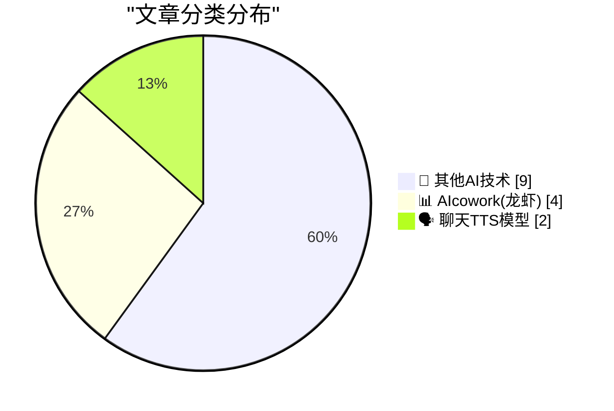
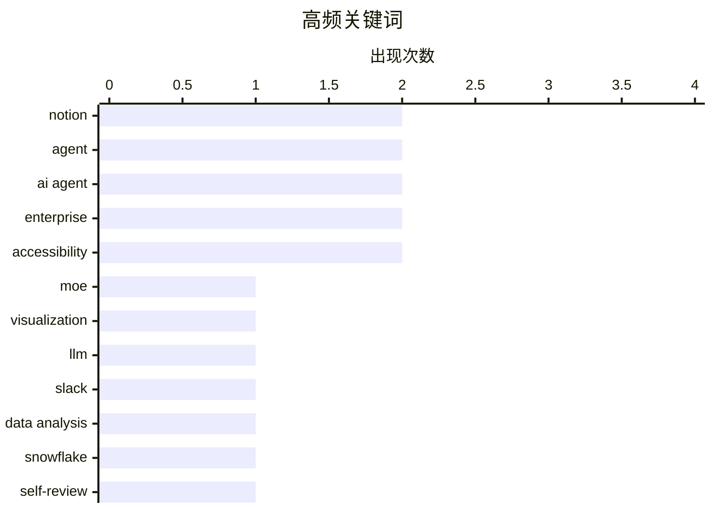

# 📰 AI 博客每日精选 — 2026-04-13

> 来自 98 个技术博客和社交媒体源，AI 精选 Top 15

## 📝 今日看点

今日技术圈聚焦于AI代理深度融入工作流与底层技术可视化两大趋势。企业级AI正从工具演变为主动协作伙伴，Notion、Google等厂商竞相推出能自主处理任务的智能代理，旨在提升效率与数据洞察。同时，对复杂AI模型内部机制的可视化探索也在推进，帮助开发者更直观地理解其运作原理。

---

## 🏆 今日必读

🥇 **一个可视化MoE专家路由的小工具**

[A little tool to visualise MoE expert routing](https://martinalderson.com/posts/moe-expert-routing-visualization/?utm_source=rss&amp;utm_medium=rss&amp;utm_campaign=feed) — martinalderson.com · 21 小时前 · 🔬 其他AI技术

> 作者构建了一个用于可视化混合专家模型（Mixture of Experts， MoE）中令牌如何被路由到不同专家的小工具。该工具直观展示了MoE模型内部的工作机制，即每个输入令牌如何根据门控网络的计算结果被动态分配给特定的专家子网络。通过可视化，可以观察到路由模式的动态变化，这有助于理解和调试MoE模型的行为。观察这一过程被作者描述为“非常迷人”。

💡 **为什么值得读**: 对于希望直观理解MoE这一重要大模型架构内部工作机制的开发者和研究者，这个可视化工具提供了独特的洞察。

🏷️ MoE, Visualization, LLM

🥈 **Notion AI代理自动在Slack中创建线程并跟进**

[RT Hector Podcast: Ok this is kinda cool. I wrote a message in a @SlackHQ channel that my whole team can see asking for an update. And now there's a t...](https://x.com/NotionHQ/status/2043799231597818344) — 𝕏 @NotionHQ · 2 小时前 · 📊 AIcowork(龙虾)

> 用户在一个全员可见的Slack频道中发布了一条请求更新的消息。Notion的AI代理自动识别该消息并创建了一个跟进线程。这一交互展示了AI代理开始无缝融入团队协作流程，能够主动响应公开的请求。作者认为，这种变化将彻底改变未来的工作方式。

💡 **为什么值得读**: 这是一个AI代理从被动工具转变为主动协作伙伴的生动案例，预示了未来人机协同的工作场景。

🏷️ Notion, Slack, Agent

🥉 **Notion推出“数据侦察兵”代理：为每位员工配备价值50万美元的数据科学家**

[RT Hurley: Meet Data Scout. It's a $500k data scientist for every employee. One of those agents every business needs. > Has Snowflake access (+ Notion...](https://x.com/NotionHQ/status/2043743373471953265) — 𝕏 @NotionHQ · 4 小时前 · 📊 AIcowork(龙虾)

> Notion内部推出了一款名为“数据侦察兵”的AI代理，其功能相当于为每位员工配备了一位价值50万美元的数据科学家。该代理拥有Snowflake、Notion、Slack、Github等系统的访问权限，能够对所有用户和账户数据进行深度分析。它还可以被其他代理调用以生成周期性报告，并已成为Notion内部最常用的代理之一。Notion鼓励开发者基于此模式构建自己的业务代理。

💡 **为什么值得读**: 它展示了企业级AI代理如何整合多系统数据、执行复杂分析并成为核心生产力工具的具体蓝图。

🏷️ Data Analysis, Agent, Snowflake

4️⃣ **Notion一键生成自我评估草稿，简化评审流程**

[Self-reviews made easy ☑️](https://x.com/NotionHQ/status/2043731899085140143) — 𝕏 @NotionHQ · 5 小时前 · 📊 AIcowork(龙虾)

> Notion团队构建了一个功能，可以一键为用户生成自我评估的草稿。该功能极大地简化了绩效自我评审的启动过程，用户无需从零开始撰写。从截图看，该工具可能基于员工在Notion中的工作历史和数据自动生成初稿。团队内部对此功能评价很高，认为它使自我评审变得轻松。

💡 **为什么值得读**: 展示了AI如何通过自动化繁琐的文书工作，来切实提升员工体验和人力资源管理效率。

🏷️ Self-review, Automation, Notion

5️⃣ **Google Workspace推出“持续会议聊天”，连接Meet与Chat**

[Keep the momentum flowing. 🚀 Continuous meeting chat links your Meet call to a persistent Google Chat conversation, so your team can move from plan...](https://x.com/GoogleWorkspace/status/2043766924509647313) — 𝕏 @GoogleWorkspace · 2 小时前 · 📊 AIcowork(龙虾)

> Google Workspace推出了一项名为“持续会议聊天”的新功能。该功能将Google Meet通话与一个持久的Google Chat对话链接起来，确保会议上下文得以延续。团队可以从会议规划无缝过渡到会后的执行与讨论，避免信息脱节。Google旨在通过此功能保持团队协作的连续性和动量。

💡 **为什么值得读**: 解决了远程协作中常见的“会后行动断层”问题，将沟通与执行更紧密地结合，提升了工作流连续性。

🏷️ Google Workspace, Meeting, Collaboration

---

## 📊 数据概览

| 扫描源 | 抓取文章 | 时间范围 | 精选 |
|:---:|:---:|:---:|:---:|
| 74/98 | 2300 篇 → 21 篇 | 24h | **15 篇** |

### 分类分布



### 高频关键词



<details>
<summary>📈 纯文本关键词图（终端友好）</summary>

```
notion        │ ████████████████████ 2
agent         │ ████████████████████ 2
ai agent      │ ████████████████████ 2
enterprise    │ ████████████████████ 2
accessibility │ ████████████████████ 2
moe           │ ██████████░░░░░░░░░░ 1
visualization │ ██████████░░░░░░░░░░ 1
llm           │ ██████████░░░░░░░░░░ 1
slack         │ ██████████░░░░░░░░░░ 1
data analysis │ ██████████░░░░░░░░░░ 1
```

</details>

### 🏷️ 话题标签

**notion**(2) · **agent**(2) · **ai agent**(2) · enterprise(2) · accessibility(2) · moe(1) · visualization(1) · llm(1) · slack(1) · data analysis(1) · snowflake(1) · self-review(1) · automation(1) · google workspace(1) · meeting(1) · collaboration(1) · authorization(1) · conversational agent(1) · voice(1) · ui(1)

---

====================

## 🔬 其他AI技术

### 1. 一个可视化MoE专家路由的小工具

[A little tool to visualise MoE expert routing](https://martinalderson.com/posts/moe-expert-routing-visualization/?utm_source=rss&amp;utm_medium=rss&amp;utm_campaign=feed) — **martinalderson.com** · 21 小时前 · ⭐ 22/25

> 作者构建了一个用于可视化混合专家模型（Mixture of Experts， MoE）中令牌如何被路由到不同专家的小工具。该工具直观展示了MoE模型内部的工作机制，即每个输入令牌如何根据门控网络的计算结果被动态分配给特定的专家子网络。通过可视化，可以观察到路由模式的动态变化，这有助于理解和调试MoE模型的行为。观察这一过程被作者描述为“非常迷人”。

🏷️ MoE, Visualization, LLM

📌 其他AI技术

---

### 2. WorkOS FGA：AI代理的授权层

[[Sponsor] WorkOS FGA: The Authorization Layer for AI Agents](https://workos.com/blog/agents-need-authorization-not-just-authentication?utm_source=daringfireball&amp;utm_medium=newsletter&amp;utm_campaign=q22026) — **daringfireball.net** · 27 分钟前 · ⭐ 12/25

> 文章指出，大多数AI代理在企业部署中遇到的主要障碍不是模型质量或延迟，而是授权问题。认证解决代理身份问题，而授权则定义其操作权限范围（“爆炸半径”）。企业AI的赢家将是那些能被安全信任的解决方案，而非功能最多的。WorkOS FGA提供了一个细粒度的、资源级别的权限模型，旨在精确控制AI代理的授权范围。

🏷️ AI Agent, Authorization, Enterprise

📌 其他AI技术

---

### 3. macOS“减少透明度”辅助功能反而降低了UI元素对比度

[Tahoe Nitpick of the Day: ‘Reduce Transparency’ Makes Layers Harder to See, Not Easier](https://mastodon.social/@tuomas_h/116397694769738857) — **daringfireball.net** · 49 分钟前 · ⭐ 9/25

> 作者指出，在macOS 26.4中，“减少透明度”这一本意为提升可访问性的设置，实际效果适得其反。开启该功能后，按钮和侧边栏等UI元素会蒙上一层灰色，使其几乎与背景的阴影融为一体，反而降低了与背景的对比度。作者认为，在当前的系统版本下，此类辅助功能开关的设计应得到更周全的考虑。他批评当前的Tahoe系统界面看起来像是仓促的仿制品。

🏷️ Accessibility, UI

📌 其他AI技术

---

### 4. Marcin Wichary探访大型系统博物馆

[Marcin Wichary Visits the Large Scale Systems Museum](https://flickr.com/photos/mwichary/albums/72177720332956990/) — **daringfireball.net** · 2 小时前 · ⭐ 9/25

> 界面设计师Marcin Wichary参观并拍摄了大型系统博物馆，并通过Flickr相册和Mastodon长帖分享了大量照片。相册中包含许多复古键盘的细节特写，其中一张“RE-START”键因单词被断行显示而显得特别。作者虽从未听说过该博物馆，但看完照片后心生向往，并认为那个断行的按键设计“明明是错的，但感觉又是对的”。

🏷️ Museum, Vintage Tech

📌 其他AI技术

---

### 5. macOS技巧：启用缩放“窥视”手势

[MacOS Tip: Enable the Zoom ‘Peek’ Gesture](https://unsung.aresluna.org/testing-tip-enable-the-zoom-peek-gesture/) — **daringfireball.net** · 4 小时前 · ⭐ 9/25

> 介绍了一个macOS内置的实用辅助功能：缩放“窥视”手势。用户可在“设置 > 辅助功能 > 缩放”中，开启“使用修饰键进行滚动手势缩放”。启用后，在任何界面下，按住Control键并用双指在触控板上滑动（或使用滚轮），即可快速缩放整个屏幕。作者建议同时关闭“高级”选项中的“平滑图像”，以便更清晰地观察单个像素。该功能已内置多年，无需第三方软件，被作者誉为“最棒的macOS技巧之一”。

🏷️ Accessibility, MacOS

📌 其他AI技术

---

### 6. Zed —— 一个字体超级家族

[Zed — A Font Superfamily](https://www.typotheque.com/blog/zed-a-sans-for-the-needs-of-21century/?utm_source=df) — **daringfireball.net** · 23 小时前 · ⭐ 9/25

> Zed是一个以读者实际需求为核心设计的新型字体超级家族系统。其设计目标不是追求样本美观，而是服务于最广泛的读者群体，尤其关注可读性。Typotheque在法国一家眼科医院与视障患者进行的测试显示，Zed Text字体在所有患者组中的阅读速度均优于经典的Helvetica字体。这证明了以用户为中心的设计方法在字体领域的实际价值。

🏷️ Font, Typography

📌 其他AI技术

---

### 7. 约翰·马泰拉罗，安息

[John Martellaro, RIP](https://geektells.com/john-martellaro-remembrance/) — **daringfireball.net** · 1 小时前 · ⭐ 5/25

> 这是一篇纪念前美国空军上尉、NASA科学家、苹果公司前员工约翰·马泰拉罗的悼文。马泰拉罗曾在The Mac Observer担任专栏作家，以其理性的声音和人文关怀而闻名。他拥有多元的职业背景，还创作科幻小说并为多家Mac媒体撰写科技专栏。文章作者深情追忆，称其为认识的最好的人之一。

🏷️ Obituary

📌 其他AI技术

---

### 8. 维克托·欧尔班在匈牙利选举中落败，承认失败并祝贺反对派获胜者

[Viktor Orban Loses Election in Hungary, Concedes Defeat, Congratulates Opposition Winners](https://www.nytimes.com/2026/04/12/world/europe/hungary-election-orban-magyar.html) — **daringfireball.net** · 23 小时前 · ⭐ 5/25

> 匈牙利总理维克托·欧尔班在选举中意外失利，并发表了早期且姿态优雅的败选演讲。他祝贺反对派获胜，承认“治理的责任和机会并未赋予我们”，但同时誓言“我们不会放弃”。此次失败为前欧尔班盟友、主要反对党领袖彼得·马扎尔在新议会召开后接任总理铺平了道路。这标志着匈牙利政治格局可能发生重大转变。

🏷️ Politics

📌 其他AI技术

---

### 9. 你为它付了钱，就应该在它里面感到舒适

[You paid for it, you should be comfortable in it](https://idiallo.com/blog/you-paid-for-it-you-should-be-comfortable-in-it?src=feed) — **idiallo.com** · 9 小时前 · ⭐ 5/25

> 作者通过朋友的一辆2010年代初购买的特斯拉Roadster跑车，引出了一个关于消费与体验的反思。这辆外观 pristine、价值六位数的跑车，内部却存在令人不适的细节。文章的核心论点是：消费者为高价商品付费，不仅购买其功能，更应获得与之匹配的舒适与尊严体验。当实际体验与高昂价格不符时，消费者有权感到失望并重新评估其价值。

🏷️ Tesla, Product

📌 其他AI技术

---

## 📊 AIcowork(龙虾)

### 10. Notion AI代理自动在Slack中创建线程并跟进

[RT Hector Podcast: Ok this is kinda cool. I wrote a message in a @SlackHQ channel that my whole team can see asking for an update. And now there's a t...](https://x.com/NotionHQ/status/2043799231597818344) — **𝕏 @NotionHQ** · 2 小时前 · ⭐ 16/25

> 用户在一个全员可见的Slack频道中发布了一条请求更新的消息。Notion的AI代理自动识别该消息并创建了一个跟进线程。这一交互展示了AI代理开始无缝融入团队协作流程，能够主动响应公开的请求。作者认为，这种变化将彻底改变未来的工作方式。

🏷️ Notion, Slack, Agent

📌 AIcowork(龙虾)

---

### 11. Notion推出“数据侦察兵”代理：为每位员工配备价值50万美元的数据科学家

[RT Hurley: Meet Data Scout. It's a $500k data scientist for every employee. One of those agents every business needs. > Has Snowflake access (+ Notion...](https://x.com/NotionHQ/status/2043743373471953265) — **𝕏 @NotionHQ** · 4 小时前 · ⭐ 16/25

> Notion内部推出了一款名为“数据侦察兵”的AI代理，其功能相当于为每位员工配备了一位价值50万美元的数据科学家。该代理拥有Snowflake、Notion、Slack、Github等系统的访问权限，能够对所有用户和账户数据进行深度分析。它还可以被其他代理调用以生成周期性报告，并已成为Notion内部最常用的代理之一。Notion鼓励开发者基于此模式构建自己的业务代理。

🏷️ Data Analysis, Agent, Snowflake

📌 AIcowork(龙虾)

---

### 12. Notion一键生成自我评估草稿，简化评审流程

[Self-reviews made easy ☑️](https://x.com/NotionHQ/status/2043731899085140143) — **𝕏 @NotionHQ** · 5 小时前 · ⭐ 16/25

> Notion团队构建了一个功能，可以一键为用户生成自我评估的草稿。该功能极大地简化了绩效自我评审的启动过程，用户无需从零开始撰写。从截图看，该工具可能基于员工在Notion中的工作历史和数据自动生成初稿。团队内部对此功能评价很高，认为它使自我评审变得轻松。

🏷️ Self-review, Automation, Notion

📌 AIcowork(龙虾)

---

### 13. Google Workspace推出“持续会议聊天”，连接Meet与Chat

[Keep the momentum flowing. 🚀 Continuous meeting chat links your Meet call to a persistent Google Chat conversation, so your team can move from plan...](https://x.com/GoogleWorkspace/status/2043766924509647313) — **𝕏 @GoogleWorkspace** · 2 小时前 · ⭐ 16/25

> Google Workspace推出了一项名为“持续会议聊天”的新功能。该功能将Google Meet通话与一个持久的Google Chat对话链接起来，确保会议上下文得以延续。团队可以从会议规划无缝过渡到会后的执行与讨论，避免信息脱节。Google旨在通过此功能保持团队协作的连续性和动量。

🏷️ Google Workspace, Meeting, Collaboration

📌 AIcowork(龙虾)

---

## 🗣️ 聊天TTS模型

### 14. ElevenLabs Q1新增ARR超1亿美元，由企业部署对话式代理驱动

[RT Mati Staniszewski: We added over $100M in net new ARR in Q1 2026 That’s our best quarter to date driven by enterprises deploying conversational ag...](https://x.com/ElevenLabs/status/2043708419761136002) — **𝕏 @ElevenLabs** · 7 小时前 · ⭐ 12/25

> ElevenLabs在2026年第一季度新增了超过1亿美元的年度经常性收入，创下其历史最佳季度纪录。这一增长主要由企业在语音、聊天、文本和电子邮件等渠道大规模部署对话式AI代理所驱动。该公司正与德国电信、Revolut和Klarna等知名企业合作，帮助其变革与客户的沟通方式。

🏷️ Conversational Agent, Enterprise, Voice

📌 聊天TTS模型

---

### 15. 《金融时报》：Meta打造扎克伯格AI分身与员工互动

[FT: ‘Meta Builds AI Version of Mark Zuckerberg to Interact With Staff’](https://www.ft.com/content/02107c23-6c7a-4c19-b8e2-b45f4bb9ce5f) — **daringfireball.net** · 4 小时前 · ⭐ 9/25

> Meta公司正在优先开发一款基于CEO马克·扎克伯格的AI角色。该AI角色旨在与员工进行对话并提供反馈，扎克伯格本人亲自参与了其动画AI的训练和测试工作。该角色正在接受训练，以模仿扎克伯格的举止、语气和公开声明。此举表明Meta正探索将高管人格数字化，用于内部沟通与管理。

🏷️ AI Agent, Avatar, Meta

📌 聊天TTS模型

---

====================

*生成于 2026-04-13 21:46 | 扫描 74 源 → 获取 2300 篇 → 精选 15 篇*
*基于 [Hacker News Popularity Contest 2025](https://refactoringenglish.com/tools/hn-popularity/) RSS 源列表，由 [Andrej Karpathy](https://x.com/karpathy) 推荐*
*由「懂点儿AI」制作，欢迎关注同名微信公众号获取更多 AI 实用技巧 💡*
