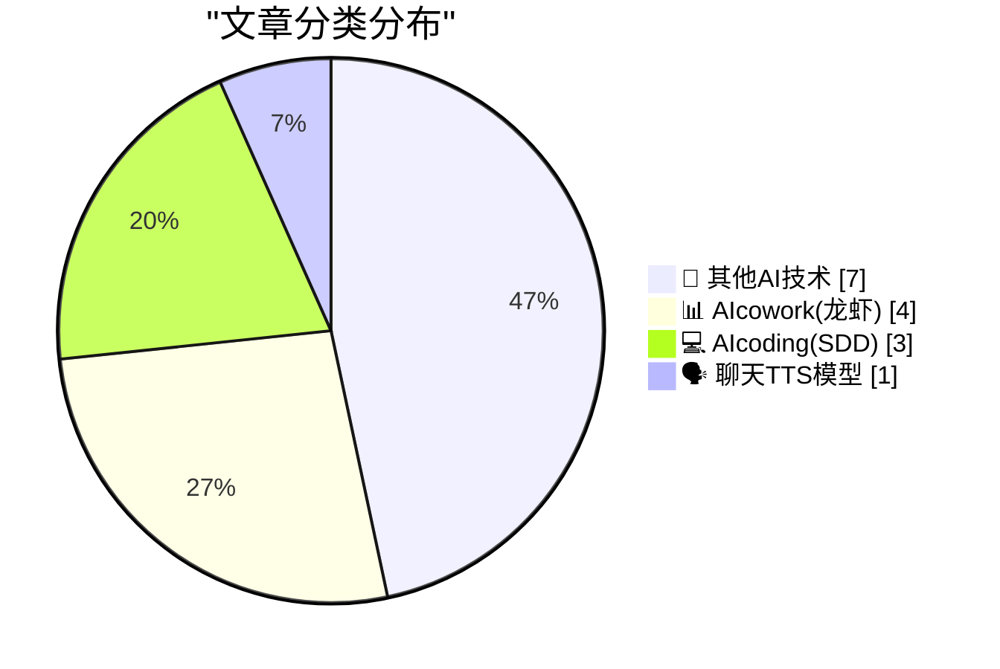
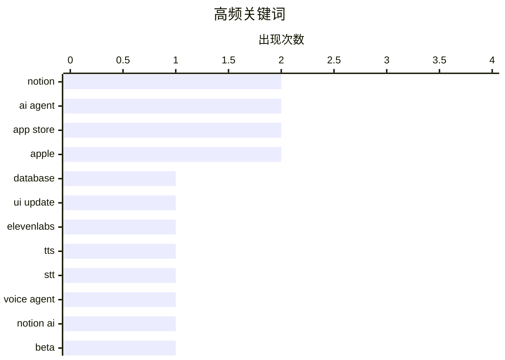

# 📰 AI 博客每日精选 — 2026-04-14

> 来自 98 个技术博客和社交媒体源，AI 精选 Top 15

## 📝 今日看点

今日技术圈聚焦于AI智能体向日常工作的深度渗透与工具平台的智能化升级。Notion、Google等平台正竞相将AI智能体打造为核心生产力，使其能持续运行并参与实际决策。同时，从Notion的界面定制到Slack的反馈自动化，主流协作工具正通过灵活的功能更新提升个性化与自动化水平。此外，谷歌打击“后退劫持”等举措，也反映出行业对基础用户体验规范的持续加强。

---

## 🏆 今日必读

🥇 **Notion 数据库视图标签现提供三种样式**

[Database view tabs now come in three flavors: 1. Icons only (new!) 2. Text only (new!) 3. Icon + text Go on and pick your favorite 🍦](https://x.com/NotionHQ/status/2044110251457425630) — 𝕏 @NotionHQ · 4 小时前 · 📊 AIcowork(龙虾)

> Notion 为数据库视图标签新增了两种显示样式。用户现在可以选择纯图标、纯文本或图标加文本三种方式来展示视图标签。这一更新旨在提供更灵活和个性化的界面定制选项。用户可以根据自己的视觉偏好和工作习惯选择最合适的样式。

💡 **为什么值得读**: 对于频繁使用 Notion 数据库进行项目管理的用户，了解如何优化界面布局可以提升操作效率和视觉舒适度。

🏷️ Notion, Database, UI Update

🥈 **ElevenLabs 从文本语音模型扩展至语音智能体领域**

[RT John Collison: Mati Staniszewski and his team at @ElevenLabs have built amazing text-to-speech and speech-to-text models, and are now expanding int...](https://x.com/ElevenLabs/status/2044098048708509793) — 𝕏 @ElevenLabs · 9 小时前 · 🗣️ 聊天TTS模型

> 播客节目 Cheeky Pint 探讨了语音用户界面发展缓慢的原因及 ElevenLabs 的技术进展。ElevenLabs 团队在出色的文本转语音和语音转文本模型基础上，正将业务扩展至语音智能体领域。对话深入剖析了音频模型的技术原理和 ElevenLabs 的商业模式。核心观点是，尽管语音交互概念历史悠久，但其技术实现和普及面临独特挑战。

💡 **为什么值得读**: 通过技术创始人访谈，可以深入了解尖端语音 AI 公司的技术路线、商业思考及对未来的判断。

🏷️ ElevenLabs, TTS, STT, Voice Agent

🥉 **Notion AI 应用现可查看自定义智能体的活动**

[RT Laura Sandoval: You can now see your custom agents' activity from the Notion AI app 🤓 Join the beta: https://testflight.apple.com/join/m2kxP5cw](https://x.com/NotionHQ/status/2044074068446699752) — 𝕏 @NotionHQ · 7 小时前 · 📊 AIcowork(龙虾)

> Notion 为其 AI 功能推出了新的测试版。用户现在可以通过 TestFlight 加入测试，并在 Notion AI 应用中直接查看其自定义 AI 智能体的活动记录。这提供了对智能体工作状态和历史的可视化追踪。该功能旨在增强用户对自动化流程的掌控和透明度。

💡 **为什么值得读**: 对于正在使用或考虑部署 Notion AI 智能体来自动化工作流的用户，此功能是监控和优化智能体表现的关键工具。

🏷️ Notion AI, AI Agent, Beta

4️⃣ **利用 Slackbot 自动汇总反馈并生成优化路线图**

[Don't spend your stand-up manually auditing feedback. 😣 Use Slackbot to pull together all the information from your channels and generate an optimi...](https://x.com/SlackHQ/status/2043810798372315483) — 𝕏 @SlackHQ · 23 小时前 · 📊 AIcowork(龙虾)

> Slack 推出了一项利用 Slackbot 自动化处理团队反馈的功能。该功能可以自动从各个频道拉取信息，替代人工在站会中手动审核反馈的繁琐过程。系统能综合分析信息并自动生成一份优化路线图，为团队决策提供数据支持。这旨在提升团队复盘和规划效率。

💡 **为什么值得读**: 该方案直接解决了敏捷团队在收集和整理分散反馈时的痛点，能显著节省会议准备时间并提升决策质量。

🏷️ Slackbot, Workflow Automation, Meeting

5️⃣ **站在 Homebrew 的肩膀上**

[Standing on the shoulders of Homebrew](https://nesbitt.io/2026/04/14/standing-on-the-shoulders-of-homebrew.html) — nesbitt.io · 11 小时前 · 💻 AIcoding(SDD)

> 文章主题是关于重写 Homebrew 包管理器中相对简单的部分。作者探讨了在现有成熟项目（Homebrew）基础上进行改进或重构的实践与思考。核心在于如何识别并替换那些已经可以被更好实现的组件，而非从头开始。这体现了软件工程中迭代和继承的智慧。

💡 **为什么值得读**: 它为开发者提供了一个具体的案例，来思考如何对大型开源项目进行渐进式改良，而非激进的重写。

🏷️ Homebrew, Package Manager, Rewriting

---

## 📊 数据概览

| 扫描源 | 抓取文章 | 时间范围 | 精选 |
|:---:|:---:|:---:|:---:|
| 74/98 | 2306 篇 → 26 篇 | 24h | **15 篇** |

### 分类分布



### 高频关键词



<details>
<summary>📈 纯文本关键词图（终端友好）</summary>

```
notion      │ ████████████████████ 2
ai agent    │ ████████████████████ 2
app store   │ ████████████████████ 2
apple       │ ████████████████████ 2
database    │ ██████████░░░░░░░░░░ 1
ui update   │ ██████████░░░░░░░░░░ 1
elevenlabs  │ ██████████░░░░░░░░░░ 1
tts         │ ██████████░░░░░░░░░░ 1
stt         │ ██████████░░░░░░░░░░ 1
voice agent │ ██████████░░░░░░░░░░ 1
```

</details>

### 🏷️ 话题标签

**notion**(2) · **ai agent**(2) · **app store**(2) · apple(2) · database(1) · ui update(1) · elevenlabs(1) · tts(1) · stt(1) · voice agent(1) · notion ai(1) · beta(1) · slackbot(1) · workflow automation(1) · meeting(1) · homebrew(1) · package manager(1) · rewriting(1) · ada(1) · oop(1)

---

====================

## 🔬 其他AI技术

### 1. Apple Frames 4：支持多设备颜色、等比缩放及 CLI 的截图加框工具

[Apple Frames 4](https://www.macstories.net/stories/introducing-apple-frames-4-a-revamped-shortcut-support-for-frame-colors-proportional-scaling-and-the-apple-frames-cli-for-developers/) — **daringfireball.net** · 21 小时前 · ⭐ 12/25

> Apple Frames 4 是为一款为苹果设备截图自动添加官方边框的快捷指令工具的重大更新。新版进行了彻底重构，速度显著提升，并支持所有最新苹果设备。主要新功能包括：首次为每款设备提供多种边框颜色选择、支持等比缩放截图，以及为开发者提供了 Apple Frames 命令行工具。

🏷️ Shortcut, Screenshot, Tool

📌 其他AI技术

---

### 2. 谷歌将于六月开始惩罚“后退按钮劫持”网站

[Google Will Finally Begin Punishing Sites for Back-Button Hijacking in June](https://developers.google.com/search/blog/2026/04/back-button-hijacking) — **daringfireball.net** · 1 小时前 · ⭐ 10/25

> 谷歌宣布将打击“后退按钮劫持”这一恶意行为，并将其纳入垃圾邮件政策。当用户点击浏览器后退按钮时，被劫持的网站会阻止其返回上一页，或将用户重定向到其他页面，破坏基本用户体验。从2026年6月开始，这将成为明确的违规行为，可能导致网站受到搜索排名惩罚等处理。谷歌此举旨在维护其搜索结果的质量和用户体验。

🏷️ Google, SEO, Web Policy

📌 其他AI技术

---

### 3. Glider Is Back in the Mac App Store

[Glider Is Back in the Mac App Store](https://bsky.app/profile/engineersneedart.com/post/3mjf3ldjbp22k) — **daringfireball.net** · 7 小时前 · ⭐ 10/25

> Glider Is Back in the Mac App Store

🏷️ App Store, Retro Game, Release

📌 其他AI技术

---

### 4. Apple Has Hidden the Pre-Creator-Studio Versions of Keynote, Numbers, and Pages in the Mac App Store

[Apple Has Hidden the Pre-Creator-Studio Versions of Keynote, Numbers, and Pages in the Mac App Store](https://9to5mac.com/2026/04/13/apple-removes-old-pages-keynote-numbers-apps-for-macos/) — **daringfireball.net** · 42 分钟前 · ⭐ 9/25

> Apple Has Hidden the Pre-Creator-Studio Versions of Keynote, Numbers, and Pages in the Mac App Store

🏷️ Apple, App Store, Software Update

📌 其他AI技术

---

### 5. Amazon to Acquire Globalstar, Announces Agreement With Apple to Continue Service for iPhone and Apple Watch

[Amazon to Acquire Globalstar, Announces Agreement With Apple to Continue Service for iPhone and Apple Watch](https://www.aboutamazon.com/news/company-news/amazon-globalstar-apple) — **daringfireball.net** · 2 小时前 · ⭐ 9/25

> Amazon to Acquire Globalstar, Announces Agreement With Apple to Continue Service for iPhone and Apple Watch

🏷️ Amazon, Satellite, Acquisition

📌 其他AI技术

---

### 6. On the Name of Apple’s Foldable iPhone

[On the Name of Apple’s Foldable iPhone](https://www.macrumors.com/2026/04/07/foldable-iphone-fold-iphone-ultra/) — **daringfireball.net** · 3 分钟前 · ⭐ 8/25

> On the Name of Apple’s Foldable iPhone

🏷️ Rumor, Apple, Hardware

📌 其他AI技术

---

### 7. Back button hijacking is going away

[Back button hijacking is going away](https://idiallo.com/blog/back-button-hijacking-is-going-away-seo?src=feed) — **idiallo.com** · 9 小时前 · ⭐ 8/25

> Back button hijacking is going away

🏷️ UX, Web

📌 其他AI技术

---

## 📊 AIcowork(龙虾)

### 8. Notion 数据库视图标签现提供三种样式

[Database view tabs now come in three flavors: 1. Icons only (new!) 2. Text only (new!) 3. Icon + text Go on and pick your favorite 🍦](https://x.com/NotionHQ/status/2044110251457425630) — **𝕏 @NotionHQ** · 4 小时前 · ⭐ 21/25

> Notion 为数据库视图标签新增了两种显示样式。用户现在可以选择纯图标、纯文本或图标加文本三种方式来展示视图标签。这一更新旨在提供更灵活和个性化的界面定制选项。用户可以根据自己的视觉偏好和工作习惯选择最合适的样式。

🏷️ Notion, Database, UI Update

📌 AIcowork(龙虾)

---

### 9. Notion AI 应用现可查看自定义智能体的活动

[RT Laura Sandoval: You can now see your custom agents' activity from the Notion AI app 🤓 Join the beta: https://testflight.apple.com/join/m2kxP5cw](https://x.com/NotionHQ/status/2044074068446699752) — **𝕏 @NotionHQ** · 7 小时前 · ⭐ 16/25

> Notion 为其 AI 功能推出了新的测试版。用户现在可以通过 TestFlight 加入测试，并在 Notion AI 应用中直接查看其自定义 AI 智能体的活动记录。这提供了对智能体工作状态和历史的可视化追踪。该功能旨在增强用户对自动化流程的掌控和透明度。

🏷️ Notion AI, AI Agent, Beta

📌 AIcowork(龙虾)

---

### 10. 利用 Slackbot 自动汇总反馈并生成优化路线图

[Don't spend your stand-up manually auditing feedback. 😣 Use Slackbot to pull together all the information from your channels and generate an optimi...](https://x.com/SlackHQ/status/2043810798372315483) — **𝕏 @SlackHQ** · 23 小时前 · ⭐ 16/25

> Slack 推出了一项利用 Slackbot 自动化处理团队反馈的功能。该功能可以自动从各个频道拉取信息，替代人工在站会中手动审核反馈的繁琐过程。系统能综合分析信息并自动生成一份优化路线图，为团队决策提供数据支持。这旨在提升团队复盘和规划效率。

🏷️ Slackbot, Workflow Automation, Meeting

📌 AIcowork(龙虾)

---

### 11. 在 Google Cloud Next 大会上看 Gemini Enterprise 的 AI 智能体如何加速企业执行

[Get a front-row seat at #GoogleCloudNext to see how AI agents in Gemini Enterprise accelerate execution & unlock capabilities that were previously imp...](https://x.com/GoogleWorkspace/status/2044038716797178345) — **𝕏 @GoogleWorkspace** · 8 小时前 · ⭐ 13/25

> Google 预告了其在 Google Cloud Next 大会上关于 AI 智能体的重点展示。核心是演示 Gemini Enterprise 中的 AI 智能体如何加速企业运营并解锁以往不可能的能力。多位专家将分解智能体在企业中的实际应用案例。这表明 Google 正将 AI 智能体定位为企业级解决方案的核心。

🏷️ Gemini Enterprise, AI Agent, Google Cloud

📌 AIcowork(龙虾)

---

## 💻 AIcoding(SDD)

### 12. 站在 Homebrew 的肩膀上

[Standing on the shoulders of Homebrew](https://nesbitt.io/2026/04/14/standing-on-the-shoulders-of-homebrew.html) — **nesbitt.io** · 11 小时前 · ⭐ 15/25

> 文章主题是关于重写 Homebrew 包管理器中相对简单的部分。作者探讨了在现有成熟项目（Homebrew）基础上进行改进或重构的实践与思考。核心在于如何识别并替换那些已经可以被更好实现的组件，而非从头开始。这体现了软件工程中迭代和继承的智慧。

🏷️ Homebrew, Package Manager, Rewriting

📌 AIcoding(SDD)

---

### 13. Ada 语言中的面向对象编程

[Object Oriented Programming in Ada](https://entropicthoughts.com/object-oriented-programming-in-ada) — **entropicthoughts.com** · 23 小时前 · ⭐ 15/25

> 文章系统介绍了如何在 Ada 这一强类型、高可靠性的编程语言中实现面向对象编程。内容涵盖了 Ada 对 OOP 核心概念（如封装、继承、多态）的特有语法和支持方式。通过对比其他主流 OOP 语言，突出了 Ada 在安全性、契约设计和并发模型方面的独特优势。结论是 Ada 提供了一种严谨且高性能的面向对象编程范式。

🏷️ Ada, OOP, Programming

📌 AIcoding(SDD)

---

### 14. Notion 联合创始人让编程智能体连续运行 13 天

[Our co-founder, Simon’s record is letting a coding agent run for 13 days straight. His bedtime routine now includes giving his agents enough work to ...](https://x.com/NotionHQ/status/2043898497381093436) — **𝕏 @NotionHQ** · 18 小时前 · ⭐ 13/25

> Notion 联合创始人 Simon 分享了使用 AI 编程智能体的极致体验。他创下了让一个编程智能体连续运行 13 天的记录，并将其融入了日常生活节奏。他的睡前例行公事包括为智能体分配足够任务，使其能工作到次日早餐时间。这展示了 AI 智能体在持续自动化开发任务方面的潜力。

🏷️ Coding Agent, Automation, Notion

📌 AIcoding(SDD)

---

## 🗣️ 聊天TTS模型

### 15. ElevenLabs 从文本语音模型扩展至语音智能体领域

[RT John Collison: Mati Staniszewski and his team at @ElevenLabs have built amazing text-to-speech and speech-to-text models, and are now expanding int...](https://x.com/ElevenLabs/status/2044098048708509793) — **𝕏 @ElevenLabs** · 9 小时前 · ⭐ 19/25

> 播客节目 Cheeky Pint 探讨了语音用户界面发展缓慢的原因及 ElevenLabs 的技术进展。ElevenLabs 团队在出色的文本转语音和语音转文本模型基础上，正将业务扩展至语音智能体领域。对话深入剖析了音频模型的技术原理和 ElevenLabs 的商业模式。核心观点是，尽管语音交互概念历史悠久，但其技术实现和普及面临独特挑战。

🏷️ ElevenLabs, TTS, STT, Voice Agent

📌 聊天TTS模型

---

====================

*生成于 2026-04-14 21:50 | 扫描 74 源 → 获取 2306 篇 → 精选 15 篇*
*基于 [Hacker News Popularity Contest 2025](https://refactoringenglish.com/tools/hn-popularity/) RSS 源列表，由 [Andrej Karpathy](https://x.com/karpathy) 推荐*
*由「懂点儿AI」制作，欢迎关注同名微信公众号获取更多 AI 实用技巧 💡*
