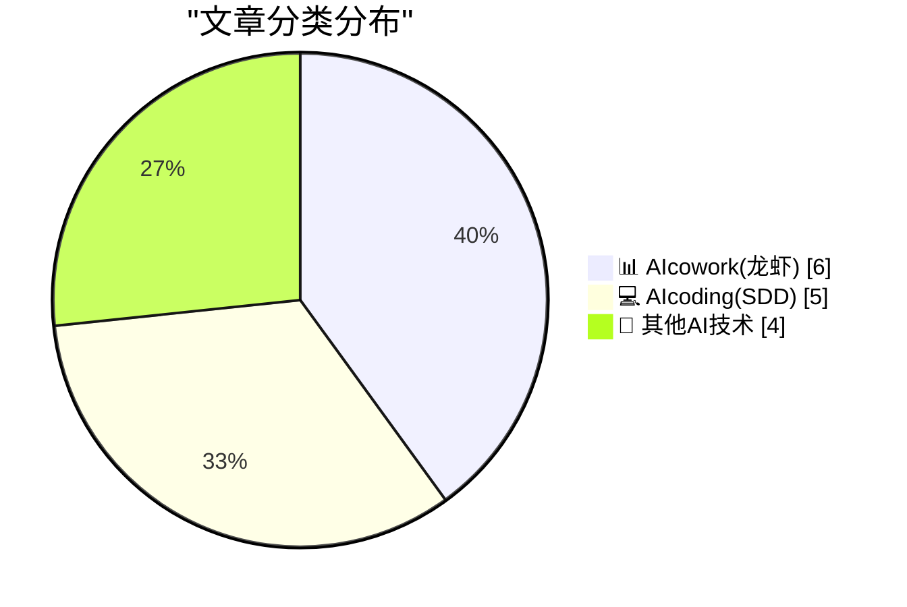
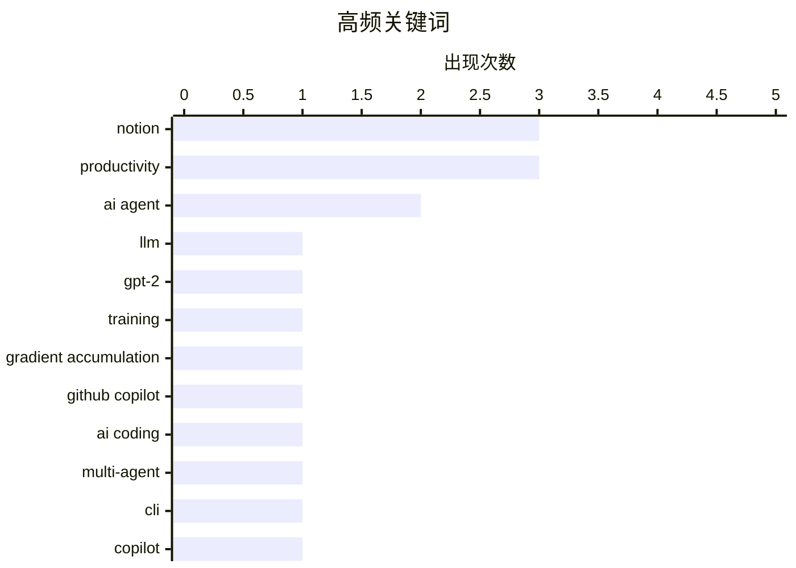

# 📰 AI 博客每日精选 — 2026-04-15

> 来自 98 个技术博客和社交媒体源，AI 精选 Top 15

## 📝 今日看点

今日技术圈的核心焦点是AI智能体深度融入工作流与开发范式的演进。一方面，AI正从辅助工具转变为协作伙伴，在Slack、Notion、Word等平台中实现透明、自主的任务处理，重塑团队生产力。另一方面，开发领域持续探索效能边界，从并行化AI编码工具到优化模型训练与开源协作，推动着软件构建方式的深层变革。

---

## 🏆 今日必读

🥇 **从零开始构建LLM，第32k部分——干预：通过梯度累积在本地训练更好的模型**

[Writing an LLM from scratch, part 32k -- Interventions: training a better model locally with gradient accumulation](https://www.gilesthomas.com/2026/04/llm-from-scratch-32k-interventions-training-our-best-model-locally-gradient-accumulation) — gilesthomas.com · 1 小时前 · 💻 AIcoding(SDD)

> 作者基于Sebastian Raschka的书籍，正在从零开始构建一个GPT-2-small风格的LLM。文章核心是探讨如何通过修改模型和训练代码（干预措施）来提升模型性能，并确定哪些干预效果最佳。作者在云端训练了多个版本进行验证后，最终选择在本地使用梯度累积技术来训练效果最好的模型。这展示了在资源有限条件下优化模型训练的一种实践路径。

💡 **为什么值得读**: 对于想深入理解LLM训练细节、特别是如何在本地有限资源下进行有效优化的开发者，这篇文章提供了宝贵的实战经验和具体技术方案。

🏷️ LLM, GPT-2, Training, Gradient Accumulation

🥈 **GitHub Copilot CLI 的 /fleet 模式：同时处理五个文件，并行派遣多个子智能体**

[Why work on one file when you can work on five at the same time? 😏 Run /fleet in Copilot CLI to dispatch multiple sub-agents in parallel to tackle ...](https://x.com/github/status/2044173605395649023) — 𝕏 @GitHub · 23 小时前 · 💻 AIcoding(SDD)

> GitHub Copilot CLI 推出了 /fleet 模式，允许用户并行派遣多个AI子智能体来加速处理代码库任务。该功能旨在通过并行化处理，让开发者能同时处理多个文件，从而大幅提升编码效率。官方还提供了如何为fleet模式编写最佳提示词的指南。这代表了AI编程助手向多智能体协作和并行任务处理方向的发展。

💡 **为什么值得读**: 如果你希望将AI编程助手的效率提升到新的水平，了解如何利用并行智能体来加速复杂代码库任务，这个新功能值得关注。

🏷️ GitHub Copilot, AI Coding, Multi-agent, CLI

🥉 **Word Copilot 最新更新：通过“跟踪更改”和上下文评论实现透明、可审计的编辑**

[The latest Copilot in Word update brings transparent, auditable edits with Track Changes and contextual comments—right where work happens. Available ...](https://x.com/Microsoft365/status/2044174466503315918) — 𝕏 @Microsoft365 · 23 小时前 · 📊 AIcowork(龙虾)

> Microsoft Word 中的 Copilot 功能获得了重要更新，现在其编辑操作可以像同事一样使用“跟踪更改”和上下文评论功能。这使得AI所做的修改变得完全透明且可审计，所有编辑都直接发生在文档工作流中。该更新已面向Frontier项目的用户推出，并利用了Work IQ技术来确保操作基于企业上下文。此举旨在让AI协作更贴近真实的人类协作模式。

💡 **为什么值得读**: 对于重视工作流程透明度和版本控制的团队，此更新解决了AI工具“黑箱”修改的痛点，是AI深度集成到生产工具中的一个关键进步。

🏷️ Copilot, Microsoft Word, Track Changes

4️⃣ **工程师Calder在Notion中构建了一个自我演进的乐队经理智能体系统**

[He’s an engineer in the AM, a musician in the PM. Calder built his own band manager as a self-evolving agent system, entirely in Notion.](https://x.com/NotionHQ/status/2044485078370165234) — 𝕏 @NotionHQ · 3 小时前 · 📊 AIcowork(龙虾)

> 一位名为Calder的工程师兼音乐家，完全在Notion平台内构建了一个自我演进的智能体系统，用于管理他的乐队事务。这个案例展示了Notion作为平台，其灵活性和可扩展性足以支持复杂智能体系统的开发。它将个人项目管理与自动化智能体技术相结合，实现了跨领域（工程与音乐）的需求整合。这体现了低代码/无代码平台在构建定制化AI应用方面的潜力。

💡 **为什么值得读**: 这个案例极具启发性，展示了如何利用现有生产力工具（如Notion）作为平台，构建高度个性化、解决实际生活问题的AI智能体系统。

🏷️ Notion, Agent System, Automation, Productivity

5️⃣ **在Slack中构建智能体：让AI知晓团队讨论的一切**

[What if your AI agent already knew everything your team discussed? That's the promise of building in Slack. New platform capabilities announced today ...](https://x.com/SlackHQ/status/2044408023708291235) — 𝕏 @SlackHQ · 8 小时前 · 📊 AIcowork(龙虾)

> Slack宣布了新的平台能力，旨在让开发者能更轻松地部署在团队协作环境中工作的AI智能体。新功能包括Slackbot MCP客户端用于协调工作、一键部署来自Vercel等合作伙伴的自定义智能体、通过AgentExchange管理统一的智能体浏览器，以及构建丰富的智能体体验。其核心承诺是让智能体基于团队的全部对话上下文进行工作，而非在独立的标签页中运行。这标志着AI智能体正深度融入核心协作场景。

💡 **为什么值得读**: 对于任何希望在团队真实协作语境中部署和集成AI智能体的开发者或企业，Slack平台的新能力提供了至关重要的基础设施和入口。

🏷️ Slack, AI Agent, Platform

---

## 📊 数据概览

| 扫描源 | 抓取文章 | 时间范围 | 精选 |
|:---:|:---:|:---:|:---:|
| 74/98 | 2308 篇 → 28 篇 | 24h | **15 篇** |

### 分类分布



### 高频关键词



<details>
<summary>📈 纯文本关键词图（终端友好）</summary>

```
notion                │ ████████████████████ 3
productivity          │ ████████████████████ 3
ai agent              │ █████████████░░░░░░░ 2
llm                   │ ███████░░░░░░░░░░░░░ 1
gpt-2                 │ ███████░░░░░░░░░░░░░ 1
training              │ ███████░░░░░░░░░░░░░ 1
gradient accumulation │ ███████░░░░░░░░░░░░░ 1
github copilot        │ ███████░░░░░░░░░░░░░ 1
ai coding             │ ███████░░░░░░░░░░░░░ 1
multi-agent           │ ███████░░░░░░░░░░░░░ 1
```

</details>

### 🏷️ 话题标签

**notion**(3) · **productivity**(3) · **ai agent**(2) · llm(1) · gpt-2(1) · training(1) · gradient accumulation(1) · github copilot(1) · ai coding(1) · multi-agent(1) · cli(1) · copilot(1) · microsoft word(1) · track changes(1) · agent system(1) · automation(1) · slack(1) · platform(1) · open source(1) · ai contributions(1)

---

====================

## 📊 AIcowork(龙虾)

### 1. Word Copilot 最新更新：通过“跟踪更改”和上下文评论实现透明、可审计的编辑

[The latest Copilot in Word update brings transparent, auditable edits with Track Changes and contextual comments—right where work happens. Available ...](https://x.com/Microsoft365/status/2044174466503315918) — **𝕏 @Microsoft365** · 23 小时前 · ⭐ 21/25

> Microsoft Word 中的 Copilot 功能获得了重要更新，现在其编辑操作可以像同事一样使用“跟踪更改”和上下文评论功能。这使得AI所做的修改变得完全透明且可审计，所有编辑都直接发生在文档工作流中。该更新已面向Frontier项目的用户推出，并利用了Work IQ技术来确保操作基于企业上下文。此举旨在让AI协作更贴近真实的人类协作模式。

🏷️ Copilot, Microsoft Word, Track Changes

📌 AIcowork(龙虾)

---

### 2. 工程师Calder在Notion中构建了一个自我演进的乐队经理智能体系统

[He’s an engineer in the AM, a musician in the PM. Calder built his own band manager as a self-evolving agent system, entirely in Notion.](https://x.com/NotionHQ/status/2044485078370165234) — **𝕏 @NotionHQ** · 3 小时前 · ⭐ 18/25

> 一位名为Calder的工程师兼音乐家，完全在Notion平台内构建了一个自我演进的智能体系统，用于管理他的乐队事务。这个案例展示了Notion作为平台，其灵活性和可扩展性足以支持复杂智能体系统的开发。它将个人项目管理与自动化智能体技术相结合，实现了跨领域（工程与音乐）的需求整合。这体现了低代码/无代码平台在构建定制化AI应用方面的潜力。

🏷️ Notion, Agent System, Automation, Productivity

📌 AIcowork(龙虾)

---

### 3. 在Slack中构建智能体：让AI知晓团队讨论的一切

[What if your AI agent already knew everything your team discussed? That's the promise of building in Slack. New platform capabilities announced today ...](https://x.com/SlackHQ/status/2044408023708291235) — **𝕏 @SlackHQ** · 8 小时前 · ⭐ 18/25

> Slack宣布了新的平台能力，旨在让开发者能更轻松地部署在团队协作环境中工作的AI智能体。新功能包括Slackbot MCP客户端用于协调工作、一键部署来自Vercel等合作伙伴的自定义智能体、通过AgentExchange管理统一的智能体浏览器，以及构建丰富的智能体体验。其核心承诺是让智能体基于团队的全部对话上下文进行工作，而非在独立的标签页中运行。这标志着AI智能体正深度融入核心协作场景。

🏷️ Slack, AI Agent, Platform

📌 AIcowork(龙虾)

---

### 4. MrBeast团队应对混乱的秘诀：内置AI工作智能体Slackbot

[Most teams collapse under chaos. MrBeast leans into it. Their secret sauce? It's Slackbot. Slackbot is your built-in AI agent for work. It can summari...](https://x.com/SlackHQ/status/2044174080883011639) — **𝕏 @SlackHQ** · 23 小时前 · ⭐ 17/25

> 文章以MrBeast团队为例，揭示了其应对高强度、快节奏工作环境的秘诀是深度使用内置AI智能体Slackbot。Slackbot能够总结对话、转录会议、创建演示文稿、分析预算等，承担了大量繁重工作。这表明将AI智能体深度集成到日常沟通工具中，可以成为团队规模化运营和应对复杂性的关键杠杆。

🏷️ Slackbot, AI Agent, Productivity

📌 AIcowork(龙虾)

---

### 5. Google Workspace with Gemini助力企业提升生产力：87%员工每周节省3-4小时

[📱 87% of employees saving 3–4 hours a week? At @enjoyGLOBE, Google Workspace with Gemini is boosting productivity and driving 80% adoption across ...](https://x.com/GoogleWorkspace/status/2044446403137585643) — **𝕏 @GoogleWorkspace** · 5 小时前 · ⭐ 16/25

> 在enjoyGLOBE公司，集成Gemini的Google Workspace显著提升了团队生产力和工具采纳率。具体数据显示，87%的员工每周因此节省了3-4个小时。该解决方案推动了高达80%的团队采纳率，表明AI工具在规模化提升组织效率方面具有巨大潜力。案例展示了企业如何在实际工作中规模化应用AI。

🏷️ Google Workspace, Gemini, Productivity

📌 AIcowork(龙虾)

---

### 6. Notion AI重构五次的完整故事首次披露

[RT swyx 🐣: finally: @simonlast + @sarahmsachs on Latent Space! Notion has rebuilt Notion AI 5 times. This is the first time Simon has told the enti...](https://x.com/NotionHQ/status/2044283553559785486) — **𝕏 @NotionHQ** · 20 小时前 · ⭐ 11/25

> 在Latent Space播客中，Notion的联合创始人Simon Last首次完整讲述了Notion AI背后曲折的开发历程。Notion AI经历了五次彻底的重建，这揭示了打造一流AI产品所需的反复迭代与巨大投入。Notion作为拥有超1亿用户（2024年数据）的顶级知识工作工具，其AI套件的目标是成为“知识工作的钢铁与蒸汽”。此次访谈揭示了顶级产品在AI转型过程中的深度思考与实践。

🏷️ Notion AI, Product Development, Case Study

📌 AIcowork(龙虾)

---

## 💻 AIcoding(SDD)

### 7. 从零开始构建LLM，第32k部分——干预：通过梯度累积在本地训练更好的模型

[Writing an LLM from scratch, part 32k -- Interventions: training a better model locally with gradient accumulation](https://www.gilesthomas.com/2026/04/llm-from-scratch-32k-interventions-training-our-best-model-locally-gradient-accumulation) — **gilesthomas.com** · 1 小时前 · ⭐ 23/25

> 作者基于Sebastian Raschka的书籍，正在从零开始构建一个GPT-2-small风格的LLM。文章核心是探讨如何通过修改模型和训练代码（干预措施）来提升模型性能，并确定哪些干预效果最佳。作者在云端训练了多个版本进行验证后，最终选择在本地使用梯度累积技术来训练效果最好的模型。这展示了在资源有限条件下优化模型训练的一种实践路径。

🏷️ LLM, GPT-2, Training, Gradient Accumulation

📌 AIcoding(SDD)

---

### 8. GitHub Copilot CLI 的 /fleet 模式：同时处理五个文件，并行派遣多个子智能体

[Why work on one file when you can work on five at the same time? 😏 Run /fleet in Copilot CLI to dispatch multiple sub-agents in parallel to tackle ...](https://x.com/github/status/2044173605395649023) — **𝕏 @GitHub** · 23 小时前 · ⭐ 21/25

> GitHub Copilot CLI 推出了 /fleet 模式，允许用户并行派遣多个AI子智能体来加速处理代码库任务。该功能旨在通过并行化处理，让开发者能同时处理多个文件，从而大幅提升编码效率。官方还提供了如何为fleet模式编写最佳提示词的指南。这代表了AI编程助手向多智能体协作和并行任务处理方向的发展。

🏷️ GitHub Copilot, AI Coding, Multi-agent, CLI

📌 AIcoding(SDD)

---

### 9. AI时代开源维护者如何有效指导贡献者？引入“3C”框架

[AI is driving more open source contributions than ever. But as a maintainer, how do you filter the noise to find the people who actually want mentorsh...](https://x.com/github/status/2044487181230571944) — **𝕏 @GitHub** · 3 小时前 · ⭐ 17/25

> 随着AI驱动开源贡献激增，维护者面临如何从噪音中筛选出真正寻求指导的贡献者的挑战。文章针对此问题，提出了一个名为“3C”的框架，旨在帮助维护者有意图地进行指导，同时避免精力耗竭。该框架旨在重新思考AI时代的开源指导模式，聚焦于质量和可持续性，而非单纯的数量。

🏷️ Open Source, AI Contributions, Maintainers, Mentorship

📌 AIcoding(SDD)

---

### 10. 一份足够全面的规格说明书并不（必然）等同于代码

[A sufficiently comprehensive spec is not (necessarily) code](https://buttondown.com/hillelwayne/archive/a-sufficiently-comprehensive-spec-is-not/) — **buttondown.com/hillelwayne** · 5 小时前 · ⭐ 14/25

> 作者针对一种常见观点——即极其详细的规格说明书可以取代代码——提出了反驳。文章通过引用一个关于业务人员与程序员对规格说明书看法的漫画，引出了这一讨论。核心论点是，无论规格说明书多么详尽和全面，其本质与可执行的代码仍然存在根本性区别，不能简单地划等号。这触及了软件开发中需求、设计与实现之间关系的经典议题。

🏷️ Specification, Software Engineering, Requirements

📌 AIcoding(SDD)

---

### 11. 这是你提交 #GitHubUniverse 会议想法的信号 ✨

[This is your sign to submit your #GitHubUniverse session idea ✨ Call for sessions is now open through May 1 👇 https://githubuniverse.com/?utm_sour...](https://x.com/github/status/2044271585046016304) — **𝕏 @GitHub** · 17 小时前 · ⭐ 10/25

> GitHub 正式开放其年度大会 GitHub Universe 的议题征集。核心议题征集截止日期为 5 月 1 日，开发者可通过官方渠道提交演讲提案。这是一个面向全球开发者社区展示技术、分享最佳实践和行业见解的平台。成功入选的演讲者将在大会上向全球观众分享其专业知识。

🏷️ GitHub, Conference, Community

📌 AIcoding(SDD)

---

## 🔬 其他AI技术

### 12. 黄仁勋访谈：TPU竞争、为何应向中国出售芯片及英伟达的供应链护城河

[Jensen Huang – TPU competition, why we should sell chips to China, & Nvidia’s supply chain moat](https://www.dwarkesh.com/p/jensen-huang) — **dwarkesh.com** · 6 小时前 · ⭐ 9/25

> 英伟达CEO黄仁勋在访谈中讨论了与谷歌TPU的竞争、对华芯片销售策略以及公司的核心优势。他解释了向中国销售芯片的商业逻辑，并强调了英伟达在供应链上的强大护城河。黄仁勋指出，公司已为未来数年可能达到的万亿美元规模做好了供应链准备。其核心观点是，强大的供应链能力是英伟达应对未来增长和竞争的关键。

🏷️ NVIDIA, TPU, AI Hardware, Supply Chain

📌 其他AI技术

---

### 13. Notion 致力于提升速度：推出快速创建和加入会议功能

[RT Zach Tratar: We’re working hard to improve the speed of Notion. One aspect of that? Creating and joining meetings rapidly in fewer clicks. So a co...](https://x.com/NotionHQ/status/2044189885624676724) — **𝕏 @NotionHQ** · 23 小时前 · ⭐ 8/25

> Notion 团队宣布推出两项新功能以提升产品速度和用户体验。新功能“快速加入”和“快速创建”旨在简化会议流程，让用户以更少的点击次数快速创建或加入会议。这是 Notion 整体性能优化计划的一部分，由工程师团队直接推动并上线。这些改进直接回应了用户对操作效率的长期需求。

🏷️ Notion, Product Update, UI Improvement

📌 其他AI技术

---

### 14. 用户 Frank 使用 Notion 构建 Notion 的元工作流

[](https://x.com/NotionHQ/status/2044183392338751763) — **𝕏 @NotionHQ** · 23 小时前 · ⭐ 8/25

> 一位名为 Frank 的用户展示了其利用 Notion 产品自身来构建和管理 Notion 工作流的“元”方法。这体现了 Notion 作为一款强大生产力工具的灵活性和自指性。用户通过将 Notion 既作为工具又作为管理对象，探索了其极限应用场景。此举在社区中引发了关于工具使用哲学的讨论。

🏷️ Notion, Meta, Screenshot

📌 其他AI技术

---

### 15. 微软面向学生推出史上最佳优惠：购指定PC获赠一年Microsoft 365与Xbox Game Pass

[RT Windows: Our best offer for students ever is here. Buy a select PC and get: ✏️ 1 year of Microsoft 365 Premium 👑 1 year of Xbox Game Pass Ulti...](https://x.com/Microsoft365/status/2044520266433184210) — **𝕏 @Microsoft365** · 3 小时前 · ⭐ 8/25

> 微软推出了针对学生群体的重磅捆绑优惠，被称为“史上最佳学生优惠”。购买指定型号PC的学生可同时获得为期一年的 Microsoft 365 Premium 订阅和 Xbox Game Pass Ultimate 订阅。此外，优惠还包含自定义设计 Xbox 无线控制器的机会。该优惠旨在通过软件和服务组合吸引学生用户进入微软生态系统。

🏷️ Microsoft 365, Promotion, Bundle

📌 其他AI技术

---

====================

*生成于 2026-04-15 21:50 | 扫描 74 源 → 获取 2308 篇 → 精选 15 篇*
*基于 [Hacker News Popularity Contest 2025](https://refactoringenglish.com/tools/hn-popularity/) RSS 源列表，由 [Andrej Karpathy](https://x.com/karpathy) 推荐*
*由「懂点儿AI」制作，欢迎关注同名微信公众号获取更多 AI 实用技巧 💡*
