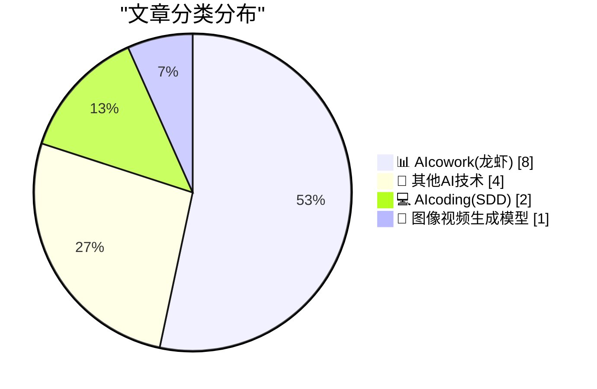
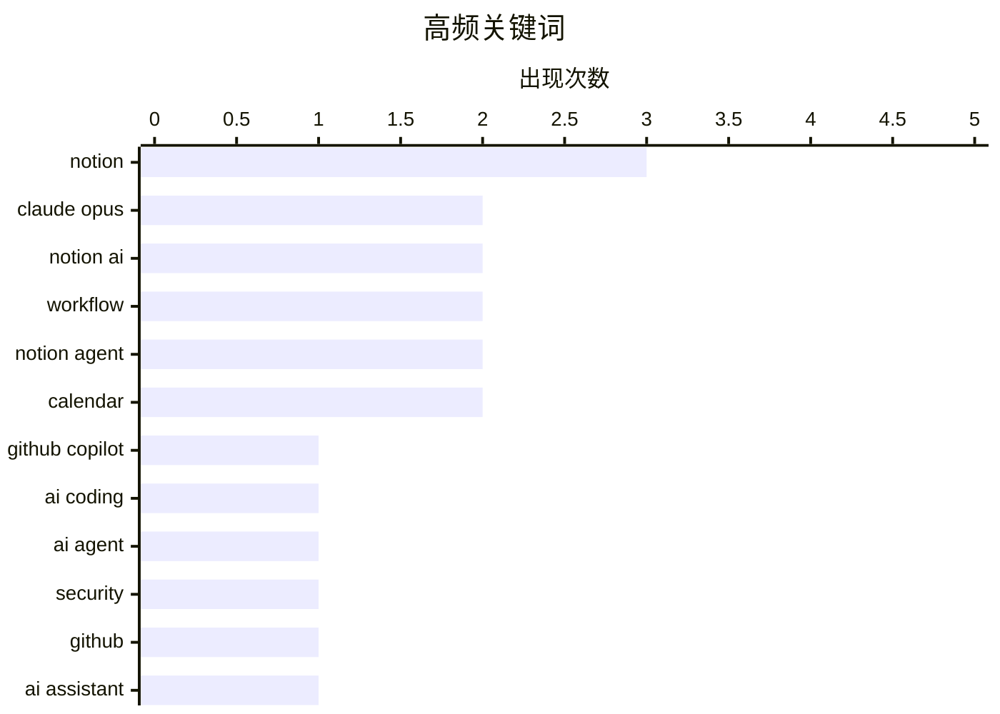

# 📰 AI 博客每日精选 — 2026-04-16

> 来自 98 个技术博客和社交媒体源，AI 精选 Top 15

## 📝 今日看点

今日技术圈聚焦于AI智能体能力的深度进化与场景融合。以Claude Opus 4.7为代表的新一代模型正全面嵌入GitHub、Notion等生产力平台，显著提升了复杂任务处理与多步骤工作流的可靠性。同时，AI智能体正从工具演变为“数字同事”，深度集成日历、项目管理等核心业务场景，实现工作流的自动化与智能化协同。此外，AI安全与可控生成成为并行热点，从攻防演练到精准视频生成，业界正积极探索技术的安全边界与精细化控制。

---

## 🏆 今日必读

🥇 **Anthropic的Claude Opus 4.7现已全面推出并集成至GitHub Copilot**

[🆕 @AnthropicAI's Claude Opus 4.7 is now generally available and rolling out in GitHub Copilot. Early testing shows ➡️ It has stronger multi-step ...](https://x.com/github/status/2044794259581161744) — 𝕏 @GitHub · 6 小时前 · 💻 AIcoding(SDD)

> Anthropic最强的Claude Opus 4.7模型已正式在GitHub Copilot中上线。早期测试表明，该模型在多步骤任务执行和智能体代理可靠性方面表现更强，在长链条推理和复杂工作流处理上也有显著改进。用户现可在VS Code或Copilot CLI中体验此更新。

💡 **为什么值得读**: 对于依赖Copilot进行复杂编程和自动化任务的开发者而言，了解此次模型升级带来的推理能力与工作流执行可靠性的具体提升至关重要。

🏷️ Claude Opus, GitHub Copilot, AI Coding

🥈 **Anthropic最智能的Opus 4.7模型现已登陆Notion**

[Opus 4.7, Anthropic's most intelligent model, is now in Notion! It’s a real step up from Opus 4.6 for multi-step workflows. It uses fewer tokens. Abo...](https://x.com/NotionHQ/status/2044787710892888281) — 𝕏 @NotionHQ · 7 小时前 · 📊 AIcowork(龙虾)

> Anthropic的Opus 4.7模型已在Notion中可用，相比Opus 4.6是多步骤工作流的实质性升级。新模型消耗更少的令牌，工具调用错误率降低了约3倍，并能像真实队友一样排查工作流中的异常问题。

💡 **为什么值得读**: 该更新直接提升了Notion AI处理复杂、多步骤任务的能力和效率，对于重度依赖Notion进行项目管理和知识工作的用户具有实用价值。

🏷️ Claude Opus, Notion AI, Workflow

🥉 **通过GitHub安全代码游戏第四季，亲手“黑掉”一个AI智能体来学习安全知识**

[These days you can access AI agents that execute commands, browse the web, and coordinate with other agents. But you should always make sure they're s...](https://x.com/github/status/2044541615943852440) — 𝕏 @GitHub · 23 小时前 · 💻 AIcoding(SDD)

> GitHub推出了安全代码游戏第四季，主题是AI智能体安全。该游戏让用户通过亲自攻击一个AI智能体来测试安全知识，这些智能体具备执行命令、浏览网页和与其他智能体协作的能力。玩家可直接在浏览器中使用免费的GitHub Codespaces快速上手。

💡 **为什么值得读**: 以互动游戏的形式学习前沿的AI智能体安全风险与防御技巧，方式新颖且实践性强，适合开发者和安全从业者。

🏷️ AI Agent, Security, GitHub

4️⃣ **新功能：您的Notion智能体现已支持使用日历**

[New: your Notion Agent can now use your calendar. It can find time with teammates, create and update events, AND show a real grid view of your calenda...](https://x.com/NotionHQ/status/2044556219814449363) — 𝕏 @NotionHQ · 22 小时前 · 📊 AIcowork(龙虾)

> Notion智能体新增了日历集成功能。它能够为团队成员寻找共同空闲时间、创建和更新日程事件，并能在聊天界面中直接显示真实的日历网格视图。

💡 **为什么值得读**: 此功能将AI智能体与日程管理深度结合，极大简化了团队协调和会议安排的流程，提升了工作效率。

🏷️ Notion Agent, Calendar, AI Assistant

5️⃣ **坐上导演椅！使用Veo 3.1精准操控数字人**

[Step into the director's chair! 🎥 Direct avatars with precision using Veo 3.1, placing them into specific scenes to interact with uploaded images o...](https://x.com/GoogleWorkspace/status/2044823889784480139) — 𝕏 @GoogleWorkspace · 4 小时前 · 🎨 图像视频生成模型

> Google的Veo 3.1视频生成模型允许用户像导演一样精准控制数字人。用户可以将数字人置入特定场景，让其与上传的产品图片互动，并确保其面部和声音在每一帧中都保持一致。

💡 **为什么值得读**: 展示了AI视频生成在保持角色一致性和复杂场景控制方面的最新进展，对内容创作者和营销人员有很强的吸引力。

🏷️ Veo 3.1, Video Generation, Avatar

---

## 📊 数据概览

| 扫描源 | 抓取文章 | 时间范围 | 精选 |
|:---:|:---:|:---:|:---:|
| 71/98 | 2236 篇 → 29 篇 | 24h | **15 篇** |

### 分类分布



### 高频关键词



<details>
<summary>📈 纯文本关键词图（终端友好）</summary>

```
notion         │ ████████████████████ 3
claude opus    │ █████████████░░░░░░░ 2
notion ai      │ █████████████░░░░░░░ 2
workflow       │ █████████████░░░░░░░ 2
notion agent   │ █████████████░░░░░░░ 2
calendar       │ █████████████░░░░░░░ 2
github copilot │ ███████░░░░░░░░░░░░░ 1
ai coding      │ ███████░░░░░░░░░░░░░ 1
ai agent       │ ███████░░░░░░░░░░░░░ 1
security       │ ███████░░░░░░░░░░░░░ 1
```

</details>

### 🏷️ 话题标签

**notion**(3) · **claude opus**(2) · **notion ai**(2) · workflow(2) · notion agent(2) · calendar(2) · github copilot(1) · ai coding(1) · ai agent(1) · security(1) · github(1) · ai assistant(1) · veo 3.1(1) · video generation(1) · avatar(1) · meeting(1) · agent(1) · auto-journal(1) · developer platform(1) · api(1)

---

====================

## 📊 AIcowork(龙虾)

### 1. Anthropic最智能的Opus 4.7模型现已登陆Notion

[Opus 4.7, Anthropic's most intelligent model, is now in Notion! It’s a real step up from Opus 4.6 for multi-step workflows. It uses fewer tokens. Abo...](https://x.com/NotionHQ/status/2044787710892888281) — **𝕏 @NotionHQ** · 7 小时前 · ⭐ 24/25

> Anthropic的Opus 4.7模型已在Notion中可用，相比Opus 4.6是多步骤工作流的实质性升级。新模型消耗更少的令牌，工具调用错误率降低了约3倍，并能像真实队友一样排查工作流中的异常问题。

🏷️ Claude Opus, Notion AI, Workflow

📌 AIcowork(龙虾)

---

### 2. 新功能：您的Notion智能体现已支持使用日历

[New: your Notion Agent can now use your calendar. It can find time with teammates, create and update events, AND show a real grid view of your calenda...](https://x.com/NotionHQ/status/2044556219814449363) — **𝕏 @NotionHQ** · 22 小时前 · ⭐ 21/25

> Notion智能体新增了日历集成功能。它能够为团队成员寻找共同空闲时间、创建和更新日程事件，并能在聊天界面中直接显示真实的日历网格视图。

🏷️ Notion Agent, Calendar, AI Assistant

📌 AIcowork(龙虾)

---

### 3. 转发：Notion与日历结合更强大！让端到端的会议体验变得神奇

[RT Zach Tratar: Notion + calendar grows in power! Excited for how this makes the end to end meeting experience truly magical.](https://x.com/NotionHQ/status/2044578866606543230) — **𝕏 @NotionHQ** · 22 小时前 · ⭐ 16/25

> 这是一条转发推文，表达了对于Notion智能体新日历功能的兴奋。观点认为，Notion与日历的结合赋予了产品更强大的能力，有望打造出真正神奇的端到端会议体验。

🏷️ Notion Agent, Calendar, Meeting

📌 AIcowork(龙虾)

---

### 4. 转发：无法想象没有Notion AI该如何写个人绩效回顾

[RT Ryan Nystrom: I cannot imagine writing a self review without Notion AI ever again. → I made an agent 6 months ago to auto-journal from Slack, PRs,...](https://x.com/NotionHQ/status/2044599760418726207) — **𝕏 @NotionHQ** · 19 小时前 · ⭐ 15/25

> 用户分享使用Notion AI撰写绩效回顾的体验。他使用一个运行了6个月的智能体自动从Slack、PR、任务等渠道收集日志，然后让Notion AI根据工程期望起草初稿，并进行校准和迭代反馈，极大简化了原本痛苦的流程。

🏷️ Notion AI, Agent, Auto-journal

📌 AIcowork(龙虾)

---

### 5. 转发：开发者们，5月13日加入我们，首次预览Notion新开发者平台

[RT Notion Developers: Developers: Join us on May 13. A first look at our new developer platform. Let's build, together. https://ntn.so/developers](https://x.com/NotionHQ/status/2044843170958385503) — **𝕏 @NotionHQ** · 3 小时前 · ⭐ 14/25

> Notion Developers账号宣布将于5月13日举办活动，首次预览全新的Notion开发者平台，并邀请开发者共同构建。

🏷️ Notion, Developer Platform, API

📌 AIcowork(龙虾)

---

### 6. 转发：祝贺Eleanor Spolyar和Taryn Kelley赢得TDX26黑客松5万美元大奖

[RT Salesforce Developers: 🎉 Congratulations to Eleanor Spolyar and Taryn Kelley - winners of the #TDX26 Hackathon and $50K Grand Prize! Their solut...](https://x.com/SlackHQ/status/2044866024777105460) — **𝕏 @SlackHQ** · 22 小时前 · ⭐ 13/25

> City Pulse Agent解决方案赢得了TDX26黑客松的5万美元大奖。该方案通过集成Slack等通信工具和Tableau实时分析，优化城市服务请求处理，分析历史数据趋势，并推荐预防性维护措施，帮助城市团队有效协调维修、跟踪进度。

🏷️ Hackathon, City Pulse Agent, Data Analysis

📌 AIcowork(龙虾)

---

### 7. 当Slack的公司用Slack来运营自身业务时会发生什么？认识Slackbot

[What happens when the company behind Slack uses Slack to run its own business? Meet Slackbot — powering smarter workflows, faster execution, and seam...](https://x.com/SlackHQ/status/2044628371900948632) — **𝕏 @SlackHQ** · 17 小时前 · ⭐ 11/25

> 推文介绍了Salesforce内部如何使用Slackbot（Slack的智能机器人）来运营业务。Slackbot助力实现了更智能的工作流、更快速的执行以及跨Salesforce的无缝协作，从而减少手动工作，提升业务影响力。

🏷️ Slackbot, Workflow, Automation

📌 AIcowork(龙虾)

---

### 8. 全球对AI感到焦虑？昨晚，我们试图改变这一点

[RT Laura H. Clugston: People around the world feel anxious about AI. Last night, we tried to change that. 50 non-technical women came to @NotionHQ in ...](https://x.com/NotionHQ/status/2044814257817342339) — **𝕏 @NotionHQ** · 6 小时前 · ⭐ 10/25

> 针对全球普遍存在的AI焦虑问题，Notion与buildafterdark_合作举办了一场线下工作坊。活动邀请了50名非技术背景的女性参与，在旧金山的Notion总部完成了首个“氛围编码”项目。该实践旨在通过亲身体验降低技术门槛，证明AI与编程并非遥不可及。活动表明，通过具体的、低门槛的实践项目，可以有效缓解公众对AI的陌生感和焦虑情绪。

🏷️ Notion, AI Education, Workshop

📌 AIcowork(龙虾)

---

## 🔬 其他AI技术

### 9. Agentblazers在#TDX26首日尽兴而归

[RT Salesforce Developers: 🤩 Agentblazers had a blast at Day 1 of #TDX26. Share your one word to describe the event.👇 Not here in-person? Catch t...](https://x.com/SlackHQ/status/2044864264205463832) — **𝕏 @SlackHQ** · 7 小时前 · ⭐ 7/25

> 这是一条关于Salesforce开发者大会#TDX26首日活动的宣传推文。推文显示Agentblazers团队参与了活动并享受其中，同时鼓励观众用一个词描述活动感受。对于未能亲临现场者，大会内容可通过Salesforce+线上平台观看。推文核心是宣传TDX26大会的活跃氛围并引导线上参与。

🏷️ Salesforce, TDX26, Event

📌 其他AI技术

---

### 10. Notion入选《福布斯》AI 50榜单，并与众多上榜团队并肩

[Notion’s on the @Forbes AI 50. And the best part is who we’re on it with a bunch of the teams on this list already run on Notion (hi friends)! Thank...](https://x.com/NotionHQ/status/2044781276880879918) — **𝕏 @NotionHQ** · 7 小时前 · ⭐ 6/25

> Notion宣布其成功入选《福布斯》杂志评选的AI 50重要榜单。值得关注的是，榜单中已有许多团队本身就是Notion的深度用户。这侧面印证了Notion作为生产力平台，其用户群体与AI创新前沿高度重合。此次上榜是对Notion在AI领域影响力和其用户生态价值的一次双重认可。

🏷️ Forbes, AI 50, Notion

📌 其他AI技术

---

### 11. 相约2026年#GoogleCloudNext，探索AI解锁组织新可能

[We hope to see you online or in Vegas at #GoogleCloudNext 2026, where you can join fellow innovators and Google experts to discover how AI can unlock ...](https://x.com/GoogleWorkspace/status/2044763491311947851) — **𝕏 @GoogleWorkspace** · 8 小时前 · ⭐ 6/25

> Google Workspace官方预告了2026年Google Cloud Next大会，会议将在线下（拉斯维加斯）和线上同步举行。大会核心主题是探讨AI如何为组织解锁新的可能性，届时创新者与谷歌专家将齐聚一堂。官方已提前列出了10场不容错过的重点议程，引导参与者提前规划。这表明谷歌将持续以年度大会为核心，系统输出其企业级AI解决方案和愿景。

🏷️ Google Cloud Next, Conference, AI Sessions

📌 其他AI技术

---

### 12. 《纽约时报》：特朗普的伊朗战争叙事与现实相撞

[Colliding With Reality, Indeed](https://www.nytimes.com/2026/04/15/us/politics/trump-iran-war.html?unlocked_article_code=1.bVA.EB30.mygpleorcQhg&amp;smid=url-share) — **daringfireball.net** · 1 小时前 · ⭐ 5/25

> 《纽约时报》报道指出，特朗普总统正试图将伊朗战争描绘成一场近乎结束的、已获成功的行动。然而，文章认为，在多年试图将个人叙事强加于现实之后，特朗普此次遭遇了一场不按其剧本发展的危机。报道一方面肯定了媒体终于开始如对待其他官员一样，直面并陈述特朗普言论与事实之间的明显矛盾。这反映了政治叙事在复杂现实面前可能失效的普遍困境。

🏷️ Politics, News

📌 其他AI技术

---

## 💻 AIcoding(SDD)

### 13. Anthropic的Claude Opus 4.7现已全面推出并集成至GitHub Copilot

[🆕 @AnthropicAI's Claude Opus 4.7 is now generally available and rolling out in GitHub Copilot. Early testing shows ➡️ It has stronger multi-step ...](https://x.com/github/status/2044794259581161744) — **𝕏 @GitHub** · 6 小时前 · ⭐ 24/25

> Anthropic最强的Claude Opus 4.7模型已正式在GitHub Copilot中上线。早期测试表明，该模型在多步骤任务执行和智能体代理可靠性方面表现更强，在长链条推理和复杂工作流处理上也有显著改进。用户现可在VS Code或Copilot CLI中体验此更新。

🏷️ Claude Opus, GitHub Copilot, AI Coding

📌 AIcoding(SDD)

---

### 14. 通过GitHub安全代码游戏第四季，亲手“黑掉”一个AI智能体来学习安全知识

[These days you can access AI agents that execute commands, browse the web, and coordinate with other agents. But you should always make sure they're s...](https://x.com/github/status/2044541615943852440) — **𝕏 @GitHub** · 23 小时前 · ⭐ 21/25

> GitHub推出了安全代码游戏第四季，主题是AI智能体安全。该游戏让用户通过亲自攻击一个AI智能体来测试安全知识，这些智能体具备执行命令、浏览网页和与其他智能体协作的能力。玩家可直接在浏览器中使用免费的GitHub Codespaces快速上手。

🏷️ AI Agent, Security, GitHub

📌 AIcoding(SDD)

---

## 🎨 图像视频生成模型

### 15. 坐上导演椅！使用Veo 3.1精准操控数字人

[Step into the director's chair! 🎥 Direct avatars with precision using Veo 3.1, placing them into specific scenes to interact with uploaded images o...](https://x.com/GoogleWorkspace/status/2044823889784480139) — **𝕏 @GoogleWorkspace** · 4 小时前 · ⭐ 19/25

> Google的Veo 3.1视频生成模型允许用户像导演一样精准控制数字人。用户可以将数字人置入特定场景，让其与上传的产品图片互动，并确保其面部和声音在每一帧中都保持一致。

🏷️ Veo 3.1, Video Generation, Avatar

📌 图像视频生成模型

---

====================

*生成于 2026-04-16 21:42 | 扫描 71 源 → 获取 2236 篇 → 精选 15 篇*
*基于 [Hacker News Popularity Contest 2025](https://refactoringenglish.com/tools/hn-popularity/) RSS 源列表，由 [Andrej Karpathy](https://x.com/karpathy) 推荐*
*由「懂点儿AI」制作，欢迎关注同名微信公众号获取更多 AI 实用技巧 💡*
