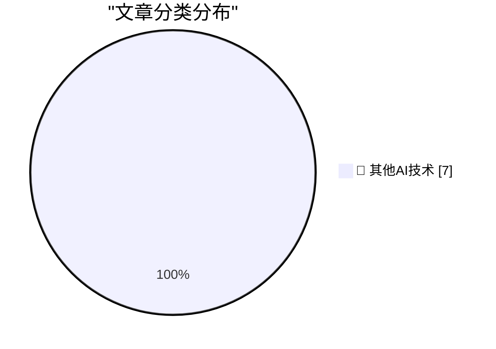
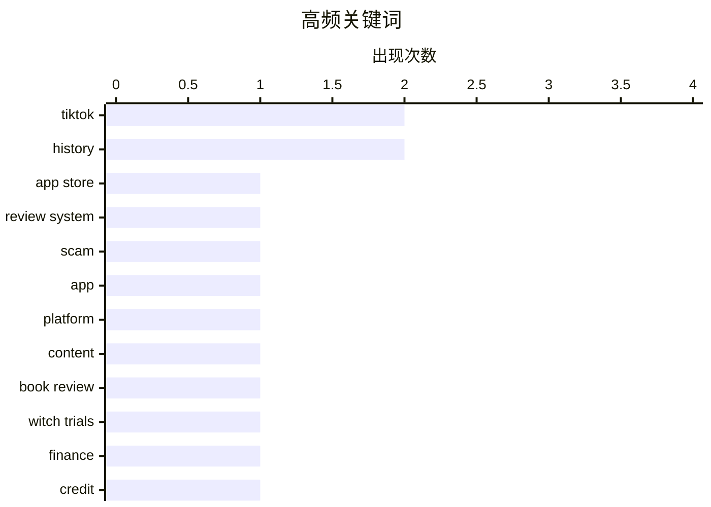

# 📰 AI 博客每日精选 — 2026-04-17

> 来自 98 个技术博客和社交媒体源，AI 精选 Top 7

## 📝 今日看点

今日技术圈聚焦于平台机制背后的深层影响。一方面，主流应用商店的评分与盈利模式暴露出设计缺陷与信任危机；另一方面，算法驱动的“TikTok化”内容分发正持续重塑文化与社会互动。同时，MP3核心专利到期标志着一个技术时代正式进入公共领域，引发对数字遗产自由化的新思考。

---

## 🏆 今日必读

🥇 **应用商店评分机制已崩坏**

[App Store Reviews Are Busted](https://blog.terrygodier.com/2026/04/13/app-store-reviews-are-busted.html) — daringfireball.net · 20 小时前 · 🔬 其他AI技术

> 文章揭示了苹果App Store评分系统存在一个反直觉的设计缺陷。核心问题是，对于一个平均分已高于4.0星的应用，任何新的4星评价实际上都会拉低其总体平均分，这在数学上等同于一个负面评价。这导致许多用户带着积极意图留下的“4星好评”（如“这是我最爱的应用！”），反而在客观上损害了开发者的评分。作者指出，这种评分算法与用户的主观评价意图严重脱节，使得评分无法真实反映用户满意度。

💡 **为什么值得读**: 本文一针见血地指出了App Store评分体系一个鲜为人知但影响深远的逻辑缺陷，对开发者和用户理解评分背后的真实含义至关重要。

🏷️ App Store, Review System

🥈 **Freecash更像是一场骗局**

[Freecash Was More Like Scamcash](https://techcrunch.com/2026/04/14/how-the-rewards-app-freecash-scammed-its-way-to-the-top-of-the-app-stores/) — daringfireball.net · 21 小时前 · 🔬 其他AI技术

> 文章揭露了曾登顶美国App Store免费榜第二的奖励应用Freecash的欺诈本质。该应用通过TikTok广告宣称“刷视频就能赚钱”来吸引用户，实则主要靠诱导用户玩手游并从中抽成来盈利。网络安全公司Malwarebytes发现，该应用在过程中收集了大量用户敏感数据，存在严重隐私风险。这一案例暴露了应用商店排名机制可能被不良应用利用，以及当前奖励应用商业模式中普遍存在的数据滥用问题。

💡 **为什么值得读**: 通过深度调查，本文揭开了现象级应用Freecash光鲜排名背后的数据欺诈黑幕，是了解应用商店生态安全风险的警示性案例。

🏷️ Scam, TikTok, App

🥉 **多元化：TikTok化将使我们自由（2026年4月17日）**

[Pluralistic: Tiktokification shall set us free (17 Apr 2026)](https://pluralistic.net/2026/04/17/for-youze/) — pluralistic.net · 11 小时前 · 🔬 其他AI技术

> 科里·多克托罗的每日链接合集，核心主题围绕“TikTok化”（算法驱动的个性化内容流）对文化和社会的影响展开。当日链接探讨了马克·扎克伯格旗下平台算法如何意外地“释放人质”（指改变内容分发逻辑），并涉及B2B托洛茨基主义、公共服务游戏、新西兰“三振出局”版权法、斯诺登近况、奥巴马谈金钱影响、荒谬的摩天大楼设计以及特斯拉里程表欺诈等多个独立但尖锐的科技文化评论。文章以碎片化但相互关联的方式，批判了当前科技巨头主导的注意力经济模式。

💡 **为什么值得读**: 作为科技文化评论的精华合集，本文以独特的“多元化”视角提供了对当下数字社会热点事件犀利而富有洞见的快照。

🏷️ TikTok, Platform, Content

4️⃣ **书评：《如何杀死一个女巫——给父权制的指南》作者：克莱尔·米切尔与佐伊·文迪托齐 ★★★⯪☆**

[Book Review: How To Kill A Witch - A Guide For The Patriarchy by Claire Mitchell and Zoe Venditozzi ★★★⯪☆](https://shkspr.mobi/blog/2026/04/book-review-how-to-kill-a-witch-a-guide-for-the-patriarchy-by-claire-mitchell-and-zoe-venditozzi/) — shkspr.mobi · 10 小时前 · 🔬 其他AI技术

> 这是一篇关于探讨苏格兰女巫审判历史书籍的评论。该书旨在回答为何女性会被指控为女巫、审判的真实情况及其现代影响等核心问题。书评指出，作者通过研究苏格兰女巫审判（兼及英格兰与海外案例），深入剖析了“巫术是否真实存在”这一核心历史张力。评论者给予该书三星半（★★★⯪☆）的评价，认为它为了解这段迫害女性的历史提供了有价值的视角。

💡 **为什么值得读**: 这篇书评引导读者关注一段被忽视的、以性别迫害为核心的历史，为理解当代性别议题提供了深刻的历史语境。

🏷️ Book Review, Witch Trials, History

5️⃣ **高级内容：私人信贷的“黑粉”指南**

[Premium: The Hater's Guide to Private Credit](https://www.wheresyoured.at/hatersguide-privatecredit/) — wheresyoured.at · 4 小时前 · 🔬 其他AI技术

> 文章以作者因一次商业贷款咨询而持续收到大量信贷推销短信的个人经历为引子，对“私人信贷”这一金融领域进行了批判性剖析。它旨在揭开私人信贷行业高速增长背后的运作机制、潜在风险和对借款人的实际影响。作者可能探讨了私人信贷与传统银行贷款的区别、其高利率与灵活条款的双刃剑特性，以及该行业在监管灰色地带的扩张问题。核心观点是提醒读者对看似便捷的私人信贷产品保持警惕，理解其复杂的成本和风险结构。

💡 **为什么值得读**: 本文以生动个人故事切入，为普通读者和创业者提供了一份关于复杂且不透明的私人信贷市场的实用避坑指南。

🏷️ Finance, Credit, Business

---

## 📊 数据概览

| 扫描源 | 抓取文章 | 时间范围 | 精选 |
|:---:|:---:|:---:|:---:|
| 64/98 | 1910 篇 → 7 篇 | 24h | **7 篇** |

### 分类分布



### 高频关键词



<details>
<summary>📈 纯文本关键词图（终端友好）</summary>

```
tiktok        │ ████████████████████ 2
history       │ ████████████████████ 2
app store     │ ██████████░░░░░░░░░░ 1
review system │ ██████████░░░░░░░░░░ 1
scam          │ ██████████░░░░░░░░░░ 1
app           │ ██████████░░░░░░░░░░ 1
platform      │ ██████████░░░░░░░░░░ 1
content       │ ██████████░░░░░░░░░░ 1
book review   │ ██████████░░░░░░░░░░ 1
witch trials  │ ██████████░░░░░░░░░░ 1
```

</details>

### 🏷️ 话题标签

**tiktok**(2) · **history**(2) · **app store**(1) · review system(1) · scam(1) · app(1) · platform(1) · content(1) · book review(1) · witch trials(1) · finance(1) · credit(1) · business(1) · game history(1) · mystery(1) · book(1) · patent(1) · mp3(1)

---

====================

## 🔬 其他AI技术

### 1. 应用商店评分机制已崩坏

[App Store Reviews Are Busted](https://blog.terrygodier.com/2026/04/13/app-store-reviews-are-busted.html) — **daringfireball.net** · 20 小时前 · ⭐ 5/25

> 文章揭示了苹果App Store评分系统存在一个反直觉的设计缺陷。核心问题是，对于一个平均分已高于4.0星的应用，任何新的4星评价实际上都会拉低其总体平均分，这在数学上等同于一个负面评价。这导致许多用户带着积极意图留下的“4星好评”（如“这是我最爱的应用！”），反而在客观上损害了开发者的评分。作者指出，这种评分算法与用户的主观评价意图严重脱节，使得评分无法真实反映用户满意度。

🏷️ App Store, Review System

📌 其他AI技术

---

### 2. Freecash更像是一场骗局

[Freecash Was More Like Scamcash](https://techcrunch.com/2026/04/14/how-the-rewards-app-freecash-scammed-its-way-to-the-top-of-the-app-stores/) — **daringfireball.net** · 21 小时前 · ⭐ 5/25

> 文章揭露了曾登顶美国App Store免费榜第二的奖励应用Freecash的欺诈本质。该应用通过TikTok广告宣称“刷视频就能赚钱”来吸引用户，实则主要靠诱导用户玩手游并从中抽成来盈利。网络安全公司Malwarebytes发现，该应用在过程中收集了大量用户敏感数据，存在严重隐私风险。这一案例暴露了应用商店排名机制可能被不良应用利用，以及当前奖励应用商业模式中普遍存在的数据滥用问题。

🏷️ Scam, TikTok, App

📌 其他AI技术

---

### 3. 多元化：TikTok化将使我们自由（2026年4月17日）

[Pluralistic: Tiktokification shall set us free (17 Apr 2026)](https://pluralistic.net/2026/04/17/for-youze/) — **pluralistic.net** · 11 小时前 · ⭐ 5/25

> 科里·多克托罗的每日链接合集，核心主题围绕“TikTok化”（算法驱动的个性化内容流）对文化和社会的影响展开。当日链接探讨了马克·扎克伯格旗下平台算法如何意外地“释放人质”（指改变内容分发逻辑），并涉及B2B托洛茨基主义、公共服务游戏、新西兰“三振出局”版权法、斯诺登近况、奥巴马谈金钱影响、荒谬的摩天大楼设计以及特斯拉里程表欺诈等多个独立但尖锐的科技文化评论。文章以碎片化但相互关联的方式，批判了当前科技巨头主导的注意力经济模式。

🏷️ TikTok, Platform, Content

📌 其他AI技术

---

### 4. 书评：《如何杀死一个女巫——给父权制的指南》作者：克莱尔·米切尔与佐伊·文迪托齐 ★★★⯪☆

[Book Review: How To Kill A Witch - A Guide For The Patriarchy by Claire Mitchell and Zoe Venditozzi ★★★⯪☆](https://shkspr.mobi/blog/2026/04/book-review-how-to-kill-a-witch-a-guide-for-the-patriarchy-by-claire-mitchell-and-zoe-venditozzi/) — **shkspr.mobi** · 10 小时前 · ⭐ 5/25

> 这是一篇关于探讨苏格兰女巫审判历史书籍的评论。该书旨在回答为何女性会被指控为女巫、审判的真实情况及其现代影响等核心问题。书评指出，作者通过研究苏格兰女巫审判（兼及英格兰与海外案例），深入剖析了“巫术是否真实存在”这一核心历史张力。评论者给予该书三星半（★★★⯪☆）的评价，认为它为了解这段迫害女性的历史提供了有价值的视角。

🏷️ Book Review, Witch Trials, History

📌 其他AI技术

---

### 5. 高级内容：私人信贷的“黑粉”指南

[Premium: The Hater's Guide to Private Credit](https://www.wheresyoured.at/hatersguide-privatecredit/) — **wheresyoured.at** · 4 小时前 · ⭐ 5/25

> 文章以作者因一次商业贷款咨询而持续收到大量信贷推销短信的个人经历为引子，对“私人信贷”这一金融领域进行了批判性剖析。它旨在揭开私人信贷行业高速增长背后的运作机制、潜在风险和对借款人的实际影响。作者可能探讨了私人信贷与传统银行贷款的区别、其高利率与灵活条款的双刃剑特性，以及该行业在监管灰色地带的扩张问题。核心观点是提醒读者对看似便捷的私人信贷产品保持警惕，理解其复杂的成本和风险结构。

🏷️ Finance, Credit, Business

📌 其他AI技术

---

### 6. 雷恩堡之谜，第四部分：当非虚构遇见虚构

[The Mystery of Rennes-le-Château, Part 4: Non-Fiction Meets Fiction](https://www.filfre.net/2026/04/the-mystery-of-rennes-le-chateau-part-4-non-fiction-meets-fiction/) — **filfre.net** · 5 小时前 · ⭐ 5/25

> 本文是系列文章的一部分，旨在追溯游戏《狩魔猎人3：神圣之血与诅咒之血》背后真实与虚构交织的历史。本部分聚焦于1982年出版的争议性著作《圣血与圣杯》（美国版名为《圣血与圣杯》），这本书混合了历史研究与猜想，催生了许多关于雷恩堡的阴谋论。文章分析了这部“非虚构”作品如何为后来的小说（如《达芬奇密码》）和游戏提供了关键的故事素材与叙事框架。它揭示了历史谜团如何通过大众文化作品被重新诠释和传播的过程。

🏷️ Game History, Mystery, Book

📌 其他AI技术

---

### 7. 最后一个MP3专利

[The last MP3 patent](https://dfarq.homeip.net/mp3-is-dead-long-live-mp3-oh-wait-its-just-the-patent/?utm_source=rss&#038;utm_medium=rss&#038;utm_campaign=mp3-is-dead-long-live-mp3-oh-wait-its-just-the-patent) — **dfarq.homeip.net** · 10 小时前 · ⭐ 5/25

> 文章宣布了MP3音频格式最后一个核心专利已到期这一标志性事件。作者巧妙地用欧洲中世纪“国王已死，国王万岁”的王权瞬时更迭谚语作类比，来形容专利到期后MP3技术真正进入公共领域的状态。这意味着MP3编解码器现在可以完全自由地使用、修改和集成，无需再支付任何许可费用。这一事件正式为MP3的专利时代画上了句号，虽然其作为技术标准的影响力早已被AAC等更高效的格式超越。

🏷️ Patent, MP3, History

📌 其他AI技术

---

====================

*生成于 2026-04-17 21:40 | 扫描 64 源 → 获取 1910 篇 → 精选 7 篇*
*基于 [Hacker News Popularity Contest 2025](https://refactoringenglish.com/tools/hn-popularity/) RSS 源列表，由 [Andrej Karpathy](https://x.com/karpathy) 推荐*
*由「懂点儿AI」制作，欢迎关注同名微信公众号获取更多 AI 实用技巧 💡*
