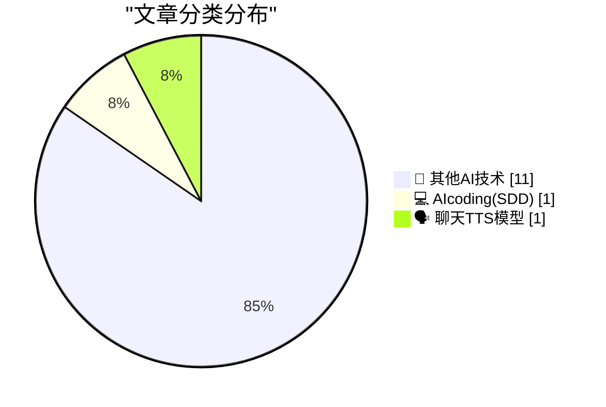
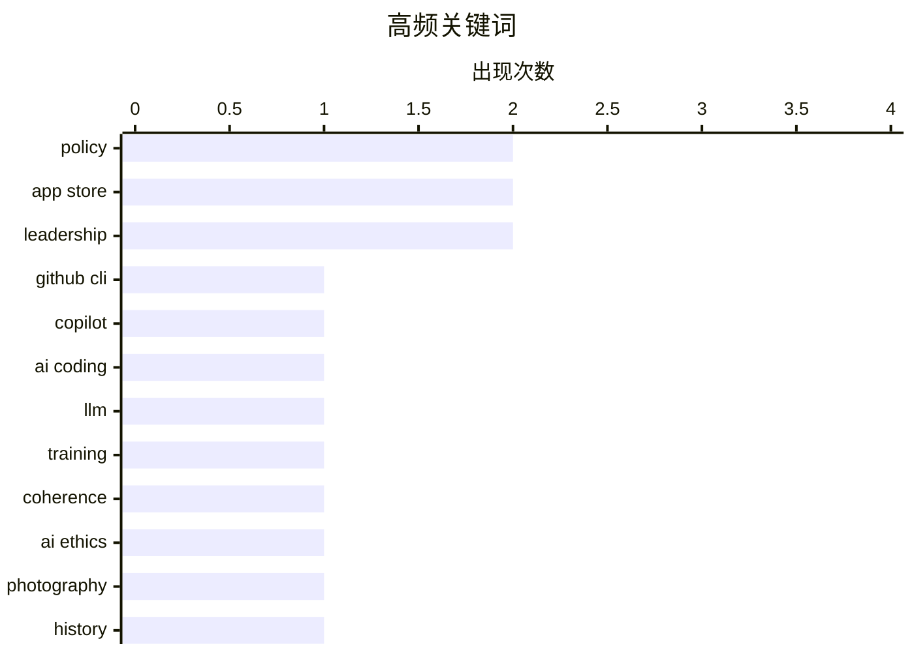

# 📰 AI 博客每日精选 — 2026-04-18

> 来自 98 个技术博客和社交媒体源，AI 精选 Top 13

## 📝 今日看点

今日技术圈聚焦于AI工具如何深度融入开发流程与职场文化反思两大趋势。一方面，AI编程助手正从代码生成向创造趣味工具和优化开发体验延伸，展现了其提升效率与创造力的双重潜力。另一方面，围绕技术伦理与职场政治的讨论升温，揭示了在技术激进变革面前，社会与组织内部存在的适应性张力与理性决策困境。

---

## 🏆 今日必读

🥇 **使用 Copilot CLI 构建 GitHub CLI 扩展会发生什么？**

[What happens when you build a GitHub CLI extension with Copilot CLI? P̶r̶o̶g̶r̶a̶m̶ ̶M̶a̶n̶a̶g̶e̶r̶ Dungeon Master @leereilly created o...](https://x.com/github/status/2045568549305856202) — 𝕏 @GitHub · 3 小时前 · 💻 AIcoding(SDD)

> 文章展示了如何利用 Copilot CLI 快速构建一个名为 `gh-dungeons` 的趣味 GitHub CLI 扩展。该扩展将代码仓库转化为一个地牢游戏，包含程序生成的地图和会“反击”的 Bug。整个过程演示了 Copilot CLI 如何通过自然语言指令辅助开发者完成从构思到实现的具体步骤。这为开发者探索 CLI 工具扩展和 AI 辅助编程提供了一个生动、有趣的实践案例。

💡 **为什么值得读**: 通过一个具体、有趣的游戏化项目，直观展示了 Copilot CLI 在提升开发效率和激发创意方面的实际能力。

🏷️ GitHub CLI, Copilot, AI Coding

🥈 **LLM 如何在训练过程中变得更连贯**

[How an LLM becomes more coherent as we train it](https://www.gilesthomas.com/2026/04/how-an-llm-becomes-more-coherent-over-training) — gilesthomas.com · 22 小时前 · 🗣️ 聊天TTS模型

> 文章探讨了基于 Transformer 架构的现代大语言模型在训练过程中输出文本连贯性的演变。作者通过训练一个拥有 1.63 亿参数的 GPT-2-small 风格模型（在约 32 亿 token 上训练），观察了其输出随训练进程的改善过程。与早期 RNN 模型的训练演变类似，LLM 的输出也从最初的随机、无意义文本，逐渐发展为语法正确、语义连贯的句子。这揭示了模型如何通过大规模数据训练逐步学习并内化语言的结构和模式。

💡 **为什么值得读**: 通过具体的训练实验和观察，为理解 LLM 内部能力如何随训练涌现提供了直观的案例和洞见。

🏷️ LLM, Training, Coherence

🥉 **许多反 AI 论点本质上是保守主义论点**

[Many anti-AI arguments are conservative arguments](https://seangoedecke.com/many-anti-ai-arguments-are-conservative/) — seangoedecke.com · 21 小时前 · 🔬 其他AI技术

> 文章指出，尽管当前多数反 AI 言论带有左翼色彩（如批判其加剧技术法西斯主义、碳排放、剥削劳工等），但其核心逻辑与保守主义论点相通。作者认为，这些批评本质上是对激进变革的恐惧，旨在维护现有社会结构、经济模式和权力分配，反对由 AI 驱动的颠覆性变化。文章旨在剥离反 AI 论述的政治标签，揭示其背后共同的保守内核。

💡 **为什么值得读**: 提供了一个独特且富有争议性的视角，挑战了关于 AI 辩论的常见政治划分，促使读者重新思考反对意见的深层动机。

🏷️ AI Ethics, Policy

4️⃣ **★ ‘移动阅览室，情人巷，以及深夜的廉价旅馆’：少年斯坦利·库布里克镜头下的 1940 年代纽约地铁**

[★ ‘A Reading Room on Wheels, a Lover’s Lane, and, After 11 PM, a Flophouse’](https://daringfireball.net/2026/04/kubrick_new_york_subway) — daringfireball.net · 3 小时前 · 🔬 其他AI技术

> 文章分享了一组由少年时代的斯坦利·库布里克在 1940 年代拍摄的纽约地铁照片。这些影像记录了当时地铁车厢内多样化的社会场景：有人阅读，有人亲密交谈，也有人将其当作过夜的场所。这些早期作品预示了库布里克日后对人性与社会空间的深刻观察和视觉叙事能力。

💡 **为什么值得读**: 为影迷和历史爱好者提供了一个难得的机会，窥见电影大师成名前捕捉日常生活瞬间的珍贵视觉档案。

🏷️ Photography, History

5️⃣ **Mac Mini 与 Mac Studio 面临供应短缺**

[Mac Mini and Mac Studio Supply Shortages](https://www.wsj.com/tech/personal-tech/apple-mac-mini-supply-3e7a7509?st=fKpr4Q) — daringfireball.net · 4 小时前 · 🔬 其他AI技术

> 据《华尔街日报》报道，苹果 Mac Mini 和 Mac Studio 目前正面临严重的供应短缺问题。具体而言，配备更大内存（如 32GB RAM 的 M4 基础版和 64GB RAM 的 M4 Pro 版）的 Mac Mini 在官网已显示“暂无供应”，其他型号的预计发货时间也长达 1 至 12 周。更强大的 Mac Studio 供应量更少，短缺情况更为严峻。这表明苹果在高端 Mac 桌面产品的供应链上遇到了挑战。

💡 **为什么值得读**: 为计划购买或关注苹果桌面产品供应链的消费者和行业观察者提供了及时且具体的关键信息。

🏷️ Hardware, Supply Chain

---

## 📊 数据概览

| 扫描源 | 抓取文章 | 时间范围 | 精选 |
|:---:|:---:|:---:|:---:|
| 71/98 | 2242 篇 → 13 篇 | 24h | **13 篇** |

### 分类分布



### 高频关键词



<details>
<summary>📈 纯文本关键词图（终端友好）</summary>

```
policy     │ ████████████████████ 2
app store  │ ████████████████████ 2
leadership │ ████████████████████ 2
github cli │ ██████████░░░░░░░░░░ 1
copilot    │ ██████████░░░░░░░░░░ 1
ai coding  │ ██████████░░░░░░░░░░ 1
llm        │ ██████████░░░░░░░░░░ 1
training   │ ██████████░░░░░░░░░░ 1
coherence  │ ██████████░░░░░░░░░░ 1
ai ethics  │ ██████████░░░░░░░░░░ 1
```

</details>

### 🏷️ 话题标签

**policy**(2) · **app store**(2) · **leadership**(2) · github cli(1) · copilot(1) · ai coding(1) · llm(1) · training(1) · coherence(1) · ai ethics(1) · photography(1) · history(1) · hardware(1) · supply chain(1) · guidelines(1) · reviews(1) · workplace(1) · politics(1) · voting technology(1) · github(1)

---

====================

## 🔬 其他AI技术

### 1. 许多反 AI 论点本质上是保守主义论点

[Many anti-AI arguments are conservative arguments](https://seangoedecke.com/many-anti-ai-arguments-are-conservative/) — **seangoedecke.com** · 21 小时前 · ⭐ 5/25

> 文章指出，尽管当前多数反 AI 言论带有左翼色彩（如批判其加剧技术法西斯主义、碳排放、剥削劳工等），但其核心逻辑与保守主义论点相通。作者认为，这些批评本质上是对激进变革的恐惧，旨在维护现有社会结构、经济模式和权力分配，反对由 AI 驱动的颠覆性变化。文章旨在剥离反 AI 论述的政治标签，揭示其背后共同的保守内核。

🏷️ AI Ethics, Policy

📌 其他AI技术

---

### 2. ★ ‘移动阅览室，情人巷，以及深夜的廉价旅馆’：少年斯坦利·库布里克镜头下的 1940 年代纽约地铁

[★ ‘A Reading Room on Wheels, a Lover’s Lane, and, After 11 PM, a Flophouse’](https://daringfireball.net/2026/04/kubrick_new_york_subway) — **daringfireball.net** · 3 小时前 · ⭐ 5/25

> 文章分享了一组由少年时代的斯坦利·库布里克在 1940 年代拍摄的纽约地铁照片。这些影像记录了当时地铁车厢内多样化的社会场景：有人阅读，有人亲密交谈，也有人将其当作过夜的场所。这些早期作品预示了库布里克日后对人性与社会空间的深刻观察和视觉叙事能力。

🏷️ Photography, History

📌 其他AI技术

---

### 3. Mac Mini 与 Mac Studio 面临供应短缺

[Mac Mini and Mac Studio Supply Shortages](https://www.wsj.com/tech/personal-tech/apple-mac-mini-supply-3e7a7509?st=fKpr4Q) — **daringfireball.net** · 4 小时前 · ⭐ 5/25

> 据《华尔街日报》报道，苹果 Mac Mini 和 Mac Studio 目前正面临严重的供应短缺问题。具体而言，配备更大内存（如 32GB RAM 的 M4 基础版和 64GB RAM 的 M4 Pro 版）的 Mac Mini 在官网已显示“暂无供应”，其他型号的预计发货时间也长达 1 至 12 周。更强大的 Mac Studio 供应量更少，短缺情况更为严峻。这表明苹果在高端 Mac 桌面产品的供应链上遇到了挑战。

🏷️ Hardware, Supply Chain

📌 其他AI技术

---

### 4. 苹果关于评分与评论提示的开发者指南

[Apple’s Developer Guidelines for Ratings and Review Prompts](https://developer.apple.com/design/human-interface-guidelines/ratings-and-reviews#Best-practices) — **daringfireball.net** · 20 小时前 · ⭐ 5/25

> 苹果在其人机界面指南中为开发者提供了关于在应用中请求评分和评论的最佳实践。核心原则是避免骚扰用户：建议至少间隔一两周再重复提示，并应在用户表现出进一步参与度后再触发。指南强烈推荐使用系统提供的标准化提示控件，以保持跨 iOS、iPadOS 和 macOS 体验的一致性且不显突兀。开发者应在用户体验中自然、恰当的时刻（如完成关键任务后）请求反馈。

🏷️ App Store, Guidelines

📌 其他AI技术

---

### 5. 后续：关于肯定出问题的 App Store 评价系统

[Follow-Up Regarding App Store Reviews, Which Are Definitely Busted](https://daringfireball.net/linked/2026/04/16/app-store-reviews-are-busted) — **daringfireball.net** · 21 小时前 · ⭐ 5/25

> 文章延续了关于 App Store 评价系统存在问题的讨论。作者指出，那些遵循最佳实践（如不频繁骚扰用户请求评价）的应用反而在获取评价数量上处于劣势。开发者 Steven Troughton-Smith 回应称，使用评价提示 API 是应用获得足够曝光（如被苹果编辑推荐）的关键，因为苹果通常只关注那些拥有大量评价的应用。这揭示了一个矛盾：良好的设计行为可能在现行的 App Store 算法和编辑逻辑下受到惩罚。

🏷️ App Store, Reviews

📌 其他AI技术

---

### 6. 我们都在工作中玩政治

[We Are All Playing Politics at Work](https://idiallo.com/blog/we-are-playing-politics?src=feed) — **idiallo.com** · 18 小时前 · ⭐ 5/25

> 文章的核心论点是：职场中的“政治”无处不在，其定义是“真相无法主导行动方向的任何讨论”。作者驳斥了那种认为职场决策纯粹基于理性与事实的“天真幻想”。他指出，人们并非处理数据的机器，而是试图在不完美世界中穿行的“政治动物”。那些试图将政治与工作完全剥离的“纯粹主义者”往往忽视了人类组织和社会互动的基本现实。成功的工作表现不仅关乎技术能力，也关乎理解和 navigate 这些非理性的政治动态。

🏷️ Workplace, Politics

📌 其他AI技术

---

### 7. 多元主义：佐治亚州投票技术的失误（2026年4月18日）

[Pluralistic: Georgia's voting technology blunder (18 Apr 2026)](https://pluralistic.net/2026/04/18/dominion-sucks-actually/) — **pluralistic.net** · 8 小时前 · ⭐ 5/25

> 文章聚焦于佐治亚州使用的 Dominion 投票系统存在的真实技术缺陷，但强调其问题与右翼评论员（如塔克·卡尔森）所声称的“选举舞弊”无关。作者旨在区分对投票技术的合理批评与基于阴谋论的政治攻击。文章还以“链接合集”形式提供了其他多样化的内容，包括科技文化评论、趣闻和作者近期活动。

🏷️ Voting Technology, Policy

📌 其他AI技术

---

### 8. 你最常用的代码审查评论是什么？为什么是 LGTM？

[What's your most used comment, and why is it LGTM? Get your t-shirt over at the GitHub Shop. https://thegithubshop.com/products/lgtm-grand-prix-long-s...](https://x.com/github/status/2045501626761298368) — **𝕏 @GitHub** · 7 小时前 · ⭐ 5/25

> 这是一条 GitHub 官方账号发布的推广推文，以社区中常见的代码审查用语“LGTM”为主题进行互动。“LGTM”是“Looks Good To Me”的缩写，表示审核通过。推文通过提问方式引发开发者共鸣，并顺势推广印有“LGTM”主题图案的 GitHub 商店长袖 T 恤。

🏷️ GitHub, Merchandise

📌 其他AI技术

---

### 9. RT Colossus: Sarah, the Anna Wintour of (AI) models

[RT Colossus: Sarah, the Anna Wintour of (AI) models](https://x.com/NotionHQ/status/2045546557467214098) — **𝕏 @NotionHQ** · 6 小时前 · ⭐ 5/25

> RT Colossus<br>Sarah, the Anna Wintour of (AI) models<br> RT Jackson Dahl<br>In a recent (upcoming) interview, a guest of mine shared that great leaders are uncompromising on vision, but not stubborn on strategy. <br><br>That feels like a good way to describ

🏷️ Leadership, Strategy, Vision

📌 其他AI技术

---

### 11. RT Steve ☕️: a lot of talk about launches around here but I don't see anyone talking about the most important launch of the year: H4 headings in @No...

[RT Steve ☕️: a lot of talk about launches around here but I don't see anyone talking about the most important launch of the year: H4 headings in @No...](https://x.com/NotionHQ/status/2045295115191885978) — **𝕏 @NotionHQ** · 21 小时前 · ⭐ 5/25

> RT Steve ☕️<br>a lot of talk about launches around here but I don't see anyone talking about the most important launch of the year: H4 headings in @NotionHQ

🏷️ Notion, Product Update, H4 Headings

📌 其他AI技术

---

## 💻 AIcoding(SDD)

### 12. 使用 Copilot CLI 构建 GitHub CLI 扩展会发生什么？

[What happens when you build a GitHub CLI extension with Copilot CLI? P̶r̶o̶g̶r̶a̶m̶ ̶M̶a̶n̶a̶g̶e̶r̶ Dungeon Master @leereilly created o...](https://x.com/github/status/2045568549305856202) — **𝕏 @GitHub** · 3 小时前 · ⭐ 19/25

> 文章展示了如何利用 Copilot CLI 快速构建一个名为 `gh-dungeons` 的趣味 GitHub CLI 扩展。该扩展将代码仓库转化为一个地牢游戏，包含程序生成的地图和会“反击”的 Bug。整个过程演示了 Copilot CLI 如何通过自然语言指令辅助开发者完成从构思到实现的具体步骤。这为开发者探索 CLI 工具扩展和 AI 辅助编程提供了一个生动、有趣的实践案例。

🏷️ GitHub CLI, Copilot, AI Coding

📌 AIcoding(SDD)

---

## 🗣️ 聊天TTS模型

### 13. LLM 如何在训练过程中变得更连贯

[How an LLM becomes more coherent as we train it](https://www.gilesthomas.com/2026/04/how-an-llm-becomes-more-coherent-over-training) — **gilesthomas.com** · 22 小时前 · ⭐ 17/25

> 文章探讨了基于 Transformer 架构的现代大语言模型在训练过程中输出文本连贯性的演变。作者通过训练一个拥有 1.63 亿参数的 GPT-2-small 风格模型（在约 32 亿 token 上训练），观察了其输出随训练进程的改善过程。与早期 RNN 模型的训练演变类似，LLM 的输出也从最初的随机、无意义文本，逐渐发展为语法正确、语义连贯的句子。这揭示了模型如何通过大规模数据训练逐步学习并内化语言的结构和模式。

🏷️ LLM, Training, Coherence

📌 聊天TTS模型

---

====================

*生成于 2026-04-18 21:33 | 扫描 71 源 → 获取 2242 篇 → 精选 13 篇*
*基于 [Hacker News Popularity Contest 2025](https://refactoringenglish.com/tools/hn-popularity/) RSS 源列表，由 [Andrej Karpathy](https://x.com/karpathy) 推荐*
*由「懂点儿AI」制作，欢迎关注同名微信公众号获取更多 AI 实用技巧 💡*
