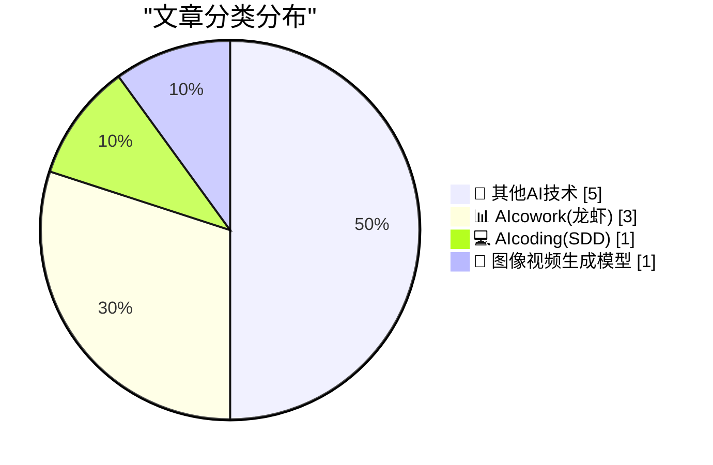
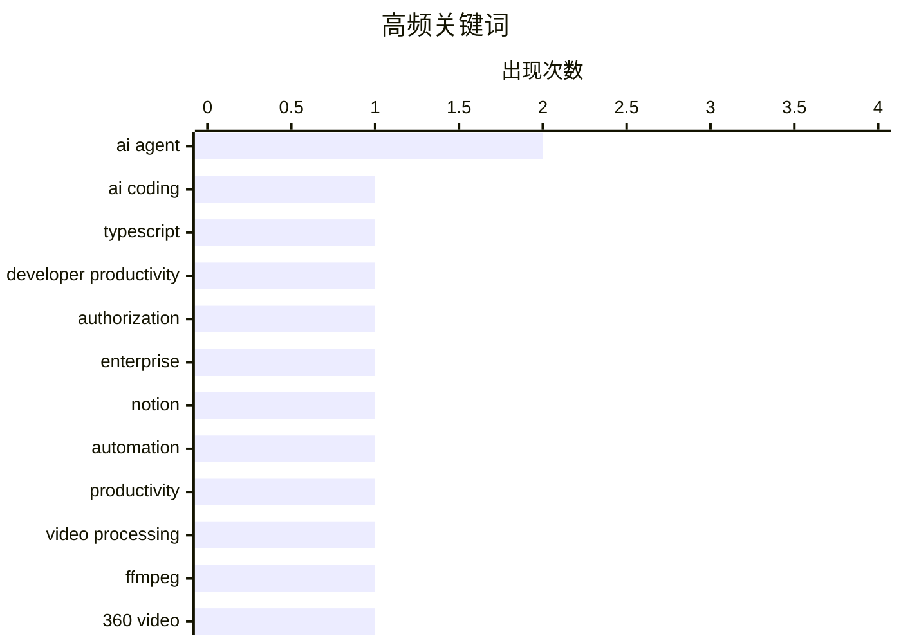

# 📰 AI 博客每日精选 — 2026-04-19

> 来自 98 个技术博客和社交媒体源，AI 精选 Top 10

## 📝 今日看点

今日技术圈的核心焦点在于AI如何深度融入并重塑工作流程。一方面，AI正从编码助手演进为承担开发中“苦差事”的协作者，旨在释放开发者的核心创造力；另一方面，AI智能体的规模化部署面临关键挑战，其安全与权限管控成为企业关注的核心。同时，AI工具开始冲击传统软件商业模式，特别是在设计等领域引发了行业竞争格局的变化。

---

## 🏆 今日必读

🥇 **TypeScript 之父 Anders Hejlsberg：让 AI 处理编码中枯燥且耗时的苦差事**

["Find the stuff that's boring and uninteresting, but you know still costs you, and try to get AI to do that for you." TypeScript's creator, Anders Hej...](https://x.com/github/status/2045924559866446280) — 𝕏 @GitHub · 3 小时前 · 💻 AIcoding(SDD)

> TypeScript 创始人 Anders Hejlsberg 分享了如何利用 AI 提升开发效率。其核心观点是，开发者应识别并让 AI 接管那些枯燥、无趣但成本高昂的编码“苦差事”。这旨在将开发者的精力从繁琐任务中解放出来，聚焦于更有创造性的工作。他认为 AI 的目标应是消除开发过程中的所有“辛劳”。

💡 **为什么值得读**: 通过编程语言大师的视角，为开发者如何有效利用 AI 工具提供了清晰且实用的战略方向。

🏷️ AI Coding, TypeScript, Developer Productivity

🥈 **WorkOS FGA：AI 智能体的授权层**

[WorkOS FGA: The Authorization Layer for AI Agents](https://workos.com/blog/agents-need-authorization-not-just-authentication?utm_source=daringfireball&amp;utm_medium=newsletter&amp;utm_campaign=q22026) — daringfireball.net · 3 小时前 · 📊 AIcowork(龙虾)

> 文章指出，企业部署 AI 智能体的主要障碍并非模型质量或延迟，而是授权问题。认证仅能证明智能体身份，授权则定义了其可操作的“爆炸半径”。WorkOS FGA 解决方案通过资源级权限来精确界定这个范围。其结论是，能在企业环境中安全、可信地运行的 AI 应用将成为最终的赢家。

💡 **为什么值得读**: 直击当前企业级 AI 应用落地的核心安全痛点，并提供了具体的解决方案视角。

🏷️ AI Agent, Authorization, Enterprise

🥉 **构建可接入任何模板的 Notion 自定义智能体，实现每日自动化报告**

[RT Osama: I built a @NotionHQ Custom Agent that plugs into ANY template. Any structure. Any setup. And every morning at 7 am, it sends you a full repo...](https://x.com/NotionHQ/status/2045932199711810015) — 𝕏 @NotionHQ · 4 小时前 · 📊 AIcowork(龙虾)

> 介绍了一个为 Notion 构建的自定义智能体，其特点是能适配任何页面模板和结构。该智能体每天上午 7 点自动生成并发送一份完整的报告。报告内容涵盖昨日完成率、连续记录、周同比数据、今日待办事项以及每周总结。这展示了利用 AI 代理实现个人知识库自动化管理与洞察的实践。

💡 **为什么值得读**: 提供了一个将 AI 智能体与流行生产力工具（Notion）结合的具体、可操作的自动化案例。

🏷️ Notion, AI Agent, Automation, Productivity

4️⃣ **将双鱼眼视频重投影为等距柱状投影格式（以 LG 360 相机为例）**

[Reprojecting Dual Fisheye Videos to Equirectangular (LG 360)](https://shkspr.mobi/blog/2026/04/reprojecting-dual-fisheye-videos-to-equirectangular-lg-360/) — shkspr.mobi · 10 小时前 · 🎨 图像视频生成模型

> 文章解决了从旧款 LG 360 相机导出的“双鱼眼”格式视频无法被 VLC、YouTube 等平台直接识别为全景视频的问题。核心方案是使用 ffmpeg 工具，通过特定的 `v360` 滤镜参数（如 `input=dfisheye:output=equirect:ih_fov=189:iv_fov=189`）进行格式转换。该方法能将双鱼眼视频转换为标准的等距柱状投影格式，从而支持正常的球形播放。

💡 **为什么值得读**: 为处理特定硬件产生的特殊全景视频格式提供了清晰、直接的技术命令行解决方案。

🏷️ Video Processing, FFmpeg, 360 Video

5️⃣ **Claude Design 的发布加剧了 Figma 的困境**

[Figma's woes compound with Claude Design](https://martinalderson.com/posts/figmas-woes-compound-with-claude-design/?utm_source=rss&amp;utm_medium=rss&amp;utm_campaign=feed) — martinalderson.com · 21 小时前 · 📊 AIcowork(龙虾)

> 文章分析了 AI 设计工具对 Figma 构成的竞争威胁。指出 Figma 因其收入严重依赖非设计师席位（如开发者、产品经理）而特别容易受到 AI 冲击。Anthropic 公司 Claude Design 的发布进一步深化了这一危机，可能直接替代这部分用户的基础协作与视图需求。

💡 **为什么值得读**: 从一个独特的商业模型视角，犀利地指出了传统 SaaS 工具在 AI 浪潮下面临的颠覆性风险。

🏷️ Figma, Claude Design, AI Competition

---

## 📊 数据概览

| 扫描源 | 抓取文章 | 时间范围 | 精选 |
|:---:|:---:|:---:|:---:|
| 73/98 | 2276 篇 → 10 篇 | 24h | **10 篇** |

### 分类分布



### 高频关键词



<details>
<summary>📈 纯文本关键词图（终端友好）</summary>

```
ai agent               │ ████████████████████ 2
ai coding              │ ██████████░░░░░░░░░░ 1
typescript             │ ██████████░░░░░░░░░░ 1
developer productivity │ ██████████░░░░░░░░░░ 1
authorization          │ ██████████░░░░░░░░░░ 1
enterprise             │ ██████████░░░░░░░░░░ 1
notion                 │ ██████████░░░░░░░░░░ 1
automation             │ ██████████░░░░░░░░░░ 1
productivity           │ ██████████░░░░░░░░░░ 1
video processing       │ ██████████░░░░░░░░░░ 1
```

</details>

### 🏷️ 话题标签

**ai agent**(2) · **ai coding**(1) · **typescript**(1) · developer productivity(1) · authorization(1) · enterprise(1) · notion(1) · automation(1) · productivity(1) · video processing(1) · ffmpeg(1) · 360 video(1) · figma(1) · claude design(1) · ai competition(1) · web console(1) · decentralized(1) · hardware history(1) · hitachi(1) · cloud security(1)

---

====================

## 🔬 其他AI技术

### 1. Wander Console 0.5.0 版本发布

[Wander Console 0.5.0](https://susam.net/code/news/wander/0.5.0.html) — **susam.net** · 21 小时前 · ⭐ 12/25

> Wander Console 0.5.0 是该项目第五个版本，这是一个小型、去中心化、可自托管的小型网络控制台。它允许网站访客探索由独立站长社区推荐的趣味网站。新版本的主要特性是内置了控制台网络爬虫功能，增强了内容发现能力。用户可访问示例站点 susam.net/wander/ 进行体验。

🏷️ Web Console, Decentralized

📌 其他AI技术

---

### 2. 日立有限公司，第二部分

[Hitachi Ltd, Part II](https://www.abortretry.fail/p/hitachi-ltd-part-ii) — **abortretry.fail** · 58 分钟前 · ⭐ 10/25

> 这是关于日立公司技术历史系列文章的第二部分。本部分聚焦于日立曾涉及或开发的几种处理器架构，包括 H8、PA-RISC 和 SuperH。文章很可能深入探讨这些架构的技术细节、市场表现及其在日立产品线中的角色。

🏷️ Hardware History, Hitachi

📌 其他AI技术

---

### 3. 堆砌文书无法让大型科技云变得更安全

[Big tech clouds worden niet veiliger met stapels papier](https://berthub.eu/articles/posts/big-tech-clouds-niet-veiliger-met-papier/) — **berthub.eu** · 2 小时前 · ⭐ 9/25

> 文章核心论点是，将社会、政府和数据托付给美国的大型科技云服务商会带来主权与安全风险。即使服务器位于欧洲，美国仍可通过至少三项法律工具获取数据。作者认为，任何特殊的协议安排都无法改变数据受美国法律管辖的现实。结论是这种依赖令人不安且难以解决。

🏷️ Cloud Security, Policy, Data Sovereignty

📌 其他AI技术

---

### 4. 杰西卡·查斯坦称 Apple TV+ 终将发布《天才》剧集

[Jessica Chastain Says Apple TV Will Finally Release ‘The Savant’](https://variety.com/2026/tv/columns/jessica-chastain-apple-tv-finally-release-the-savant-after-postponement-charlie-kirk-assassination-1236725384/) — **daringfireball.net** · 2 小时前 · ⭐ 8/25

> 演员杰西卡·查斯坦确认，此前播出计划悬而未决的政治惊悚剧《天才》将在 Apple TV+ 上线。她明确表示该剧“将会与观众见面”，而非此前的不确定状态。据消息人士透露，苹果公司计划在七月发布该剧集。这标志着这部备受关注的剧集结束了其发行日期的“悬置”状态。

🏷️ Entertainment, Apple TV

📌 其他AI技术

---

### 5. 把它连接到机器上

[Hook It Up to the Machine](https://blog.jim-nielsen.com/2026/hook-it-up-to-the-machine/) — **blog.jim-nielsen.com** · 2 小时前 · ⭐ 6/25

> 作者通过回忆一次家庭旅行中旧车不断过热抛锚的经历作为引子。当机械师将汽车诊断电脑连接到车辆接口并成功读取故障码时，给他留下了深刻印象。这个故事隐喻了现代技术（尤其是 AI）的作用：就像诊断电脑一样，它们能连接并“读取”复杂系统（如代码、业务流程），找出人眼难以察觉的问题和优化点。

🏷️ Personal Story, Road Trip

📌 其他AI技术

---

## 📊 AIcowork(龙虾)

### 6. WorkOS FGA：AI 智能体的授权层

[WorkOS FGA: The Authorization Layer for AI Agents](https://workos.com/blog/agents-need-authorization-not-just-authentication?utm_source=daringfireball&amp;utm_medium=newsletter&amp;utm_campaign=q22026) — **daringfireball.net** · 3 小时前 · ⭐ 19/25

> 文章指出，企业部署 AI 智能体的主要障碍并非模型质量或延迟，而是授权问题。认证仅能证明智能体身份，授权则定义了其可操作的“爆炸半径”。WorkOS FGA 解决方案通过资源级权限来精确界定这个范围。其结论是，能在企业环境中安全、可信地运行的 AI 应用将成为最终的赢家。

🏷️ AI Agent, Authorization, Enterprise

📌 AIcowork(龙虾)

---

### 7. 构建可接入任何模板的 Notion 自定义智能体，实现每日自动化报告

[RT Osama: I built a @NotionHQ Custom Agent that plugs into ANY template. Any structure. Any setup. And every morning at 7 am, it sends you a full repo...](https://x.com/NotionHQ/status/2045932199711810015) — **𝕏 @NotionHQ** · 4 小时前 · ⭐ 19/25

> 介绍了一个为 Notion 构建的自定义智能体，其特点是能适配任何页面模板和结构。该智能体每天上午 7 点自动生成并发送一份完整的报告。报告内容涵盖昨日完成率、连续记录、周同比数据、今日待办事项以及每周总结。这展示了利用 AI 代理实现个人知识库自动化管理与洞察的实践。

🏷️ Notion, AI Agent, Automation, Productivity

📌 AIcowork(龙虾)

---

### 8. Claude Design 的发布加剧了 Figma 的困境

[Figma's woes compound with Claude Design](https://martinalderson.com/posts/figmas-woes-compound-with-claude-design/?utm_source=rss&amp;utm_medium=rss&amp;utm_campaign=feed) — **martinalderson.com** · 21 小时前 · ⭐ 15/25

> 文章分析了 AI 设计工具对 Figma 构成的竞争威胁。指出 Figma 因其收入严重依赖非设计师席位（如开发者、产品经理）而特别容易受到 AI 冲击。Anthropic 公司 Claude Design 的发布进一步深化了这一危机，可能直接替代这部分用户的基础协作与视图需求。

🏷️ Figma, Claude Design, AI Competition

📌 AIcowork(龙虾)

---

## 💻 AIcoding(SDD)

### 9. TypeScript 之父 Anders Hejlsberg：让 AI 处理编码中枯燥且耗时的苦差事

["Find the stuff that's boring and uninteresting, but you know still costs you, and try to get AI to do that for you." TypeScript's creator, Anders Hej...](https://x.com/github/status/2045924559866446280) — **𝕏 @GitHub** · 3 小时前 · ⭐ 20/25

> TypeScript 创始人 Anders Hejlsberg 分享了如何利用 AI 提升开发效率。其核心观点是，开发者应识别并让 AI 接管那些枯燥、无趣但成本高昂的编码“苦差事”。这旨在将开发者的精力从繁琐任务中解放出来，聚焦于更有创造性的工作。他认为 AI 的目标应是消除开发过程中的所有“辛劳”。

🏷️ AI Coding, TypeScript, Developer Productivity

📌 AIcoding(SDD)

---

## 🎨 图像视频生成模型

### 10. 将双鱼眼视频重投影为等距柱状投影格式（以 LG 360 相机为例）

[Reprojecting Dual Fisheye Videos to Equirectangular (LG 360)](https://shkspr.mobi/blog/2026/04/reprojecting-dual-fisheye-videos-to-equirectangular-lg-360/) — **shkspr.mobi** · 10 小时前 · ⭐ 18/25

> 文章解决了从旧款 LG 360 相机导出的“双鱼眼”格式视频无法被 VLC、YouTube 等平台直接识别为全景视频的问题。核心方案是使用 ffmpeg 工具，通过特定的 `v360` 滤镜参数（如 `input=dfisheye:output=equirect:ih_fov=189:iv_fov=189`）进行格式转换。该方法能将双鱼眼视频转换为标准的等距柱状投影格式，从而支持正常的球形播放。

🏷️ Video Processing, FFmpeg, 360 Video

📌 图像视频生成模型

---

====================

*生成于 2026-04-19 21:34 | 扫描 73 源 → 获取 2276 篇 → 精选 10 篇*
*基于 [Hacker News Popularity Contest 2025](https://refactoringenglish.com/tools/hn-popularity/) RSS 源列表，由 [Andrej Karpathy](https://x.com/karpathy) 推荐*
*由「懂点儿AI」制作，欢迎关注同名微信公众号获取更多 AI 实用技巧 💡*
