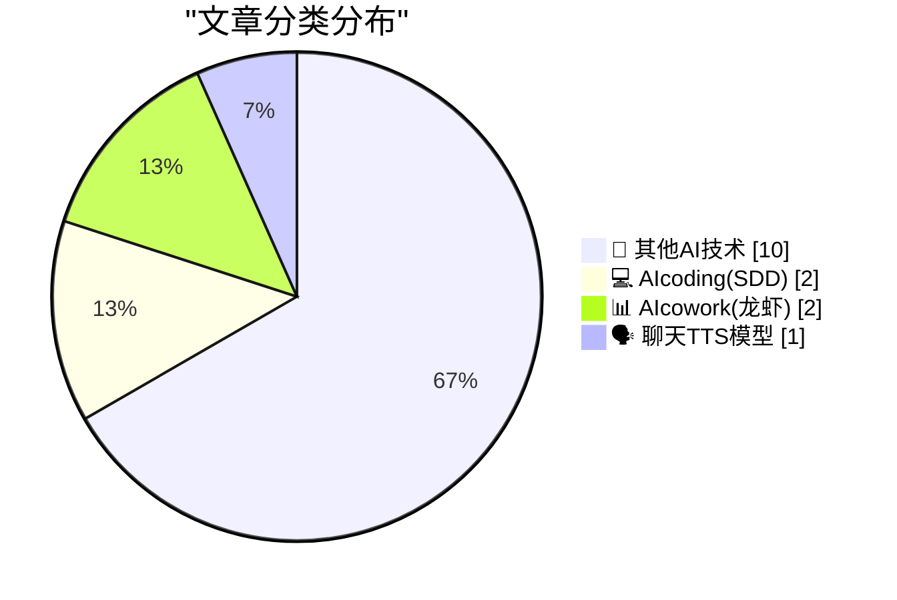
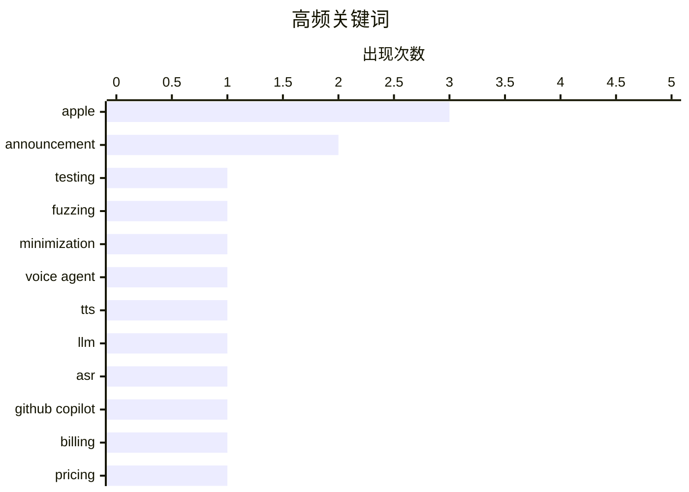

# 📰 AI 博客每日精选 — 2026-04-20

> 来自 98 个技术博客和社交媒体源，AI 精选 Top 15

## 📝 今日看点

今日技术圈聚焦于AI工具的商业化演进与生产力深度整合。微软拟调整GitHub Copilot计费模式，反映出AI编码辅助正从粗放扩张转向精细化运营。同时，Notion、Google等平台大力推动AI与工作流的融合，通过统一界面与智能体赋能，旨在打造无缝的智能协作环境。此外，对测试最小化等底层技术的精简探索，也体现了业界在追求AI应用落地的同时，持续回归工程本质的趋势。

---

## 🏆 今日必读

🥇 **256行或更少：测试用例最小化**

[256 Lines or Less: Test Case Minimization](https://matklad.github.io/2026/04/20/test-case-minimization.html) — matklad.github.io · 21 小时前 · 💻 AIcoding(SDD)

> 文章探讨了如何用极简代码实现基于属性的测试（PBT）和模糊测试中的测试用例最小化技术。作者提出了一种“客厅把戏”式的PBT库，声称仅需几百行代码即可实现。该方案旨在将复杂的科学密集型技术（如PBT守护进程、客户端-服务器架构）简化为一个轻量级、易于理解的实现。核心观点是，高级测试技术可以通过简洁、直接的代码来实践，而无需过度复杂的架构。

💡 **为什么值得读**: 为开发者提供了一种理解并实践复杂测试技术的极简、可操作的实现思路，极具启发性。

🏷️ Testing, Fuzzing, Minimization

🥈 **ElevenLabs为何押注级联方案构建语音智能体**

[RT Stripe: Mati Staniszewski on why ElevenLabs is betting on a cascaded approach for voice agents: “Our approach, as you think about voice agents, co...](https://x.com/ElevenLabs/status/2046290782337011949) — 𝕏 @ElevenLabs · 6 小时前 · 🗣️ 聊天TTS模型

> ElevenLabs联合创始人Mati Staniszewski阐述了公司构建语音智能体的技术路线选择。他们当前重点优化的是级联方案，即串联语音转文本、大语言模型和文本转语音等模块。相比之下，端到端的“语音到语音”方案是另一种可能路径。公司认为级联方案是目前更优的选择，并正在此方向上投入大量优化工作。

💡 **为什么值得读**: 揭示了顶级AI语音公司在关键架构选型上的战略思考，对从事语音AI和智能体开发的从业者有重要参考价值。

🏷️ Voice Agent, TTS, LLM, ASR

🥉 **独家：微软计划将GitHub Copilot计费模式改为基于令牌，并收紧速率限制**

[Exclusive: Microsoft To Shift GitHub Copilot Users To Token-Based Billing, Tighten Rate Limits](https://www.wheresyoured.at/news-microsoft-to-shift-github-copilot-users-to-token-based-billing-reduce-rate-limits-2/) — wheresyoured.at · 4 小时前 · 💻 AIcoding(SDD)

> 根据内部文件，微软正计划调整GitHub Copilot的商业模式和访问策略。核心变动包括从按请求计费转向基于令牌（Token）计费，并准备收紧服务的速率限制。此外，微软将暂时停止个人账户的新注册。文件披露，自年初以来，GitHub Copilot的周度运行成本已经翻倍，这可能是此次调整的主要原因。

💡 **为什么值得读**: 提前揭示了可能影响数百万开发者使用成本和体验的重要商业策略变动，值得所有Copilot用户和AI服务提供商关注。

🏷️ GitHub Copilot, Billing, Pricing

4️⃣ **Notion邀请旧金山开发者参加为期两天的新开发者平台实战活动**

[RT Notion Developers: SF builders: Join us for two days of hands-on building on our new Developer Platform. Sync any data source into Notion, give you...](https://x.com/NotionHQ/status/2046324064919466339) — 𝕏 @NotionHQ · 1 小时前 · 📊 AIcowork(龙虾)

> Notion Developers官方账号宣布将在旧金山举办为期两天的开发者实战活动，重点是其新推出的开发者平台。该平台允许开发者将任何数据源同步至Notion，为智能体提供工具，并从任何地方触发工作流。其宣称无需服务器和基础设施，仅需CLI和创意。活动名额有限，需通过申请参加。

💡 **为什么值得读**: 为开发者提供了近距离了解并上手Notion最新、最强大集成与自动化能力的机会。

🏷️ Notion, Developer Platform, Workflow

5️⃣ **Notion将邮件与日历连接整合至统一标签页，并支持AI跨应用操作**

[Before, your mail + calendar connections lived in a few different places. Now they’re in one tab, so managing multiple accounts is simpler. Once they...](https://x.com/NotionHQ/status/2046286103821598737) — 𝕏 @NotionHQ · 3 小时前 · 📊 AIcowork(龙虾)

> Notion对其邮件和日历集成功能进行了更新。此前分散在多处的连接现在被统一到一个标签页（设置→邮件和日历）中管理，简化了多账户操作。连接后，用户可以利用Notion AI跨应用自动处理任务，例如安排会议和起草邮件，从而减轻工作负担。

💡 **为什么值得读**: 展示了Notion如何通过整合与AI能力，进一步提升其作为一体化工作中心的效率和便利性。

🏷️ Notion AI, Automation, Productivity

---

## 📊 数据概览

| 扫描源 | 抓取文章 | 时间范围 | 精选 |
|:---:|:---:|:---:|:---:|
| 72/98 | 2246 篇 → 17 篇 | 24h | **15 篇** |

### 分类分布



### 高频关键词



<details>
<summary>📈 纯文本关键词图（终端友好）</summary>

```
apple          │ ████████████████████ 3
announcement   │ █████████████░░░░░░░ 2
testing        │ ███████░░░░░░░░░░░░░ 1
fuzzing        │ ███████░░░░░░░░░░░░░ 1
minimization   │ ███████░░░░░░░░░░░░░ 1
voice agent    │ ███████░░░░░░░░░░░░░ 1
tts            │ ███████░░░░░░░░░░░░░ 1
llm            │ ███████░░░░░░░░░░░░░ 1
asr            │ ███████░░░░░░░░░░░░░ 1
github copilot │ ███████░░░░░░░░░░░░░ 1
```

</details>

### 🏷️ 话题标签

**apple**(3) · **announcement**(2) · **testing**(1) · fuzzing(1) · minimization(1) · voice agent(1) · tts(1) · llm(1) · asr(1) · github copilot(1) · billing(1) · pricing(1) · notion(1) · developer platform(1) · workflow(1) · notion ai(1) · automation(1) · productivity(1) · graphics(1) · memory(1)

---

====================

## 🔬 其他AI技术

### 1. 在使用存储体切换显存的显卡时，代码如何处理24位每像素格式？

[How did code handle 24-bit-per-pixel formats when using video cards with bank-switched memory?](https://devblogs.microsoft.com/oldnewthing/20260420-00/?p=112245) — **devblogs.microsoft.com/oldnewthing** · 7 小时前 · ⭐ 16/25

> 文章探讨了早期显卡编程中一个具体的技术难题：当使用支持存储体切换（bank-switched）内存的显卡处理24位每像素（非对齐）格式时，代码应如何编写。关键点在于，尽管像素数据本身可能不对齐，但内存访问仍然必须遵循对齐原则。作者通过回顾历史技术细节，解释了在当时硬件限制下的编程实践。

🏷️ Graphics, Memory, Legacy Code

📌 其他AI技术

---

### 2. Google Workspace预告Google Cloud Next大会重要发布

[Don’t miss the biggest announcements coming up at #GoogleCloudNext! 🚀 We’re breaking down the must-see sessions and demos to help you cut the bus...](https://x.com/GoogleWorkspace/status/2046273442542989783) — **𝕏 @GoogleWorkspace** · 4 小时前 · ⭐ 15/25

> Google Workspace官方账号为即将到来的Google Cloud Next大会造势，预告将有重大发布。推文旨在帮助观众从众多议程中筛选出必看环节和演示，重点关注如何利用Gemini减少繁琐工作并将创意变为现实。内容包含一个宣传视频，引导用户访问相关链接获取更多信息。

🏷️ Google Cloud, Gemini, Announcement

📌 其他AI技术

---

### 3. 微软CEO盛赞Excel世界冠军Diarmuid Early处于“不同联赛”

[When the CEO of Microsoft says you're in a different league at Excel, you know you've made it. Congrats to Diarmuid Early, reigning Excel World Champi...](https://x.com/Microsoft365/status/2046269617342120080) — **𝕏 @Microsoft365** · 4 小时前 · ⭐ 9/25

> 微软CEO萨提亚·纳德拉公开称赞现任Excel世界冠军Diarmuid Early，称其在Excel技能上处于“不同联赛”。推文包含一段纳德拉与Diarmuid Early交流的视频，以此祝贺这位冠军取得的成就。此举将Excel专业技能提升到了一个新的认可高度。

🏷️ Excel, Microsoft, Champion

📌 其他AI技术

---

### 4. 戈登·摩尔与摩尔定律

[Gordon Moore and Moore’s Law](https://dfarq.homeip.net/gordon-moore-and-moores-law/?utm_source=rss&#038;utm_medium=rss&#038;utm_campaign=gordon-moore-and-moores-law) — **dfarq.homeip.net** · 10 小时前 · ⭐ 6/25

> 文章介绍了英特尔联合创始人戈登·摩尔（1929-2023）及其提出的著名“摩尔定律”。该定律指出，集成电路上的晶体管数量大约每两年翻一番。这一定律数十年来一直是半导体行业发展和预测的基石。戈登·摩尔于2023年3月去世，他对计算机芯片产业的发展产生了深远影响。

🏷️ Moore's Law, Semiconductor, History

📌 其他AI技术

---

### 5. Daring Fireball周边：T恤和连帽衫回归销售

[DF Paraphernalia: T-Shirts and Hoodies Are Back](https://store.daringfireball.net/) — **daringfireball.net** · 7 分钟前 · ⭐ 5/25

> 科技博客Daring Fireball宣布其品牌的T恤和连帽衫再次开放销售。订单现已接收，生产将于本周末开始，并于下周发货。公告同时暗示，作者John Gruber正在整理关于当日苹果公司领导层变动的想法，可能即将发布相关评论。

🏷️ Merchandise, Announcement

📌 其他AI技术

---

### 6. 蒂姆致苹果社区的一封信

[‘Community Letter From Tim’](https://www.apple.com/community-letter-from-tim/) — **daringfireball.net** · 7 分钟前 · ⭐ 5/25

> 苹果CEO蒂姆·库克分享了他15年来每日清晨阅读全球用户邮件的习惯。用户通过邮件向他讲述苹果产品如何影响他们的生活，例如Apple Watch拯救了母亲的生命，或在山顶用iPhone拍下完美自拍等个人故事。这些信件构成了库克与用户之间直接的情感连接。库克通过这封信强调了倾听用户声音是苹果公司文化的重要核心。

🏷️ Leadership, Letter, Apple

📌 其他AI技术

---

### 7. 蒂姆·库克将转任苹果董事会执行主席，约翰·特努斯将出任苹果CEO

[Apple: ‘Tim Cook to Become Apple Executive Chairman; John Ternus to Become Apple CEO’](https://www.apple.com/newsroom/2026/04/tim-cook-to-become-apple-executive-chairman-john-ternus-to-become-apple-ceo/) — **daringfireball.net** · 1 小时前 · ⭐ 5/25

> 苹果公司宣布了其最高领导层的继任计划。自2026年9月1日起，现任CEO蒂姆·库克将转任董事会执行主席，而现任硬件工程高级副总裁约翰·特努斯将接任首席执行官一职。此次过渡是董事会一致批准的，源于一个深思熟虑的长期继任规划过程。库克将在整个夏季继续担任CEO，并与特努斯密切合作以确保平稳交接。

🏷️ CEO, Transition, Apple

📌 其他AI技术

---

### 8. 苹果年度环境进展报告：产品中再生材料使用量创历史新高

[Apple’s Annual Environmental Progress Report](https://www.apple.com/newsroom/2026/04/apple-accelerates-progress-with-highest-ever-recycled-material-in-its-products/) — **daringfireball.net** · 4 小时前 · ⭐ 5/25

> 苹果发布了年度环境进展报告，展示了其在实现“Apple 2030”全价值链碳中和目标上的加速进展。与2015年相比，苹果2025年的温室气体排放量下降了超过60%，并在业务显著增长的一年中保持了与2024年持平的排放水平。报告重点突出了在可再生能源、材料创新与回收以及水资源管理等领域取得的额外进展。

🏷️ Environment, Report, Apple

📌 其他AI技术

---

### 9. 来自一位百万富翁的建议

[Advice from a millionaire](https://idiallo.com/blog/advice-from-a-millionaire?src=feed) — **idiallo.com** · 9 小时前 · ⭐ 5/25

> 文章以咖啡馆中一位穿着得体的男士（暗示为百万富翁）与一位带着两个调皮孩子的疲惫母亲之间的简短对话开场。场景描绘了母亲忙于管教孩子（一个试图从椅子上滑下来，另一个在剥果汁瓶标签）的混乱日常。这位“富翁”的介入和随后可能给出的建议，旨在从平凡的生活瞬间中提炼出关于财富、成功或人生意义的深刻见解。

🏷️ Story, Advice, Life

📌 其他AI技术

---

### 10. 多元主义：同志特朗普（2026年4月20日）

[Pluralistic: Comrade Trump (20 Apr 2026)](https://pluralistic.net/2026/04/20/praxis/) — **pluralistic.net** · 5 小时前 · ⭐ 5/25

> 科里·多克托罗的每日链接博客探讨了“同志特朗普”这一核心议题，将其行为解读为“为拯救美利坚帝国而将其焚毁”的政治实践。当日链接合集涵盖了广泛主题，包括MPAA基于威胁的“教育”、AT&T与互联网的对抗、英国避税天堂与政府的关系、新自由主义定义、报业房东现象等。博客还列出了作者近期及即将在旧金山、伦敦、柏林等地进行的公开露面安排。

🏷️ Politics, Commentary, Links

📌 其他AI技术

---

## 💻 AIcoding(SDD)

### 11. 256行或更少：测试用例最小化

[256 Lines or Less: Test Case Minimization](https://matklad.github.io/2026/04/20/test-case-minimization.html) — **matklad.github.io** · 21 小时前 · ⭐ 21/25

> 文章探讨了如何用极简代码实现基于属性的测试（PBT）和模糊测试中的测试用例最小化技术。作者提出了一种“客厅把戏”式的PBT库，声称仅需几百行代码即可实现。该方案旨在将复杂的科学密集型技术（如PBT守护进程、客户端-服务器架构）简化为一个轻量级、易于理解的实现。核心观点是，高级测试技术可以通过简洁、直接的代码来实践，而无需过度复杂的架构。

🏷️ Testing, Fuzzing, Minimization

📌 AIcoding(SDD)

---

### 12. 独家：微软计划将GitHub Copilot计费模式改为基于令牌，并收紧速率限制

[Exclusive: Microsoft To Shift GitHub Copilot Users To Token-Based Billing, Tighten Rate Limits](https://www.wheresyoured.at/news-microsoft-to-shift-github-copilot-users-to-token-based-billing-reduce-rate-limits-2/) — **wheresyoured.at** · 4 小时前 · ⭐ 20/25

> 根据内部文件，微软正计划调整GitHub Copilot的商业模式和访问策略。核心变动包括从按请求计费转向基于令牌（Token）计费，并准备收紧服务的速率限制。此外，微软将暂时停止个人账户的新注册。文件披露，自年初以来，GitHub Copilot的周度运行成本已经翻倍，这可能是此次调整的主要原因。

🏷️ GitHub Copilot, Billing, Pricing

📌 AIcoding(SDD)

---

## 📊 AIcowork(龙虾)

### 13. Notion邀请旧金山开发者参加为期两天的新开发者平台实战活动

[RT Notion Developers: SF builders: Join us for two days of hands-on building on our new Developer Platform. Sync any data source into Notion, give you...](https://x.com/NotionHQ/status/2046324064919466339) — **𝕏 @NotionHQ** · 1 小时前 · ⭐ 20/25

> Notion Developers官方账号宣布将在旧金山举办为期两天的开发者实战活动，重点是其新推出的开发者平台。该平台允许开发者将任何数据源同步至Notion，为智能体提供工具，并从任何地方触发工作流。其宣称无需服务器和基础设施，仅需CLI和创意。活动名额有限，需通过申请参加。

🏷️ Notion, Developer Platform, Workflow

📌 AIcowork(龙虾)

---

### 14. Notion将邮件与日历连接整合至统一标签页，并支持AI跨应用操作

[Before, your mail + calendar connections lived in a few different places. Now they’re in one tab, so managing multiple accounts is simpler. Once they...](https://x.com/NotionHQ/status/2046286103821598737) — **𝕏 @NotionHQ** · 3 小时前 · ⭐ 20/25

> Notion对其邮件和日历集成功能进行了更新。此前分散在多处的连接现在被统一到一个标签页（设置→邮件和日历）中管理，简化了多账户操作。连接后，用户可以利用Notion AI跨应用自动处理任务，例如安排会议和起草邮件，从而减轻工作负担。

🏷️ Notion AI, Automation, Productivity

📌 AIcowork(龙虾)

---

## 🗣️ 聊天TTS模型

### 15. ElevenLabs为何押注级联方案构建语音智能体

[RT Stripe: Mati Staniszewski on why ElevenLabs is betting on a cascaded approach for voice agents: “Our approach, as you think about voice agents, co...](https://x.com/ElevenLabs/status/2046290782337011949) — **𝕏 @ElevenLabs** · 6 小时前 · ⭐ 21/25

> ElevenLabs联合创始人Mati Staniszewski阐述了公司构建语音智能体的技术路线选择。他们当前重点优化的是级联方案，即串联语音转文本、大语言模型和文本转语音等模块。相比之下，端到端的“语音到语音”方案是另一种可能路径。公司认为级联方案是目前更优的选择，并正在此方向上投入大量优化工作。

🏷️ Voice Agent, TTS, LLM, ASR

📌 聊天TTS模型

---

====================

*生成于 2026-04-20 21:45 | 扫描 72 源 → 获取 2246 篇 → 精选 15 篇*
*基于 [Hacker News Popularity Contest 2025](https://refactoringenglish.com/tools/hn-popularity/) RSS 源列表，由 [Andrej Karpathy](https://x.com/karpathy) 推荐*
*由「懂点儿AI」制作，欢迎关注同名微信公众号获取更多 AI 实用技巧 💡*
