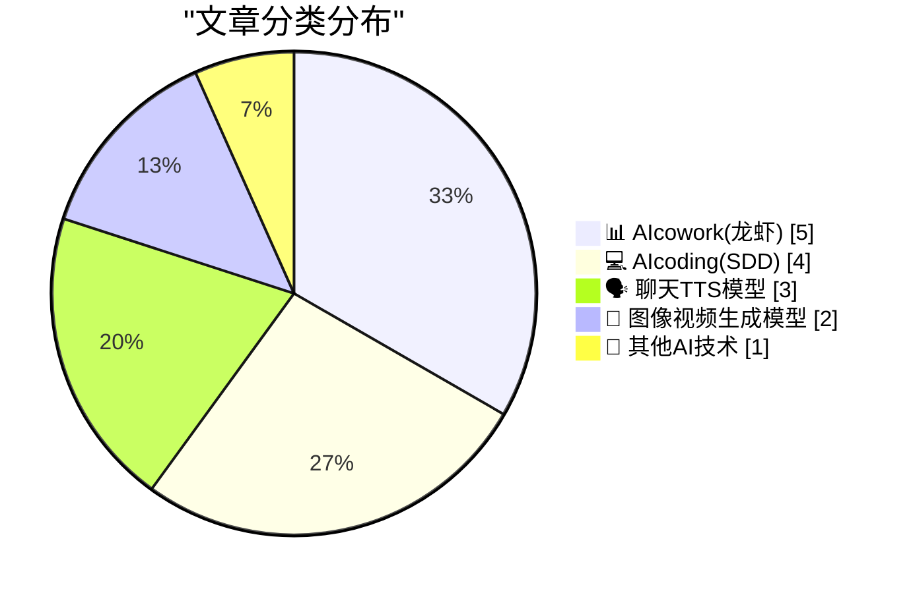
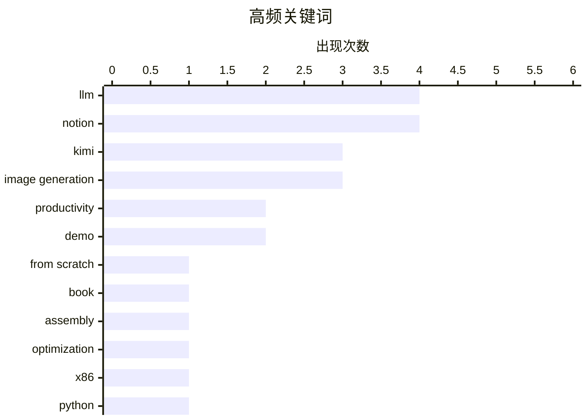

# 📰 AI 博客每日精选 — 2026-04-21

> 来自 98 个技术博客和社交媒体源，AI 精选 Top 15

## 📝 今日看点

今日技术圈聚焦于AI能力的深度集成与开源模型的突破。Notion通过集成顶级开源模型Kimi K2.6并推出多项AI功能，正将自身打造为集大成的AI协作平台。同时，从零开始训练大语言模型的技术实践与底层编程优化探讨，反映出业界对AI基础原理与执行效率的持续深耕。

---

## 🏆 今日必读

🥇 **从零开始构建大语言模型，第32集——干预措施：结论**

[Writing an LLM from scratch, part 32m -- Interventions: conclusion](https://www.gilesthomas.com/2026/04/llm-from-scratch-32m-interventions-conclusion) — gilesthomas.com · 1 小时前 · 💻 AIcoding(SDD)

> 作者完成了《从零开始构建大语言模型》一书后的核心目标之一：自主训练完整的GPT-2基础模型。该模型在作者的个人机器上训练了44小时，其性能已接近（即便不完全等同）GPT-2 small。这标志着一个从理论到实践、完全自主复现经典模型的重要里程碑。结论是，通过系统性的努力，个人完全有能力复现并理解现代大语言模型的核心训练过程。

💡 **为什么值得读**: 对于想深入理解LLM训练全流程、并有意亲手复现经典模型的开发者和学习者，这是一份极具参考价值的实践记录和成果总结。

🏷️ LLM, From Scratch, Book

🥈 **Kimi K2.6 模型现已登陆 Notion**

[RT Akshay Kothari: Kimi K2.6 just landed in @NotionHQ. Open‑weight, but absolutely a heavyweight. Take it for a drive! 🏎️](https://x.com/NotionHQ/status/2046424017213767799) — 𝕏 @NotionHQ · 18 小时前 · 🗣️ 聊天TTS模型

> Notion 宣布集成 Kimi K2.6 这一开源权重模型。该模型被描述为具有顶级模型性能的“重量级”选手，尤其在工具使用和执行复杂任务方面表现出色。用户现可在 Notion 中直接体验和使用该模型。

💡 **为什么值得读**: 了解顶尖开源模型如何集成到主流生产力工具中，并亲身体验其实际能力。

🏷️ Kimi, LLM, Notion

🥉 **确实，用异或操作清零寄存器是惯用方法，但为什么不用减法？**

[Sure, xor’ing a register with itself is the idiom for zeroing it out, but why not sub?](https://devblogs.microsoft.com/oldnewthing/20260421-00/?p=112247) — devblogs.microsoft.com/oldnewthing · 7 小时前 · 💻 AIcoding(SDD)

> 文章探讨了在汇编编程中，将寄存器与自身进行异或操作（XOR）是将其清零的流行惯用语法。核心问题是分析为何此方法比使用减法操作（SUB）更受青睐。作者从指令长度、执行效率或CPU优化等底层细节进行了对比和解释。结论揭示了这一微小选择背后可能存在的性能或编码惯例考量。

💡 **为什么值得读**: 通过一个微小的编码习惯，深入理解CPU指令集优化和底层编程的最佳实践。

🏷️ Assembly, Optimization, x86

4️⃣ **当语言实现破坏了语言保证时，人们会感到困惑**

[People get confused when language implementations break language guarantees](https://buttondown.com/hillelwayne/archive/people-get-confused-when-language-implementations/) — buttondown.com/hillelwayne · 4 小时前 · 💻 AIcoding(SDD)

> 文章通过一个简单的Python代码示例，探讨了语言实现（如解释器或编译器）有时会违背该语言本身提供的语义保证这一现象。这会导致程序行为与开发者的直观预期不符，引发困惑。作者旨在揭示编程语言规范与实际实现之间可能存在的微妙差距。核心观点是，理解这种差距对于编写可靠和可移植的代码至关重要。

💡 **为什么值得读**: 帮助开发者超越语法层面，理解语言规范与实现之间的灰色地带，避免潜在的陷阱。

🏷️ Python, Language, Implementation

5️⃣ **Git 2.54 版本发布，带来基于配置的钩子等新功能**

[Git 2.54 is here with features like config-based hooks, new ways to rewrite history, and much more. ✨ Check out the highlights from this release. �...](https://x.com/github/status/2046351971368513888) — 𝕏 @GitHub · 23 小时前 · 💻 AIcoding(SDD)

> Git 2.54 正式发布，引入了一系列新特性。主要亮点包括基于配置文件管理的钩子（config-based hooks），这提供了更灵活和可版本化的钩子管理方式。此外，还包含了重写历史的新方法。此次更新为版本控制工作流带来了更多便利和强大的工具。

💡 **为什么值得读**: 了解Git最新版本的核心增强功能，特别是对自动化脚本和仓库历史管理有重大改进的配置化钩子。

🏷️ Git, Version Control, Release

---

## 📊 数据概览

| 扫描源 | 抓取文章 | 时间范围 | 精选 |
|:---:|:---:|:---:|:---:|
| 73/98 | 2270 篇 → 24 篇 | 24h | **15 篇** |

### 分类分布



### 高频关键词



<details>
<summary>📈 纯文本关键词图（终端友好）</summary>

```
llm              │ ████████████████████ 4
notion           │ ████████████████████ 4
kimi             │ ███████████████░░░░░ 3
image generation │ ███████████████░░░░░ 3
productivity     │ ██████████░░░░░░░░░░ 2
demo             │ ██████████░░░░░░░░░░ 2
from scratch     │ █████░░░░░░░░░░░░░░░ 1
book             │ █████░░░░░░░░░░░░░░░ 1
assembly         │ █████░░░░░░░░░░░░░░░ 1
optimization     │ █████░░░░░░░░░░░░░░░ 1
```

</details>

### 🏷️ 话题标签

**llm**(4) · **notion**(4) · **kimi**(3) · image generation(3) · productivity(2) · demo(2) · from scratch(1) · book(1) · assembly(1) · optimization(1) · x86(1) · python(1) · language(1) · implementation(1) · git(1) · version control(1) · release(1) · ai agent(1) · workflow(1) · tool use(1)

---

====================

## 📊 AIcowork(龙虾)

### 1. Notion 库新增“自定义智能体目录”功能

[Your Library just got a new wing. The Custom Agent Directory is a full-page, gallery for your (+ your workspace’s) custom agents. Browse, search, and...](https://x.com/NotionHQ/status/2046696673955725312) — **𝕏 @NotionHQ** · 39 分钟前 · ⭐ 20/25

> Notion 为其“库”功能新增了一个“自定义智能体目录”。这是一个全页面的画廊式界面，用于集中浏览、搜索和管理用户及其工作空间内的所有自定义AI智能体。用户现在可以在“库”的“智能体”标签页中统一管理这些资源。

🏷️ Notion, AI Agent, Productivity

📌 AIcowork(龙虾)

---

### 2. Notion 推出图像生成功能：根据笔记生成漫画或信息图

[RT Ivan Zhao: A comic based on your meeting notes. A Infographic from your strategy doc.](https://x.com/NotionHQ/status/2046692265347940704) — **𝕏 @NotionHQ** · 57 分钟前 · ⭐ 20/25

> Notion 正式上线图像生成功能。用户只需在编辑器中输入“/image”指令，即可基于页面内容（如会议笔记、战略文档）自动生成相应的漫画或信息图表。该功能旨在让用户能轻松地为任何页面创建配套的视觉化图形。

🏷️ Notion, Image Generation, Workflow

📌 AIcowork(龙虾)

---

### 3. 提醒：顶级开源模型 Kimi K2.6 现已集成于 Notion

[ICYMI: Kimi K2.6 is now in Notion. It’s the first open-weight model that plays like other top-tier models. It’s strong at tool use and carrying out ...](https://x.com/NotionHQ/status/2046630407891034497) — **𝕏 @NotionHQ** · 5 小时前 · ⭐ 20/25

> Notion 再次强调已集成开源模型 Kimi K2.6，并称其为第一个性能堪比顶级专有模型的开放权重模型。该模型在工具使用和执行细致或模糊任务方面表现强劲，直接推理的提供商定价也更便宜。在某些评估子集上，其性能甚至超过了GPT-5.2。

🏷️ Notion, Kimi, LLM, Tool Use

📌 AIcowork(龙虾)

---

### 4. 用卡通头像吸引你的观众

[Engage your audience with cartoon avatars. ✨ Use 2D and 3D cartoon avatars to deliver lighthearted project recaps or guide learners through complex c...](https://x.com/GoogleWorkspace/status/2046635829183775228) — **𝕏 @GoogleWorkspace** · 4 小时前 · ⭐ 18/25

> Google Workspace 为其视频创作工具引入了2D和3D卡通头像功能。用户可以利用这些富有表现力的虚拟形象，以更轻松、亲切的方式制作项目回顾或教学视频。该功能旨在降低复杂内容的讲解门槛，提升观众的参与度和学习体验。用户可通过 vids.new 网址尝试此功能。

🏷️ Google Workspace, Avatar, Video

📌 AIcowork(龙虾)

---

### 5. brief：项目规范知识库与CLI工具

[brief](https://nesbitt.io/2026/04/21/brief.html) — **nesbitt.io** · 11 小时前 · ⭐ 16/25

> brief 是一个将项目开发规范与惯例集中管理的知识库系统。其核心创新在于通过命令行界面暴露这些知识，方便开发团队快速查询和统一标准。这解决了团队在代码风格、提交规范、部署流程等方面信息分散的问题。工具旨在提升开发效率和项目一致性。

🏷️ CLI, Knowledge Base, Productivity

📌 AIcowork(龙虾)

---

## 💻 AIcoding(SDD)

### 6. 从零开始构建大语言模型，第32集——干预措施：结论

[Writing an LLM from scratch, part 32m -- Interventions: conclusion](https://www.gilesthomas.com/2026/04/llm-from-scratch-32m-interventions-conclusion) — **gilesthomas.com** · 1 小时前 · ⭐ 22/25

> 作者完成了《从零开始构建大语言模型》一书后的核心目标之一：自主训练完整的GPT-2基础模型。该模型在作者的个人机器上训练了44小时，其性能已接近（即便不完全等同）GPT-2 small。这标志着一个从理论到实践、完全自主复现经典模型的重要里程碑。结论是，通过系统性的努力，个人完全有能力复现并理解现代大语言模型的核心训练过程。

🏷️ LLM, From Scratch, Book

📌 AIcoding(SDD)

---

### 7. 确实，用异或操作清零寄存器是惯用方法，但为什么不用减法？

[Sure, xor’ing a register with itself is the idiom for zeroing it out, but why not sub?](https://devblogs.microsoft.com/oldnewthing/20260421-00/?p=112247) — **devblogs.microsoft.com/oldnewthing** · 7 小时前 · ⭐ 20/25

> 文章探讨了在汇编编程中，将寄存器与自身进行异或操作（XOR）是将其清零的流行惯用语法。核心问题是分析为何此方法比使用减法操作（SUB）更受青睐。作者从指令长度、执行效率或CPU优化等底层细节进行了对比和解释。结论揭示了这一微小选择背后可能存在的性能或编码惯例考量。

🏷️ Assembly, Optimization, x86

📌 AIcoding(SDD)

---

### 8. 当语言实现破坏了语言保证时，人们会感到困惑

[People get confused when language implementations break language guarantees](https://buttondown.com/hillelwayne/archive/people-get-confused-when-language-implementations/) — **buttondown.com/hillelwayne** · 4 小时前 · ⭐ 20/25

> 文章通过一个简单的Python代码示例，探讨了语言实现（如解释器或编译器）有时会违背该语言本身提供的语义保证这一现象。这会导致程序行为与开发者的直观预期不符，引发困惑。作者旨在揭示编程语言规范与实际实现之间可能存在的微妙差距。核心观点是，理解这种差距对于编写可靠和可移植的代码至关重要。

🏷️ Python, Language, Implementation

📌 AIcoding(SDD)

---

### 9. Git 2.54 版本发布，带来基于配置的钩子等新功能

[Git 2.54 is here with features like config-based hooks, new ways to rewrite history, and much more. ✨ Check out the highlights from this release. �...](https://x.com/github/status/2046351971368513888) — **𝕏 @GitHub** · 23 小时前 · ⭐ 20/25

> Git 2.54 正式发布，引入了一系列新特性。主要亮点包括基于配置文件管理的钩子（config-based hooks），这提供了更灵活和可版本化的钩子管理方式。此外，还包含了重写历史的新方法。此次更新为版本控制工作流带来了更多便利和强大的工具。

🏷️ Git, Version Control, Release

📌 AIcoding(SDD)

---

## 🗣️ 聊天TTS模型

### 10. Kimi K2.6 模型现已登陆 Notion

[RT Akshay Kothari: Kimi K2.6 just landed in @NotionHQ. Open‑weight, but absolutely a heavyweight. Take it for a drive! 🏎️](https://x.com/NotionHQ/status/2046424017213767799) — **𝕏 @NotionHQ** · 18 小时前 · ⭐ 21/25

> Notion 宣布集成 Kimi K2.6 这一开源权重模型。该模型被描述为具有顶级模型性能的“重量级”选手，尤其在工具使用和执行复杂任务方面表现出色。用户现可在 Notion 中直接体验和使用该模型。

🏷️ Kimi, LLM, Notion

📌 聊天TTS模型

---

### 11. 在 Linux 上实现更好的文本转语音（TTS）

[Better TTS on Linux](https://shkspr.mobi/blog/2026/04/better-tts-on-linux/) — **shkspr.mobi** · 10 小时前 · ⭐ 19/25

> 文章指出Linux系统自带的经典TTS工具eSpeak虽然支持广泛的语言和口音，但其声音单调、机械，听起来像80年代的玩具。核心问题是寻求更自然、更高质量的TTS解决方案来替代eSpeak。作者探讨并推荐了其他能提供更优语音合成效果的替代软件或引擎。目的是提升Linux桌面环境下的语音输出体验。

🏷️ TTS, Linux, eSpeak

📌 聊天TTS模型

---

### 12. Notion 团队成员评价 Kimi 2.6：开源模型的新标杆

[RT Sarah Sachs: When I saw our team's evals of Kimi 2.6, I thought "ok, things are gonna get interesting now". This is the first open-weight model tha...](https://x.com/NotionHQ/status/2046430729706647584) — **𝕏 @NotionHQ** · 18 小时前 · ⭐ 19/25

> Notion团队成员根据内部评估表示，Kimi 2.6是第一个在智能体任务表现上堪比顶级专有模型（如Opus 4.6）的开源模型。它在处理模糊和细致的链式工具任务上非常成功，且推理成本更低。在部分评估集上，其性能甚至超过了GPT-5.2。这标志着开源模型领域即将迎来新的竞争格局。

🏷️ Kimi, LLM, Agent

📌 聊天TTS模型

---

## 🎨 图像视频生成模型

### 13. 由 ChatGPT Images 2.0 创作

[Made with ChatGPT Images 2.0](https://x.com/OpenAI/status/2046665696898412887) — **𝕏 @OpenAI** · 2 小时前 · ⭐ 18/25

> OpenAI 展示了其图像生成模型 ChatGPT Images 2.0 的创作能力。视频演示了该模型根据文本提示生成高质量、富有创意图像的过程。这表明模型在理解复杂指令和生成视觉细节方面取得了显著进步。其核心在于将自然语言描述快速、准确地转化为视觉内容。

🏷️ ChatGPT, Image Generation, Demo

📌 图像视频生成模型

---

### 14. 这不是一张截图

[This is not a screenshot.](https://x.com/OpenAI/status/2046589828918317155) — **𝕏 @OpenAI** · 7 小时前 · ⭐ 15/25

> OpenAI 发布了一张视觉效果极其逼真的图片，并强调“这不是一张截图”。这强烈暗示该图片是由其AI模型（很可能是视频生成或世界模型）实时渲染生成的动态场景中的一帧。其目的在于展示AI在生成复杂、连贯且逼真场景方面的突破性能力。这标志着AI在理解与模拟物理世界方面迈出了重要一步。

🏷️ Image Generation, Realism, Demo

📌 图像视频生成模型

---

## 🔬 其他AI技术

### 15. 思考中…生成中…直播中…

[Thinking… Generating… Livestreaming… https://openai.com/live/](https://x.com/OpenAI/status/2046661795327459677) — **𝕏 @OpenAI** · 2 小时前 · ⭐ 15/25

> OpenAI 发布了一条极具悬念的预告，宣布其即将进行一场直播活动。预告词“思考…生成…直播…”暗示直播内容可能与AI的实时推理或内容生成过程有关。活动官网为 openai.com/live。这很可能是一次重要产品发布或技术演示。

🏷️ OpenAI, Livestream, Event

📌 其他AI技术

---

====================

*生成于 2026-04-21 21:44 | 扫描 73 源 → 获取 2270 篇 → 精选 15 篇*
*基于 [Hacker News Popularity Contest 2025](https://refactoringenglish.com/tools/hn-popularity/) RSS 源列表，由 [Andrej Karpathy](https://x.com/karpathy) 推荐*
*由「懂点儿AI」制作，欢迎关注同名微信公众号获取更多 AI 实用技巧 💡*
