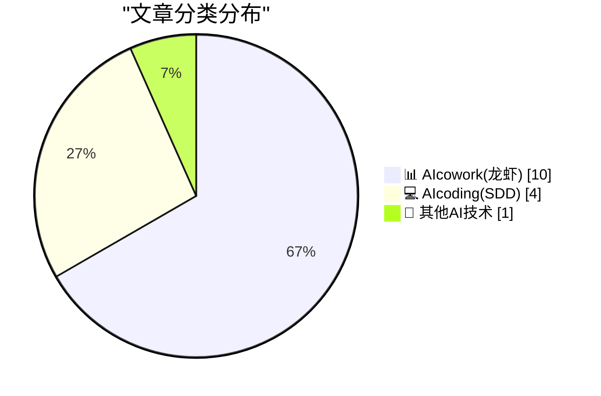
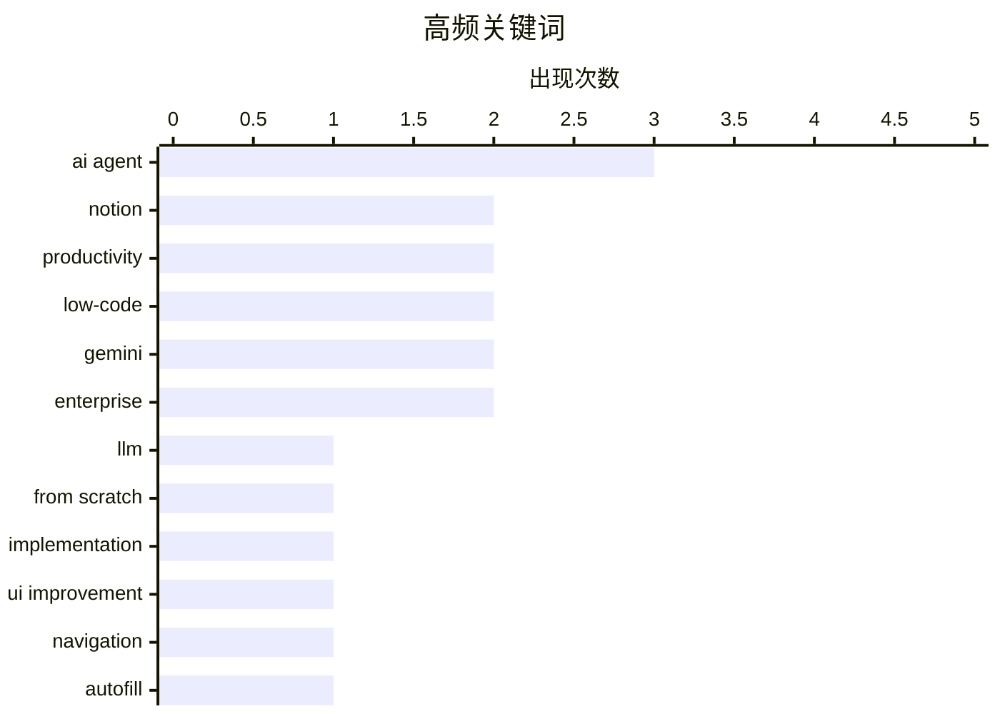

# 📰 AI 博客每日精选 — 2026-04-22

> 来自 98 个技术博客和社交媒体源，AI 精选 Top 15

## 📝 今日看点

今日技术圈聚焦于AI与协作工具的深度融合。一方面，AI编程助手正经历定价与计费模式的关键调整，同时其能力向代码优化与底层构建延伸。另一方面，各大生产力平台竞相将AI智能体深度嵌入办公流程，通过自动化与上下文理解重塑日程管理、文档创建与数据交互体验。AI正从辅助工具演变为驱动工作流变革的核心智能引擎。

---

## 🏆 今日必读

🥇 **从零编写LLM第33部分：完成附录后的心得体会**

[Writing an LLM from scratch, part 33 -- what I learned from finally getting round to the appendices](https://www.gilesthomas.com/2026/04/llm-from-scratch-33-what-i-learned-from-the-appendices) — gilesthomas.com · 4 小时前 · 💻 AIcoding(SDD)

> 作者在完成《从零开始构建大语言模型》一书主体后，设定了三个后续目标。第一个目标是成功训练了一个完整的GPT-2-small风格的基础模型，这过程相对顺利。然而，在完成附录部分时，作者遇到了新的挑战并获得了更深层次的见解。文章分享了作者在完成全书所有内容（包括附录）后的核心学习与反思。

💡 **为什么值得读**: 对于想深入理解LLM构建全流程，尤其是那些容易被忽略的附录细节和实战后反思的开发者，这篇文章提供了宝贵的经验总结。

🏷️ LLM, From Scratch, Implementation

🥈 **Notion面包屑导航改进：悬停显示同级页面**

[🔧 Product / … / 🌱 Improvement / 🍞 Breadcrumb browser Breadcrumbs now show sibling pages when you hover. Should make it easier to explore rel...](https://x.com/NotionHQ/status/2047043688208236928) — 𝕏 @NotionHQ · 1 小时前 · 📊 AIcowork(龙虾)

> Notion为其面包屑导航功能推出了一项用户体验改进。用户现在将鼠标悬停在面包屑路径上时，会显示当前页面的所有同级页面列表。这项改进旨在帮助用户更轻松地探索相关页面，并在工作区中进行导航。它通过可视化页面层级关系，提升了信息架构的浏览效率。

💡 **为什么值得读**: 如果你经常使用Notion管理复杂项目或知识库，这个细微但实用的导航增强功能能显著提升你的浏览和查找效率。

🏷️ Notion, UI Improvement, Navigation

🥉 **Notion将数据库代理重命名为Autofill，并提供两种模式**

[We heard you. Database agents are back to being called Autofill (keeping it simple). Autofill comes in two flavors: → Basic for quick, one-pass fills...](https://x.com/NotionHQ/status/2046969956496273464) — 𝕏 @NotionHQ · 6 小时前 · 📊 AIcowork(龙虾)

> Notion根据用户反馈，将“数据库代理”功能名称改回更直观的“Autofill”。Autofill功能现分为两种模式：“基础版”用于快速、单次填充，包含在商业版和企业版计划中；“自定义代理”则用于更复杂的任务，支持工作区及网络搜索、多步推理。此次调整旨在简化用户理解并明确功能定位。

💡 **为什么值得读**: 了解Notion AI功能的正式命名和具体能力划分，有助于你更准确地评估和选择适合自己团队协作需求的付费计划。

🏷️ Notion, Autofill, Database Agent

4️⃣ **微软推出Copilot Cowork：基于M365数据管理日程与会议**

[Introducing a new way to work with Copilot Cowork. Using data from Microsoft 365, Cowork manages your calendar, tells you which meetings to prioritize...](https://x.com/Microsoft365/status/2047035349809918233) — 𝕏 @Microsoft365 · 2 小时前 · 📊 AIcowork(龙虾)

> 微软推出了名为Copilot Cowork的新工作方式，深度集成于Microsoft 365。它利用Microsoft 365中的数据，主动管理用户的日历，智能提示需要优先处理的会议，并帮助用户进行会议准备。该功能旨在为用户节省数小时时间，并保护其专注时间不受干扰。这标志着Copilot从工具向智能化工作伙伴的演进。

💡 **为什么值得读**: 对于重度依赖Microsoft 365套件且日程繁忙的职场人士，Copilot Cowork展示了AI如何系统性地优化时间管理和会议效率，值得关注。

🏷️ Copilot, Productivity, Calendar

5️⃣ **谷歌在CloudNext‘26上发布Sheets Canvas：可在数据上构建交互式迷你应用**

[Just announced at #GoogleCloudNext ‘26 📣 Sheets canvas lets you build custom, interactive mini-apps like dashboards, kanban boards, and heat maps ...](https://x.com/GoogleWorkspace/status/2047058614318248276) — 𝕏 @GoogleWorkspace · 47 分钟前 · 📊 AIcowork(龙虾)

> 谷歌在Google Cloud Next ‘26大会上宣布了Sheets Canvas新功能。它允许用户直接在Google Sheets数据之上，安全地构建自定义的交互式迷你应用程序，例如仪表盘、看板或热力图。这突破了传统电子表格的静态展示局限，实现了数据的动态、可视化交互。该功能旨在彻底改变用户可视化和管理数据的方式。

💡 **为什么值得读**: 如果你需要频繁使用Google Sheets进行数据分析和展示，Sheets Canvas提供了一种无需复杂开发即可创建强大数据应用的新路径。

🏷️ Google Sheets, Data Visualization, Low-code

---

## 📊 数据概览

| 扫描源 | 抓取文章 | 时间范围 | 精选 |
|:---:|:---:|:---:|:---:|
| 74/98 | 2286 篇 → 32 篇 | 24h | **15 篇** |

### 分类分布



### 高频关键词



<details>
<summary>📈 纯文本关键词图（终端友好）</summary>

```
ai agent       │ ████████████████████ 3
notion         │ █████████████░░░░░░░ 2
productivity   │ █████████████░░░░░░░ 2
low-code       │ █████████████░░░░░░░ 2
gemini         │ █████████████░░░░░░░ 2
enterprise     │ █████████████░░░░░░░ 2
llm            │ ███████░░░░░░░░░░░░░ 1
from scratch   │ ███████░░░░░░░░░░░░░ 1
implementation │ ███████░░░░░░░░░░░░░ 1
ui improvement │ ███████░░░░░░░░░░░░░ 1
```

</details>

### 🏷️ 话题标签

**ai agent**(3) · **notion**(2) · **productivity**(2) · low-code(2) · gemini(2) · enterprise(2) · llm(1) · from scratch(1) · implementation(1) · ui improvement(1) · navigation(1) · autofill(1) · database agent(1) · copilot(1) · calendar(1) · google sheets(1) · data visualization(1) · google slides(1) · presentation(1) · github copilot(1)

---

====================

## 📊 AIcowork(龙虾)

### 1. Notion面包屑导航改进：悬停显示同级页面

[🔧 Product / … / 🌱 Improvement / 🍞 Breadcrumb browser Breadcrumbs now show sibling pages when you hover. Should make it easier to explore rel...](https://x.com/NotionHQ/status/2047043688208236928) — **𝕏 @NotionHQ** · 1 小时前 · ⭐ 22/25

> Notion为其面包屑导航功能推出了一项用户体验改进。用户现在将鼠标悬停在面包屑路径上时，会显示当前页面的所有同级页面列表。这项改进旨在帮助用户更轻松地探索相关页面，并在工作区中进行导航。它通过可视化页面层级关系，提升了信息架构的浏览效率。

🏷️ Notion, UI Improvement, Navigation

📌 AIcowork(龙虾)

---

### 2. Notion将数据库代理重命名为Autofill，并提供两种模式

[We heard you. Database agents are back to being called Autofill (keeping it simple). Autofill comes in two flavors: → Basic for quick, one-pass fills...](https://x.com/NotionHQ/status/2046969956496273464) — **𝕏 @NotionHQ** · 6 小时前 · ⭐ 22/25

> Notion根据用户反馈，将“数据库代理”功能名称改回更直观的“Autofill”。Autofill功能现分为两种模式：“基础版”用于快速、单次填充，包含在商业版和企业版计划中；“自定义代理”则用于更复杂的任务，支持工作区及网络搜索、多步推理。此次调整旨在简化用户理解并明确功能定位。

🏷️ Notion, Autofill, Database Agent

📌 AIcowork(龙虾)

---

### 3. 微软推出Copilot Cowork：基于M365数据管理日程与会议

[Introducing a new way to work with Copilot Cowork. Using data from Microsoft 365, Cowork manages your calendar, tells you which meetings to prioritize...](https://x.com/Microsoft365/status/2047035349809918233) — **𝕏 @Microsoft365** · 2 小时前 · ⭐ 19/25

> 微软推出了名为Copilot Cowork的新工作方式，深度集成于Microsoft 365。它利用Microsoft 365中的数据，主动管理用户的日历，智能提示需要优先处理的会议，并帮助用户进行会议准备。该功能旨在为用户节省数小时时间，并保护其专注时间不受干扰。这标志着Copilot从工具向智能化工作伙伴的演进。

🏷️ Copilot, Productivity, Calendar

📌 AIcowork(龙虾)

---

### 4. 谷歌在CloudNext‘26上发布Sheets Canvas：可在数据上构建交互式迷你应用

[Just announced at #GoogleCloudNext ‘26 📣 Sheets canvas lets you build custom, interactive mini-apps like dashboards, kanban boards, and heat maps ...](https://x.com/GoogleWorkspace/status/2047058614318248276) — **𝕏 @GoogleWorkspace** · 47 分钟前 · ⭐ 19/25

> 谷歌在Google Cloud Next ‘26大会上宣布了Sheets Canvas新功能。它允许用户直接在Google Sheets数据之上，安全地构建自定义的交互式迷你应用程序，例如仪表盘、看板或热力图。这突破了传统电子表格的静态展示局限，实现了数据的动态、可视化交互。该功能旨在彻底改变用户可视化和管理数据的方式。

🏷️ Google Sheets, Data Visualization, Low-code

📌 AIcowork(龙虾)

---

### 5. Gemini集成Google Slides：一键生成符合公司模板的完整可编辑幻灯片

[Create full, editable slide decks in one shot 🪄 Using context from Workspace Intelligence, Gemini in Google Slides will stick to your company’s te...](https://x.com/GoogleWorkspace/status/2047043515864031362) — **𝕏 @GoogleWorkspace** · 1 小时前 · ⭐ 19/25

> 谷歌将Gemini AI深度集成到Google Slides中。利用Workspace Intelligence的上下文，Gemini能够一键生成完整的、可编辑的幻灯片演示文稿。关键特性在于，它能自动遵循公司的品牌模板和视觉风格，确保内容符合企业形象。这极大地简化了从构思到可演示幻灯片的制作流程。

🏷️ Gemini, Google Slides, Presentation

📌 AIcowork(龙虾)

---

### 6. Slack即将推出简化版Agent部署：与Vercel/Lovable集成，一键添加

[Not a Bolt developer? No problem. Coming soon in Slack: When building with @vercel or @Lovable, hit "Add to Slack" and your agent is deployed — OAuth...](https://x.com/SlackHQ/status/2047034049491877975) — **𝕏 @SlackHQ** · 2 小时前 · ⭐ 17/25

> Slack宣布即将推出一项新功能，极大简化在Slack中部署AI智能体（Agent）的流程。用户在使用Vercel或Lovable平台开发后，只需点击“添加到Slack”，其智能体即可自动部署。该流程自动处理OAuth授权、清单配置和环境设置等复杂步骤。目标是实现从提示词到实时Slack智能体的秒级部署，且无需迁移开发平台。

🏷️ Slack, AI Agent, Low-code

📌 AIcowork(龙虾)

---

### 7. RT Marc Benioff: No browser required. Our API is the UI. 🔓 Salesforce Headless 360 just exposed our entire platform — apps, workflows, metadata, A...

[RT Marc Benioff: No browser required. Our API is the UI. 🔓 Salesforce Headless 360 just exposed our entire platform — apps, workflows, metadata, A...](https://x.com/SlackHQ/status/2047029464354144414) — **𝕏 @SlackHQ** · 4 小时前 · ⭐ 16/25

> RT Marc Benioff<br>No browser required. Our API is the UI. 🔓 Salesforce Headless 360 just exposed our entire platform — apps, workflows, metadata, Agentforce &amp; Slack — as unified APIs, MCP tools 

🏷️ API, AI Agent, CRM

📌 AIcowork(龙虾)

---

### 8. What’s Next with Workspace AI? We take you through our latest launch, Workspace Intelligence, that's launching at #GoogleCloudNext. Find out how it c...

[What’s Next with Workspace AI? We take you through our latest launch, Workspace Intelligence, that's launching at #GoogleCloudNext. Find out how it c...](https://x.com/GoogleWorkspace/status/2047029903766225147) — **𝕏 @GoogleWorkspace** · 2 小时前 · ⭐ 16/25

> What’s Next with Workspace AI? We take you through our latest launch, Workspace Intelligence, that's launching at #GoogleCloudNext. <br><br>Find out how it can transform your workday, right from your 

🏷️ Workspace, AI Integration, Productivity

📌 AIcowork(龙虾)

---

### 9. Colgate-Palmolive has scaled Google Workspace to 34,000 employees. By building custom AI agents on Gemini, their teams are now: ⏱️ Accelerating Inno...

[Colgate-Palmolive has scaled Google Workspace to 34,000 employees. By building custom AI agents on Gemini, their teams are now: ⏱️ Accelerating Inno...](https://x.com/GoogleWorkspace/status/2047005733527421157) — **𝕏 @GoogleWorkspace** · 4 小时前 · ⭐ 15/25

> Colgate-Palmolive has scaled Google Workspace to 34,000 employees. By building custom AI agents on Gemini, their teams are now:<br><br>⏱️ Accelerating Innovation: Turning complex data into new product

🏷️ Gemini, AI Agent, Enterprise

📌 AIcowork(龙虾)

---

### 10. Upgrading your entire organization—including complex legal and finance teams—from Microsoft 365 to Google Workspace is now 5X faster thanks to our n...

[Upgrading your entire organization—including complex legal and finance teams—from Microsoft 365 to Google Workspace is now 5X faster thanks to our n...](https://x.com/GoogleWorkspace/status/2047005886590193878) — **𝕏 @GoogleWorkspace** · 4 小时前 · ⭐ 13/25

> Upgrading your entire organization—including complex legal and finance teams—from Microsoft 365 to Google Workspace is now 5X faster thanks to our new migration and interoperability enhancements. http

🏷️ Migration, Google Workspace, Enterprise

📌 AIcowork(龙虾)

---

## 💻 AIcoding(SDD)

### 11. 从零编写LLM第33部分：完成附录后的心得体会

[Writing an LLM from scratch, part 33 -- what I learned from finally getting round to the appendices](https://www.gilesthomas.com/2026/04/llm-from-scratch-33-what-i-learned-from-the-appendices) — **gilesthomas.com** · 4 小时前 · ⭐ 23/25

> 作者在完成《从零开始构建大语言模型》一书主体后，设定了三个后续目标。第一个目标是成功训练了一个完整的GPT-2-small风格的基础模型，这过程相对顺利。然而，在完成附录部分时，作者遇到了新的挑战并获得了更深层次的见解。文章分享了作者在完成全书所有内容（包括附录）后的核心学习与反思。

🏷️ LLM, From Scratch, Implementation

📌 AIcoding(SDD)

---

### 12. 独家：微软将于6月将所有GitHub Copilot用户迁移至基于令牌的计费模式

[Exclusive: Microsoft Moving All GitHub Copilot Subscribers To Token-Based Billing In June](https://www.wheresyoured.at/exclusive-microsoft-moving-all-github-copilot-subscribers-to-token-based-billing-in-june/) — **wheresyoured.at** · 4 小时前 · ⭐ 17/25

> 内部文件显示，微软计划从6月开始，为所有GitHub Copilot客户推行基于令牌（Token）的计费模式。Copilot Business客户每月每用户支付19美元，获得30美元的共享AI额度；Copilot Enterprise客户每月每用户支付39美元，获得70美元的共享AI额度。这标志着Copilot的定价策略从固定订阅费转向与实际使用量更挂钩的模型。

🏷️ GitHub Copilot, Billing, AI Coding

📌 AIcoding(SDD)

---

### 13. [更新]新闻：Anthropic暂时将Claude Code从20美元“Pro”订阅计划中移除

[[UPDATED] News: Anthropic (Briefly) Removes Claude Code From $20-A-Month "Pro" Subscription Plan For New Users](https://www.wheresyoured.at/news-anthropic-removes-pro-cc/) — **wheresyoured.at** · 23 小时前 · ⭐ 17/25

> 2026年4月21日下午，Anthropic在其多个定价页面移除了20美元/月的“Pro”计划对Claude Code的访问权限，但现有Pro用户短期内似乎仍可通过网页应用使用。相关的支持文档也一度被修改。此举可能意味着Anthropic正在调整其产品功能与定价的捆绑策略。

🏷️ Claude Code, Pricing, Subscription

📌 AIcoding(SDD)

---

### 14. GitHub探讨AI驱动软件优化如何帮助团队

[Re This Earth Day, let's rethink how we approach our code. Learn more about how AI-powered software optimization works. ⬇️ https://github.blog/news-...](https://x.com/github/status/2047064253623079176) — **𝕏 @GitHub** · 25 分钟前 · ⭐ 17/25

> GitHub在世界地球日之际，倡导重新思考编写代码的方式。其博客文章深入探讨了AI驱动的软件优化技术的工作原理。这种优化旨在通过AI分析代码，提出或自动实施改进，以提升软件性能和效率。其核心观点是，AI不仅能帮助编写代码，还能帮助优化代码，从而可能带来更广泛的效益。

🏷️ Code Optimization, Sustainability, AI Tools

📌 AIcoding(SDD)

---

## 🔬 其他AI技术

### 15. AI and Teaching – The Brave New World

[AI and Teaching – The Brave New World](https://steveblank.com/2026/04/22/ai-and-teaching-the-brave-new-world/) — **steveblank.com** · 6 小时前 · ⭐ 13/25

> This article previously appeared in the Entrepreneur & Innovation Exchange (EIX) This is the 16th year we’ve been teaching the Stanford Lean LaunchPad class. This year, from the first hour of the firs

🏷️ AI Education, Teaching, Application

📌 其他AI技术

---

====================

*生成于 2026-04-22 21:50 | 扫描 74 源 → 获取 2286 篇 → 精选 15 篇*
*基于 [Hacker News Popularity Contest 2025](https://refactoringenglish.com/tools/hn-popularity/) RSS 源列表，由 [Andrej Karpathy](https://x.com/karpathy) 推荐*
*由「懂点儿AI」制作，欢迎关注同名微信公众号获取更多 AI 实用技巧 💡*
