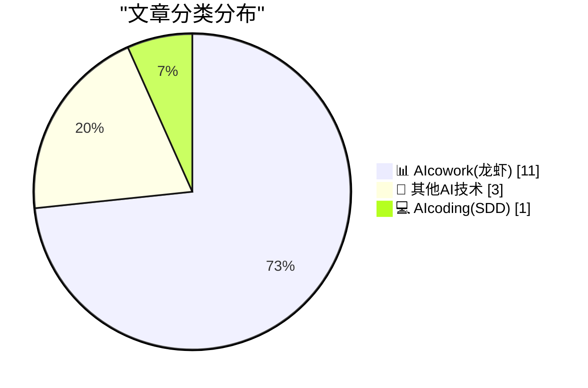
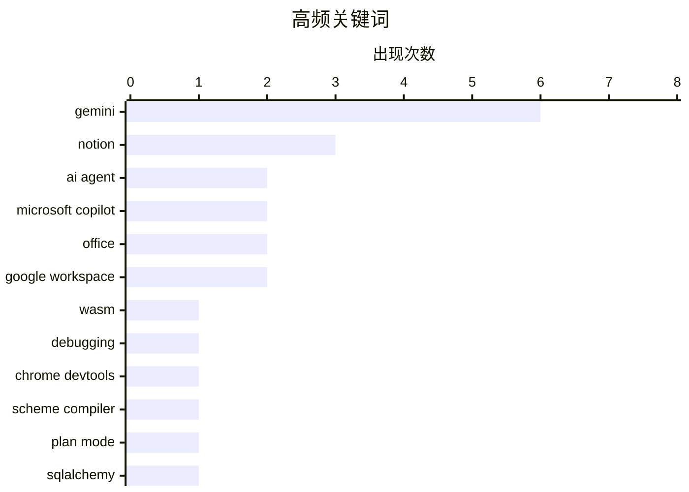

# 📰 AI 博客每日精选 — 2026-04-23

> 来自 98 个技术博客和社交媒体源，AI 精选 Top 15

## 📝 今日看点

今日技术圈的核心趋势聚焦于AI Agent的全面进化与落地：Notion、Microsoft和Google三大平台不约而同地推出了更智能、更可控的AI代理模式，强调计划审批、多步骤操作和跨应用自动化，标志着AI从“被动问答”向“主动执行”的实质性跨越。与此同时，WASM调试能力的成熟与SQLAlchemy等后端工具的实战深化，也反映出开发者工具链正在为AI时代的高效协作与复杂应用构建提供更坚实的基础。

---

## 🏆 今日必读

🥇 **在 Chrome DevTools 中调试 WASM**

[Debugging WASM in Chrome DevTools](https://eli.thegreenplace.net/2026/debugging-wasm-in-chrome-devtools/) — eli.thegreenplace.net · 19 小时前 · 💻 AIcoding(SDD)

> 文章分享了作者在开发 Scheme 编译器的 WASM 后端时，使用 Chrome DevTools 调试 WASM 代码的经验。Chrome DevTools 内置了功能强大的 WASM 调试器，支持设置断点、单步执行、查看变量和调用栈等核心功能。文章通过具体案例展示了如何利用这些工具定位和解决 WASM 代码中的逻辑错误。作者认为，对于 WASM 开发者来说，掌握 Chrome DevTools 的调试技巧能显著提升开发效率。

💡 **为什么值得读**: 如果你正在或即将进行 WebAssembly 开发，这篇文章能帮你快速上手 Chrome 自带的强大调试工具，避免在调试 WASM 代码时走弯路。

🏷️ WASM, debugging, Chrome DevTools, Scheme compiler

🥈 **Notion 推出计划模式**

[Introducing Plan Mode. Because a prompt without a plan is just a wish. In plan mode, your agent shows its work in a read-only sandbox before touching ...](https://x.com/NotionHQ/status/2047420542454829117) — 𝕏 @NotionHQ · 42 分钟前 · 📊 AIcowork(龙虾)

> Notion 在其 AI Agent 中推出了“计划模式”（Plan Mode）。该模式的核心是让 AI Agent 在执行任何操作前，先在一个只读沙盒中展示其完整的执行计划。用户审阅并批准计划后，Agent 才会实际执行。这一流程将 AI 的决策过程透明化，让用户能提前发现并纠正潜在错误，从而提升对 AI 的信任度和控制力。

💡 **为什么值得读**: 这是 AI Agent 产品设计中的一个重要创新，解决了用户对 AI“黑箱操作”的信任问题，值得所有 AI 产品经理和开发者关注。

🏷️ AI Agent, Plan Mode, Notion

🥉 **SQLAlchemy 2 实战 - 第6章：页面分析解决方案**

[SQLAlchemy 2 In Practice - Chapter 6: A Page Analytics Solution](https://blog.miguelgrinberg.com/post/sqlalchemy-2-in-practice---chapter-6-a-page-analytics-solution) — miguelgrinberg.com · 8 小时前 · 🔬 其他AI技术

> 这是《SQLAlchemy 2 实战》一书的第六章，目标是运用前几章学到的概念，构建一个网页流量分析解决方案。该章节通过一个完整的实战项目，帮助读者巩固 SQLAlchemy 2 的核心知识，包括模型定义、查询构建、关系映射和性能优化等。读者将学习如何设计数据库模型来存储页面访问数据，并编写高效的查询来生成分析报告。

💡 **为什么值得读**: 如果你正在学习 SQLAlchemy 2，这一章提供了一个极佳的实战项目，能帮你将理论知识转化为解决实际问题的能力。

🏷️ SQLAlchemy, Python, Database

4️⃣ **Notion 推出新的 AI Agent 管理方式**

[RT Laura Sandoval: Introducing a new way to manage your Notion agents in the Notion AI beta 💬 We want to make it easier for you to track your agent...](https://x.com/NotionHQ/status/2047402181557735914) — 𝕏 @NotionHQ · 2 小时前 · 📊 AIcowork(龙虾)

> Notion 在 AI 测试版中推出了一种管理 Notion Agents 的新方式。该功能旨在让用户更轻松地追踪 Agent 的活动，并在需要时进行干预和纠正。Notion 将 Agent 的管理界面提升到了更显眼的位置，方便用户随时查看和调整。目前该功能已开放给 TestFlight 用户进行测试。

💡 **为什么值得读**: 这是 Notion AI 功能的重要更新，如果你正在使用或计划使用 Notion AI Agent，了解这个新管理方式能帮你更好地掌控 Agent 的行为。

🏷️ Notion AI, Agent Management, Beta

5️⃣ **Slack API 实战：几分钟内构建线索丰富工作流**

[From idea to workflow in minutes. ⚡ Danny Sanchez, VP of Delivery & Technology at govSlackers, shares how they built a lead enrichment workflow — tr...](https://x.com/SlackHQ/status/2047314802029023551) — 𝕏 @SlackHQ · 7 小时前 · 📊 AIcowork(龙虾)

> Slack 官方分享了一个客户案例，展示了如何利用 Slack API 在几分钟内构建一个线索丰富工作流。该工作流由 Salesforce 触发，调用 Claude AI 模型进行数据处理，最终将结果推送到 Slack。这个案例生动展示了 Slack API 在自动化业务流程中的强大能力，实现了跨平台的无缝集成。

💡 **为什么值得读**: 这是一个极佳的 Slack API 实战案例，展示了如何快速将 AI 能力与现有业务系统（如 Salesforce）集成，对希望提升销售效率的团队有直接参考价值。

🏷️ Slack API, Claude, Workflow Automation

---

## 📊 数据概览

| 扫描源 | 抓取文章 | 时间范围 | 精选 |
|:---:|:---:|:---:|:---:|
| 73/98 | 2270 篇 → 27 篇 | 24h | **15 篇** |

### 分类分布



### 高频关键词



<details>
<summary>📈 纯文本关键词图（终端友好）</summary>

```
gemini            │ ████████████████████ 6
notion            │ ██████████░░░░░░░░░░ 3
ai agent          │ ███████░░░░░░░░░░░░░ 2
microsoft copilot │ ███████░░░░░░░░░░░░░ 2
office            │ ███████░░░░░░░░░░░░░ 2
google workspace  │ ███████░░░░░░░░░░░░░ 2
wasm              │ ███░░░░░░░░░░░░░░░░░ 1
debugging         │ ███░░░░░░░░░░░░░░░░░ 1
chrome devtools   │ ███░░░░░░░░░░░░░░░░░ 1
scheme compiler   │ ███░░░░░░░░░░░░░░░░░ 1
```

</details>

### 🏷️ 话题标签

**gemini**(6) · **notion**(3) · **ai agent**(2) · microsoft copilot(2) · office(2) · google workspace(2) · wasm(1) · debugging(1) · chrome devtools(1) · scheme compiler(1) · plan mode(1) · sqlalchemy(1) · python(1) · database(1) · notion ai(1) · agent management(1) · beta(1) · slack api(1) · claude(1) · workflow automation(1)

---

====================

## 📊 AIcowork(龙虾)

### 1. Notion 推出计划模式

[Introducing Plan Mode. Because a prompt without a plan is just a wish. In plan mode, your agent shows its work in a read-only sandbox before touching ...](https://x.com/NotionHQ/status/2047420542454829117) — **𝕏 @NotionHQ** · 42 分钟前 · ⭐ 19/25

> Notion 在其 AI Agent 中推出了“计划模式”（Plan Mode）。该模式的核心是让 AI Agent 在执行任何操作前，先在一个只读沙盒中展示其完整的执行计划。用户审阅并批准计划后，Agent 才会实际执行。这一流程将 AI 的决策过程透明化，让用户能提前发现并纠正潜在错误，从而提升对 AI 的信任度和控制力。

🏷️ AI Agent, Plan Mode, Notion

📌 AIcowork(龙虾)

---

### 2. Notion 推出新的 AI Agent 管理方式

[RT Laura Sandoval: Introducing a new way to manage your Notion agents in the Notion AI beta 💬 We want to make it easier for you to track your agent...](https://x.com/NotionHQ/status/2047402181557735914) — **𝕏 @NotionHQ** · 2 小时前 · ⭐ 15/25

> Notion 在 AI 测试版中推出了一种管理 Notion Agents 的新方式。该功能旨在让用户更轻松地追踪 Agent 的活动，并在需要时进行干预和纠正。Notion 将 Agent 的管理界面提升到了更显眼的位置，方便用户随时查看和调整。目前该功能已开放给 TestFlight 用户进行测试。

🏷️ Notion AI, Agent Management, Beta

📌 AIcowork(龙虾)

---

### 3. Slack API 实战：几分钟内构建线索丰富工作流

[From idea to workflow in minutes. ⚡ Danny Sanchez, VP of Delivery & Technology at govSlackers, shares how they built a lead enrichment workflow — tr...](https://x.com/SlackHQ/status/2047314802029023551) — **𝕏 @SlackHQ** · 7 小时前 · ⭐ 15/25

> Slack 官方分享了一个客户案例，展示了如何利用 Slack API 在几分钟内构建一个线索丰富工作流。该工作流由 Salesforce 触发，调用 Claude AI 模型进行数据处理，最终将结果推送到 Slack。这个案例生动展示了 Slack API 在自动化业务流程中的强大能力，实现了跨平台的无缝集成。

🏷️ Slack API, Claude, Workflow Automation

📌 AIcowork(龙虾)

---

### 4. Microsoft 365 Copilot 推出 Agent 模式

[A true collaborator goes beyond suggestions, they execute in tandem. Now Copilot does just that—performing multi-step actions in Word, Excel, and Pow...](https://x.com/Microsoft365/status/2047115647243456550) — **𝕏 @Microsoft365** · 20 小时前 · ⭐ 15/25

> Microsoft 宣布对 Copilot 体验进行重大更新，正式推出“Agent 模式”（Agent Mode）并设为默认模式。该模式使 Copilot 能够在 Word、Excel 和 PowerPoint 中执行多步骤操作，而不仅仅是提供建议。用户始终掌握控制权，Copilot 则像一个真正的协作者，在文档、数据和演示文稿中直接执行任务。

🏷️ Microsoft Copilot, Office, Multi-step Actions

📌 AIcowork(龙虾)

---

### 5. Microsoft 365 Copilot 多步骤操作功能全面可用

[You want a partner to execute right in the doc, data, and deck—and now Copilot can. A truly collaborative Copilot is now widely available and takes m...](https://x.com/Microsoft365/status/2047105999723442403) — **𝕏 @Microsoft365** · 21 小时前 · ⭐ 11/25

> Microsoft 宣布其 Copilot 的协作功能现已广泛可用，能够在 Word、Excel 和 PowerPoint 中直接执行多步骤操作。用户现在可以要求 Copilot 在文档、数据和演示文稿中完成更复杂的任务，而 Copilot 会像一个真正的合作伙伴一样执行。该功能旨在让 AI 成为用户在工作中的执行伙伴。

🏷️ Microsoft Copilot, Office, AI Agent

📌 AIcowork(龙虾)

---

### 6. Google Workspace 推出 Gemini 会议调度功能

[Ask Gemini in Chat is your new command line for work 💻 Announced at #GoogleCloudNext, Ask Gemini can now schedule meetings at a suitable time for e...](https://x.com/GoogleWorkspace/status/2047421003928576261) — **𝕏 @GoogleWorkspace** · 40 分钟前 · ⭐ 11/25

> 在 Google Cloud Next 大会上，Google Workspace 宣布 Ask Gemini in Chat 新增会议调度功能。用户可以直接在聊天中让 Gemini 查找大家都有空的时间并安排会议，无需切换应用。这标志着 Gemini 从一个信息查询工具，进化为一个能够直接执行操作的工作“命令行”。

🏷️ Gemini, Google Workspace, AI Scheduling

📌 AIcowork(龙虾)

---

### 7. Google Workspace 扩展“为我记笔记”功能至线下会议

[We’re expanding Take Notes for Me to work across in-person meetings and other providers. Just tap and let Gemini handle the summary and action items ...](https://x.com/GoogleWorkspace/status/2047405900441272664) — **𝕏 @GoogleWorkspace** · 1 小时前 · ⭐ 11/25

> Google Workspace 宣布扩展其“Take Notes for Me”（为我记笔记）功能，使其能够支持线下会议和其他第三方会议提供商。用户只需点击一下，Gemini 就能自动生成会议摘要和待办事项，并保存到 Google 文档中。该功能旨在让用户专注于对话本身，而无需分心记录。

🏷️ Gemini, Meeting Notes, AI Summary

📌 AIcowork(龙虾)

---

### 8. Google Workspace 推出 Gemini 自动浏览功能

[Gemini auto browse handles multi-step tasks across the web and your apps with built-in checkpoints and enterprise-grade protection. 🌐 Stay in contr...](https://x.com/GoogleWorkspace/status/2047375701901250584) — **𝕏 @GoogleWorkspace** · 3 小时前 · ⭐ 11/25

> Google Workspace 推出了 Gemini 的“自动浏览”（auto browse）功能。该功能可以处理跨网页和应用的复杂多步骤任务，并内置了检查点和企业级保护。用户可以在 Gemini 执行任务时保持控制，随时检查或中断操作。这标志着 Gemini 具备了更强的自主执行能力。

🏷️ Gemini, Auto Browse, Multi-step Agent

📌 AIcowork(龙虾)

---

### 9. 在 Google Chat 中体验 Ask Gemini：一个统一的工作日命令行工具

[Meet Ask Gemini in Chat: a unified command line for your workday that manages tasks and delivers results directly to your threads. 💬✨ Turning your...](https://x.com/GoogleWorkspace/status/2047345502719459479) — **𝕏 @GoogleWorkspace** · 5 小时前 · ⭐ 11/25

> Google Workspace 在 Google Cloud Next 大会上推出了 Chat 中的“Ask Gemini”功能，旨在将聊天界面转变为生产力中心。该功能作为一个统一的命令行工具，允许用户直接在聊天线程中管理任务并获取结果。它能够整合并检索用户的所有 Workspace 数据，以回答复杂问题。这是 Google Workspace Intelligence 计划的一部分，标志着 AI 深度集成到办公协作中的新阶段。

🏷️ Gemini, Chat, Command Line

📌 AIcowork(龙虾)

---

### 10. Google Workspace Intelligence 发布：这只是个开始

[This one’s powerful, and just the start. Full rundown of what’s new in Google Workspace (and what’s coming) here 👇](https://x.com/GoogleWorkspace/status/2047315305072930887) — **𝕏 @GoogleWorkspace** · 7 小时前 · ⭐ 11/25

> Google Workspace 正式推出 Workspace Intelligence 功能，其中“Ask Gemini”在 Google Chat 中尤为突出。该功能能够扫描用户所有的 Workspace 数据，并可靠地回答最棘手的问题。官方称这一功能非常强大，并暗示这仅仅是 AI 集成到办公套件的开端。文章还提供了关于所有新功能及未来规划的完整介绍链接。

🏷️ Google Workspace, AI Intelligence, Gemini

📌 AIcowork(龙虾)

---

### 11. AI 收件箱：更快处理邮件，提供待办建议和主题摘要

[Tackle your inbox faster than ever. ⚡️ AI Inbox gives you suggested to-dos and topic summaries so you can catch up and take action quickly. Now roll...](https://x.com/GoogleWorkspace/status/2047073712508190922) — **𝕏 @GoogleWorkspace** · 23 小时前 · ⭐ 11/25

> Google Workspace 推出 AI Inbox 功能，旨在帮助用户以前所未有的速度处理收件箱。该功能能自动生成建议的待办事项和邮件主题摘要，让用户快速了解邮件内容并采取行动。该功能目前正在向 Gemini Alpha 计划的 Workspace Enterprise Plus 客户逐步推出。这标志着 AI 在邮件管理领域的深度应用，旨在解决信息过载问题。

🏷️ AI Inbox, Email, Gemini

📌 AIcowork(龙虾)

---

## 🔬 其他AI技术

### 12. SQLAlchemy 2 实战 - 第6章：页面分析解决方案

[SQLAlchemy 2 In Practice - Chapter 6: A Page Analytics Solution](https://blog.miguelgrinberg.com/post/sqlalchemy-2-in-practice---chapter-6-a-page-analytics-solution) — **miguelgrinberg.com** · 8 小时前 · ⭐ 18/25

> 这是《SQLAlchemy 2 实战》一书的第六章，目标是运用前几章学到的概念，构建一个网页流量分析解决方案。该章节通过一个完整的实战项目，帮助读者巩固 SQLAlchemy 2 的核心知识，包括模型定义、查询构建、关系映射和性能优化等。读者将学习如何设计数据库模型来存储页面访问数据，并编写高效的查询来生成分析报告。

🏷️ SQLAlchemy, Python, Database

📌 其他AI技术

---

### 13. Notion 开发者：收到 🫡

[RT Notion Developers: 🫡](https://x.com/NotionHQ/status/2047359333831463298) — **𝕏 @NotionHQ** · 4 小时前 · ⭐ 9/25

> Notion 官方账号转发了其开发者 Teddy Riker 的一条推文，内容仅为一个表情符号“🫡”（敬礼）。该推文链接到一篇关于 Notion 的文章。这通常暗示 Notion 开发者团队对某项社区反馈或内部动态做出了简洁而有力的回应，可能涉及产品更新或开发者关系。

🏷️ Notion, Social Media

📌 其他AI技术

---

### 14. 在 Notion 工作是什么体验？像一支爵士乐队

[RT First Round: What’s it like working at @NotionHQ? Kind of like a jazz band. High agency, low bureaucracy, and lots of “yes, and…”](https://x.com/NotionHQ/status/2047360995769864401) — **𝕏 @NotionHQ** · 5 小时前 · ⭐ 9/25

> Notion 官方转发了 First Round 对其公司文化的描述：在 Notion 工作就像一支爵士乐队。这种文化强调高度的自主权（High agency）、极低的官僚主义（Low bureaucracy）以及大量的“是的，而且……”（即即兴协作与肯定式沟通）。该描述通过视频形式生动展现了 Notion 独特的组织管理哲学。

🏷️ Notion, Company Culture

📌 其他AI技术

---

## 💻 AIcoding(SDD)

### 15. 在 Chrome DevTools 中调试 WASM

[Debugging WASM in Chrome DevTools](https://eli.thegreenplace.net/2026/debugging-wasm-in-chrome-devtools/) — **eli.thegreenplace.net** · 19 小时前 · ⭐ 20/25

> 文章分享了作者在开发 Scheme 编译器的 WASM 后端时，使用 Chrome DevTools 调试 WASM 代码的经验。Chrome DevTools 内置了功能强大的 WASM 调试器，支持设置断点、单步执行、查看变量和调用栈等核心功能。文章通过具体案例展示了如何利用这些工具定位和解决 WASM 代码中的逻辑错误。作者认为，对于 WASM 开发者来说，掌握 Chrome DevTools 的调试技巧能显著提升开发效率。

🏷️ WASM, debugging, Chrome DevTools, Scheme compiler

📌 AIcoding(SDD)

---

====================

*生成于 2026-04-23 21:43 | 扫描 73 源 → 获取 2270 篇 → 精选 15 篇*
*基于 [Hacker News Popularity Contest 2025](https://refactoringenglish.com/tools/hn-popularity/) RSS 源列表，由 [Andrej Karpathy](https://x.com/karpathy) 推荐*
*由「懂点儿AI」制作，欢迎关注同名微信公众号获取更多 AI 实用技巧 💡*
