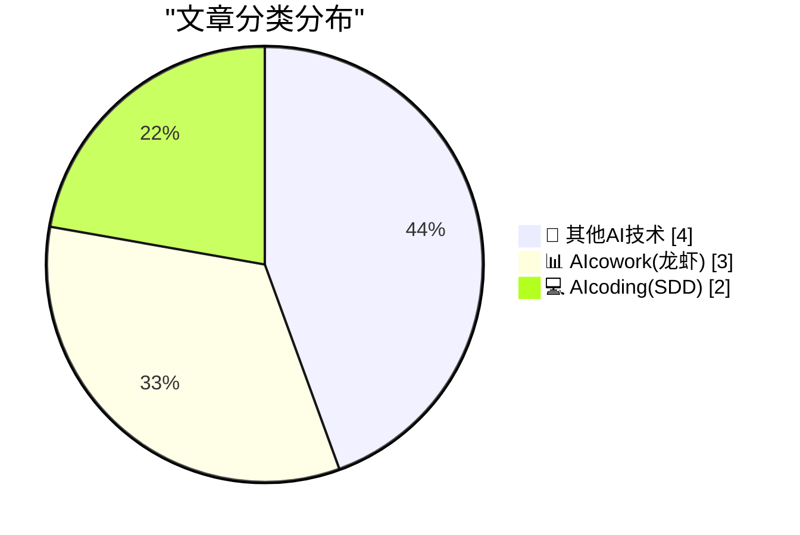
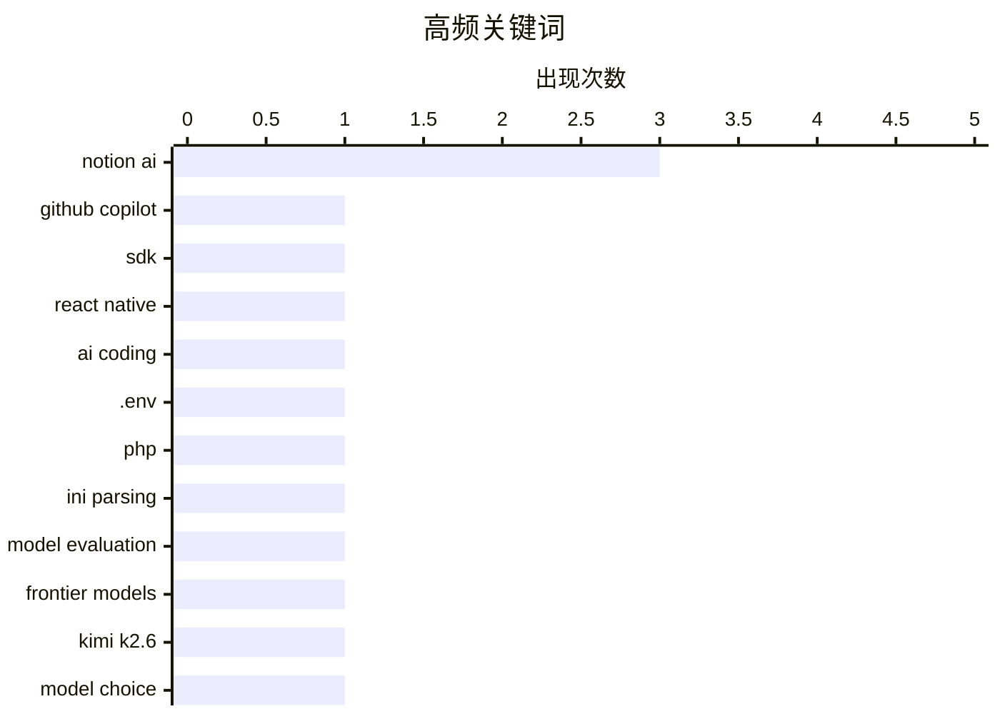

# 📰 AI 博客每日精选 — 2026-04-25

> 来自 98 个技术博客和社交媒体源，AI 精选 Top 9

## 📝 今日看点

今日技术圈聚焦两大趋势：AI 能力正加速嵌入日常工具与工作流，以 Notion 为代表的知识应用密集集成 GPT-5.5、Kimi K2.6 等多款前沿模型，并公开评估方法论；同时，AI 从辅助编码向自主生成商业计划等“替代执行”方向延伸，引发关于“满足感来自讲述还是构建”的深层反思。此外，GitHub Copilot SDK 的发布标志着 AI 编程助手正从插件走向可编程平台，开发者可将其智能集成到自有应用中。

---

## 🏆 今日必读

🥇 **使用 GitHub Copilot SDK 构建 AI 驱动的 Issue 分类**

[With the GitHub Copilot SDK, you can add the same AI that powers Copilot Chat to your own applications. To test this out, @acolombiadev integrated the...](https://x.com/github/status/2048100990721654803) — 𝕏 @GitHub · 3 小时前 · 💻 AIcoding(SDD)

> GitHub 发布了 Copilot SDK，允许开发者将 Copilot Chat 的 AI 能力集成到自己的应用中。开发者 @acolombiadev 将该 SDK 集成到 React Native 应用中，实现了 AI 驱动的 Issue 摘要生成。该实现包含了优雅降级和缓存等生产级模式。文章详细介绍了具体的集成步骤和实现方案。

💡 **为什么值得读**: 如果你正在考虑将 AI 助手能力集成到自己的产品中，这篇文章提供了一个从 SDK 到生产级实现的完整实战案例。

🏷️ GitHub Copilot, SDK, React Native, AI Coding

🥈 **你可以用 PHP 将 .env 文件作为 .ini 解析——但有个坑**

[You can parse an .env file as an .ini with PHP - but there's a catch](https://shkspr.mobi/blog/2026/04/you-can-parse-an-env-file-as-an-ini-with-php-but-theres-a-catch/) — shkspr.mobi · 10 小时前 · 💻 AIcoding(SDD)

> .env 文件是一种存储环境变量的低技术方案，但 PHP 开发者常纠结于如何解析它。文章指出，可以直接使用 PHP 内置的 parse_ini_file() 函数来解析 .env 文件，无需额外库。然而，.env 和 .ini 格式在行为上存在细微差异，例如引号处理和变量展开规则不同，直接使用可能导致意外错误。文章揭示了这些差异并给出了规避建议。

💡 **为什么值得读**: 对于追求极简方案的 PHP 开发者，这篇文章揭示了内置函数与 .env 文件之间的隐藏陷阱，能帮你避免一个常见的生产环境 Bug。

🏷️ .env, PHP, INI Parsing

🥉 **Notion 如何评估每个新 AI 模型**

[RT eli(as): We’ve often been asked about how we eval each new model at Notion, since we’re one of the few apps deploying both frontier lab models an...](https://x.com/NotionHQ/status/2047801893632856557) — 𝕏 @NotionHQ · 23 小时前 · 📊 AIcowork(龙虾)

> Notion 作为少数同时部署前沿实验室模型和领先开源模型的知识工作应用，公开了其模型评估方法论。文章分享了 Notion 在评估新模型后向模型提供商反馈的具体内容。评估标准涵盖了通用知识工作的多个维度，以确保模型在实际场景中的表现。

💡 **为什么值得读**: 如果你在为企业应用做 AI 模型选型，Notion 的评估框架和反馈标准是极具参考价值的行业实践。

🏷️ Notion AI, Model Evaluation, Frontier Models

4️⃣ **在 Notion AI 独立应用中使用 Kimi K2.6**

[RT Max Schoening: It’s nice to have the choice. Using Kimi K2.6 in the standalone Notion AI app.](https://x.com/NotionHQ/status/2048074962012127257) — 𝕏 @NotionHQ · 17 小时前 · 📊 AIcowork(龙虾)

> Notion AI 独立应用现已支持 Kimi K2.6 模型。用户 Max Schoening 表示，拥有多种模型选择是件好事。这标志着 Notion 在 AI 模型支持上的进一步扩展，为用户提供了除 GPT 系列之外的新选择。

💡 **为什么值得读**: 这条动态展示了 Notion AI 在模型多样性上的最新进展，对于关注多模型策略的用户具有即时信息价值。

🏷️ Notion AI, Kimi K2.6, Model Choice

5️⃣ **GPT-5.5 现已登陆 Notion**

[GPT-5.5 is now in Notion 🫡](https://x.com/NotionHQ/status/2047795181760721350) — 𝕏 @NotionHQ · 23 小时前 · 📊 AIcowork(龙虾)

> Notion 正式集成了 OpenAI 的最新模型 GPT-5.5。用户现在可以在 Notion 的 AI 功能中直接使用该模型。这是 Notion 持续更新其 AI 能力的最新动作。

💡 **为什么值得读**: 如果你是 Notion AI 的重度用户，这条消息直接告诉你最新的可用模型，能帮你第一时间体验 GPT-5.5 的能力提升。

🏷️ Notion AI, GPT-5.5, Model Update

---

## 📊 数据概览

| 扫描源 | 抓取文章 | 时间范围 | 精选 |
|:---:|:---:|:---:|:---:|
| 73/98 | 2282 篇 → 9 篇 | 24h | **9 篇** |

### 分类分布



### 高频关键词



<details>
<summary>📈 纯文本关键词图（终端友好）</summary>

```
notion ai        │ ████████████████████ 3
github copilot   │ ███████░░░░░░░░░░░░░ 1
sdk              │ ███████░░░░░░░░░░░░░ 1
react native     │ ███████░░░░░░░░░░░░░ 1
ai coding        │ ███████░░░░░░░░░░░░░ 1
.env             │ ███████░░░░░░░░░░░░░ 1
php              │ ███████░░░░░░░░░░░░░ 1
ini parsing      │ ███████░░░░░░░░░░░░░ 1
model evaluation │ ███████░░░░░░░░░░░░░ 1
frontier models  │ ███████░░░░░░░░░░░░░ 1
```

</details>

### 🏷️ 话题标签

**notion ai**(3) · **github copilot**(1) · **sdk**(1) · react native(1) · ai coding(1) · .env(1) · php(1) · ini parsing(1) · model evaluation(1) · frontier models(1) · kimi k2.6(1) · model choice(1) · gpt-5.5(1) · model update(1) · ceo transition(1) · financial report(1) · chatgpt(1) · idea sharing(1) · pricing(1) · web development(1)

---

====================

## 🔬 其他AI技术

### 1. 是时候端上一盘关于 Cook-Ternus CEO 交接的“美味索赔浓汤”了

[★ Time to Serve Some Delicious Claim Chowder Regarding the Cook-Ternus CEO Transition](https://daringfireball.net/2026/04/delicious_claim_chowder_regarding_the_cook-ternus_ceo_transition) — **daringfireball.net** · 20 小时前 · ⭐ 5/25

> 文章针对 2025 年 11 月《金融时报》关于苹果 CEO 库克与特努斯交接的报道进行了复盘。此前 Mark Gurman 曾斥该报道“完全是假的”，但文章指出，该报道的每一个字实际上都完全正确。作者以此为例，批评了科技媒体圈中常见的错误否认和事后打脸现象。

🏷️ CEO Transition, Financial Report

📌 其他AI技术

---

### 2. ChatGPT 计划的满足感

[The Satisfaction of a ChatGPT Plan](https://idiallo.com/byte-size/the-satisfaction-of-a-chatgpt-plan?src=feed) — **idiallo.com** · 3 小时前 · ⭐ 5/25

> 作者观察到一种新现象：人们不再仅仅分享一个想法，而是分享由 AI 完全生成的、关于如何实现该想法的“ChatGPT 商业计划”。作者认为，对于许多人来说，满足感来自于“讲述”而非“构建”，AI 生成的计划进一步强化了这种虚假的成就感。多位读者来信表示有同感。

🏷️ ChatGPT, Idea Sharing

📌 其他AI技术

---

### 3. 你该为什么收费？

[What Do You Charge For?](https://idiallo.com/blog/what-do-you-charge-for?src=feed) — **idiallo.com** · 16 小时前 · ⭐ 5/25

> 作者在学会为建网站定出合理价格后，遇到了更深层的问题：到底该为什么收费？是为产品本身（建站成本）收费，还是为足以谋生的价格收费？这个问题适用于任何行业，无论是顾问、机械师还是私人司机。作者通过一次与建站公司的合作经历，探讨了定价策略背后的核心矛盾。

🏷️ Pricing, Web Development

📌 其他AI技术

---

### 4. Ada Palmer 的《发明文艺复兴》

[Pluralistic: Ada Palmer's "Inventing the Renaissance" (25 Apr 2026)](https://pluralistic.net/2026/04/25/machiavellian/) — **pluralistic.net** · 10 小时前 · ⭐ 5/25

> 文章盛赞 Ada Palmer 的新书《发明文艺复兴》是一部杰作、一部巨著，展现了极高的才华。此外，文章还汇总了多个值得关注的链接，包括对互联网泡沫破裂的回顾、RIAA 起诉无电脑家庭、约翰迪尔与信息安全、富士康与威斯康星州、版权欺诈与施虐者名誉、以及“粗心之人”等话题。

🏷️ Book Review, Renaissance

📌 其他AI技术

---

## 📊 AIcowork(龙虾)

### 5. Notion 如何评估每个新 AI 模型

[RT eli(as): We’ve often been asked about how we eval each new model at Notion, since we’re one of the few apps deploying both frontier lab models an...](https://x.com/NotionHQ/status/2047801893632856557) — **𝕏 @NotionHQ** · 23 小时前 · ⭐ 17/25

> Notion 作为少数同时部署前沿实验室模型和领先开源模型的知识工作应用，公开了其模型评估方法论。文章分享了 Notion 在评估新模型后向模型提供商反馈的具体内容。评估标准涵盖了通用知识工作的多个维度，以确保模型在实际场景中的表现。

🏷️ Notion AI, Model Evaluation, Frontier Models

📌 AIcowork(龙虾)

---

### 6. 在 Notion AI 独立应用中使用 Kimi K2.6

[RT Max Schoening: It’s nice to have the choice. Using Kimi K2.6 in the standalone Notion AI app.](https://x.com/NotionHQ/status/2048074962012127257) — **𝕏 @NotionHQ** · 17 小时前 · ⭐ 12/25

> Notion AI 独立应用现已支持 Kimi K2.6 模型。用户 Max Schoening 表示，拥有多种模型选择是件好事。这标志着 Notion 在 AI 模型支持上的进一步扩展，为用户提供了除 GPT 系列之外的新选择。

🏷️ Notion AI, Kimi K2.6, Model Choice

📌 AIcowork(龙虾)

---

### 7. GPT-5.5 现已登陆 Notion

[GPT-5.5 is now in Notion 🫡](https://x.com/NotionHQ/status/2047795181760721350) — **𝕏 @NotionHQ** · 23 小时前 · ⭐ 12/25

> Notion 正式集成了 OpenAI 的最新模型 GPT-5.5。用户现在可以在 Notion 的 AI 功能中直接使用该模型。这是 Notion 持续更新其 AI 能力的最新动作。

🏷️ Notion AI, GPT-5.5, Model Update

📌 AIcowork(龙虾)

---

## 💻 AIcoding(SDD)

### 8. 使用 GitHub Copilot SDK 构建 AI 驱动的 Issue 分类

[With the GitHub Copilot SDK, you can add the same AI that powers Copilot Chat to your own applications. To test this out, @acolombiadev integrated the...](https://x.com/github/status/2048100990721654803) — **𝕏 @GitHub** · 3 小时前 · ⭐ 20/25

> GitHub 发布了 Copilot SDK，允许开发者将 Copilot Chat 的 AI 能力集成到自己的应用中。开发者 @acolombiadev 将该 SDK 集成到 React Native 应用中，实现了 AI 驱动的 Issue 摘要生成。该实现包含了优雅降级和缓存等生产级模式。文章详细介绍了具体的集成步骤和实现方案。

🏷️ GitHub Copilot, SDK, React Native, AI Coding

📌 AIcoding(SDD)

---

### 9. 你可以用 PHP 将 .env 文件作为 .ini 解析——但有个坑

[You can parse an .env file as an .ini with PHP - but there's a catch](https://shkspr.mobi/blog/2026/04/you-can-parse-an-env-file-as-an-ini-with-php-but-theres-a-catch/) — **shkspr.mobi** · 10 小时前 · ⭐ 17/25

> .env 文件是一种存储环境变量的低技术方案，但 PHP 开发者常纠结于如何解析它。文章指出，可以直接使用 PHP 内置的 parse_ini_file() 函数来解析 .env 文件，无需额外库。然而，.env 和 .ini 格式在行为上存在细微差异，例如引号处理和变量展开规则不同，直接使用可能导致意外错误。文章揭示了这些差异并给出了规避建议。

🏷️ .env, PHP, INI Parsing

📌 AIcoding(SDD)

---

====================

*生成于 2026-04-25 21:35 | 扫描 73 源 → 获取 2282 篇 → 精选 9 篇*
*基于 [Hacker News Popularity Contest 2025](https://refactoringenglish.com/tools/hn-popularity/) RSS 源列表，由 [Andrej Karpathy](https://x.com/karpathy) 推荐*
*由「懂点儿AI」制作，欢迎关注同名微信公众号获取更多 AI 实用技巧 💡*
