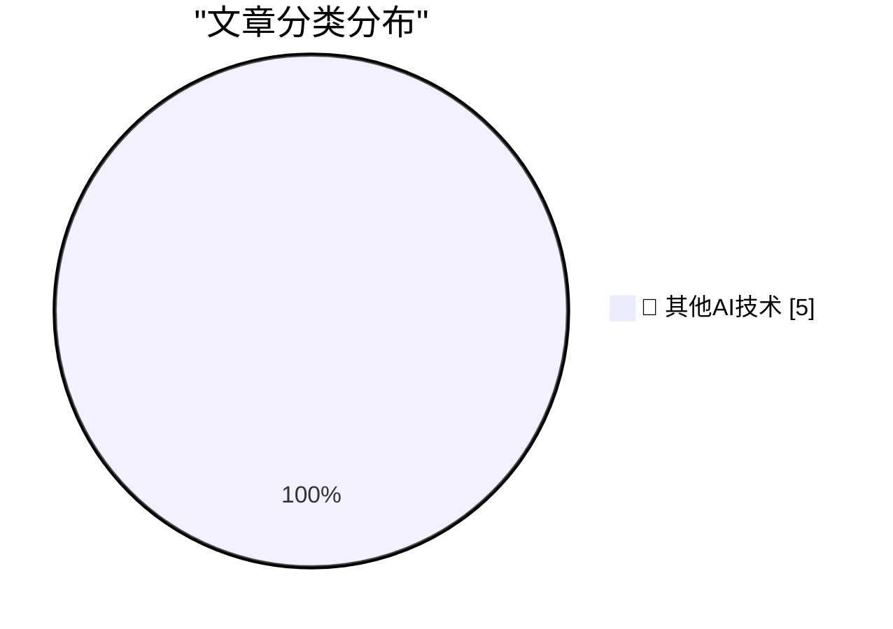
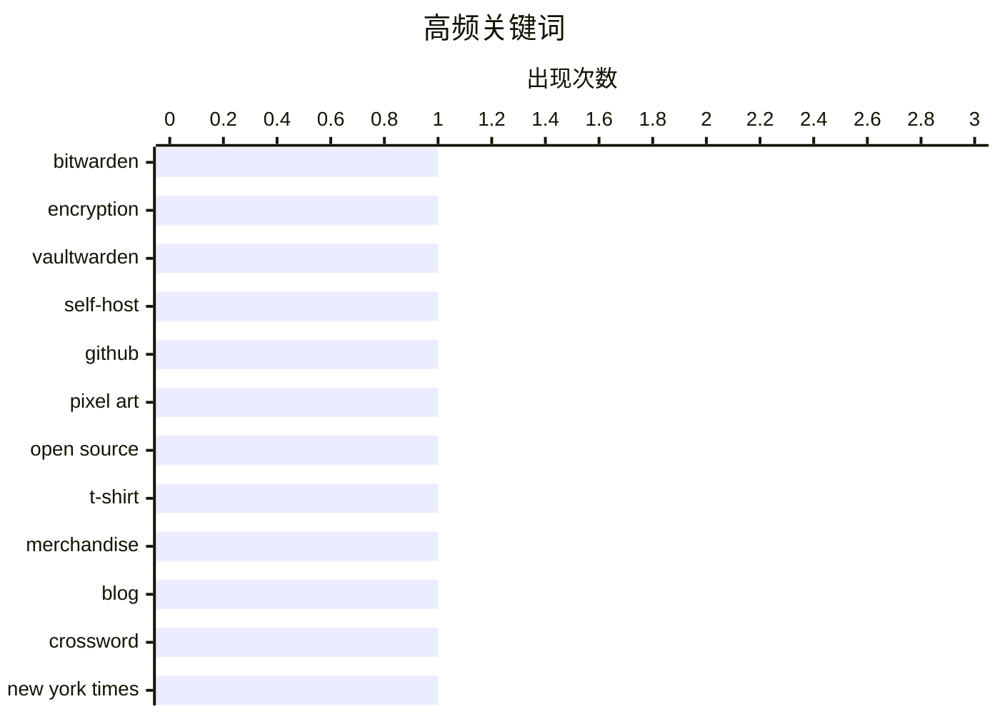

# 📰 AI 博客每日精选 — 2026-04-26

> 来自 98 个技术博客和社交媒体源，AI 精选 Top 5

## 📝 今日看点

今日技术圈呈现两大趋势：一是安全与隐私成为焦点，Bitwarden的零知识加密模型展示了如何通过端到端加密让服务端无法窥探用户数据；二是创意与代码的融合愈发有趣，Git City将GitHub数据转化为像素艺术城市，让个人资料变得可视化。此外，硬件思维与软件思维的碰撞引发思考，从《纽约时报》的印刷错误到三星移动可能出现的亏损，都在提醒我们：在追求速度与效率的同时，慢下来、专注细节或许才是更持久的竞争力。

---

## 🏆 今日必读

🥇 **Bitwarden 如何加密和解密秘密**

[How Bitwarden Encrypts and Decrypts Secrets](https://blog.miguelgrinberg.com/post/how-bitwarden-encrypts-and-decrypts-secrets) — miguelgrinberg.com · 7 小时前 · 🔬 其他AI技术

> 文章深入剖析了开源密码管理器 Bitwarden 的加密架构，重点解释了其零知识加密模型。核心机制是使用主密码派生的密钥对用户数据进行 AES-CBC 256 位加密，服务端仅存储加密后的密文，无法读取明文。文章详细描述了注册、登录、同步及解密流程，包括密钥派生函数（PBKDF2）和加密密钥的生成与保护方式。结论是 Bitwarden 通过客户端加密、服务端盲存的设计，确保了即使数据库泄露，攻击者也无法获取用户密码。

💡 **为什么值得读**: 如果你正在自托管密码管理器（如 Vaultwarden）或关心密码存储的安全性，这篇文章用清晰的逻辑讲透了 Bitwarden 的加密原理，是理解零知识架构的绝佳入门。

🏷️ Bitwarden, Encryption, Vaultwarden, Self-host

🥈 **Git City：将你的 GitHub 个人资料变成像素艺术城市**

[Have you visited Git City yet? This open source project turns your GitHub profile into a pixel art city. Your commits, repos, and stars build the skyl...](https://x.com/github/status/2048494014383505661) — 𝕏 @GitHub · 1 小时前 · 🔬 其他AI技术

> Git City 是一个开源项目，能将用户的 GitHub 个人资料（提交数、仓库数、星标数）实时转化为一幅像素艺术城市天际线。提交数决定建筑高度，仓库和星标数影响城市景观的丰富度。该项目完全开源，托管在 GitHub 上，支持用户通过链接直接生成并分享自己的“城市”。这是一个将开发数据可视化与趣味性结合的创意工具。

💡 **为什么值得读**: 将枯燥的 GitHub 统计数据变成一幅可分享的像素画，既有趣又直观，适合所有想在社交平台上展示自己开发成果的开发者。

🏷️ GitHub, Pixel Art, Open Source

🥉 **DF 周边：本轮 T 恤和卫衣最后机会**

[DF Paraphernalia: Last Call for This Round of T-Shirts and Hoodies](https://store.daringfireball.net/) — daringfireball.net · 2 小时前 · 🔬 其他AI技术

> Daring Fireball 创始人 John Gruber 宣布本轮 T 恤和卫衣周边销售即将截止。他回顾了自己从兼职写作到全职运营 Daring Fireball 20 周年的历程，并分享了当年宣布全职写作时的感言。文章主要目的是提醒读者这是本轮周边购买的最后机会，同时表达了对读者长期支持的感谢。

💡 **为什么值得读**: 如果你是 Daring Fireball 的长期读者，这不仅是一次周边购买提醒，更是一份来自 Gruber 的 20 周年纪念与情感回顾。

🏷️ T-shirt, Merchandise, Blog

4️⃣ **《纽约时报》上周日印错了填字游戏网格，我觉得这个时机很巧**

[★ The New York Times Printed the Wrong Crossword Grid Last Sunday, and I Find That Timing Serendipitous](https://daringfireball.net/2026/04/nyt_wrong_crossword_grid) — daringfireball.net · 2 小时前 · 🔬 其他AI技术

> 文章借《纽约时报》上周日印错填字游戏网格这一事件，引出了软件思维与硬件思维的对比：软件思维追求“更快、更多”，认为唯一无法修复的错误是“太慢”；硬件思维则强调“更慢、更少、专注”，认为错误是永恒的。作者认为这次印刷错误恰好发生在软件与硬件思维冲突的节点上，具有讽刺意味。

💡 **为什么值得读**: 用一次印刷错误引出软件与硬件两种截然不同的工程哲学，短小精悍却发人深省，适合所有对技术文化有思考的读者。

🏷️ Crossword, New York Times, Software

5️⃣ **报告称三星今年可能首次出现移动部门亏损，归咎于内存危机**

[Report Claims Samsung Might Post Its First-Ever Mobile Division Loss This Year, Blaming RAM Crisis](https://9to5google.com/2026/04/22/samsung-is-increasingly-worried-about-first-ever-mobile-division-loss-in-ram-crisis-report/) — daringfireball.net · 3 小时前 · 🔬 其他AI技术

> 据韩国媒体报道，三星移动（MX）部门可能将在 2026 年首次出现运营亏损。此前三星已采取内部削减成本措施，但内存危机导致的成本飙升和市场需求疲软使亏损几乎成为定局。三星移动负责人 TM Roh 已对亏损可能性表示担忧。这是三星移动部门历史上首次面临亏损风险，标志着其长期盈利纪录的终结。

💡 **为什么值得读**: 三星移动部门首次亏损预警是消费电子行业的重大信号，文章揭示了内存危机对终端厂商的深层影响，值得关注供应链和手机市场的读者阅读。

🏷️ Samsung, Mobile, Loss, RAM

---

## 📊 数据概览

| 扫描源 | 抓取文章 | 时间范围 | 精选 |
|:---:|:---:|:---:|:---:|
| 72/98 | 2262 篇 → 5 篇 | 24h | **5 篇** |

### 分类分布



### 高频关键词



<details>
<summary>📈 纯文本关键词图（终端友好）</summary>

```
bitwarden   │ ████████████████████ 1
encryption  │ ████████████████████ 1
vaultwarden │ ████████████████████ 1
self-host   │ ████████████████████ 1
github      │ ████████████████████ 1
pixel art   │ ████████████████████ 1
open source │ ████████████████████ 1
t-shirt     │ ████████████████████ 1
merchandise │ ████████████████████ 1
blog        │ ████████████████████ 1
```

</details>

### 🏷️ 话题标签

**bitwarden**(1) · **encryption**(1) · **vaultwarden**(1) · self-host(1) · github(1) · pixel art(1) · open source(1) · t-shirt(1) · merchandise(1) · blog(1) · crossword(1) · new york times(1) · software(1) · samsung(1) · mobile(1) · loss(1) · ram(1)

---

====================

## 🔬 其他AI技术

### 1. Bitwarden 如何加密和解密秘密

[How Bitwarden Encrypts and Decrypts Secrets](https://blog.miguelgrinberg.com/post/how-bitwarden-encrypts-and-decrypts-secrets) — **miguelgrinberg.com** · 7 小时前 · ⭐ 20/25

> 文章深入剖析了开源密码管理器 Bitwarden 的加密架构，重点解释了其零知识加密模型。核心机制是使用主密码派生的密钥对用户数据进行 AES-CBC 256 位加密，服务端仅存储加密后的密文，无法读取明文。文章详细描述了注册、登录、同步及解密流程，包括密钥派生函数（PBKDF2）和加密密钥的生成与保护方式。结论是 Bitwarden 通过客户端加密、服务端盲存的设计，确保了即使数据库泄露，攻击者也无法获取用户密码。

🏷️ Bitwarden, Encryption, Vaultwarden, Self-host

📌 其他AI技术

---

### 2. Git City：将你的 GitHub 个人资料变成像素艺术城市

[Have you visited Git City yet? This open source project turns your GitHub profile into a pixel art city. Your commits, repos, and stars build the skyl...](https://x.com/github/status/2048494014383505661) — **𝕏 @GitHub** · 1 小时前 · ⭐ 16/25

> Git City 是一个开源项目，能将用户的 GitHub 个人资料（提交数、仓库数、星标数）实时转化为一幅像素艺术城市天际线。提交数决定建筑高度，仓库和星标数影响城市景观的丰富度。该项目完全开源，托管在 GitHub 上，支持用户通过链接直接生成并分享自己的“城市”。这是一个将开发数据可视化与趣味性结合的创意工具。

🏷️ GitHub, Pixel Art, Open Source

📌 其他AI技术

---

### 3. DF 周边：本轮 T 恤和卫衣最后机会

[DF Paraphernalia: Last Call for This Round of T-Shirts and Hoodies](https://store.daringfireball.net/) — **daringfireball.net** · 2 小时前 · ⭐ 5/25

> Daring Fireball 创始人 John Gruber 宣布本轮 T 恤和卫衣周边销售即将截止。他回顾了自己从兼职写作到全职运营 Daring Fireball 20 周年的历程，并分享了当年宣布全职写作时的感言。文章主要目的是提醒读者这是本轮周边购买的最后机会，同时表达了对读者长期支持的感谢。

🏷️ T-shirt, Merchandise, Blog

📌 其他AI技术

---

### 4. 《纽约时报》上周日印错了填字游戏网格，我觉得这个时机很巧

[★ The New York Times Printed the Wrong Crossword Grid Last Sunday, and I Find That Timing Serendipitous](https://daringfireball.net/2026/04/nyt_wrong_crossword_grid) — **daringfireball.net** · 2 小时前 · ⭐ 5/25

> 文章借《纽约时报》上周日印错填字游戏网格这一事件，引出了软件思维与硬件思维的对比：软件思维追求“更快、更多”，认为唯一无法修复的错误是“太慢”；硬件思维则强调“更慢、更少、专注”，认为错误是永恒的。作者认为这次印刷错误恰好发生在软件与硬件思维冲突的节点上，具有讽刺意味。

🏷️ Crossword, New York Times, Software

📌 其他AI技术

---

### 5. 报告称三星今年可能首次出现移动部门亏损，归咎于内存危机

[Report Claims Samsung Might Post Its First-Ever Mobile Division Loss This Year, Blaming RAM Crisis](https://9to5google.com/2026/04/22/samsung-is-increasingly-worried-about-first-ever-mobile-division-loss-in-ram-crisis-report/) — **daringfireball.net** · 3 小时前 · ⭐ 5/25

> 据韩国媒体报道，三星移动（MX）部门可能将在 2026 年首次出现运营亏损。此前三星已采取内部削减成本措施，但内存危机导致的成本飙升和市场需求疲软使亏损几乎成为定局。三星移动负责人 TM Roh 已对亏损可能性表示担忧。这是三星移动部门历史上首次面临亏损风险，标志着其长期盈利纪录的终结。

🏷️ Samsung, Mobile, Loss, RAM

📌 其他AI技术

---

====================

*生成于 2026-04-26 21:36 | 扫描 72 源 → 获取 2262 篇 → 精选 5 篇*
*基于 [Hacker News Popularity Contest 2025](https://refactoringenglish.com/tools/hn-popularity/) RSS 源列表，由 [Andrej Karpathy](https://x.com/karpathy) 推荐*
*由「懂点儿AI」制作，欢迎关注同名微信公众号获取更多 AI 实用技巧 💡*
