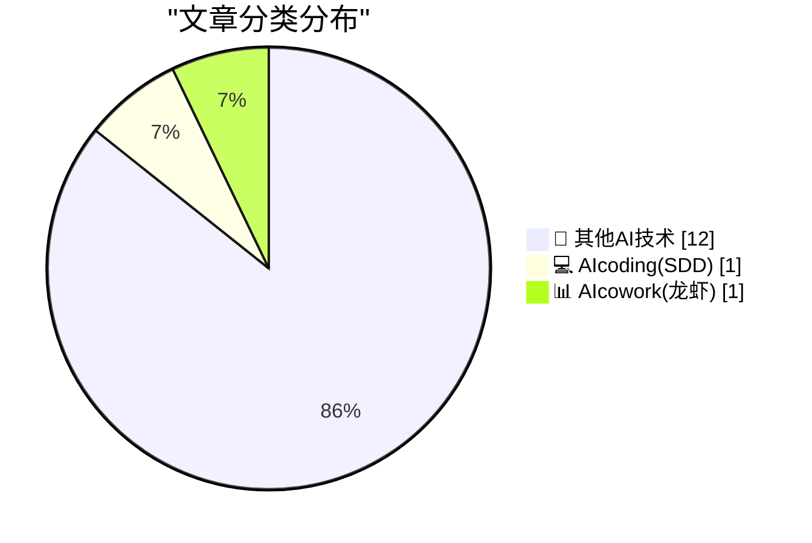
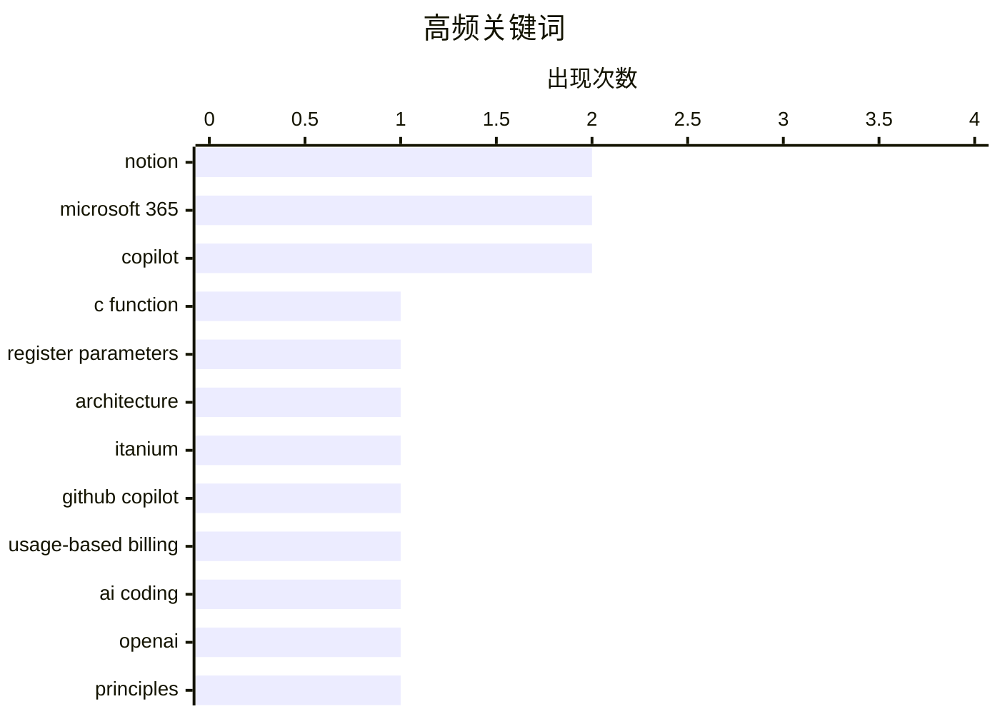

# 📰 AI 博客每日精选 — 2026-04-27

> 来自 98 个技术博客和社交媒体源，AI 精选 Top 14

## 📝 今日看点

今日技术圈聚焦两大趋势：AI开发工具的商业模式正在发生根本性转变，GitHub Copilot宣布转向基于使用量的计费，标志着AI辅助编程从订阅制走向更精细化的成本模型；同时，围绕AI发展的底层原则与历史反思成为热议话题，Sam Altman重申OpenAI的五大核心原则，而施乐错失GUI创新的故事则被重新提起，警示技术领先不等于商业成功。此外，平台“垃圾化”的讨论持续发酵，揭示了互联网服务从用户友好到利益优先的普遍演变规律。

---

## 🏆 今日必读

🥇 **在不同架构上向C函数传递过少寄存器参数的后果**

[Looking at consequences of passing too few register parameters to a C function on various architectures](https://devblogs.microsoft.com/oldnewthing/20260427-00/?p=112271) — devblogs.microsoft.com/oldnewthing · 7 小时前 · 🔬 其他AI技术

> 文章探讨了在x86、ARM、Itanium等不同CPU架构上，调用C函数时传递的寄存器参数少于函数预期所引发的后果。在x86上，多余的参数会被从栈上错误读取，导致数据错乱；ARM则会静默读取未初始化的寄存器值，结果不可预测。最严重的是Itanium架构，由于依赖寄存器堆栈和旋转机制，参数不足不仅会导致函数读取垃圾值，还可能引发寄存器栈下溢异常，直接崩溃。结论是：无论哪种架构，传递过少参数都是严重错误，但Itanium的惩罚最为严厉。

💡 **为什么值得读**: 深入浅出地对比了主流CPU架构在参数传递错误时的行为差异，对系统编程和底层调试有直接参考价值。

🏷️ C function, register parameters, architecture, Itanium

🥈 **GitHub Copilot将于6月1日转向基于使用量的计费模式**

[Starting June 1st, GitHub Copilot will move to a usage-based billing model as GitHub Copilot supports more agentic and advanced workflows. In early Ma...](https://x.com/github/status/2048794729274278258) — 𝕏 @GitHub · 5 小时前 · 💻 AIcoding(SDD)

> GitHub宣布从2026年6月1日起，Copilot将采用基于使用量的计费模型，以支持更智能和更高级的工作流。5月初，用户将看到预览账单体验，提前了解过渡后的预估成本。这一变化意味着Copilot从固定订阅制转向按实际使用量付费，旨在适应日益增长的Agentic和高级工作流需求。用户需关注自身使用量以控制成本。

💡 **为什么值得读**: 对Copilot用户至关重要，直接关系到未来付费策略和使用习惯的调整。

🏷️ GitHub Copilot, usage-based billing, AI Coding

🥉 **Sam Altman重申OpenAI的五大原则**

[RT Sam Altman: Our Principles: Democratization, Empowerment, Universal Prosperity, Resilience, and Adaptability https://openai.com/index/our-principle...](https://x.com/OpenAI/status/2048568971625181220) — 𝕏 @OpenAI · 21 小时前 · 🔬 其他AI技术

> OpenAI CEO Sam Altman转推并重申了公司的五大核心原则：民主化、赋能、普遍繁荣、韧性和适应性。这些原则旨在指导OpenAI在AI发展中的方向，强调技术应广泛可及、赋予个人力量、促进全球福祉，并具备应对变化和挑战的能力。该声明反映了OpenAI在追求AGI过程中的价值观框架。

💡 **为什么值得读**: 直接了解OpenAI官方价值观和战略方向的第一手资料。

🏷️ OpenAI, principles, Sam Altman

4️⃣ **施乐如何发明了图形用户界面（GUI）又失去了它**

[How Xerox invented the GUI and lost it](https://dfarq.homeip.net/how-xerox-invented-the-gui-and-lost-it/?utm_source=rss&#038;utm_medium=rss&#038;utm_campaign=how-xerox-invented-the-gui-and-lost-it) — dfarq.homeip.net · 10 小时前 · 🔬 其他AI技术

> 文章回顾了施乐公司在1960年代如何凭借PARC研究中心发明了图形用户界面（GUI）、鼠标、以太网等革命性技术，一度占据类似今天苹果的创新地位。然而，由于管理层未能认识到这些技术的商业潜力，施乐最终将GUI拱手让给了苹果和微软。核心教训是：拥有技术不等于拥有市场，商业远见和执行力同样关键。

💡 **为什么值得读**: 经典科技商业案例深度剖析，对理解创新与商业化的关系极具启发。

🏷️ Xerox, GUI, history

5️⃣ **John Gruber在The Vergecast上谈论苹果的过渡与Tim Cook的遗产**

[Yours Truly on The Vergecast](https://www.theverge.com/podcast/917965/apple-ceo-cook-ternus-transition) — daringfireball.net · 3 小时前 · 🔬 其他AI技术

> Daring Fireball的John Gruber做客The Vergecast，与主持人讨论苹果从乔布斯到库克的过渡、这一过渡的平稳性，以及Tim Cook作为产品负责人的真正遗产。核心争论点在于：我们该责怪库克推出了Touch Bar，还是该责怪他没有足够努力让Touch Bar变得更好？Gruber认为这看似玩笑，实则是评估库克产品决策的关键问题。

💡 **为什么值得读**: 苹果观察家John Gruber对Tim Cook产品遗产的犀利点评，视角独特。

🏷️ Apple, Vergecast, Tim Cook

---

## 📊 数据概览

| 扫描源 | 抓取文章 | 时间范围 | 精选 |
|:---:|:---:|:---:|:---:|
| 73/98 | 2275 篇 → 14 篇 | 24h | **14 篇** |

### 分类分布



### 高频关键词



<details>
<summary>📈 纯文本关键词图（终端友好）</summary>

```
notion              │ ████████████████████ 2
microsoft 365       │ ████████████████████ 2
copilot             │ ████████████████████ 2
c function          │ ██████████░░░░░░░░░░ 1
register parameters │ ██████████░░░░░░░░░░ 1
architecture        │ ██████████░░░░░░░░░░ 1
itanium             │ ██████████░░░░░░░░░░ 1
github copilot      │ ██████████░░░░░░░░░░ 1
usage-based billing │ ██████████░░░░░░░░░░ 1
ai coding           │ ██████████░░░░░░░░░░ 1
```

</details>

### 🏷️ 话题标签

**notion**(2) · **microsoft 365**(2) · **copilot**(2) · c function(1) · register parameters(1) · architecture(1) · itanium(1) · github copilot(1) · usage-based billing(1) · ai coding(1) · openai(1) · principles(1) · sam altman(1) · xerox(1) · gui(1) · history(1) · apple(1) · vergecast(1) · tim cook(1) · enshittification(1)

---

====================

## 🔬 其他AI技术

### 1. 在不同架构上向C函数传递过少寄存器参数的后果

[Looking at consequences of passing too few register parameters to a C function on various architectures](https://devblogs.microsoft.com/oldnewthing/20260427-00/?p=112271) — **devblogs.microsoft.com/oldnewthing** · 7 小时前 · ⭐ 16/25

> 文章探讨了在x86、ARM、Itanium等不同CPU架构上，调用C函数时传递的寄存器参数少于函数预期所引发的后果。在x86上，多余的参数会被从栈上错误读取，导致数据错乱；ARM则会静默读取未初始化的寄存器值，结果不可预测。最严重的是Itanium架构，由于依赖寄存器堆栈和旋转机制，参数不足不仅会导致函数读取垃圾值，还可能引发寄存器栈下溢异常，直接崩溃。结论是：无论哪种架构，传递过少参数都是严重错误，但Itanium的惩罚最为严厉。

🏷️ C function, register parameters, architecture, Itanium

📌 其他AI技术

---

### 2. Sam Altman重申OpenAI的五大原则

[RT Sam Altman: Our Principles: Democratization, Empowerment, Universal Prosperity, Resilience, and Adaptability https://openai.com/index/our-principle...](https://x.com/OpenAI/status/2048568971625181220) — **𝕏 @OpenAI** · 21 小时前 · ⭐ 9/25

> OpenAI CEO Sam Altman转推并重申了公司的五大核心原则：民主化、赋能、普遍繁荣、韧性和适应性。这些原则旨在指导OpenAI在AI发展中的方向，强调技术应广泛可及、赋予个人力量、促进全球福祉，并具备应对变化和挑战的能力。该声明反映了OpenAI在追求AGI过程中的价值观框架。

🏷️ OpenAI, principles, Sam Altman

📌 其他AI技术

---

### 3. 施乐如何发明了图形用户界面（GUI）又失去了它

[How Xerox invented the GUI and lost it](https://dfarq.homeip.net/how-xerox-invented-the-gui-and-lost-it/?utm_source=rss&#038;utm_medium=rss&#038;utm_campaign=how-xerox-invented-the-gui-and-lost-it) — **dfarq.homeip.net** · 10 小时前 · ⭐ 6/25

> 文章回顾了施乐公司在1960年代如何凭借PARC研究中心发明了图形用户界面（GUI）、鼠标、以太网等革命性技术，一度占据类似今天苹果的创新地位。然而，由于管理层未能认识到这些技术的商业潜力，施乐最终将GUI拱手让给了苹果和微软。核心教训是：拥有技术不等于拥有市场，商业远见和执行力同样关键。

🏷️ Xerox, GUI, history

📌 其他AI技术

---

### 4. John Gruber在The Vergecast上谈论苹果的过渡与Tim Cook的遗产

[Yours Truly on The Vergecast](https://www.theverge.com/podcast/917965/apple-ceo-cook-ternus-transition) — **daringfireball.net** · 3 小时前 · ⭐ 5/25

> Daring Fireball的John Gruber做客The Vergecast，与主持人讨论苹果从乔布斯到库克的过渡、这一过渡的平稳性，以及Tim Cook作为产品负责人的真正遗产。核心争论点在于：我们该责怪库克推出了Touch Bar，还是该责怪他没有足够努力让Touch Bar变得更好？Gruber认为这看似玩笑，实则是评估库克产品决策的关键问题。

🏷️ Apple, Vergecast, Tim Cook

📌 其他AI技术

---

### 5. 平台“垃圾化”的多重宇宙

[Pluralistic: The enshittification multiverse (27 Apr 2026)](https://pluralistic.net/2026/04/27/analogs-and-analogies/) — **pluralistic.net** · 13 小时前 · ⭐ 5/25

> 文章提出“平台垃圾化”（enshittification）是一个有用的类比，用于描述互联网平台如何从对用户有益，逐渐转向对商业客户有益，最终只对平台自身有益。作者通过多个领域的例子（如版权、医疗植入物、DMCA等）论证，这种退化模式在不同生态系统中普遍存在。核心观点是：理解这一模式有助于识别和对抗平台权力的滥用。

🏷️ enshittification, multiverse, analogy

📌 其他AI技术

---

### 6. 剧院评论：冥界（Hadestown）★★★★★

[Theatre Review: Hadestown ★★★★★](https://shkspr.mobi/blog/2026/04/theatre-review-hadestown/) — **shkspr.mobi** · 10 小时前 · ⭐ 5/25

> Anaïs Mitchell创作的《冥界》是一场充满魔力的戏剧体验，作者几乎每首歌都想起立鼓掌。坐在前排时，开场部分像晚餐剧场一样亲密；第一幕非常繁忙，充满了细节和情感。演员们精准地掌控着观众的情绪，整场演出是纯粹的戏剧享受。结论：这是一部五星级的、不容错过的作品。

🏷️ theatre, review, Hadestown

📌 其他AI技术

---

### 7. 软件包安装的各个阶段

[The stages of package installation](https://nesbitt.io/2026/04/27/the-stages-of-package-installation.html) — **nesbitt.io** · 11 小时前 · ⭐ 5/25

> 文章用心理学上的“悲伤五阶段”（否认、愤怒、讨价还价、抑郁、接受）来类比软件包安装过程中用户的心理变化，并幽默地增加了第六阶段“postinstall”（安装后脚本）。核心观点是：软件包安装过程充满挫折，用户情绪会经历从否认问题到最终接受现实的完整循环。

🏷️ package installation, humor

📌 其他AI技术

---

### 8. 这个周末我在思考的问题：开放性问题、智能与权力、科学验证难题、达尔文主义的平行发现

[What I've been thinking about this weekend - More open questions, intelligence vs power, the problem of verification in science, the parallel discovery of Darwinism](https://www.dwarkesh.com/p/what-ive-been-thinking-april-27) — **dwarkesh.com** · 8 小时前 · ⭐ 5/25

> 作者分享了这个周末思考的一系列开放性问题，包括：智能与权力之间的关系、科学中验证问题的本质、以及达尔文主义被平行发现的现象。文章是一个思想杂烩，没有给出明确结论，而是提出了多个值得深入探讨的跨学科问题。

🏷️ open questions, intelligence, power, Darwinism

📌 其他AI技术

---

### 9. Rollups now support number formatting (USD, EUR, percent, etc.) and decimal places. No more formatting via formulas. Your budget rollups finally look ...

[Rollups now support number formatting (USD, EUR, percent, etc.) and decimal places. No more formatting via formulas. Your budget rollups finally look ...](https://x.com/NotionHQ/status/2048793204812890429) — **𝕏 @NotionHQ** · 5 小时前 · ⭐ 5/25

> Rollups now support number formatting (USD, EUR, percent, etc.) and decimal places. <br><br>No more formatting via formulas. Your budget rollups finally look like money.<br> RT Satya Nadella<br>Super to see Accenture roll out 740,000+ M365 Copilot seats—our largest deployment to date!<br>https://news.microsoft.com/source/features/digital-transformation/accenture-is-rollin

🏷️ Microsoft 365, Copilot, Deployment

📌 其他AI技术

---

### 11. More focused analysis. More complete outputs. More complex work—done. GPT-5.5 Thinking is now available in Copilot Studio and rolling out across Micr...

[More focused analysis. More complete outputs. More complex work—done. GPT-5.5 Thinking is now available in Copilot Studio and rolling out across Micr...](https://x.com/Microsoft365/status/2048794302285758502) — **𝕏 @Microsoft365** · 5 小时前 · ⭐ 5/25

> More focused analysis. More complete outputs. More complex work—done.<br><br>GPT-5.5 Thinking is now available in Copilot Studio and rolling out across Microsoft 365 Copilot in Copilot Chat, Word, Exc

🏷️ GPT-5.5, Copilot, Microsoft 365

📌 其他AI技术

---

### 12. Speech translation in Google Meet is officially rolling out to our Android and iOS apps. 📱💬 Experience near-real-time audio translation, in the ...

[Speech translation in Google Meet is officially rolling out to our Android and iOS apps. 📱💬 Experience near-real-time audio translation, in the ...](https://x.com/GoogleWorkspace/status/2048840360911151128) — **𝕏 @GoogleWorkspace** · 2 小时前 · ⭐ 5/25

> Speech translation in Google Meet is officially rolling out to our Android and iOS apps. 📱💬 Experience near-real-time audio translation, in the speaker's voice and tone, between English and Spanish,

🏷️ Google Meet, Speech Translation, Mobile

📌 其他AI技术

---

## 💻 AIcoding(SDD)

### 13. GitHub Copilot将于6月1日转向基于使用量的计费模式

[Starting June 1st, GitHub Copilot will move to a usage-based billing model as GitHub Copilot supports more agentic and advanced workflows. In early Ma...](https://x.com/github/status/2048794729274278258) — **𝕏 @GitHub** · 5 小时前 · ⭐ 16/25

> GitHub宣布从2026年6月1日起，Copilot将采用基于使用量的计费模型，以支持更智能和更高级的工作流。5月初，用户将看到预览账单体验，提前了解过渡后的预估成本。这一变化意味着Copilot从固定订阅制转向按实际使用量付费，旨在适应日益增长的Agentic和高级工作流需求。用户需关注自身使用量以控制成本。

🏷️ GitHub Copilot, usage-based billing, AI Coding

📌 AIcoding(SDD)

---

## 📊 AIcowork(龙虾)

### 14. 在Notion上构建的团队：OpenAI、Cursor、Figma等

[Teams building on Notion: OpenAI Cursor Figma Ramp Toyota Deel Clay Faire Vercel Adobe Descript Braintrust Linktree Partiful Buffer Headspace Typeform...](https://x.com/NotionHQ/status/2048819896243585483) — **𝕏 @NotionHQ** · 4 小时前 · ⭐ 5/25

> Notion官方列举了在其平台上进行团队协作和构建的知名企业，包括OpenAI、Cursor、Figma、Ramp、丰田、Deel、Clay、Faire、Vercel、Adobe、Descript、Braintrust、Linktree、Partiful、Buffer、Headspace、Typeform和Blinkist等。这展示了Notion作为协作平台在企业级市场的广泛采用。

🏷️ Notion, teams, collaboration

📌 AIcowork(龙虾)

---

====================

*生成于 2026-04-27 21:53 | 扫描 73 源 → 获取 2275 篇 → 精选 14 篇*
*基于 [Hacker News Popularity Contest 2025](https://refactoringenglish.com/tools/hn-popularity/) RSS 源列表，由 [Andrej Karpathy](https://x.com/karpathy) 推荐*
*由「懂点儿AI」制作，欢迎关注同名微信公众号获取更多 AI 实用技巧 💡*
