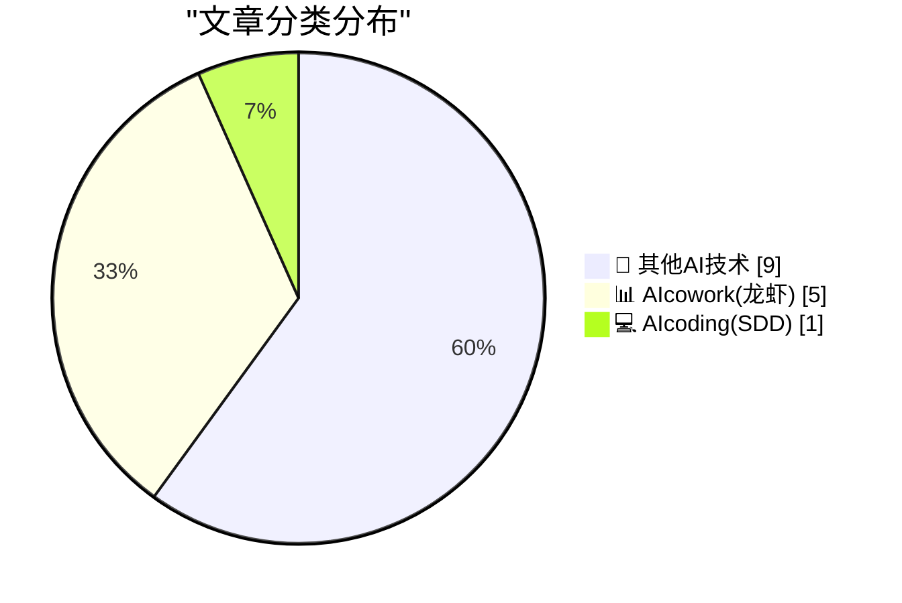
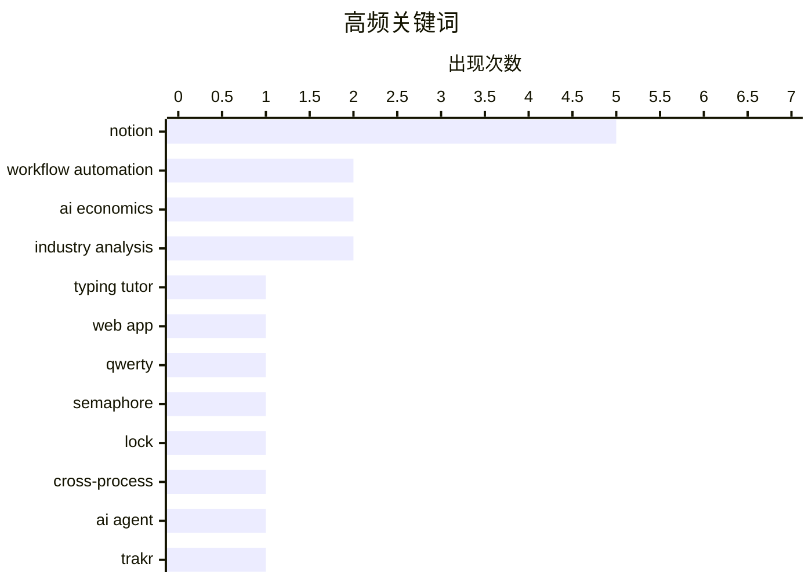

# 📰 AI 博客每日精选 — 2026-04-28

> 来自 98 个技术博客和社交媒体源，AI 精选 Top 15

## 📝 今日看点

今日技术圈聚焦两大趋势：AI协作工具正加速渗透日常办公流程，Notion密集推出Trakr代理、会议笔记一键分享及移动端交互升级，将AI能力嵌入任务追踪与沟通闭环；与此同时，开发者基础设施的可靠性引发反思，GitHub Actions被指为CI/CD薄弱环节，而跨进程读写锁、10Gb以太网部署等底层技术探讨，则凸显了在追求效率时对系统稳健性的重新审视。

---

## 🏆 今日必读

🥇 **QuickQWERTY 1.2.2 发布**

[QuickQWERTY 1.2.2](https://susam.net/code/news/quickqwerty/1.2.2.html) — susam.net · 21 小时前 · 🔬 其他AI技术

> QuickQWERTY 是一款基于浏览器的 QWERTY 键盘在线打字练习工具。1.2.2 版本修复了一个长期存在的练习面板 Bug：点击“重新开始”链接时，会错误地跳转到“单元 1.1”而非重新开始当前课程。现在该链接已能正确重置当前课程。

💡 **为什么值得读**: 如果你是 QuickQWERTY 的用户，这个版本修复了一个影响练习流程的关键 Bug，值得立即更新。

🏷️ Typing Tutor, Web App, QWERTY

🥈 **开发跨进程读写锁（限制读者数量）：第一部分——信号量**

[Developing a cross-process reader/writer lock with limited readers, part 1: A semaphore](https://devblogs.microsoft.com/oldnewthing/20260428-00/?p=112278) — devblogs.microsoft.com/oldnewthing · 7 小时前 · 🔬 其他AI技术

> 本文是系列文章的第一部分，探讨如何实现一个限制读者数量的跨进程读写锁。核心方案是使用信号量（Semaphore）作为同步原语。文章详细分析了信号量在解决读者-写者问题中的角色和实现细节。

💡 **为什么值得读**: 对于需要实现高性能、跨进程同步机制的底层系统开发者，这是一份扎实的实战指南。

🏷️ Semaphore, Lock, Cross-process

🥉 **Notion 推出 Trakr 代理：实时同步产品状态与发布信息**

[RT Clay: "Is this feature live for everyone?" "Can I add new customers to this beta?" "Are we able to tell prospects about this feature?" These questi...](https://x.com/NotionHQ/status/2049194381798961237) — 𝕏 @NotionHQ · 3 小时前 · 📊 AIcowork(龙虾)

> Clay 团队为解决“功能是否已上线”、“能否告知客户”等日常沟通痛点，在 Notion 上构建了名为 Trakr 的 AI 代理。Trakr 每天扫描 Slack 和 Notion 数据库，当信息过时时会主动提醒负责人（DRI），负责人回复后 Trakr 会自动更新 Notion 数据库，实现产品状态和发布计划的实时可见性。

💡 **为什么值得读**: 这是一个将 AI 代理用于内部信息同步的实战案例，展示了如何用 Notion 和 Slack 自动化解决跨团队沟通的典型痛点。

🏷️ Notion, AI Agent, Workflow Automation, Trakr

4️⃣ **别用 localhost:3000，用你自己的自定义域名**

[Don't use localhost:3000, use your own custom domain](https://idiallo.com/blog/say-no-to-localhost3000-use-custom-domains?src=feed) — idiallo.com · 22 小时前 · 🔬 其他AI技术

> 作者在演示内部工具时，因使用自定义域名（如 www.internaltool.com）而非 localhost:3002 引发了同事的困惑。文章指出，使用自定义域名进行本地开发可以避免端口号带来的混淆，让演示更专业，并解决跨设备访问时的白名单问题。

💡 **为什么值得读**: 一个简单但实用的开发技巧，能显著提升本地演示的专业性和可访问性，适合所有前端开发者。

🏷️ Custom Domain, Localhost, Web Development

5️⃣ **Notion 推出 Notes Sharing to Slack 2.0：两键分享 AI 会议笔记**

[RT Zach Tratar: Teams communicate across many tools, but Slack and Notion make a wonderful pair. We’re now rolling out Notes Sharing to Slack 2.0! Sh...](https://x.com/NotionHQ/status/2049202041063649489) — 𝕏 @NotionHQ · 3 小时前 · 📊 AIcowork(龙虾)

> Notion 正在逐步推出 Notes Sharing to Slack 2.0 功能。用户只需两次点击（约 3 秒）即可将 AI 生成的会议笔记分享到 Slack。Notion 会自动生成适合 Slack 的摘要，并记住用户常用的分享频道。

💡 **为什么值得读**: 对于频繁在 Notion 和 Slack 之间切换的团队，这个功能将会议笔记分享流程从几分钟缩短到几秒，大幅提升协作效率。

🏷️ Notion, Slack, Meeting Notes, Integration

---

## 📊 数据概览

| 扫描源 | 抓取文章 | 时间范围 | 精选 |
|:---:|:---:|:---:|:---:|
| 77/98 | 2755 篇 → 23 篇 | 24h | **15 篇** |

### 分类分布



### 高频关键词



<details>
<summary>📈 纯文本关键词图（终端友好）</summary>

```
notion              │ ████████████████████ 5
workflow automation │ ████████░░░░░░░░░░░░ 2
ai economics        │ ████████░░░░░░░░░░░░ 2
industry analysis   │ ████████░░░░░░░░░░░░ 2
typing tutor        │ ████░░░░░░░░░░░░░░░░ 1
web app             │ ████░░░░░░░░░░░░░░░░ 1
qwerty              │ ████░░░░░░░░░░░░░░░░ 1
semaphore           │ ████░░░░░░░░░░░░░░░░ 1
lock                │ ████░░░░░░░░░░░░░░░░ 1
cross-process       │ ████░░░░░░░░░░░░░░░░ 1
```

</details>

### 🏷️ 话题标签

**notion**(5) · **workflow automation**(2) · **ai economics**(2) · industry analysis(2) · typing tutor(1) · web app(1) · qwerty(1) · semaphore(1) · lock(1) · cross-process(1) · ai agent(1) · trakr(1) · custom domain(1) · localhost(1) · web development(1) · slack(1) · meeting notes(1) · integration(1) · agent(1) · prompt engineering(1)

---

====================

## 🔬 其他AI技术

### 1. QuickQWERTY 1.2.2 发布

[QuickQWERTY 1.2.2](https://susam.net/code/news/quickqwerty/1.2.2.html) — **susam.net** · 21 小时前 · ⭐ 17/25

> QuickQWERTY 是一款基于浏览器的 QWERTY 键盘在线打字练习工具。1.2.2 版本修复了一个长期存在的练习面板 Bug：点击“重新开始”链接时，会错误地跳转到“单元 1.1”而非重新开始当前课程。现在该链接已能正确重置当前课程。

🏷️ Typing Tutor, Web App, QWERTY

📌 其他AI技术

---

### 2. 开发跨进程读写锁（限制读者数量）：第一部分——信号量

[Developing a cross-process reader/writer lock with limited readers, part 1: A semaphore](https://devblogs.microsoft.com/oldnewthing/20260428-00/?p=112278) — **devblogs.microsoft.com/oldnewthing** · 7 小时前 · ⭐ 16/25

> 本文是系列文章的第一部分，探讨如何实现一个限制读者数量的跨进程读写锁。核心方案是使用信号量（Semaphore）作为同步原语。文章详细分析了信号量在解决读者-写者问题中的角色和实现细节。

🏷️ Semaphore, Lock, Cross-process

📌 其他AI技术

---

### 3. 别用 localhost:3000，用你自己的自定义域名

[Don't use localhost:3000, use your own custom domain](https://idiallo.com/blog/say-no-to-localhost3000-use-custom-domains?src=feed) — **idiallo.com** · 22 小时前 · ⭐ 15/25

> 作者在演示内部工具时，因使用自定义域名（如 www.internaltool.com）而非 localhost:3002 引发了同事的困惑。文章指出，使用自定义域名进行本地开发可以避免端口号带来的混淆，让演示更专业，并解决跨设备访问时的白名单问题。

🏷️ Custom Domain, Localhost, Web Development

📌 其他AI技术

---

### 4. 10Gb 以太网：我不得不重新学习的东西

[10Gb Ethernet: what I had to (re)learn](https://www.gilesthomas.com/2026/04/10g-ethernet-what-i-relearned) — **gilesthomas.com** · 3 小时前 · ⭐ 14/25

> 作者因 ISP 推出 10Gb 宽带而升级家庭有线网络，发现过去 20 多年家庭和小型办公室的有线网络技术进展不大。文章分享了在部署 10Gb 以太网过程中重新学到的关键知识，包括线缆选择、硬件兼容性和配置要点。

🏷️ 10Gb Ethernet, Networking, Hardware

📌 其他AI技术

---

### 5. GitHub Actions 是最薄弱的环节

[GitHub Actions is the weakest link](https://nesbitt.io/2026/04/28/github-actions-is-the-weakest-link.html) — **nesbitt.io** · 11 小时前 · ⭐ 14/25

> 文章指出 GitHub Actions 在 CI/CD 流程中可能成为安全或稳定性的最薄弱环节。作者分析了其潜在风险，包括工作流配置错误、权限管理不当以及第三方 Action 的供应链安全问题。

🏷️ GitHub Actions, CI/CD, Security

📌 其他AI技术

---

### 6. AI的经济学说不通

[AI's Economics Don't Make Sense](https://www.wheresyoured.at/ais-economics-dont-make-sense/) — **wheresyoured.at** · 5 小时前 · ⭐ 7/25

> 文章质疑当前AI行业的经济模型不可持续。核心论点是，AI基础设施（如GPU集群）的巨额投入与AI产品（如Copilot）的实际收入之间存在巨大鸿沟。作者指出，GitHub Copilot等产品的定价远低于其运行成本，依赖风险投资补贴。结论是，如果AI不能快速找到高利润的商业模式，当前的投资泡沫将破裂。

🏷️ AI Economics, Industry Analysis

📌 其他AI技术

---

### 7. AI的经济学说不通 [无广告版]

[AI's Economics Don't Make Sense [Ad Free]](https://www.wheresyoured.at/ais-economics-dont-make-sense-ad-free/) — **wheresyoured.at** · 5 小时前 · ⭐ 7/25

> 本文是同一作者对AI经济问题的深入分析，面向付费订阅用户。文章以GitHub Copilot用户近期收到的涨价通知为引子，进一步论证AI服务定价与成本严重脱节。作者披露了内部数据，显示Copilot每用户的实际推理成本远高于订阅费。结论是，AI公司要么大幅涨价，要么找到新的收入来源，否则无法维持运营。

🏷️ AI Economics, GitHub Copilot, Industry Analysis

📌 其他AI技术

---

### 8. （一个）好的AI已经到来

[(One) Good AI Is Here](https://anildash.com/2026/04/28/one-good-ai-is-here/) — **anildash.com** · 21 小时前 · ⭐ 7/25

> 文章指出AI领域的文化争论已陷入僵局：批评者指责大平台未经许可使用数据、忽视环境影响、缺乏问责；而AI狂热者则无视这些批评。作者提出，真正“好的AI”应当具备三个特征：透明（开源代码和权重）、可问责（第三方可审计）、可持续（考虑环境成本）。结论是，虽然目前大多数AI不符合这些标准，但已有少数开源项目开始朝这个方向努力，这才是值得关注的“好AI”。

🏷️ AI Ethics, AI Criticism, Cultural Impact

📌 其他AI技术

---

### 9. 一家百年企业。一个协作新时代。

[A 100-year-old company. A new era of collaboration. @TheRaymond_RLL is breaking down silos, speeding up creativity, and working smarter using Google W...](https://x.com/GoogleWorkspace/status/2049172551247532260) — **𝕏 @GoogleWorkspace** · 4 小时前 · ⭐ 7/25

> 这是一条来自Google Workspace的推广推文，介绍一家拥有百年历史的公司Raymond Corporation如何通过Google Workspace与Gemini AI实现数字化转型。核心案例是该公司利用Gemini打破部门壁垒、加速创意流程。推文强调，在Searce公司的支持下，Raymond正在重新定义未来的工作方式。

🏷️ Google Workspace, Gemini, Enterprise AI

📌 其他AI技术

---

## 📊 AIcowork(龙虾)

### 10. Notion 推出 Trakr 代理：实时同步产品状态与发布信息

[RT Clay: "Is this feature live for everyone?" "Can I add new customers to this beta?" "Are we able to tell prospects about this feature?" These questi...](https://x.com/NotionHQ/status/2049194381798961237) — **𝕏 @NotionHQ** · 3 小时前 · ⭐ 16/25

> Clay 团队为解决“功能是否已上线”、“能否告知客户”等日常沟通痛点，在 Notion 上构建了名为 Trakr 的 AI 代理。Trakr 每天扫描 Slack 和 Notion 数据库，当信息过时时会主动提醒负责人（DRI），负责人回复后 Trakr 会自动更新 Notion 数据库，实现产品状态和发布计划的实时可见性。

🏷️ Notion, AI Agent, Workflow Automation, Trakr

📌 AIcowork(龙虾)

---

### 11. Notion 推出 Notes Sharing to Slack 2.0：两键分享 AI 会议笔记

[RT Zach Tratar: Teams communicate across many tools, but Slack and Notion make a wonderful pair. We’re now rolling out Notes Sharing to Slack 2.0! Sh...](https://x.com/NotionHQ/status/2049202041063649489) — **𝕏 @NotionHQ** · 3 小时前 · ⭐ 15/25

> Notion 正在逐步推出 Notes Sharing to Slack 2.0 功能。用户只需两次点击（约 3 秒）即可将 AI 生成的会议笔记分享到 Slack。Notion 会自动生成适合 Slack 的摘要，并记住用户常用的分享频道。

🏷️ Notion, Slack, Meeting Notes, Integration

📌 AIcowork(龙虾)

---

### 12. Notion 代理课程：指令与技能——将重复提示转化为可复用技能

[🍎 Today's lecture: Agent instructions and skills! Lean how to turn your repeated prompts into reusable skills, get consistent outputs, and make you...](https://x.com/NotionHQ/status/2049180257781981385) — **𝕏 @NotionHQ** · 4 小时前 · ⭐ 15/25

> 本课程讲解如何将重复的提示词转化为可复用的“技能”，以获得一致的输出，并让 Notion 代理更贴合个人需求。内容涵盖如何编写清晰的指令、构建自定义代理以及连接正确的工具和触发器。

🏷️ Agent, Notion, Prompt Engineering

📌 AIcowork(龙虾)

---

### 13. Notion 代理课程：构建你的第一个自定义代理

[Attention! Class is in session 🍎 Learn how to build your first Custom Agent, write clear instructions, and connect the right tools and triggers so ...](https://x.com/NotionHQ/status/2048887801241076078) — **𝕏 @NotionHQ** · 23 小时前 · ⭐ 15/25

> 本课程教用户如何构建第一个自定义 Notion 代理，包括编写清晰的指令、连接正确的工具和触发器，让代理自动处理重复性工作。下一节课将深入讲解代理指令和技能。

🏷️ Custom Agent, Notion, Workflow Automation

📌 AIcowork(龙虾)

---

### 14. Notion 移动端首页焕新：主页、AI 聊天、会议笔记和收件箱一键滑动切换

[Your mobile homepage just got a refresh! Now, your home, AI chats, meeting notes, and inbox… are just one swipe away. Take it for a spin and tell us ...](https://x.com/NotionHQ/status/2049225431816241393) — **𝕏 @NotionHQ** · 1 小时前 · ⭐ 14/25

> Notion 移动端首页进行了界面刷新，现在用户可以通过滑动操作在主页、AI 聊天、会议笔记和收件箱之间快速切换。

🏷️ Notion, Mobile App, Product Update

📌 AIcowork(龙虾)

---

## 💻 AIcoding(SDD)

### 15. 非法状态 vs 不期望状态

[Illegal vs Unwanted States](https://buttondown.com/hillelwayne/archive/illegal-vs-unwanted-states/) — **buttondown.com/hillelwayne** · 6 小时前 · ⭐ 13/25

> 文章区分了系统设计中的两种状态：非法状态（系统永远不应进入）和不期望状态（系统不应停留）。以日历软件为例，允许同一用户同时参加两个重叠会议的数据结构，常被误认为是非法状态，但实际上它只是不期望状态。作者指出，许多开发者试图通过类型系统将不期望状态“非法化”，但这往往导致过度复杂的设计。核心观点是，正确识别状态类型比强行消除所有不期望状态更重要，因为处理不期望状态（如通过业务逻辑）比处理非法状态（如通过类型约束）更灵活。

🏷️ State Management, Software Design, Illegal States

📌 AIcoding(SDD)

---

====================

*生成于 2026-04-28 21:55 | 扫描 77 源 → 获取 2755 篇 → 精选 15 篇*
*基于 [Hacker News Popularity Contest 2025](https://refactoringenglish.com/tools/hn-popularity/) RSS 源列表，由 [Andrej Karpathy](https://x.com/karpathy) 推荐*
*由「懂点儿AI」制作，欢迎关注同名微信公众号获取更多 AI 实用技巧 💡*
