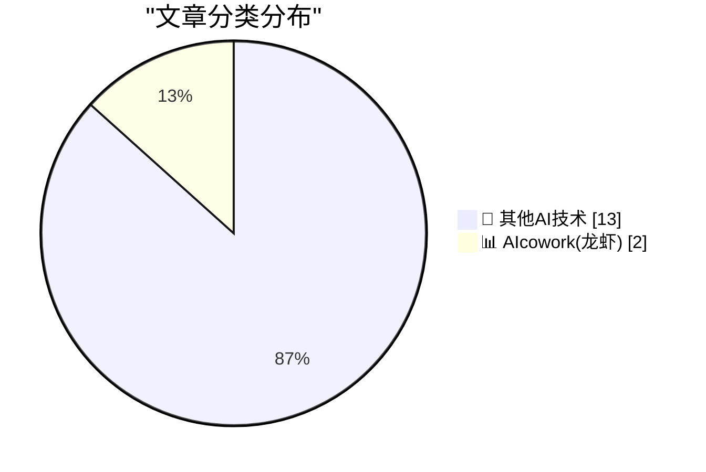
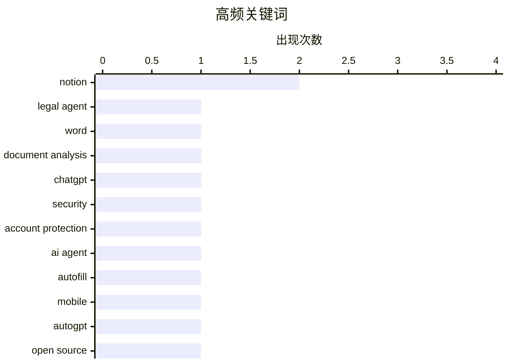

# 📰 AI 博客每日精选 — 2026-04-30

> 来自 98 个技术博客和社交媒体源，AI 精选 Top 15

## 📝 今日看点

今日技术圈聚焦三大趋势：AI正深度嵌入办公与创作场景，微软Word推出法律文档智能分析功能，Notion则密集发布AI自动填充与Agent 2.0等更新，推动生产力工具向“自主代理”进化；与此同时，AI安全与开发者生态成为新热点，OpenAI上线高级账户防钓鱼功能，GitHub与Notion分别加码开源贡献管理和开发者专属账号建设；此外，AI语音助手正重塑工作方式，用户通勤途中即可完成全天任务，标志着人机协作进入“随时随地对谈”的新阶段。

---

## 🏆 今日必读

🥇 **Word 中的法律代理功能现已上线**

[Legal Agent in Word is here, helping to analyze complex legal documents and make tracked edits with precision. Now available via the Frontier program ...](https://x.com/Microsoft365/status/2049838711450247310) — 𝕏 @Microsoft365 · 8 小时前 · 📊 AIcowork(龙虾)

> Microsoft 365 推出了 Word 中的“法律代理”功能，旨在帮助用户分析复杂的法律文档并进行精确的修订追踪。该功能目前通过 Frontier 计划在美国地区率先开放。它能够自动识别法律文本中的关键条款并提出修改建议，以追踪修订的形式呈现。这标志着 AI 在专业文档处理领域，特别是法律场景下的深度应用。

💡 **为什么值得读**: 如果你是法律从业者或经常处理合同的专业人士，这篇文章展示了 AI 如何直接嵌入办公软件，自动化高精度文档审阅流程。

🏷️ Legal Agent, Word, document analysis

🥈 **ChatGPT 推出高级账户安全功能**

[Now available for ChatGPT accounts: Advanced Account Security, a new opt-in setting for people at higher risk of digital attacks, with stronger protec...](https://x.com/OpenAI/status/2049902506881462613) — 𝕏 @OpenAI · 4 小时前 · 🔬 其他AI技术

> OpenAI 为 ChatGPT 账户推出了名为“高级账户安全”的新功能，这是一个针对高风险数字攻击人群的可选设置。该功能提供了更强的保护措施，包括防钓鱼登录和更安全的账户恢复流程。用户现在可以在 ChatGPT 设置中主动开启此选项，以增强账户安全性。

💡 **为什么值得读**: 对于担心账户被攻击或钓鱼的用户，这篇文章介绍了 ChatGPT 最新的安全升级，值得立即了解并开启。

🏷️ ChatGPT, security, account protection

🥉 **Notion 本月发布多项更新：AI 自动填充、Agent 2.0 及多模型支持**

[Another busy month in the books. Here’s what we shipped. - AI Autofill - Native Custom Agents on mobile - Agent 2.0 - Mobile standalone AI (TestFligh...](https://x.com/NotionHQ/status/2049924580484235461) — 𝕏 @NotionHQ · 3 小时前 · 📊 AIcowork(龙虾)

> Notion 在忙碌的一个月内发布了大量更新，核心亮点包括 AI 自动填充、移动端原生自定义 Agent 以及 Agent 2.0 版本。此外，还推出了移动端独立 AI 应用（TestFlight）、日历和邮件工具集成到个人 Agent 中，以及侧边栏 Notion Agent。在模型支持方面，新增了 Kimi K2.6、Opus 4.7 和 GPT-5.5 等选项。这些更新显著增强了 Notion 的 AI 助手能力和跨平台体验。

💡 **为什么值得读**: 如果你是 Notion 重度用户或关注 AI 生产力工具，这篇文章汇总了 Notion 最新、最全的功能更新，能帮你快速了解平台进化方向。

🏷️ Notion, AI Agent, autofill, mobile

4️⃣ **GitHub 开源星期五：与 AutoGPT 维护者探讨 AI 贡献管理**

[Tomorrow on Open Source Friday ⬇️ We kick off Maintainer Month with Nicholas Tindle, maintainer of @Auto_GPT. Here's how his team is keeping up amid...](https://x.com/github/status/2049965794910478650) — 𝕏 @GitHub · 20 分钟前 · 🔬 其他AI技术

> GitHub 宣布在“开源星期五”活动中启动“维护者月”，首期嘉宾是 AutoGPT 的维护者 Nicholas Tindle。他将分享其团队如何在开源领域应对大量 AI 相关贡献的涌入。活动旨在探讨开源项目维护者在 AI 时代面临的新挑战与管理策略。

💡 **为什么值得读**: 如果你是开源项目维护者或对 AI 如何影响开源生态感兴趣，这篇文章提供了来自一线维护者的实战经验分享。

🏷️ AutoGPT, open source, maintainer

5️⃣ **Anthropic 产品负责人：最快团队赢在人类、Agent、数据和应用的整合**

["Anthropic largely runs on Slack...I love the hackability." @_catwu, Head of Product for Claude Code at @AnthropicAI, on @lennysan's pod. The fastest ...](https://x.com/SlackHQ/status/2049923689521484031) — 𝕏 @SlackHQ · 3 小时前 · 🔬 其他AI技术

> Anthropic 的 Claude Code 产品负责人 Cat Wu 在播客中表示，Anthropic 很大程度上依赖 Slack 运行，并称赞其可“破解性”。她指出，最快的团队并非靠更多 AI 取胜，而是赢在人类、Agent、数据和应用的协同整合上。这揭示了高效团队在 AI 时代的核心竞争策略。

💡 **为什么值得读**: 这篇文章提供了来自 AI 前沿公司高管的独特视角，揭示了“AI 不是万能药，整合才是关键”的深刻洞见。

🏷️ Slack, Anthropic, Claude Code

---

## 📊 数据概览

| 扫描源 | 抓取文章 | 时间范围 | 精选 |
|:---:|:---:|:---:|:---:|
| 76/98 | 2747 篇 → 21 篇 | 24h | **15 篇** |

### 分类分布



### 高频关键词



<details>
<summary>📈 纯文本关键词图（终端友好）</summary>

```
notion             │ ████████████████████ 2
legal agent        │ ██████████░░░░░░░░░░ 1
word               │ ██████████░░░░░░░░░░ 1
document analysis  │ ██████████░░░░░░░░░░ 1
chatgpt            │ ██████████░░░░░░░░░░ 1
security           │ ██████████░░░░░░░░░░ 1
account protection │ ██████████░░░░░░░░░░ 1
ai agent           │ ██████████░░░░░░░░░░ 1
autofill           │ ██████████░░░░░░░░░░ 1
mobile             │ ██████████░░░░░░░░░░ 1
```

</details>

### 🏷️ 话题标签

**notion**(2) · **legal agent**(1) · **word**(1) · document analysis(1) · chatgpt(1) · security(1) · account protection(1) · ai agent(1) · autofill(1) · mobile(1) · autogpt(1) · open source(1) · maintainer(1) · slack(1) · anthropic(1) · claude code(1) · developer(1) · ai(1) · commute(1) · productivity(1)

---

====================

## 🔬 其他AI技术

### 1. ChatGPT 推出高级账户安全功能

[Now available for ChatGPT accounts: Advanced Account Security, a new opt-in setting for people at higher risk of digital attacks, with stronger protec...](https://x.com/OpenAI/status/2049902506881462613) — **𝕏 @OpenAI** · 4 小时前 · ⭐ 18/25

> OpenAI 为 ChatGPT 账户推出了名为“高级账户安全”的新功能，这是一个针对高风险数字攻击人群的可选设置。该功能提供了更强的保护措施，包括防钓鱼登录和更安全的账户恢复流程。用户现在可以在 ChatGPT 设置中主动开启此选项，以增强账户安全性。

🏷️ ChatGPT, security, account protection

📌 其他AI技术

---

### 2. GitHub 开源星期五：与 AutoGPT 维护者探讨 AI 贡献管理

[Tomorrow on Open Source Friday ⬇️ We kick off Maintainer Month with Nicholas Tindle, maintainer of @Auto_GPT. Here's how his team is keeping up amid...](https://x.com/github/status/2049965794910478650) — **𝕏 @GitHub** · 20 分钟前 · ⭐ 8/25

> GitHub 宣布在“开源星期五”活动中启动“维护者月”，首期嘉宾是 AutoGPT 的维护者 Nicholas Tindle。他将分享其团队如何在开源领域应对大量 AI 相关贡献的涌入。活动旨在探讨开源项目维护者在 AI 时代面临的新挑战与管理策略。

🏷️ AutoGPT, open source, maintainer

📌 其他AI技术

---

### 3. Anthropic 产品负责人：最快团队赢在人类、Agent、数据和应用的整合

["Anthropic largely runs on Slack...I love the hackability." @_catwu, Head of Product for Claude Code at @AnthropicAI, on @lennysan's pod. The fastest ...](https://x.com/SlackHQ/status/2049923689521484031) — **𝕏 @SlackHQ** · 3 小时前 · ⭐ 8/25

> Anthropic 的 Claude Code 产品负责人 Cat Wu 在播客中表示，Anthropic 很大程度上依赖 Slack 运行，并称赞其可“破解性”。她指出，最快的团队并非靠更多 AI 取胜，而是赢在人类、Agent、数据和应用的协同整合上。这揭示了高效团队在 AI 时代的核心竞争策略。

🏷️ Slack, Anthropic, Claude Code

📌 其他AI技术

---

### 4. Notion 推出开发者专属账号 @NotionDevs

[ICYMI, we have a second account @NotionDevs Updates for developers building with Notion, straight from our team.](https://x.com/NotionHQ/status/2049965870458470772) — **𝕏 @NotionHQ** · 20 分钟前 · ⭐ 7/25

> Notion 宣布推出第二个官方账号 @NotionDevs，专门为使用 Notion 进行开发的开发者提供来自团队的更新信息。这标志着 Notion 开始更加重视其平台上的开发者生态建设。

🏷️ Notion, developer

📌 其他AI技术

---

### 5. 通勤新方式：与手机对话，完成一天的工作任务

[RT Hurley: My morning and evening commute is now talking to my phone. Asking it questions and giving it tasks. A place to go when your mind is racing....](https://x.com/NotionHQ/status/2049877611174826393) — **𝕏 @NotionHQ** · 8 小时前 · ⭐ 7/25

> 一位用户分享其通勤方式的改变：现在早晚通勤时间都在与手机对话，提问并分配任务。他感叹，一年前需要一整天才能完成的工作，现在在通勤路上就能搞定，甚至有些事以前根本不可能实现。这生动展示了 AI 语音助手如何彻底改变个人工作流和效率。

🏷️ AI, commute, productivity

📌 其他AI技术

---

### 6. Google Workspace 感谢 Google Cloud Next 大会

[Thank you, #GoogleCloudNext 💻☁️🥳 Already excited for NEXT 😉 year! https://goo.gle/4cDsjyK](https://x.com/GoogleWorkspace/status/2049882217686483242) — **𝕏 @GoogleWorkspace** · 5 小时前 · ⭐ 7/25

> Google Workspace 在社交媒体上发文感谢 Google Cloud Next 大会的参与者，并表达了对明年大会的期待。这是一条简短的感谢和预告信息。

🏷️ Google Cloud, Next

📌 其他AI技术

---

### 7. 我开始怀疑 MacRumors 那些人是不是抽了什么

[I’m Starting to Wonder What They’re Smoking Over There at MacRumors](https://www.macrumors.com/2026/04/29/apple-questioning-iphone-magsafe/) — **daringfireball.net** · 6 小时前 · ⭐ 5/25

> 文章质疑了 MacRumors 一篇基于微博爆料、声称苹果考虑从所有 iPhone 中移除 MagSafe 的报道。作者指出，去年的 iPhone 16e 没有 MagSafe，但今年的 17e 却加入了，这清晰地表明了苹果对 MagSafe 的立场。文章认为，无需依赖匿名爆料，产品迭代本身已说明 MagSafe 不会被放弃。

🏷️ Apple, MagSafe, iPhone

📌 其他AI技术

---

### 8. 伦敦新班克西作品

[New Banksy in London](https://www.instagram.com/reel/DXwf7pis6KT/) — **daringfireball.net** · 7 小时前 · ⭐ 5/25

> 文章推荐了班克西在伦敦的新雕像作品，并称赞其介绍视频非常有趣，称班克西是我们这个时代最伟大的艺术家。

🏷️ Banksy, art

📌 其他AI技术

---

### 9. 你见过新版 Excel 吗？

[Have You Seen the New Excel?](https://idiallo.com/blog/have-you-seen-the-new-xl-ai-parody?src=feed) — **idiallo.com** · 22 小时前 · ⭐ 5/25

> 文章以讽刺的口吻指出，当科技界痴迷于大语言模型和神经网络时，真正的颠覆者其实是自 1992 年就安装在桌面上的 Microsoft Excel。作者认为，Excel 的最新版本代表了自公司制度发明以来企业能力最重大的飞跃。文章核心观点是，人们低估了这款经典工具在新时代的变革潜力，它才是隐藏的“真·颠覆者”。

🏷️ Excel, spreadsheet

📌 其他AI技术

---

### 10. 如何不禁止监控定价：马里兰州的新消费者保护法全是漏洞

[Pluralistic: How not to ban surveillance pricing (30 Apr 2026)](https://pluralistic.net/2026/04/30/something-must-be-done/) — **pluralistic.net** · 7 小时前 · ⭐ 5/25

> 文章批判了马里兰州一项旨在禁止“监控定价”（基于个人数据动态定价）的新消费者保护法。作者指出，该法律看似保护消费者，实则充满了漏洞和例外条款，导致其实际约束力极低。核心论点是，立法者未能堵住关键漏洞，使得企业可以轻易绕过禁令，继续利用用户数据进行价格歧视。结论是，这种“名义上禁止、实际上放任”的立法比没有法律更糟糕。

🏷️ surveillance, pricing, privacy

📌 其他AI技术

---

### 11. 你可能吃错了止痛药

[You’re probably taking the wrong painkiller](https://dynomight.net/painkillers/) — **dynomight.net** · 21 小时前 · ⭐ 5/25

> 文章对比了两种最常见的非处方止痛药：对乙酰氨基酚（扑热息痛）和布洛芬。核心问题是，很多人并不清楚这两种药在作用机制、适用场景和副作用上的根本区别。关键发现是，对乙酰氨基酚更适合缓解疼痛但不消炎，而布洛芬兼具抗炎作用，对肌肉拉伤、关节炎等炎症性疼痛效果更好。结论是，根据疼痛类型选择正确的止痛药，能显著提升疗效并降低风险。

🏷️ painkiller, acetaminophen, ibuprofen

📌 其他AI技术

---

### 12. 开发跨进程读写锁（限制读者数量）第三部分：公平性

[Developing a cross-process reader/writer lock with limited readers, part 3: Fairness](https://devblogs.microsoft.com/oldnewthing/20260430-00/?p=112288) — **devblogs.microsoft.com/oldnewthing** · 7 小时前 · ⭐ 5/25

> 文章是跨进程读写锁系列教程的第三部分，核心问题是解决“公平性”难题——即如何防止写者（独占锁）被大量读者（共享锁）无限期饿死。技术方案是引入排队机制，让写者请求在队列中拥有比后续读者更高的优先级。结论是，通过精心设计的信号量调度，可以在限制读者数量的前提下，确保写者获得公平的竞争机会。

🏷️ reader-writer, lock, cross-process

📌 其他AI技术

---

### 13. 2026 年 4 月笔记

[Notes from April 2026](https://evanhahn.com/notes-from-april-2026/) — **evanhahn.com** · 21 小时前 · ⭐ 5/25

> 这是一篇个人月度笔记，作者回顾了相对平静的 4 月，并汇总了本月发布的内容。其中重点提及了一篇为 GitHub 近期糟糕的可用性进行辩护的文章，尽管作者本人并不喜欢这家微软子公司。笔记还包含了一系列供读者点击的链接集合。核心内容是作者对个人创作和行业观察的碎片化记录。

🏷️ notes, links

📌 其他AI技术

---

## 📊 AIcowork(龙虾)

### 14. Word 中的法律代理功能现已上线

[Legal Agent in Word is here, helping to analyze complex legal documents and make tracked edits with precision. Now available via the Frontier program ...](https://x.com/Microsoft365/status/2049838711450247310) — **𝕏 @Microsoft365** · 8 小时前 · ⭐ 19/25

> Microsoft 365 推出了 Word 中的“法律代理”功能，旨在帮助用户分析复杂的法律文档并进行精确的修订追踪。该功能目前通过 Frontier 计划在美国地区率先开放。它能够自动识别法律文本中的关键条款并提出修改建议，以追踪修订的形式呈现。这标志着 AI 在专业文档处理领域，特别是法律场景下的深度应用。

🏷️ Legal Agent, Word, document analysis

📌 AIcowork(龙虾)

---

### 15. Notion 本月发布多项更新：AI 自动填充、Agent 2.0 及多模型支持

[Another busy month in the books. Here’s what we shipped. - AI Autofill - Native Custom Agents on mobile - Agent 2.0 - Mobile standalone AI (TestFligh...](https://x.com/NotionHQ/status/2049924580484235461) — **𝕏 @NotionHQ** · 3 小时前 · ⭐ 16/25

> Notion 在忙碌的一个月内发布了大量更新，核心亮点包括 AI 自动填充、移动端原生自定义 Agent 以及 Agent 2.0 版本。此外，还推出了移动端独立 AI 应用（TestFlight）、日历和邮件工具集成到个人 Agent 中，以及侧边栏 Notion Agent。在模型支持方面，新增了 Kimi K2.6、Opus 4.7 和 GPT-5.5 等选项。这些更新显著增强了 Notion 的 AI 助手能力和跨平台体验。

🏷️ Notion, AI Agent, autofill, mobile

📌 AIcowork(龙虾)

---

====================

*生成于 2026-04-30 21:55 | 扫描 76 源 → 获取 2747 篇 → 精选 15 篇*
*基于 [Hacker News Popularity Contest 2025](https://refactoringenglish.com/tools/hn-popularity/) RSS 源列表，由 [Andrej Karpathy](https://x.com/karpathy) 推荐*
*由「懂点儿AI」制作，欢迎关注同名微信公众号获取更多 AI 实用技巧 💡*
