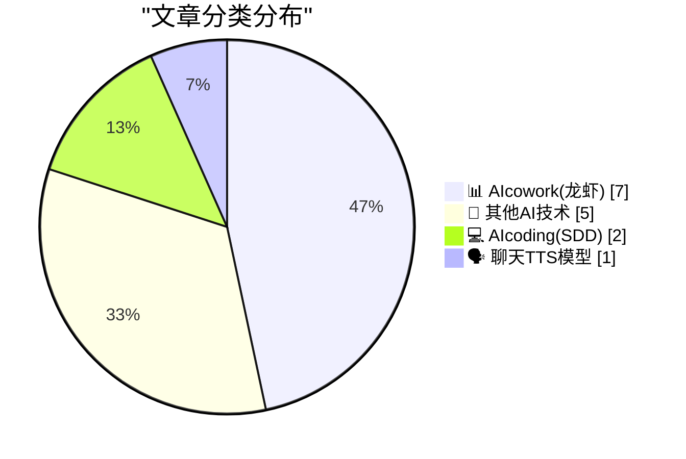
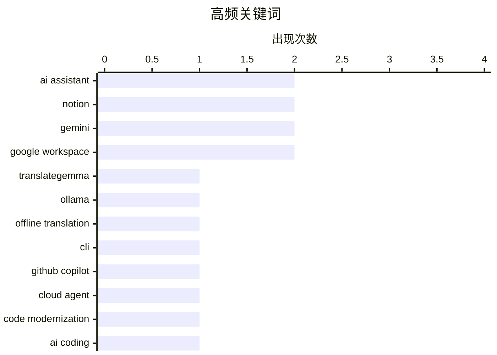

# 📰 AI 博客每日精选 — 2026-05-01

> 来自 98 个技术博客和社交媒体源，AI 精选 Top 15

## 📝 今日看点

今日技术圈聚焦两大趋势：AI Agent 正加速渗透至日常办公与专业工作流，微软、Notion 等巨头密集推出邮件管理、日历优化及法律流程代理，将“智能协作”从概念推向实用；同时，AI 编码能力迎来爆发，OpenAI 的 GPT-5.5 发布一周即创下收入纪录，GitHub 与 ElevenLabs 则分别展示了代码现代化与经典文化场景的 AI 落地，标志着大模型正从“对话工具”进化为“生产力引擎”。

---

## 🏆 今日必读

🥇 **使用 TranslateGemma + Ollama 实现离线命令行翻译**

[Offline command line translation with TranslateGemma + Ollama](https://evanhahn.com/offline-cli-translation-with-translategemma-and-ollama/) — evanhahn.com · 21 小时前 · 🔬 其他AI技术

> 作者编写了一个简单的脚本，利用 TranslateGemma 模型和 Ollama 工具，实现了完全离线的命令行翻译功能。用户只需通过管道将文本传递给 `translate` 命令，即可在本地完成翻译，无需联网。该方案基于 Google 的 TranslateGemma 模型，通过 Ollama 在本地运行，确保了数据隐私和零网络依赖。脚本支持多种语言，性能取决于本地硬件配置。核心价值在于为开发者提供了一种轻量、私密且高效的翻译替代方案，尤其适合处理敏感数据或离线环境。

💡 **为什么值得读**: 如果你需要在不联网、保护隐私的前提下快速翻译文本，这篇文章提供了一个基于开源模型和工具的即用方案。

🏷️ TranslateGemma, Ollama, Offline Translation, CLI

🥈 **用 GitHub Copilot Cloud Agent 现代化你的代码库**

[We all have that one "quick script" that accidentally turned into a full project. 😅 Use GitHub Copilot cloud agent to modernize your codebase and i...](https://x.com/github/status/2050304275163615426) — 𝕏 @GitHub · 1 小时前 · 💻 AIcoding(SDD)

> GitHub 官方推荐使用 Copilot Cloud Agent 来现代化代码库并提升质量，同时不拖慢开发速度。该教程针对那些从“快速脚本”意外演变成完整项目的代码，提供自动化重构和优化方案。Cloud Agent 能够分析现有代码结构，提出改进建议并自动执行，帮助开发者清理技术债务。核心优势在于在保持开发节奏的同时，系统性提升代码质量和可维护性。

💡 **为什么值得读**: 如果你有大量遗留代码或“临时脚本”需要重构，这篇教程展示了如何用 AI 代理高效完成，值得一试。

🏷️ GitHub Copilot, cloud agent, code modernization, AI Coding

🥉 **ElevenLabs 在伦敦红色电话亭安装 AI 代理，使用迈克尔·凯恩的声音**

[We installed an ElevenAgent in an iconic red phone box in London. Using Sir Michael Caine’s voice, the agent quizzed visitors to the AI Engineer summ...](https://x.com/ElevenLabs/status/2050171771022655682) — 𝕏 @ElevenLabs · 10 小时前 · 🗣️ 聊天TTS模型

> ElevenLabs 将 ElevenAgent 安装在一个标志性的伦敦红色电话亭中，使用著名演员迈克尔·凯恩的声音，向 AI 工程师峰会的访客提问关于英国 AI 历史的问题。这是一个结合经典文化符号与前沿语音 AI 技术的创意营销活动。该代理展示了 ElevenLabs 在语音克隆和实时对话 AI 方面的能力，能够以名人声音进行自然交互。活动旨在推广其语音代理技术在公共场景中的应用潜力。

💡 **为什么值得读**: 这个案例生动展示了语音 AI 代理在真实场景中的创意应用，对了解语音克隆和交互技术的前沿实践有启发。

🏷️ ElevenLabs, voice agent, TTS, voice cloning

4️⃣ **Microsoft Word 推出 Legal Agent，支持法律工作流程**

[Keeping track of legal processes can be complex. Legal Agent in Word follows structured workflows shaped by real legal practice, so you can focus on h...](https://x.com/Microsoft365/status/2050239686661009537) — 𝕏 @Microsoft365 · 6 小时前 · 📊 AIcowork(龙虾)

> Microsoft 365 宣布在 Word 中引入 Legal Agent，该代理遵循真实法律实践的结构化工作流程，帮助法律专业人士处理复杂的法律流程。它能够自动处理条款审查、修订跟踪等任务，让律师专注于高影响力的决策。该代理由微软总裁 Brad Smith 介绍，强调其支持法律工作所需的精确性和严谨性。核心价值在于将 AI 深度嵌入专业法律文档处理，提升效率并减少人为错误。

💡 **为什么值得读**: 如果你是法律从业者或对 AI 在专业领域（如法律）的应用感兴趣，这篇文章展示了微软如何用 AI 优化高精度工作流。

🏷️ Legal Agent, Microsoft Word, Workflow, AI

5️⃣ **Notion Agent 现在可以管理你的电子邮件**

[Your Notion Agent can now manage your email! Ask it to search your inbox, draft a reply, or unsubscribe from lists you keep meaning to leave. It puts ...](https://x.com/NotionHQ/status/2050253907922948353) — 𝕏 @NotionHQ · 5 小时前 · 📊 AIcowork(龙虾)

> Notion 宣布其 AI Agent 新增邮件管理功能，用户可以通过自然语言指令让代理搜索收件箱、起草回复或取消订阅邮件列表。该代理能够自动执行重复性邮件任务，帮助用户节省时间。演示视频显示，代理可以理解复杂指令并直接在 Notion 界面内操作。核心卖点是将邮件管理整合到 Notion 的工作流中，减少应用切换，提升个人效率。

💡 **为什么值得读**: 如果你经常被邮件淹没，这篇文章展示了如何用 Notion 的 AI 代理自动化处理邮件，值得关注。

🏷️ Notion Agent, Email Management, AI Assistant

---

## 📊 数据概览

| 扫描源 | 抓取文章 | 时间范围 | 精选 |
|:---:|:---:|:---:|:---:|
| 79/98 | 2786 篇 → 26 篇 | 24h | **15 篇** |

### 分类分布



### 高频关键词



<details>
<summary>📈 纯文本关键词图（终端友好）</summary>

```
ai assistant        │ ████████████████████ 2
notion              │ ████████████████████ 2
gemini              │ ████████████████████ 2
google workspace    │ ████████████████████ 2
translategemma      │ ██████████░░░░░░░░░░ 1
ollama              │ ██████████░░░░░░░░░░ 1
offline translation │ ██████████░░░░░░░░░░ 1
cli                 │ ██████████░░░░░░░░░░ 1
github copilot      │ ██████████░░░░░░░░░░ 1
cloud agent         │ ██████████░░░░░░░░░░ 1
```

</details>

### 🏷️ 话题标签

**ai assistant**(2) · **notion**(2) · **gemini**(2) · google workspace(2) · translategemma(1) · ollama(1) · offline translation(1) · cli(1) · github copilot(1) · cloud agent(1) · code modernization(1) · ai coding(1) · elevenlabs(1) · voice agent(1) · tts(1) · voice cloning(1) · legal agent(1) · microsoft word(1) · workflow(1) · ai(1)

---

====================

## 📊 AIcowork(龙虾)

### 1. Microsoft Word 推出 Legal Agent，支持法律工作流程

[Keeping track of legal processes can be complex. Legal Agent in Word follows structured workflows shaped by real legal practice, so you can focus on h...](https://x.com/Microsoft365/status/2050239686661009537) — **𝕏 @Microsoft365** · 6 小时前 · ⭐ 15/25

> Microsoft 365 宣布在 Word 中引入 Legal Agent，该代理遵循真实法律实践的结构化工作流程，帮助法律专业人士处理复杂的法律流程。它能够自动处理条款审查、修订跟踪等任务，让律师专注于高影响力的决策。该代理由微软总裁 Brad Smith 介绍，强调其支持法律工作所需的精确性和严谨性。核心价值在于将 AI 深度嵌入专业法律文档处理，提升效率并减少人为错误。

🏷️ Legal Agent, Microsoft Word, Workflow, AI

📌 AIcowork(龙虾)

---

### 2. Notion Agent 现在可以管理你的电子邮件

[Your Notion Agent can now manage your email! Ask it to search your inbox, draft a reply, or unsubscribe from lists you keep meaning to leave. It puts ...](https://x.com/NotionHQ/status/2050253907922948353) — **𝕏 @NotionHQ** · 5 小时前 · ⭐ 14/25

> Notion 宣布其 AI Agent 新增邮件管理功能，用户可以通过自然语言指令让代理搜索收件箱、起草回复或取消订阅邮件列表。该代理能够自动执行重复性邮件任务，帮助用户节省时间。演示视频显示，代理可以理解复杂指令并直接在 Notion 界面内操作。核心卖点是将邮件管理整合到 Notion 的工作流中，减少应用切换，提升个人效率。

🏷️ Notion Agent, Email Management, AI Assistant

📌 AIcowork(龙虾)

---

### 3. 使用 Copilot Cowork 优化日历、准备会议并保护专注时间

[Optimize your calendar, prep for meetings, and protect focus time with Copilot Cowork.](https://x.com/Microsoft365/status/2050274052904783925) — **𝕏 @Microsoft365** · 3 小时前 · ⭐ 14/25

> Microsoft 365 推出 Copilot Cowork 功能，旨在帮助用户优化日历安排、准备会议内容并保护专注时间。该代理能够自动分析日程冲突、生成会议准备材料，并智能预留无打扰时段。核心目标是减少会议带来的碎片化干扰，提升工作效率。演示视频展示了其与 Outlook 日历的深度集成，能够根据用户习惯动态调整时间块。

🏷️ Copilot, Calendar, Meeting, Productivity

📌 AIcowork(龙虾)

---

### 4. Notion AI 推出全新 AI Widgets 并优化用户体验

[RT Laura Sandoval: Today we're bringing these lovely AI widgets @andrewaashen designed for our core Notion app to Notion AI 📲 We've also been heads...](https://x.com/NotionHQ/status/2050324771242754359) — **𝕏 @NotionHQ** · 1 小时前 · ⭐ 12/25

> Notion 将原本为核心应用设计的 AI Widgets 引入 Notion AI 平台，同时进行了大量细节打磨以提升流畅度。这些 Widgets 由设计师 Andrewaashen 设计，旨在提供更直观的 AI 交互体验。目前 Notion AI 测试版已通过 TestFlight 开放给 iOS 用户。核心改进在于将 AI 功能以更轻量、可视化的方式嵌入日常笔记和工作流中。

🏷️ Notion AI, widgets, AI assistant

📌 AIcowork(龙虾)

---

### 5. Notion 将于 5 月 13 日发布全新开发者工具

[We've been busy building. New dev tools land May 13. Join us for a first look:](https://x.com/NotionHQ/status/2050294471385104734) — **𝕏 @NotionHQ** · 2 小时前 · ⭐ 10/25

> Notion 宣布将于 5 月 13 日发布新的开发者平台，并邀请开发者参加首次预览。该平台旨在提供更强大的 API 和集成能力，让开发者能够基于 Notion 构建更复杂的应用。官方表示这是“全新开发者平台”的首次亮相，暗示可能有重大功能更新。核心目标是降低开发门槛，扩展 Notion 作为协作平台的能力边界。

🏷️ Notion, developer platform, announcement

📌 AIcowork(龙虾)

---

### 6. Google Workspace 团队亲选：你最爱的 Gemini 功能是哪个？

[At #GoogleCloudNext, we asked the team behind the tools: what’s your favorite Gemini feature in Workspace? See which features the experts recommend. ...](https://x.com/GoogleWorkspace/status/2050289945298829715) — **𝕏 @GoogleWorkspace** · 2 小时前 · ⭐ 9/25

> 在 Google Cloud Next 大会上，Google Workspace 团队被问及他们最喜爱的 Gemini 功能。专家们推荐了 Workspace 中集成 Gemini 的特定特性。视频展示了这些推荐功能的具体使用场景。该内容旨在帮助用户发现并利用 Gemini 提升工作效率。

🏷️ Gemini, Google Workspace, Feature Highlight

📌 AIcowork(龙虾)

---

### 7. Gear Foundation 借助 Google Workspace 与 Gemini 弥合特殊需求家庭的信息鸿沟

[The Gear Foundation is bridging the resource gap for special needs families using Google Workspace with Gemini. Hear from Dave Krikac, Founder and CEO...](https://x.com/GoogleWorkspace/status/2050259706782814649) — **𝕏 @GoogleWorkspace** · 4 小时前 · ⭐ 9/25

> Gear Foundation 利用 Google Workspace 与 Gemini 技术，帮助特殊需求家庭解决资源获取困难的问题。创始人兼 CEO Dave Krikac 分享了他们如何将复杂数据转化为清晰易懂的支持信息。该案例展示了 AI 工具在公益领域的实际应用价值。通过 Gemini，组织能够更高效地处理信息并服务弱势群体。

🏷️ Google Workspace, Gemini, Nonprofit, Case Study

📌 AIcowork(龙虾)

---

## 🔬 其他AI技术

### 8. 使用 TranslateGemma + Ollama 实现离线命令行翻译

[Offline command line translation with TranslateGemma + Ollama](https://evanhahn.com/offline-cli-translation-with-translategemma-and-ollama/) — **evanhahn.com** · 21 小时前 · ⭐ 20/25

> 作者编写了一个简单的脚本，利用 TranslateGemma 模型和 Ollama 工具，实现了完全离线的命令行翻译功能。用户只需通过管道将文本传递给 `translate` 命令，即可在本地完成翻译，无需联网。该方案基于 Google 的 TranslateGemma 模型，通过 Ollama 在本地运行，确保了数据隐私和零网络依赖。脚本支持多种语言，性能取决于本地硬件配置。核心价值在于为开发者提供了一种轻量、私密且高效的翻译替代方案，尤其适合处理敏感数据或离线环境。

🏷️ TranslateGemma, Ollama, Offline Translation, CLI

📌 其他AI技术

---

### 9. Notion 团队庆祝季度末

[RT Khiet Tran: 😎 wrapping up another EOQ at @NotionHQ](https://x.com/NotionHQ/status/2050243777886146580) — **𝕏 @NotionHQ** · 7 小时前 · ⭐ 9/25

> Notion 团队负责人 Khiet Tran 在社交媒体上分享了团队庆祝季度末（EOQ）的照片，展示了团队氛围。内容为内部活动记录，无技术或产品更新信息。

🏷️ Notion, EOQ, Social Post

📌 其他AI技术

---

### 10. 单板计算机集群性价比极低，但玩起来很有趣

[SBC Clusters are a terrible value, but they're fun anyway](https://www.jeffgeerling.com/blog/2026/deskpi-super4c-sbc-cluster/) — **jeffgeerling.com** · 7 小时前 · ⭐ 5/25

> 文章探讨了使用单板计算机（如树莓派）搭建集群的价值问题。作者以 DeskPi Super4C（一款4节点树莓派 CM5 集群板）为例，指出这类集群在成本、性能和功耗上远不如同等价位的二手企业级服务器。尽管性价比极差，但作者认为其作为学习、实验和娱乐项目的价值无可替代。核心结论是：SBC 集群是糟糕的投资，但却是极好的玩具。

🏷️ SBC Cluster, Raspberry Pi, Hardware

📌 其他AI技术

---

### 11. Meta 解决了肯尼亚外包员工审核 AI 眼镜用户如厕画面的问题

[Meta Solved Their Problem With Kenyan Contractors Seeing Footage of AI Glasses Wearers on the Toilet](https://www.bbc.com/news/articles/c5y7yvgy0w6o) — **daringfireball.net** · 51 分钟前 · ⭐ 5/25

> 文章回顾了两个月前被曝光的丑闻：Meta 雇佣肯尼亚外包团队审核其智能眼镜用户拍摄的脱衣、性行为及如厕等隐私视频。这些外包工人被迫观看大量不堪入目的内容，而大多数眼镜用户对此毫不知情。Meta 随后采取措施“解决”了这一问题，但文章暗示其解决方案可能只是将审核工作转移或隐藏，而非从根本上保护用户隐私或工人权益。

🏷️ AI Ethics, Data Privacy, Smart Glasses

📌 其他AI技术

---

### 12. 蒂姆·库克应对关税退税难题的巧妙方案

[Tim Cook’s Clever Solution to the Tariff Refund Puzzle](https://sixcolors.com/post/2026/04/apple-results-analysis-net-net-over-the-moon/) — **daringfireball.net** · 1 小时前 · ⭐ 5/25

> 文章分析了苹果公司季度财报电话会议中的一个关键细节。面对分析师关于产品利润率的复杂提问，苹果 CFO 中途将问题转交给 CEO 库克。库克随后宣读了一份关于关税的预先准备好的声明，表示苹果将遵循既定流程申请关税退税，并计划将收到的任何退款重新投资。这一举动被解读为库克巧妙地将财务压力转化为公关叙事，既回应了市场关切，又展示了苹果的长期投资决心。

🏷️ Apple, Tariff, Business

📌 其他AI技术

---

## 💻 AIcoding(SDD)

### 13. 用 GitHub Copilot Cloud Agent 现代化你的代码库

[We all have that one "quick script" that accidentally turned into a full project. 😅 Use GitHub Copilot cloud agent to modernize your codebase and i...](https://x.com/github/status/2050304275163615426) — **𝕏 @GitHub** · 1 小时前 · ⭐ 20/25

> GitHub 官方推荐使用 Copilot Cloud Agent 来现代化代码库并提升质量，同时不拖慢开发速度。该教程针对那些从“快速脚本”意外演变成完整项目的代码，提供自动化重构和优化方案。Cloud Agent 能够分析现有代码结构，提出改进建议并自动执行，帮助开发者清理技术债务。核心优势在于在保持开发节奏的同时，系统性提升代码质量和可维护性。

🏷️ GitHub Copilot, cloud agent, code modernization, AI Coding

📌 AIcoding(SDD)

---

### 14. GPT-5.5 发布一周即成为 OpenAI 最强模型

[One week since the launch of GPT-5.5, and it’s already our strongest model launch yet. API revenue is growing more than 2x faster than any prior rele...](https://x.com/OpenAI/status/2050250926888468929) — **𝕏 @OpenAI** · 5 小时前 · ⭐ 12/25

> OpenAI 宣布 GPT-5.5 发布仅一周，已成为其史上最成功的模型发布。API 收入增长速度是此前任何版本的两倍以上，其中 Codex 在七天内收入翻倍，主要受企业级代理编码工具需求推动。该数据表明，开发者对 AI 编码代理的需求正在爆发式增长。核心结论是 GPT-5.5 在性能和商业表现上均创下新纪录，尤其在企业级应用场景中表现突出。

🏷️ GPT-5.5, API, Codex, agentic coding

📌 AIcoding(SDD)

---

## 🗣️ 聊天TTS模型

### 15. ElevenLabs 在伦敦红色电话亭安装 AI 代理，使用迈克尔·凯恩的声音

[We installed an ElevenAgent in an iconic red phone box in London. Using Sir Michael Caine’s voice, the agent quizzed visitors to the AI Engineer summ...](https://x.com/ElevenLabs/status/2050171771022655682) — **𝕏 @ElevenLabs** · 10 小时前 · ⭐ 15/25

> ElevenLabs 将 ElevenAgent 安装在一个标志性的伦敦红色电话亭中，使用著名演员迈克尔·凯恩的声音，向 AI 工程师峰会的访客提问关于英国 AI 历史的问题。这是一个结合经典文化符号与前沿语音 AI 技术的创意营销活动。该代理展示了 ElevenLabs 在语音克隆和实时对话 AI 方面的能力，能够以名人声音进行自然交互。活动旨在推广其语音代理技术在公共场景中的应用潜力。

🏷️ ElevenLabs, voice agent, TTS, voice cloning

📌 聊天TTS模型

---

====================

*生成于 2026-05-01 21:52 | 扫描 79 源 → 获取 2786 篇 → 精选 15 篇*
*基于 [Hacker News Popularity Contest 2025](https://refactoringenglish.com/tools/hn-popularity/) RSS 源列表，由 [Andrej Karpathy](https://x.com/karpathy) 推荐*
*由「懂点儿AI」制作，欢迎关注同名微信公众号获取更多 AI 实用技巧 💡*
