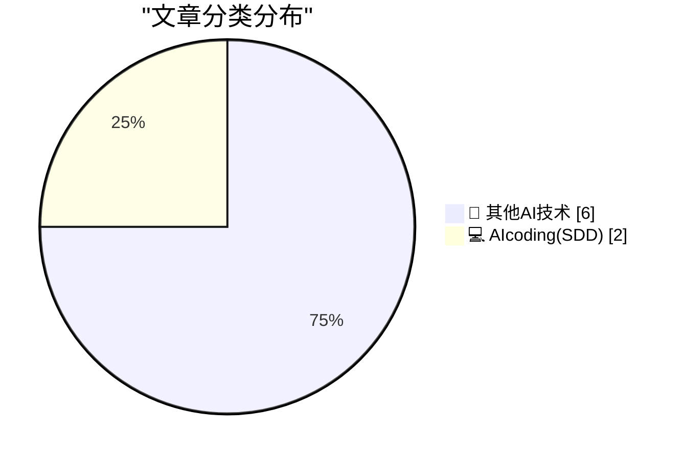
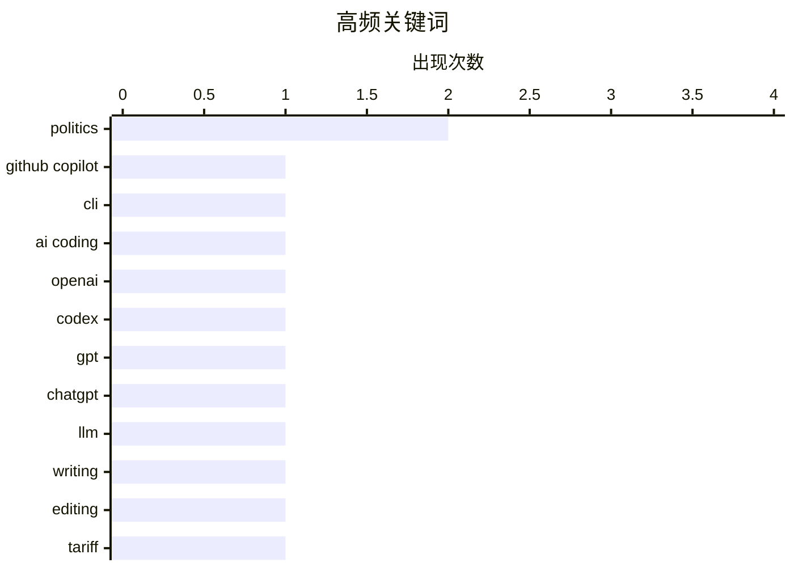

# 📰 AI 博客每日精选 — 2026-05-02

> 来自 98 个技术博客和社交媒体源，AI 精选 Top 8

## 📝 今日看点

今日技术圈聚焦两大趋势：AI辅助工具正从代码生成向项目理解与创意互动延伸，GitHub Copilot CLI与OpenAI Codex宠物活动分别展示了AI在代码库速览和趣味化开发体验上的新尝试；与此同时，AI辅助写作的“真实性”问题引发反思，开发者开始警惕工具对个人表达与核心功能的侵蚀。此外，开源维护者生态与苹果的关税策略也持续受到关注，反映出技术社区对工具依赖与商业博弈的深层思考。

---

## 🏆 今日必读

🥇 **GitHub Copilot CLI：一句话获取项目概览**

[Need to catch up on a new project? Just ask for an overview in Copilot CLI and get the essentials. 🪄 Learn more tips and tricks with Copilot CLI fo...](https://x.com/github/status/2050642837419544965) — 𝕏 @GitHub · 3 小时前 · 💻 AIcoding(SDD)

> GitHub 推出 Copilot CLI 新功能，开发者只需在命令行中请求项目概述，即可快速了解新项目的核心信息。该功能旨在帮助开发者快速上手不熟悉的代码库，无需手动翻阅文档或代码。GitHub 还发布了《Copilot CLI for Beginners》指南，提供更多使用技巧和最佳实践。

💡 **为什么值得读**: 对于经常接手新项目或需要快速理解他人代码的开发者，这是一个能显著提升效率的实用技巧，值得花几分钟了解具体用法。

🏷️ GitHub Copilot, CLI, AI Coding

🥈 **OpenAI 推出 Codex 宠物孵化活动**

[RT OpenAI Developers: Show us the Codex pets you hatched. Use /hatch to create your own Codex pet. We’ll pick 10 favorites to get 30 days of ChatGPT ...](https://x.com/OpenAI/status/2050622862424416689) — 𝕏 @OpenAI · 4 小时前 · 💻 AIcoding(SDD)

> OpenAI 发起 Codex 宠物孵化活动，开发者可通过 /hatch 命令创建个性化的 Codex 宠物。活动将评选出 10 个最受欢迎的宠物，获奖者将获得 30 天的 ChatGPT Pro 订阅。该活动旨在鼓励开发者探索和展示 Codex 的创意应用。

💡 **为什么值得读**: 如果你是 AI 开发者或对 Codex 的创意玩法感兴趣，这个活动既能展示你的作品，又有机会获得免费 Pro 订阅。

🏷️ OpenAI, Codex, GPT, ChatGPT

🥉 **编辑我的 LLM 辅助文章**

[Editing my LLM assisted Articles](https://idiallo.com/byte-size/editing-llm-assisted-articles?src=feed) — idiallo.com · 18 小时前 · 🔬 其他AI技术

> 作者反思了使用 AI 辅助写作的弊端：虽然节省时间，但事后重读时发现文章内容与自己的真实想法存在偏差，导致无法准确引用。作者决定重写这些文章，以恢复自己的写作风格和真实思想。文章将展示具体的编辑过程和对比。

💡 **为什么值得读**: 对于依赖 AI 写作的创作者，这篇文章揭示了“AI 代笔”的隐性成本，并提供了如何找回个人声音的实操思路。

🏷️ LLM, Writing, Editing

4️⃣ **苹果关税退税难题的优雅逻辑解法**

[More on Apple’s Logically Elegant Tariff Refund Puzzle Solution](https://daringfireball.net/linked/2026/05/01/tim-cooks-clever-solution-to-the-tariff-refund-puzzle) — daringfireball.net · 20 小时前 · 🔬 其他AI技术

> 文章分析了蒂姆·库克如何巧妙解决苹果在申请和接受关税退税时可能激怒特朗普的困境。库克承诺将退税资金全部投入“美国创新与先进制造”，但读者质疑这是否意味着苹果将额外增加支出。文章深入探讨了这一承诺背后的逻辑与潜在影响。

💡 **为什么值得读**: 如果你关注苹果的商业策略、中美贸易关系或企业政治博弈，这篇文章提供了一个精妙的案例分析。

🏷️ Tariff, Apple, Politics

5️⃣ **禁用自动更新**

[Disable Auto-Update](https://idiallo.com/blog/disable-auto-update?src=feed) — idiallo.com · 22 小时前 · 🔬 其他AI技术

> 作者抱怨一款完全离线的健身应用在自动更新后，核心功能突然消失。该应用原本通过蓝牙从可穿戴设备收集数据，数据仅存储在本地，无需服务器维护。作者质疑：为何一个离线、无服务器依赖的应用，其核心功能会因更新而丢失？

💡 **为什么值得读**: 这篇文章直击“自动更新破坏用户体验”的痛点，对于所有依赖离线应用的用户来说，是一个值得警惕的真实案例。

🏷️ App, Update, Fitness

---

## 📊 数据概览

| 扫描源 | 抓取文章 | 时间范围 | 精选 |
|:---:|:---:|:---:|:---:|
| 74/98 | 2708 篇 → 8 篇 | 24h | **8 篇** |

### 分类分布



### 高频关键词



<details>
<summary>📈 纯文本关键词图（终端友好）</summary>

```
politics       │ ████████████████████ 2
github copilot │ ██████████░░░░░░░░░░ 1
cli            │ ██████████░░░░░░░░░░ 1
ai coding      │ ██████████░░░░░░░░░░ 1
openai         │ ██████████░░░░░░░░░░ 1
codex          │ ██████████░░░░░░░░░░ 1
gpt            │ ██████████░░░░░░░░░░ 1
chatgpt        │ ██████████░░░░░░░░░░ 1
llm            │ ██████████░░░░░░░░░░ 1
writing        │ ██████████░░░░░░░░░░ 1
```

</details>

### 🏷️ 话题标签

**politics**(2) · **github copilot**(1) · **cli**(1) · ai coding(1) · openai(1) · codex(1) · gpt(1) · chatgpt(1) · llm(1) · writing(1) · editing(1) · tariff(1) · apple(1) · app(1) · update(1) · fitness(1) · history(1) · whistleblower(1) · github(1) · maintainer(1)

---

====================

## 🔬 其他AI技术

### 1. 编辑我的 LLM 辅助文章

[Editing my LLM assisted Articles](https://idiallo.com/byte-size/editing-llm-assisted-articles?src=feed) — **idiallo.com** · 18 小时前 · ⭐ 11/25

> 作者反思了使用 AI 辅助写作的弊端：虽然节省时间，但事后重读时发现文章内容与自己的真实想法存在偏差，导致无法准确引用。作者决定重写这些文章，以恢复自己的写作风格和真实思想。文章将展示具体的编辑过程和对比。

🏷️ LLM, Writing, Editing

📌 其他AI技术

---

### 2. 苹果关税退税难题的优雅逻辑解法

[More on Apple’s Logically Elegant Tariff Refund Puzzle Solution](https://daringfireball.net/linked/2026/05/01/tim-cooks-clever-solution-to-the-tariff-refund-puzzle) — **daringfireball.net** · 20 小时前 · ⭐ 5/25

> 文章分析了蒂姆·库克如何巧妙解决苹果在申请和接受关税退税时可能激怒特朗普的困境。库克承诺将退税资金全部投入“美国创新与先进制造”，但读者质疑这是否意味着苹果将额外增加支出。文章深入探讨了这一承诺背后的逻辑与潜在影响。

🏷️ Tariff, Apple, Politics

📌 其他AI技术

---

### 3. 禁用自动更新

[Disable Auto-Update](https://idiallo.com/blog/disable-auto-update?src=feed) — **idiallo.com** · 22 小时前 · ⭐ 5/25

> 作者抱怨一款完全离线的健身应用在自动更新后，核心功能突然消失。该应用原本通过蓝牙从可穿戴设备收集数据，数据仅存储在本地，无需服务器维护。作者质疑：为何一个离线、无服务器依赖的应用，其核心功能会因更新而丢失？

🏷️ App, Update, Fitness

📌 其他AI技术

---

### 4. 多元主义：民主党纽伦堡核心小组的前史

[Pluralistic: The prehistory of the Democratic Nuremberg Caucus (02 May 2026)](https://pluralistic.net/2026/05/02/denazification/) — **pluralistic.net** · 10 小时前 · ⭐ 5/25

> 文章追溯了“民主党纽伦堡核心小组”的历史背景，并呼吁对 ICE 举报人实施悬赏。此外，文章还汇集了多个话题链接，包括科尔伯特对布什的采访、袋鼠奶研究、杰伊·罗森的新闻学原则、激进媒体、附带权益解释、TCP over 鸽子、BNL 版权案、乔安娜·拉斯的讣告，以及共和党强迫学生偿还诈骗贷款等。

🏷️ Politics, History, Whistleblower

📌 其他AI技术

---

### 5. 面向维护者的 GitHub

[A GitHub for maintainers](https://nesbitt.io/2026/05/02/a-github-for-maintainers.html) — **nesbitt.io** · 11 小时前 · ⭐ 5/25

> 文章提出一个概念：为依赖项提供与 fork 相同的待遇，即让维护者也能像 fork 代码一样轻松地管理和贡献依赖项。这旨在改善开源维护者的工作流程，降低维护负担。

🏷️ GitHub, Maintainer, Dependencies

📌 其他AI技术

---

### 6. 正弦波的缩放、拉伸与平移

[Scaling, stretching and shifting sinusoids](https://eli.thegreenplace.net/2026/scaling-stretching-and-shifting-sinusoids/) — **eli.thegreenplace.net** · 7 小时前 · ⭐ 5/25

> 文章简要解释了如何调整标准正弦波 sin(x) 的振幅、频率和相位偏移。通过通用函数形式，展示了如何通过数学变换实现这些调整，适合需要快速回顾或理解正弦波基本操作的读者。

🏷️ Sinusoid, Math, Signal

📌 其他AI技术

---

## 💻 AIcoding(SDD)

### 7. GitHub Copilot CLI：一句话获取项目概览

[Need to catch up on a new project? Just ask for an overview in Copilot CLI and get the essentials. 🪄 Learn more tips and tricks with Copilot CLI fo...](https://x.com/github/status/2050642837419544965) — **𝕏 @GitHub** · 3 小时前 · ⭐ 21/25

> GitHub 推出 Copilot CLI 新功能，开发者只需在命令行中请求项目概述，即可快速了解新项目的核心信息。该功能旨在帮助开发者快速上手不熟悉的代码库，无需手动翻阅文档或代码。GitHub 还发布了《Copilot CLI for Beginners》指南，提供更多使用技巧和最佳实践。

🏷️ GitHub Copilot, CLI, AI Coding

📌 AIcoding(SDD)

---

### 8. OpenAI 推出 Codex 宠物孵化活动

[RT OpenAI Developers: Show us the Codex pets you hatched. Use /hatch to create your own Codex pet. We’ll pick 10 favorites to get 30 days of ChatGPT ...](https://x.com/OpenAI/status/2050622862424416689) — **𝕏 @OpenAI** · 4 小时前 · ⭐ 13/25

> OpenAI 发起 Codex 宠物孵化活动，开发者可通过 /hatch 命令创建个性化的 Codex 宠物。活动将评选出 10 个最受欢迎的宠物，获奖者将获得 30 天的 ChatGPT Pro 订阅。该活动旨在鼓励开发者探索和展示 Codex 的创意应用。

🏷️ OpenAI, Codex, GPT, ChatGPT

📌 AIcoding(SDD)

---

====================

*生成于 2026-05-02 21:38 | 扫描 74 源 → 获取 2708 篇 → 精选 8 篇*
*基于 [Hacker News Popularity Contest 2025](https://refactoringenglish.com/tools/hn-popularity/) RSS 源列表，由 [Andrej Karpathy](https://x.com/karpathy) 推荐*
*由「懂点儿AI」制作，欢迎关注同名微信公众号获取更多 AI 实用技巧 💡*
