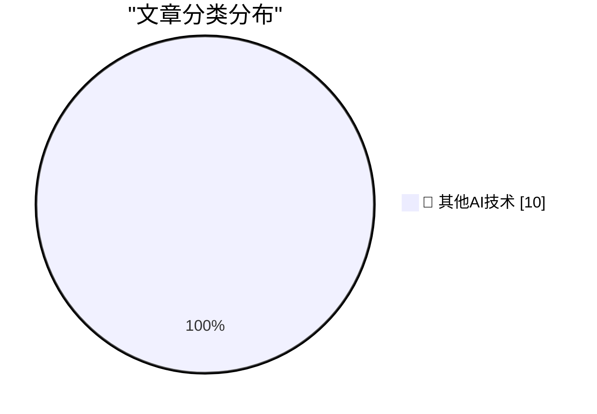

# 📰 AI 博客每日精选 — 2026-05-03

> 来自 98 个技术博客和社交媒体源，AI 精选 Top 10

## 🏆 今日必读

🥇 **Why I don't like the "staff engineer archetypes"**

[Why I don't like the "staff engineer archetypes"](https://seangoedecke.com/staff-engineer-archetypes/) — seangoedecke.com · 21 小时前 · 🔬 其他AI技术

> Why I don't like the "staff engineer archetypes"

🥈 **Vertically Aligning Roman Numerals in Code**

[Vertically Aligning Roman Numerals in Code](https://shkspr.mobi/blog/2026/05/vertically-aligning-roman-numerals-in-code/) — shkspr.mobi · 10 小时前 · 🔬 其他AI技术

> Vertically Aligning Roman Numerals in Code

🥉 **Minimal Viable Zig Error Contexts**

[Minimal Viable Zig Error Contexts](https://matklad.github.io/2026/05/03/zig-error-context.html) — matklad.github.io · 21 小时前 · 🔬 其他AI技术

> Minimal Viable Zig Error Contexts

4️⃣ **QuickQWERTY 1.2.3**

[QuickQWERTY 1.2.3](https://susam.net/code/news/quickqwerty/1.2.3.html) — susam.net · 21 小时前 · 🔬 其他AI技术

> QuickQWERTY 1.2.3

5️⃣ **Punk, or why I don’t stream anymore**

[Punk, or why I don’t stream anymore](https://geohot.github.io//blog/jekyll/update/2026/05/03/punk-or-why-i-dont-stream.html) — geohot.github.io · 14 小时前 · 🔬 其他AI技术

> Punk, or why I don’t stream anymore

---

## 📊 数据概览

| 扫描源 | 抓取文章 | 时间范围 | 精选 |
|:---:|:---:|:---:|:---:|
| 79/98 | 2774 篇 → 10 篇 | 24h | **10 篇** |

### 分类分布

---

====================

## 🔬 其他AI技术

### 1. Why I don't like the "staff engineer archetypes"

[Why I don't like the "staff engineer archetypes"](https://seangoedecke.com/staff-engineer-archetypes/) — **seangoedecke.com** · 21 小时前 · ⭐ 15/25

> Why I don't like the "staff engineer archetypes"

📌 其他AI技术

---

### 2. Vertically Aligning Roman Numerals in Code

[Vertically Aligning Roman Numerals in Code](https://shkspr.mobi/blog/2026/05/vertically-aligning-roman-numerals-in-code/) — **shkspr.mobi** · 10 小时前 · ⭐ 15/25

> Vertically Aligning Roman Numerals in Code

📌 其他AI技术

---

### 3. Minimal Viable Zig Error Contexts

[Minimal Viable Zig Error Contexts](https://matklad.github.io/2026/05/03/zig-error-context.html) — **matklad.github.io** · 21 小时前 · ⭐ 15/25

> Minimal Viable Zig Error Contexts

📌 其他AI技术

---

### 4. QuickQWERTY 1.2.3

[QuickQWERTY 1.2.3](https://susam.net/code/news/quickqwerty/1.2.3.html) — **susam.net** · 21 小时前 · ⭐ 15/25

> QuickQWERTY 1.2.3

📌 其他AI技术

---

### 5. Punk, or why I don’t stream anymore

[Punk, or why I don’t stream anymore](https://geohot.github.io//blog/jekyll/update/2026/05/03/punk-or-why-i-dont-stream.html) — **geohot.github.io** · 14 小时前 · ⭐ 15/25

> Punk, or why I don’t stream anymore

📌 其他AI技术

---

### 6. Microsoft’s open sourcing of 86-DOS and what it means

[Microsoft’s open sourcing of 86-DOS and what it means](https://dfarq.homeip.net/microsofts-open-sourcing-of-86-dos-and-what-it-means/?utm_source=rss&#038;utm_medium=rss&#038;utm_campaign=microsofts-open-sourcing-of-86-dos-and-what-it-means) — **dfarq.homeip.net** · 4 小时前 · ⭐ 15/25

> Microsoft’s open sourcing of 86-DOS and what it means

📌 其他AI技术

---

### 7. callgraph analysis

[callgraph analysis](https://jyn.dev/callgraph-analysis/) — **jyn.dev** · 21 小时前 · ⭐ 15/25

> callgraph analysis

📌 其他AI技术

---

### 8. France is going all in on open source. 🇫🇷🐧 DINUM plans to migrate every ministry to Linux—building on the success of GendBuntu, which saves ...

[France is going all in on open source. 🇫🇷🐧 DINUM plans to migrate every ministry to Linux—building on the success of GendBuntu, which saves ...](https://x.com/github/status/2050997675651117326) — **𝕏 @GitHub** · 3 小时前 · ⭐ 15/25

> France is going all in on open source. 🇫🇷🐧 DINUM plans to migrate every ministry to Linux—building on the success of GendBuntu, which saves ...

📌 其他AI技术

---

### 9. RT Lenny Rachitsky: "We already have universal basic income. It's called knowledge work." Max Schoening (@mschoening) is one of the deepest thinkers o...

[RT Lenny Rachitsky: "We already have universal basic income. It's called knowledge work." Max Schoening (@mschoening) is one of the deepest thinkers o...](https://x.com/NotionHQ/status/2051012715767066932) — **𝕏 @NotionHQ** · 3 小时前 · ⭐ 15/25

> RT Lenny Rachitsky: "We already have universal basic income. It's called knowledge work." Max Schoening (@mschoening) is one of the deepest thinkers o...

📌 其他AI技术

---

### 10. RT brexton: .@NotionHQ AI’s harness has gotten crazy good Something happened with it recently The solo Notion AI testflight is about to be my most-us...

[RT brexton: .@NotionHQ AI’s harness has gotten crazy good Something happened with it recently The solo Notion AI testflight is about to be my most-us...](https://x.com/NotionHQ/status/2051002950206783904) — **𝕏 @NotionHQ** · 19 小时前 · ⭐ 15/25

> RT brexton: .@NotionHQ AI’s harness has gotten crazy good Something happened with it recently The solo Notion AI testflight is about to be my most-us...

📌 其他AI技术

---

====================

*生成于 2026-05-03 21:39 | 扫描 79 源 → 获取 2774 篇 → 精选 10 篇*
*基于 [Hacker News Popularity Contest 2025](https://refactoringenglish.com/tools/hn-popularity/) RSS 源列表，由 [Andrej Karpathy](https://x.com/karpathy) 推荐*
*由「懂点儿AI」制作，欢迎关注同名微信公众号获取更多 AI 实用技巧 💡*
