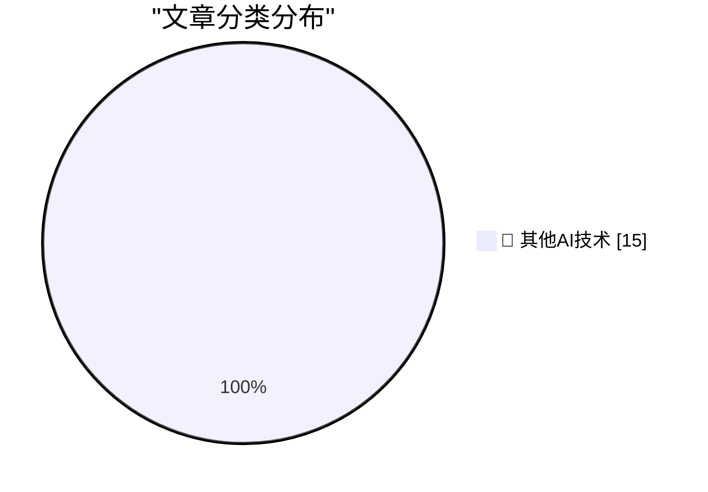

# 📰 AI 博客每日精选 — 2026-05-04

> 来自 98 个技术博客和社交媒体源，AI 精选 Top 15

## 🏆 今日必读

🥇 **Google Owns a Big Chunk of Anthropic**

[Google Owns a Big Chunk of Anthropic](https://www.nytimes.com/2025/03/11/technology/google-investment-anthropic.html?unlocked_article_code=1.f1A.eSTf.D5ECvk6f4DZ7) — daringfireball.net · 17 分钟前 · 🔬 其他AI技术

> Google Owns a Big Chunk of Anthropic

🥈 **App Store Search Ads and the Slippery Slope**

[App Store Search Ads and the Slippery Slope](https://blog.thinktapwork.com/post/812803664980967425/ios-app-store-search-is-rotten) — daringfireball.net · 49 分钟前 · 🔬 其他AI技术

> App Store Search Ads and the Slippery Slope

🥉 **‘Noir, Japan’s Hard-Boiled Bittersweet Answer to Oreos’**

[‘Noir, Japan’s Hard-Boiled Bittersweet Answer to Oreos’](https://tokyopaladin.substack.com/p/the-japanese-oreo-noir-kills-the) — daringfireball.net · 2 小时前 · 🔬 其他AI技术

> ‘Noir, Japan’s Hard-Boiled Bittersweet Answer to Oreos’

4️⃣ **Photoshop’s ‘Modern User Interface’ Sucks (and Doesn’t Feel Modern)**

[Photoshop’s ‘Modern User Interface’ Sucks (and Doesn’t Feel Modern)](https://unsung.aresluna.org/photoshops-challenges-with-focus-pt-2/) — daringfireball.net · 2 小时前 · 🔬 其他AI技术

> Photoshop’s ‘Modern User Interface’ Sucks (and Doesn’t Feel Modern)

5️⃣ **Anthropic Executive, One Year Ago: Fully AI Employees Are a Year Away**

[Anthropic Executive, One Year Ago: Fully AI Employees Are a Year Away](https://www.axios.com/2025/04/22/ai-anthropic-virtual-employees-security) — daringfireball.net · 3 小时前 · 🔬 其他AI技术

> Anthropic Executive, One Year Ago: Fully AI Employees Are a Year Away

---

## 📊 数据概览

| 扫描源 | 抓取文章 | 时间范围 | 精选 |
|:---:|:---:|:---:|:---:|
| 77/98 | 2742 篇 → 22 篇 | 24h | **15 篇** |

### 分类分布

---

====================

## 🔬 其他AI技术

### 1. Google Owns a Big Chunk of Anthropic

[Google Owns a Big Chunk of Anthropic](https://www.nytimes.com/2025/03/11/technology/google-investment-anthropic.html?unlocked_article_code=1.f1A.eSTf.D5ECvk6f4DZ7) — **daringfireball.net** · 17 分钟前 · ⭐ 15/25

> Google Owns a Big Chunk of Anthropic

📌 其他AI技术

---

### 2. App Store Search Ads and the Slippery Slope

[App Store Search Ads and the Slippery Slope](https://blog.thinktapwork.com/post/812803664980967425/ios-app-store-search-is-rotten) — **daringfireball.net** · 49 分钟前 · ⭐ 15/25

> App Store Search Ads and the Slippery Slope

📌 其他AI技术

---

### 3. ‘Noir, Japan’s Hard-Boiled Bittersweet Answer to Oreos’

[‘Noir, Japan’s Hard-Boiled Bittersweet Answer to Oreos’](https://tokyopaladin.substack.com/p/the-japanese-oreo-noir-kills-the) — **daringfireball.net** · 2 小时前 · ⭐ 15/25

> ‘Noir, Japan’s Hard-Boiled Bittersweet Answer to Oreos’

📌 其他AI技术

---

### 4. Photoshop’s ‘Modern User Interface’ Sucks (and Doesn’t Feel Modern)

[Photoshop’s ‘Modern User Interface’ Sucks (and Doesn’t Feel Modern)](https://unsung.aresluna.org/photoshops-challenges-with-focus-pt-2/) — **daringfireball.net** · 2 小时前 · ⭐ 15/25

> Photoshop’s ‘Modern User Interface’ Sucks (and Doesn’t Feel Modern)

📌 其他AI技术

---

### 5. Anthropic Executive, One Year Ago: Fully AI Employees Are a Year Away

[Anthropic Executive, One Year Ago: Fully AI Employees Are a Year Away](https://www.axios.com/2025/04/22/ai-anthropic-virtual-employees-security) — **daringfireball.net** · 3 小时前 · ⭐ 15/25

> Anthropic Executive, One Year Ago: Fully AI Employees Are a Year Away

📌 其他AI技术

---

### 6. Commits on GitHub Are Up 14× Year-Over-Year

[Commits on GitHub Are Up 14× Year-Over-Year](https://daringfireball.net/linked/2026/03/13/amodei-ai-code-claim-chowder) — **daringfireball.net** · 6 小时前 · ⭐ 15/25

> Commits on GitHub Are Up 14× Year-Over-Year

📌 其他AI技术

---

### 7. ScopeXR — Cataract Surgery Using Apple Vision Pro Mixed Reality

[ScopeXR — Cataract Surgery Using Apple Vision Pro Mixed Reality](https://www.prnewswire.com/news-releases/sightmds-dr-eric-rosenberg-becomes-first-surgeon-in-the-world-to-perform-cataract-surgery-using-apple-vision-pro-mixed-reality-302754311.html) — **daringfireball.net** · 7 小时前 · ⭐ 15/25

> ScopeXR — Cataract Surgery Using Apple Vision Pro Mixed Reality

📌 其他AI技术

---

### 8. John Sterling, Beloved Longtime Yankees Radio Voice, Passes at 87

[John Sterling, Beloved Longtime Yankees Radio Voice, Passes at 87](https://www.mlb.com/news/john-sterling-passes-away) — **daringfireball.net** · 7 小时前 · ⭐ 15/25

> John Sterling, Beloved Longtime Yankees Radio Voice, Passes at 87

📌 其他AI技术

---

### 9. X, the Platform of Free Speech

[X, the Platform of Free Speech](https://bsky.app/profile/gilduran.com/post/3mky5taqg3222) — **daringfireball.net** · 21 小时前 · ⭐ 15/25

> X, the Platform of Free Speech

📌 其他AI技术

---

### 10. ‘2 Letters From Steve’

[‘2 Letters From Steve’](https://davidgelphman.wordpress.com/2013/03/29/2-letters-from-steve/) — **daringfireball.net** · 22 小时前 · ⭐ 15/25

> ‘2 Letters From Steve’

📌 其他AI技术

---

### 11. ★ Crimes Against Decency Need as Much Cover-Up as Crimes Against the Law

[★ Crimes Against Decency Need as Much Cover-Up as Crimes Against the Law](https://daringfireball.net/2026/05/crimes_against_decency_need_as_much_cover-up_as_crimes_against_the_law) — **daringfireball.net** · 22 小时前 · ⭐ 15/25

> ★ Crimes Against Decency Need as Much Cover-Up as Crimes Against the Law

📌 其他AI技术

---

### 12. Pluralistic: Demand destruction vs fuel-superseding infrastructure (04 May 2026)

[Pluralistic: Demand destruction vs fuel-superseding infrastructure (04 May 2026)](https://pluralistic.net/2026/05/04/hope-in-the-dark/) — **pluralistic.net** · 12 小时前 · ⭐ 15/25

> Pluralistic: Demand destruction vs fuel-superseding infrastructure (04 May 2026)

📌 其他AI技术

---

### 13. [RSS Club] Where are you from?

[[RSS Club] Where are you from?](https://shkspr.mobi/blog/2026/05/rss-club-where-are-you-from/) — **shkspr.mobi** · 10 小时前 · ⭐ 15/25

> [RSS Club] Where are you from?

📌 其他AI技术

---

### 14. How do I inform Windows that I’m writing a binary file?

[How do I inform Windows that I’m writing a binary file?](https://devblogs.microsoft.com/oldnewthing/20260504-00/?p=112296) — **devblogs.microsoft.com/oldnewthing** · 7 小时前 · ⭐ 15/25

> How do I inform Windows that I’m writing a binary file?

📌 其他AI技术

---

### 15. Content for Content’s Sake

[Content for Content’s Sake](https://lucumr.pocoo.org/2026/5/4/content-for-contents-sake/) — **lucumr.pocoo.org** · 21 小时前 · ⭐ 15/25

> Content for Content’s Sake

📌 其他AI技术

---

====================

*生成于 2026-05-04 21:58 | 扫描 77 源 → 获取 2742 篇 → 精选 15 篇*
*基于 [Hacker News Popularity Contest 2025](https://refactoringenglish.com/tools/hn-popularity/) RSS 源列表，由 [Andrej Karpathy](https://x.com/karpathy) 推荐*
*由「懂点儿AI」制作，欢迎关注同名微信公众号获取更多 AI 实用技巧 💡*
