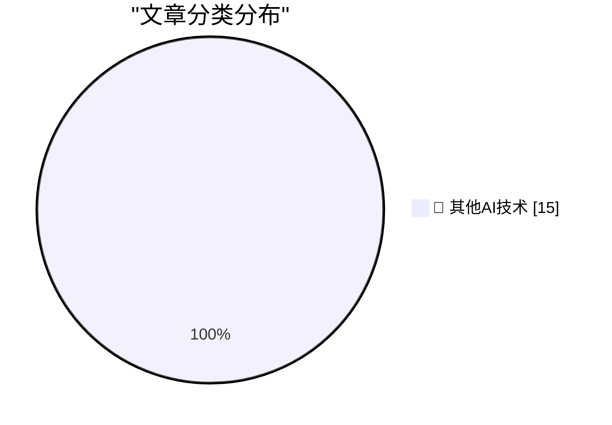

# 📰 AI 博客每日精选 — 2026-05-05

> 来自 98 个技术博客和社交媒体源，AI 精选 Top 15

## 🏆 今日必读

🥇 **The Pentagon Pegs the Cost of the Iran War, So Far, at $25 Billion**

[The Pentagon Pegs the Cost of the Iran War, So Far, at $25 Billion](https://politicalwire.com/2026/04/29/iran-war-has-cost-25-billion-so-far/) — daringfireball.net · 3 分钟前 · 🔬 其他AI技术

> The Pentagon Pegs the Cost of the Iran War, So Far, at $25 Billion

🥈 **★ Software as the Product of Obsession Times Voice**

[★ Software as the Product of Obsession Times Voice](https://daringfireball.net/2026/05/software_as_the_product_of_obsession_times_voice) — daringfireball.net · 58 分钟前 · 🔬 其他AI技术

> ★ Software as the Product of Obsession Times Voice

🥉 **Pedometer++ 8.0**

[Pedometer++ 8.0](https://david-smith.org/blog/2026/04/29/maps-on-watchos/) — daringfireball.net · 3 小时前 · 🔬 其他AI技术

> Pedometer++ 8.0

4️⃣ **[Sponsor] WorkOS: Ready to Sell to Enterprise? Your Product Is Ready, Your Auth Infrastructure Isn’t.**

[[Sponsor] WorkOS: Ready to Sell to Enterprise? Your Product Is Ready, Your Auth Infrastructure Isn’t.](https://workos.com/?utm_source=daringfireball&amp;utm_medium=newsletter&amp;utm_campaign=q22026) — daringfireball.net · 19 小时前 · 🔬 其他AI技术

> [Sponsor] WorkOS: Ready to Sell to Enterprise? Your Product Is Ready, Your Auth Infrastructure Isn’t.

5️⃣ **Chess Peace**

[Chess Peace](https://chesspeace.app/) — daringfireball.net · 19 小时前 · 🔬 其他AI技术

> Chess Peace

---

## 📊 数据概览

| 扫描源 | 抓取文章 | 时间范围 | 精选 |
|:---:|:---:|:---:|:---:|
| 77/98 | 2741 篇 → 28 篇 | 24h | **15 篇** |

### 分类分布

---

====================

## 🔬 其他AI技术

### 1. The Pentagon Pegs the Cost of the Iran War, So Far, at $25 Billion

[The Pentagon Pegs the Cost of the Iran War, So Far, at $25 Billion](https://politicalwire.com/2026/04/29/iran-war-has-cost-25-billion-so-far/) — **daringfireball.net** · 3 分钟前 · ⭐ 15/25

> The Pentagon Pegs the Cost of the Iran War, So Far, at $25 Billion

📌 其他AI技术

---

### 2. ★ Software as the Product of Obsession Times Voice

[★ Software as the Product of Obsession Times Voice](https://daringfireball.net/2026/05/software_as_the_product_of_obsession_times_voice) — **daringfireball.net** · 58 分钟前 · ⭐ 15/25

> ★ Software as the Product of Obsession Times Voice

📌 其他AI技术

---

### 3. Pedometer++ 8.0

[Pedometer++ 8.0](https://david-smith.org/blog/2026/04/29/maps-on-watchos/) — **daringfireball.net** · 3 小时前 · ⭐ 15/25

> Pedometer++ 8.0

📌 其他AI技术

---

### 4. [Sponsor] WorkOS: Ready to Sell to Enterprise? Your Product Is Ready, Your Auth Infrastructure Isn’t.

[[Sponsor] WorkOS: Ready to Sell to Enterprise? Your Product Is Ready, Your Auth Infrastructure Isn’t.](https://workos.com/?utm_source=daringfireball&amp;utm_medium=newsletter&amp;utm_campaign=q22026) — **daringfireball.net** · 19 小时前 · ⭐ 15/25

> [Sponsor] WorkOS: Ready to Sell to Enterprise? Your Product Is Ready, Your Auth Infrastructure Isn’t.

📌 其他AI技术

---

### 5. Chess Peace

[Chess Peace](https://chesspeace.app/) — **daringfireball.net** · 19 小时前 · ⭐ 15/25

> Chess Peace

📌 其他AI技术

---

### 6. Adobe’s ‘Modern’ User Interface Is Just Webpages

[Adobe’s ‘Modern’ User Interface Is Just Webpages](https://pxlnv.com/linklog/adobe-modern-user-interface/) — **daringfireball.net** · 19 小时前 · ⭐ 15/25

> Adobe’s ‘Modern’ User Interface Is Just Webpages

📌 其他AI技术

---

### 7. Paul Thurrott Might Write a Book on Markdown

[Paul Thurrott Might Write a Book on Markdown](https://www.thurrott.com/paul/334577/the-markdown-book-on-writing?utm_source=dlvr.it&amp;utm_medium=mastodon) — **daringfireball.net** · 23 小时前 · ⭐ 15/25

> Paul Thurrott Might Write a Book on Markdown

📌 其他AI技术

---

### 8. ★ Y Combinator’s Stake in OpenAI

[★ Y Combinator’s Stake in OpenAI](https://daringfireball.net/2026/05/y_combinators_stake_in_openai) — **daringfireball.net** · 23 小时前 · ⭐ 15/25

> ★ Y Combinator’s Stake in OpenAI

📌 其他AI技术

---

### 9. AI didn't delete your database, you did

[AI didn't delete your database, you did](https://idiallo.com/blog/ai-didnt-delete-your-database-you-did?src=feed) — **idiallo.com** · 23 小时前 · ⭐ 15/25

> AI didn't delete your database, you did

📌 其他AI技术

---

### 10. Pluralistic: The three armies fighting for the post-American world (05 May 2026)

[Pluralistic: The three armies fighting for the post-American world (05 May 2026)](https://pluralistic.net/2026/05/05/three-is-a-magic-number/) — **pluralistic.net** · 9 小时前 · ⭐ 15/25

> Pluralistic: The three armies fighting for the post-American world (05 May 2026)

📌 其他AI技术

---

### 11. RSS Feeds Send Me More Traffic Than Google

[RSS Feeds Send Me More Traffic Than Google](https://shkspr.mobi/blog/2026/05/rss-feeds-send-me-more-traffic-than-google/) — **shkspr.mobi** · 10 小时前 · ⭐ 15/25

> RSS Feeds Send Me More Traffic Than Google

📌 其他AI技术

---

### 12. A dispute over the TAB key highlights a mismatch between Microsoft and IBM organizational structures

[A dispute over the TAB key highlights a mismatch between Microsoft and IBM organizational structures](https://devblogs.microsoft.com/oldnewthing/20260505-00/?p=112298) — **devblogs.microsoft.com/oldnewthing** · 7 小时前 · ⭐ 15/25

> A dispute over the TAB key highlights a mismatch between Microsoft and IBM organizational structures

📌 其他AI技术

---

### 13. Package Manager Threat Models

[Package Manager Threat Models](https://nesbitt.io/2026/05/05/package-manager-threat-models.html) — **nesbitt.io** · 11 小时前 · ⭐ 15/25

> Package Manager Threat Models

📌 其他AI技术

---

### 14. Fizz Buzz Through Monoids

[Fizz Buzz Through Monoids](https://entropicthoughts.com/fizzbuzz-through-monoids) — **entropicthoughts.com** · 23 小时前 · ⭐ 15/25

> Fizz Buzz Through Monoids

📌 其他AI技术

---

### 15. The Impossible Things We Have to Believe

[The Impossible Things We Have to Believe](https://berthub.eu/articles/posts/the-impossible-things-we-have-to-believe/) — **berthub.eu** · 6 小时前 · ⭐ 15/25

> The Impossible Things We Have to Believe

📌 其他AI技术

---

====================

*生成于 2026-05-05 21:59 | 扫描 77 源 → 获取 2741 篇 → 精选 15 篇*
*基于 [Hacker News Popularity Contest 2025](https://refactoringenglish.com/tools/hn-popularity/) RSS 源列表，由 [Andrej Karpathy](https://x.com/karpathy) 推荐*
*由「懂点儿AI」制作，欢迎关注同名微信公众号获取更多 AI 实用技巧 💡*
