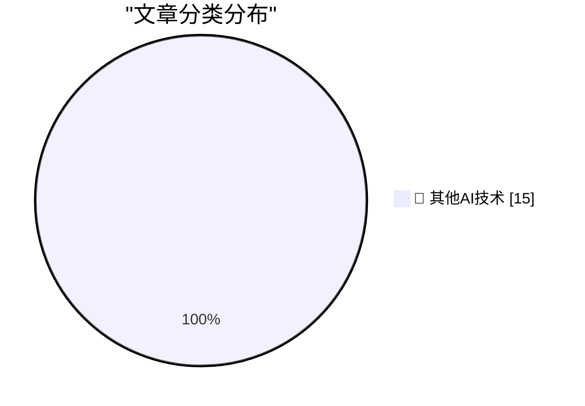

# 📰 AI 博客每日精选 — 2026-05-06

> 来自 98 个技术博客和社交媒体源，AI 精选 Top 15

## 🏆 今日必读

🥇 **Broadcast Booths Around Baseball Tip Their Caps to John Sterling**

[Broadcast Booths Around Baseball Tip Their Caps to John Sterling](https://www.mlb.com/news/broadcast-booths-around-baseball-mirror-john-sterling-signature-calls) — daringfireball.net · 1 小时前 · 🔬 其他AI技术

> Broadcast Booths Around Baseball Tip Their Caps to John Sterling

🥈 **Claris CEO Ryan McCann on FileMaker in the Age of Agentic Coding**

[Claris CEO Ryan McCann on FileMaker in the Age of Agentic Coding](https://www.claris.com/blog/2026/how-claris-is-building-for-what-comes-next) — daringfireball.net · 2 小时前 · 🔬 其他AI技术

> Claris CEO Ryan McCann on FileMaker in the Age of Agentic Coding

🥉 **Luca Maestri Runs the Cafeteria**

[Luca Maestri Runs the Cafeteria](https://www.apple.com/leadership/luca-maestri/) — daringfireball.net · 2 小时前 · 🔬 其他AI技术

> Luca Maestri Runs the Cafeteria

4️⃣ **Apple Cuts More Mac Studio and Mac Mini RAM Options as Memory Shortage Worsens**

[Apple Cuts More Mac Studio and Mac Mini RAM Options as Memory Shortage Worsens](https://www.macrumors.com/2026/05/05/apple-mac-studio-mac-mini-ram-cuts/) — daringfireball.net · 21 小时前 · 🔬 其他AI技术

> Apple Cuts More Mac Studio and Mac Mini RAM Options as Memory Shortage Worsens

5️⃣ **Apple Settles Class Action Lawsuit Over AI Features That Were Advertised but Didn’t Ship for $250 Million**

[Apple Settles Class Action Lawsuit Over AI Features That Were Advertised but Didn’t Ship for $250 Million](https://9to5mac.com/2026/05/05/apple-reaches-250m-settlement-over-siri-delays-users-could-get-up-to-95-per-device/) — daringfireball.net · 21 小时前 · 🔬 其他AI技术

> Apple Settles Class Action Lawsuit Over AI Features That Were Advertised but Didn’t Ship for $250 Million

---

## 📊 数据概览

| 扫描源 | 抓取文章 | 时间范围 | 精选 |
|:---:|:---:|:---:|:---:|
| 77/98 | 2733 篇 → 26 篇 | 24h | **15 篇** |

### 分类分布

---

====================

## 🔬 其他AI技术

### 1. Broadcast Booths Around Baseball Tip Their Caps to John Sterling

[Broadcast Booths Around Baseball Tip Their Caps to John Sterling](https://www.mlb.com/news/broadcast-booths-around-baseball-mirror-john-sterling-signature-calls) — **daringfireball.net** · 1 小时前 · ⭐ 15/25

> Broadcast Booths Around Baseball Tip Their Caps to John Sterling

📌 其他AI技术

---

### 2. Claris CEO Ryan McCann on FileMaker in the Age of Agentic Coding

[Claris CEO Ryan McCann on FileMaker in the Age of Agentic Coding](https://www.claris.com/blog/2026/how-claris-is-building-for-what-comes-next) — **daringfireball.net** · 2 小时前 · ⭐ 15/25

> Claris CEO Ryan McCann on FileMaker in the Age of Agentic Coding

📌 其他AI技术

---

### 3. Luca Maestri Runs the Cafeteria

[Luca Maestri Runs the Cafeteria](https://www.apple.com/leadership/luca-maestri/) — **daringfireball.net** · 2 小时前 · ⭐ 15/25

> Luca Maestri Runs the Cafeteria

📌 其他AI技术

---

### 4. Apple Cuts More Mac Studio and Mac Mini RAM Options as Memory Shortage Worsens

[Apple Cuts More Mac Studio and Mac Mini RAM Options as Memory Shortage Worsens](https://www.macrumors.com/2026/05/05/apple-mac-studio-mac-mini-ram-cuts/) — **daringfireball.net** · 21 小时前 · ⭐ 15/25

> Apple Cuts More Mac Studio and Mac Mini RAM Options as Memory Shortage Worsens

📌 其他AI技术

---

### 5. Apple Settles Class Action Lawsuit Over AI Features That Were Advertised but Didn’t Ship for $250 Million

[Apple Settles Class Action Lawsuit Over AI Features That Were Advertised but Didn’t Ship for $250 Million](https://9to5mac.com/2026/05/05/apple-reaches-250m-settlement-over-siri-delays-users-could-get-up-to-95-per-device/) — **daringfireball.net** · 21 小时前 · ⭐ 15/25

> Apple Settles Class Action Lawsuit Over AI Features That Were Advertised but Didn’t Ship for $250 Million

📌 其他AI技术

---

### 6. The Pentagon Pegs the Cost of the Iran War, So Far, at $25 Billion

[The Pentagon Pegs the Cost of the Iran War, So Far, at $25 Billion](https://politicalwire.com/2026/04/29/iran-war-has-cost-25-billion-so-far/) — **daringfireball.net** · 23 小时前 · ⭐ 15/25

> The Pentagon Pegs the Cost of the Iran War, So Far, at $25 Billion

📌 其他AI技术

---

### 7. Asimov's three laws are merely a suggestion

[Asimov's three laws are merely a suggestion](https://idiallo.com/blog/asimov-three-laws-dont-work-with-ai?src=feed) — **idiallo.com** · 9 小时前 · ⭐ 15/25

> Asimov's three laws are merely a suggestion

📌 其他AI技术

---

### 8. Pluralistic: In praise of vultures (06 May 2026)

[Pluralistic: In praise of vultures (06 May 2026)](https://pluralistic.net/2026/05/06/champerty-loves-company/) — **pluralistic.net** · 11 小时前 · ⭐ 15/25

> Pluralistic: In praise of vultures (06 May 2026)

📌 其他AI技术

---

### 9. Why not have changes in API behavior depend on the SDK you link against?

[Why not have changes in API behavior depend on the SDK you link against?](https://devblogs.microsoft.com/oldnewthing/20260506-00/?p=112303) — **devblogs.microsoft.com/oldnewthing** · 7 小时前 · ⭐ 15/25

> Why not have changes in API behavior depend on the SDK you link against?

📌 其他AI技术

---

### 10. Revisiting the 2015 Open Source Census

[Revisiting the 2015 Open Source Census](https://nesbitt.io/2026/05/06/revisiting-the-2015-open-source-census.html) — **nesbitt.io** · 11 小时前 · ⭐ 15/25

> Revisiting the 2015 Open Source Census

📌 其他AI技术

---

### 11. New Logic for Programmers (and the future of this newsletter)

[New Logic for Programmers (and the future of this newsletter)](https://buttondown.com/hillelwayne/archive/new-logic-for-programmers-and-the-future-of-this/) — **buttondown.com/hillelwayne** · 4 小时前 · ⭐ 15/25

> New Logic for Programmers (and the future of this newsletter)

📌 其他AI技术

---

### 12. Am I Meant To Be Impressed?

[Am I Meant To Be Impressed?](https://www.wheresyoured.at/am-i-meant-to-be-impressed/) — **wheresyoured.at** · 6 小时前 · ⭐ 15/25

> Am I Meant To Be Impressed?

📌 其他AI技术

---

### 13. Adobe’s subscription model

[Adobe’s subscription model](https://dfarq.homeip.net/adobes-subscription-model/?utm_source=rss&#038;utm_medium=rss&#038;utm_campaign=adobes-subscription-model) — **dfarq.homeip.net** · 10 小时前 · ⭐ 15/25

> Adobe’s subscription model

📌 其他AI技术

---

### 14. Open weights are quietly closing up - and that's a problem

[Open weights are quietly closing up - and that's a problem](https://martinalderson.com/posts/open-weights-are-quietly-closing-up/?utm_source=rss&amp;utm_medium=rss&amp;utm_campaign=feed) — **martinalderson.com** · 21 小时前 · ⭐ 15/25

> Open weights are quietly closing up - and that's a problem

📌 其他AI技术

---

### 15. SQLAlchemy 2 In Practice - Chapter 7: Asynchronous SQLAlchemy

[SQLAlchemy 2 In Practice - Chapter 7: Asynchronous SQLAlchemy](https://blog.miguelgrinberg.com/post/sqlalchemy-2-in-practice---chapter-7-asynchronous-sqlalchemy) — **miguelgrinberg.com** · 5 分钟前 · ⭐ 15/25

> SQLAlchemy 2 In Practice - Chapter 7: Asynchronous SQLAlchemy

📌 其他AI技术

---

====================

*生成于 2026-05-06 21:54 | 扫描 77 源 → 获取 2733 篇 → 精选 15 篇*
*基于 [Hacker News Popularity Contest 2025](https://refactoringenglish.com/tools/hn-popularity/) RSS 源列表，由 [Andrej Karpathy](https://x.com/karpathy) 推荐*
*由「懂点儿AI」制作，欢迎关注同名微信公众号获取更多 AI 实用技巧 💡*
