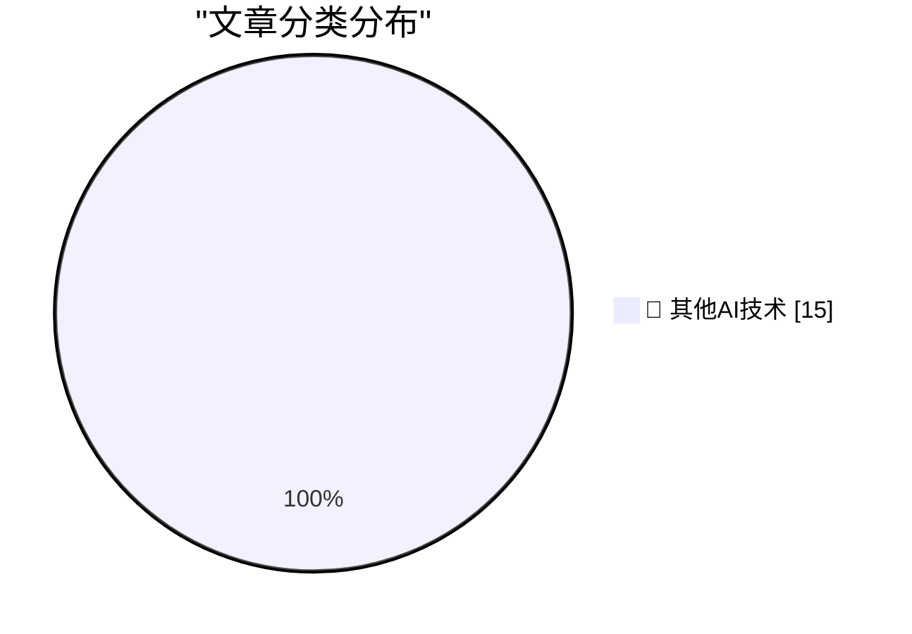

# 📰 AI 博客每日精选 — 2026-05-07

> 来自 98 个技术博客和社交媒体源，AI 精选 Top 15

## 🏆 今日必读

🥇 **Why hasn't longer-horizon training slowed AI progress?**

[Why hasn't longer-horizon training slowed AI progress?](https://seangoedecke.com/why-hasnt-longer-horizon-training-slowed-ai-progress/) — seangoedecke.com · 21 小时前 · 🔬 其他AI技术

> Why hasn't longer-horizon training slowed AI progress?

🥈 **Prolost Watches 1.0**

[Prolost Watches 1.0](https://prolost.com/blog/prolostwatches) — daringfireball.net · 28 分钟前 · 🔬 其他AI技术

> Prolost Watches 1.0

🥉 **The Greatest Match Cut in Cinematic History, Improved by Amazon Prime**

[The Greatest Match Cut in Cinematic History, Improved by Amazon Prime](https://bsky.app/profile/gethill.bsky.social/post/3ml6fyfv7kc2l) — daringfireball.net · 6 小时前 · 🔬 其他AI技术

> The Greatest Match Cut in Cinematic History, Improved by Amazon Prime

4️⃣ **Pluralistic: Bubbles are REALLY evil (07 May 2026)**

[Pluralistic: Bubbles are REALLY evil (07 May 2026)](https://pluralistic.net/2026/05/07/dump-the-pumpers/) — pluralistic.net · 13 小时前 · 🔬 其他AI技术

> Pluralistic: Bubbles are REALLY evil (07 May 2026)

5️⃣ **I've found just the right paper for my Bottom Hole problem**

[I've found just the right paper for my Bottom Hole problem](https://shkspr.mobi/blog/2026/05/ive-found-just-the-right-paper-for-my-bottom-hole-problem/) — shkspr.mobi · 10 小时前 · 🔬 其他AI技术

> I've found just the right paper for my Bottom Hole problem

---

## 📊 数据概览

| 扫描源 | 抓取文章 | 时间范围 | 精选 |
|:---:|:---:|:---:|:---:|
| 77/98 | 2739 篇 → 27 篇 | 24h | **15 篇** |

### 分类分布

---

====================

## 🔬 其他AI技术

### 1. Why hasn't longer-horizon training slowed AI progress?

[Why hasn't longer-horizon training slowed AI progress?](https://seangoedecke.com/why-hasnt-longer-horizon-training-slowed-ai-progress/) — **seangoedecke.com** · 21 小时前 · ⭐ 15/25

> Why hasn't longer-horizon training slowed AI progress?

📌 其他AI技术

---

### 2. Prolost Watches 1.0

[Prolost Watches 1.0](https://prolost.com/blog/prolostwatches) — **daringfireball.net** · 28 分钟前 · ⭐ 15/25

> Prolost Watches 1.0

📌 其他AI技术

---

### 3. The Greatest Match Cut in Cinematic History, Improved by Amazon Prime

[The Greatest Match Cut in Cinematic History, Improved by Amazon Prime](https://bsky.app/profile/gethill.bsky.social/post/3ml6fyfv7kc2l) — **daringfireball.net** · 6 小时前 · ⭐ 15/25

> The Greatest Match Cut in Cinematic History, Improved by Amazon Prime

📌 其他AI技术

---

### 4. Pluralistic: Bubbles are REALLY evil (07 May 2026)

[Pluralistic: Bubbles are REALLY evil (07 May 2026)](https://pluralistic.net/2026/05/07/dump-the-pumpers/) — **pluralistic.net** · 13 小时前 · ⭐ 15/25

> Pluralistic: Bubbles are REALLY evil (07 May 2026)

📌 其他AI技术

---

### 5. I've found just the right paper for my Bottom Hole problem

[I've found just the right paper for my Bottom Hole problem](https://shkspr.mobi/blog/2026/05/ive-found-just-the-right-paper-for-my-bottom-hole-problem/) — **shkspr.mobi** · 10 小时前 · ⭐ 15/25

> I've found just the right paper for my Bottom Hole problem

📌 其他AI技术

---

### 6. Maybe you shouldn't install new software for a bit

[Maybe you shouldn't install new software for a bit](https://xeiaso.net/blog/2026/abstain-from-install/) — **xeiaso.net** · 21 小时前 · ⭐ 15/25

> Maybe you shouldn't install new software for a bit

📌 其他AI技术

---

### 7. When you upgrade your resource strings to Unicode, don’t forget to specify the L prefix

[When you upgrade your resource strings to Unicode, don’t forget to specify the L prefix](https://devblogs.microsoft.com/oldnewthing/20260507-00/?p=112307) — **devblogs.microsoft.com/oldnewthing** · 7 小时前 · ⭐ 15/25

> When you upgrade your resource strings to Unicode, don’t forget to specify the L prefix

📌 其他AI技术

---

### 8. Free as in Tribbles

[Free as in Tribbles](https://nesbitt.io/2026/05/07/free-as-in-tribbles.html) — **nesbitt.io** · 11 小时前 · ⭐ 15/25

> Free as in Tribbles

📌 其他AI技术

---

### 9. Article previews in RSS

[Article previews in RSS](https://entropicthoughts.com/article-previews-in-rss) — **entropicthoughts.com** · 23 小时前 · ⭐ 15/25

> Article previews in RSS

📌 其他AI技术

---

### 10. Intel Pentium II introduced May 7, 1997

[Intel Pentium II introduced May 7, 1997](https://dfarq.homeip.net/intel-pentium-ii-introduced-may-7-1997/?utm_source=rss&#038;utm_medium=rss&#038;utm_campaign=intel-pentium-ii-introduced-may-7-1997) — **dfarq.homeip.net** · 10 小时前 · ⭐ 15/25

> Intel Pentium II introduced May 7, 1997

📌 其他AI技术

---

### 11. Monitor your devices with LibreNMS on FreeBSD

[Monitor your devices with LibreNMS on FreeBSD](https://it-notes.dragas.net/2026/05/07/monitor-your-services-with-librenms-on-freebsd/) — **it-notes.dragas.net** · 11 小时前 · ⭐ 15/25

> Monitor your devices with LibreNMS on FreeBSD

📌 其他AI技术

---

### 12. The Intolerable Hypocrisy of Cyberlibertarianism

[The Intolerable Hypocrisy of Cyberlibertarianism](https://matduggan.com/the-intolerable-hypocrisy-of-cyberlibertarianism/) — **matduggan.com** · 12 小时前 · ⭐ 15/25

> The Intolerable Hypocrisy of Cyberlibertarianism

📌 其他AI技术

---

### 13. RT Micah Carroll: We recently found some instances of CoT grading during the training of previously deployed models after building a system that scans...

[RT Micah Carroll: We recently found some instances of CoT grading during the training of previously deployed models after building a system that scans...](https://x.com/OpenAI/status/2052454114911756687) — **𝕏 @OpenAI** · 3 小时前 · ⭐ 15/25

> RT Micah Carroll: We recently found some instances of CoT grading during the training of previously deployed models after building a system that scans...

📌 其他AI技术

---

### 14. RT jason liu: 新しいリアルタイム翻訳モデルを発表できることをうれしく思います。ぜひ本日よりAPIでお試しください。

[RT jason liu: 新しいリアルタイム翻訳モデルを発表できることをうれしく思います。ぜひ本日よりAPIでお試しください。](https://x.com/OpenAI/status/2052480203172274593) — **𝕏 @OpenAI** · 3 小时前 · ⭐ 15/25

> RT jason liu: 新しいリアルタイム翻訳モデルを発表できることをうれしく思います。ぜひ本日よりAPIでお試しください。

📌 其他AI技术

---

### 15. Happy World Password Day! Consider updating your password from ******** to *********. https://docs.github.com/en/authentication/keeping-your-account-a...

[Happy World Password Day! Consider updating your password from ******** to *********. https://docs.github.com/en/authentication/keeping-your-account-a...](https://x.com/github/status/2052460964881047984) — **𝕏 @GitHub** · 3 小时前 · ⭐ 15/25

> Happy World Password Day! Consider updating your password from ******** to *********. https://docs.github.com/en/authentication/keeping-your-account-a...

📌 其他AI技术

---

====================

*生成于 2026-05-07 21:55 | 扫描 77 源 → 获取 2739 篇 → 精选 15 篇*
*基于 [Hacker News Popularity Contest 2025](https://refactoringenglish.com/tools/hn-popularity/) RSS 源列表，由 [Andrej Karpathy](https://x.com/karpathy) 推荐*
*由「懂点儿AI」制作，欢迎关注同名微信公众号获取更多 AI 实用技巧 💡*
