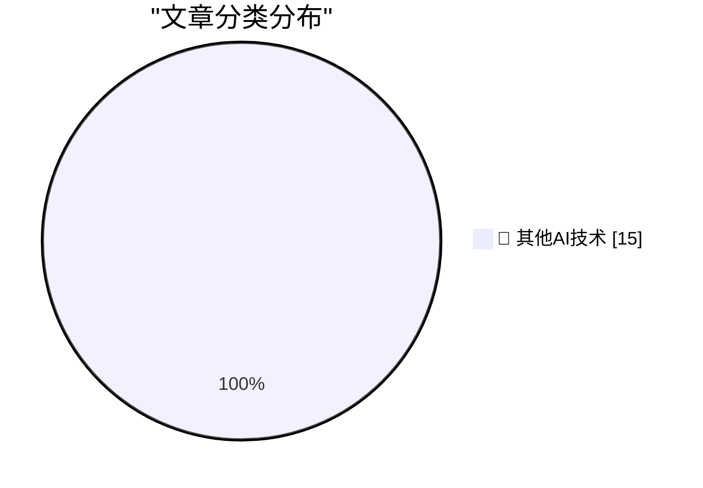

# 📰 AI 博客每日精选 — 2026-05-08

> 来自 98 个技术博客和社交媒体源，AI 精选 Top 15

## 🏆 今日必读

🥇 **HomePod mini feels like magic, but it's just good timing**

[HomePod mini feels like magic, but it's just good timing](https://www.jeffgeerling.com/blog/2026/homepod-mini-feels-like-magic--but-it-s-just-good-timing/) — jeffgeerling.com · 7 小时前 · 🔬 其他AI技术

> HomePod mini feels like magic, but it's just good timing

🥈 **Hi stranger**

[Hi stranger](https://idiallo.com/blog/hi?src=feed) — idiallo.com · 7 小时前 · 🔬 其他AI技术

> Hi stranger

🥉 **Pluralistic: Lee Lai's "Cannon" (08 May 2026)**

[Pluralistic: Lee Lai's "Cannon" (08 May 2026)](https://pluralistic.net/2026/05/08/gung-gung/) — pluralistic.net · 9 小时前 · 🔬 其他AI技术

> Pluralistic: Lee Lai's "Cannon" (08 May 2026)

4️⃣ **Developing more confidence when tracking renames via Read­Directory­ChangesW**

[Developing more confidence when tracking renames via Read­Directory­ChangesW](https://devblogs.microsoft.com/oldnewthing/20260508-00/?p=112310) — devblogs.microsoft.com/oldnewthing · 7 小时前 · 🔬 其他AI技术

> Developing more confidence when tracking renames via Read­Directory­ChangesW

5️⃣ **Pushing Local Models With Focus And Polish**

[Pushing Local Models With Focus And Polish](https://lucumr.pocoo.org/2026/5/8/local-models/) — lucumr.pocoo.org · 21 小时前 · 🔬 其他AI技术

> Pushing Local Models With Focus And Polish

---

## 📊 数据概览

| 扫描源 | 抓取文章 | 时间范围 | 精选 |
|:---:|:---:|:---:|:---:|
| 75/98 | 2703 篇 → 26 篇 | 24h | **15 篇** |

### 分类分布

---

====================

## 🔬 其他AI技术

### 1. HomePod mini feels like magic, but it's just good timing

[HomePod mini feels like magic, but it's just good timing](https://www.jeffgeerling.com/blog/2026/homepod-mini-feels-like-magic--but-it-s-just-good-timing/) — **jeffgeerling.com** · 7 小时前 · ⭐ 15/25

> HomePod mini feels like magic, but it's just good timing

📌 其他AI技术

---

### 2. Hi stranger

[Hi stranger](https://idiallo.com/blog/hi?src=feed) — **idiallo.com** · 7 小时前 · ⭐ 15/25

> Hi stranger

📌 其他AI技术

---

### 3. Pluralistic: Lee Lai's "Cannon" (08 May 2026)

[Pluralistic: Lee Lai's "Cannon" (08 May 2026)](https://pluralistic.net/2026/05/08/gung-gung/) — **pluralistic.net** · 9 小时前 · ⭐ 15/25

> Pluralistic: Lee Lai's "Cannon" (08 May 2026)

📌 其他AI技术

---

### 4. Developing more confidence when tracking renames via Read­Directory­ChangesW

[Developing more confidence when tracking renames via Read­Directory­ChangesW](https://devblogs.microsoft.com/oldnewthing/20260508-00/?p=112310) — **devblogs.microsoft.com/oldnewthing** · 7 小时前 · ⭐ 15/25

> Developing more confidence when tracking renames via Read­Directory­ChangesW

📌 其他AI技术

---

### 5. Pushing Local Models With Focus And Polish

[Pushing Local Models With Focus And Polish](https://lucumr.pocoo.org/2026/5/8/local-models/) — **lucumr.pocoo.org** · 21 小时前 · ⭐ 15/25

> Pushing Local Models With Focus And Polish

📌 其他AI技术

---

### 6. Steering Zig Fmt

[Steering Zig Fmt](https://matklad.github.io/2026/05/08/steering-zig-fmt.html) — **matklad.github.io** · 21 小时前 · ⭐ 15/25

> Steering Zig Fmt

📌 其他AI技术

---

### 7. Weekend at Bernie’s

[Weekend at Bernie’s](https://nesbitt.io/2026/05/08/weekend-at-bernies.html) — **nesbitt.io** · 11 小时前 · ⭐ 15/25

> Weekend at Bernie’s

📌 其他AI技术

---

### 8. Wander Console 0.6.0

[Wander Console 0.6.0](https://susam.net/code/news/wander/0.6.0.html) — **susam.net** · 21 小时前 · ⭐ 15/25

> Wander Console 0.6.0

📌 其他AI技术

---

### 9. David Reich – Why the Bronze Age was an inflection point in human evolution

[David Reich – Why the Bronze Age was an inflection point in human evolution](https://www.dwarkesh.com/p/david-reich-2) — **dwarkesh.com** · 5 小时前 · ⭐ 15/25

> David Reich – Why the Bronze Age was an inflection point in human evolution

📌 其他AI技术

---

### 10. Notes on the Hantavirus Outbreak

[Notes on the Hantavirus Outbreak](https://borretti.me/article/notes-on-the-hantavirus-outbreak) — **borretti.me** · 21 小时前 · ⭐ 15/25

> Notes on the Hantavirus Outbreak

📌 其他AI技术

---

### 11. Premium: AI's Circular Psychosis

[Premium: AI's Circular Psychosis](https://www.wheresyoured.at/premium-ais-circular-psychosis/) — **wheresyoured.at** · 7 小时前 · ⭐ 15/25

> Premium: AI's Circular Psychosis

📌 其他AI技术

---

### 12. This Week on The Analog Antiquarian

[This Week on The Analog Antiquarian](https://www.filfre.net/2026/05/this-week-on-the-analog-antiquarian/) — **filfre.net** · 5 小时前 · ⭐ 15/25

> This Week on The Analog Antiquarian

📌 其他AI技术

---

### 13. Dell buys Alienware, May 8, 2006

[Dell buys Alienware, May 8, 2006](https://dfarq.homeip.net/dell-buys-alienware-may-8-2006/?utm_source=rss&#038;utm_medium=rss&#038;utm_campaign=dell-buys-alienware-may-8-2006) — **dfarq.homeip.net** · 10 小时前 · ⭐ 15/25

> Dell buys Alienware, May 8, 2006

📌 其他AI技术

---

### 14. Flower: an SSG with a Clojure template language

[Flower: an SSG with a Clojure template language](https://jyn.dev/talks/flower/) — **jyn.dev** · 21 小时前 · ⭐ 15/25

> Flower: an SSG with a Clojure template language

📌 其他AI技术

---

### 15. George Orwell's review of Russel's Power: A New Social Analysis

[George Orwell's review of Russel's Power: A New Social Analysis](https://berthub.eu/articles/posts/orwell-review-bertrand-russells-power/) — **berthub.eu** · 1 小时前 · ⭐ 15/25

> George Orwell's review of Russel's Power: A New Social Analysis

📌 其他AI技术

---

====================

*生成于 2026-05-08 21:58 | 扫描 75 源 → 获取 2703 篇 → 精选 15 篇*
*基于 [Hacker News Popularity Contest 2025](https://refactoringenglish.com/tools/hn-popularity/) RSS 源列表，由 [Andrej Karpathy](https://x.com/karpathy) 推荐*
*由「懂点儿AI」制作，欢迎关注同名微信公众号获取更多 AI 实用技巧 💡*
