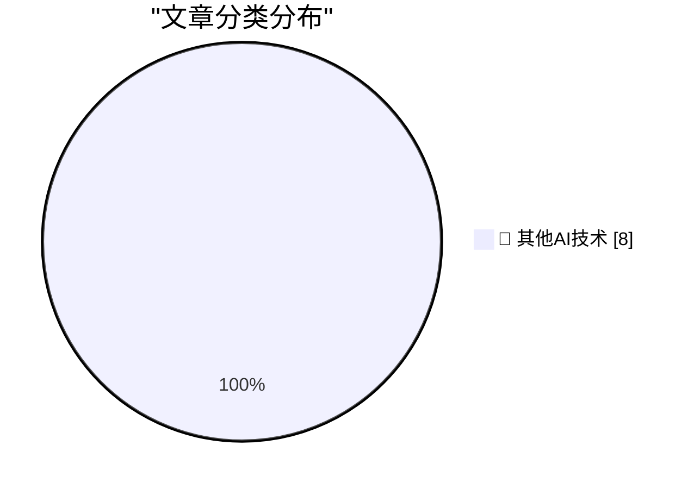

# 📰 AI 博客每日精选 — 2026-05-09

> 来自 98 个技术博客和社交媒体源，AI 精选 Top 8

## 🏆 今日必读

🥇 **Pluralistic: Trump's fruitless search for a goreable ox (09 May 2026)**

[Pluralistic: Trump's fruitless search for a goreable ox (09 May 2026)](https://pluralistic.net/2026/05/09/cossie-livvie-crissie/) — pluralistic.net · 8 小时前 · 🔬 其他AI技术

> Pluralistic: Trump's fruitless search for a goreable ox (09 May 2026)

🥈 **Book Review: The Names by Florence Knapp ★★⯪☆☆**

[Book Review: The Names by Florence Knapp ★★⯪☆☆](https://shkspr.mobi/blog/2026/05/book-review-the-names-by-florence-knapp/) — shkspr.mobi · 10 小时前 · 🔬 其他AI技术

> Book Review: The Names by Florence Knapp ★★⯪☆☆

🥉 **The Mismeasure of Open Source**

[The Mismeasure of Open Source](https://nesbitt.io/2026/05/09/the-mismeasure-of-open-source.html) — nesbitt.io · 11 小时前 · 🔬 其他AI技术

> The Mismeasure of Open Source

4️⃣ **I Will Not Add Query Strings to Your URLs**

[I Will Not Add Query Strings to Your URLs](https://susam.net/no-query-strings.html) — susam.net · 21 小时前 · 🔬 其他AI技术

> I Will Not Add Query Strings to Your URLs

5️⃣ **TanStack now has TanStack AI. 👀 Here's what to expect from this new, fully open-source toolkit. ▶️**

[TanStack now has TanStack AI. 👀 Here's what to expect from this new, fully open-source toolkit. ▶️](https://x.com/github/status/2053178420981305452) — 𝕏 @GitHub · 3 小时前 · 🔬 其他AI技术

> TanStack now has TanStack AI. 👀 Here's what to expect from this new, fully open-source toolkit. ▶️

---

## 📊 数据概览

| 扫描源 | 抓取文章 | 时间范围 | 精选 |
|:---:|:---:|:---:|:---:|
| 76/98 | 2718 篇 → 8 篇 | 24h | **8 篇** |

### 分类分布

---

====================

## 🔬 其他AI技术

### 1. Pluralistic: Trump's fruitless search for a goreable ox (09 May 2026)

[Pluralistic: Trump's fruitless search for a goreable ox (09 May 2026)](https://pluralistic.net/2026/05/09/cossie-livvie-crissie/) — **pluralistic.net** · 8 小时前 · ⭐ 15/25

> Pluralistic: Trump's fruitless search for a goreable ox (09 May 2026)

📌 其他AI技术

---

### 2. Book Review: The Names by Florence Knapp ★★⯪☆☆

[Book Review: The Names by Florence Knapp ★★⯪☆☆](https://shkspr.mobi/blog/2026/05/book-review-the-names-by-florence-knapp/) — **shkspr.mobi** · 10 小时前 · ⭐ 15/25

> Book Review: The Names by Florence Knapp ★★⯪☆☆

📌 其他AI技术

---

### 3. The Mismeasure of Open Source

[The Mismeasure of Open Source](https://nesbitt.io/2026/05/09/the-mismeasure-of-open-source.html) — **nesbitt.io** · 11 小时前 · ⭐ 15/25

> The Mismeasure of Open Source

📌 其他AI技术

---

### 4. I Will Not Add Query Strings to Your URLs

[I Will Not Add Query Strings to Your URLs](https://susam.net/no-query-strings.html) — **susam.net** · 21 小时前 · ⭐ 15/25

> I Will Not Add Query Strings to Your URLs

📌 其他AI技术

---

### 5. TanStack now has TanStack AI. 👀 Here's what to expect from this new, fully open-source toolkit. ▶️

[TanStack now has TanStack AI. 👀 Here's what to expect from this new, fully open-source toolkit. ▶️](https://x.com/github/status/2053178420981305452) — **𝕏 @GitHub** · 3 小时前 · ⭐ 15/25

> TanStack now has TanStack AI. 👀 Here's what to expect from this new, fully open-source toolkit. ▶️

📌 其他AI技术

---

### 6. And just like that, the first month of AI Labs is a wrap. NYC → Stockholm → Sydney → Tokyo. This run was all about Custom Agents + Notion Workers (...

[And just like that, the first month of AI Labs is a wrap. NYC → Stockholm → Sydney → Tokyo. This run was all about Custom Agents + Notion Workers (...](https://x.com/NotionHQ/status/2052867854501085523) — **𝕏 @NotionHQ** · 23 小时前 · ⭐ 15/25

> And just like that, the first month of AI Labs is a wrap. NYC → Stockholm → Sydney → Tokyo. This run was all about Custom Agents + Notion Workers (...

📌 其他AI技术

---

### 7. There’s a lot of pressure to move fast with AI. But if people aren’t part of the process, it doesn’t really work. The companies pulling ahead are t...

[There’s a lot of pressure to move fast with AI. But if people aren’t part of the process, it doesn’t really work. The companies pulling ahead are t...](https://x.com/Microsoft365/status/2052893863468003445) — **𝕏 @Microsoft365** · 22 小时前 · ⭐ 15/25

> There’s a lot of pressure to move fast with AI. But if people aren’t part of the process, it doesn’t really work. The companies pulling ahead are t...

📌 其他AI技术

---

### 8. 130% growth in one year? 🚀 Chef Ryan Scott is using Gemini and Google Calendar to respond to catering requests faster and mesh new cultural cuisine...

[130% growth in one year? 🚀 Chef Ryan Scott is using Gemini and Google Calendar to respond to catering requests faster and mesh new cultural cuisine...](https://x.com/GoogleWorkspace/status/2052894933346816448) — **𝕏 @GoogleWorkspace** · 22 小时前 · ⭐ 15/25

> 130% growth in one year? 🚀 Chef Ryan Scott is using Gemini and Google Calendar to respond to catering requests faster and mesh new cultural cuisine...

📌 其他AI技术

---

====================

*生成于 2026-05-09 21:41 | 扫描 76 源 → 获取 2718 篇 → 精选 8 篇*
*基于 [Hacker News Popularity Contest 2025](https://refactoringenglish.com/tools/hn-popularity/) RSS 源列表，由 [Andrej Karpathy](https://x.com/karpathy) 推荐*
*由「懂点儿AI」制作，欢迎关注同名微信公众号获取更多 AI 实用技巧 💡*
