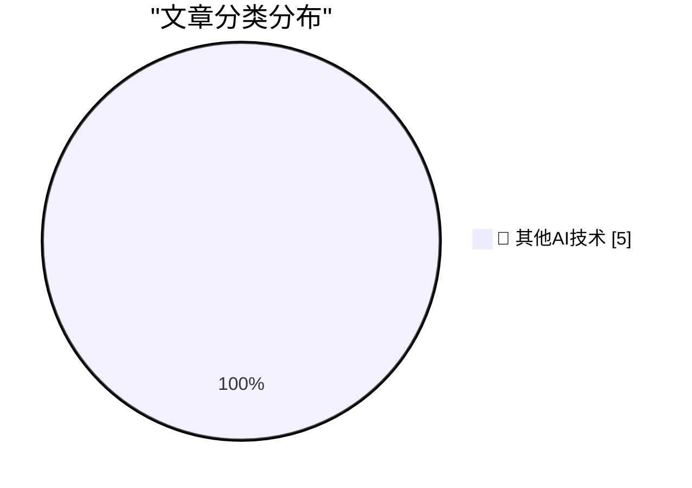

# 📰 AI 博客每日精选 — 2026-05-10

> 来自 98 个技术博客和社交媒体源，AI 精选 Top 5

## 🏆 今日必读

🥇 **WorkOS**

[WorkOS](https://workos.com/?utm_source=daringfireball&amp;utm_medium=newsletter&amp;utm_campaign=q22026) — daringfireball.net · 7 小时前 · 🔬 其他AI技术

> WorkOS

🥈 **Meta to Start Capturing Employee Mouse Movements, Keystrokes for AI Training Data**

[Meta to Start Capturing Employee Mouse Movements, Keystrokes for AI Training Data](https://www.reuters.com/sustainability/boards-policy-regulation/meta-start-capturing-employee-mouse-movements-keystrokes-ai-training-data-2026-04-21/) — daringfireball.net · 7 小时前 · 🔬 其他AI技术

> Meta to Start Capturing Employee Mouse Movements, Keystrokes for AI Training Data

🥉 **[RSS Club] A Sneak Preview of Upcoming Posts**

[[RSS Club] A Sneak Preview of Upcoming Posts](https://shkspr.mobi/blog/2026/05/rss-club-a-sneak-preview-of-upcoming-posts/) — shkspr.mobi · 10 小时前 · 🔬 其他AI技术

> [RSS Club] A Sneak Preview of Upcoming Posts

4️⃣ **Madame Semver Will See You Now**

[Madame Semver Will See You Now](https://nesbitt.io/2026/05/10/madame-semver-will-see-you-now.html) — nesbitt.io · 11 小时前 · 🔬 其他AI技术

> Madame Semver Will See You Now

5️⃣ **New to GitHub Copilot CLI? Our beginner series makes it easy to get started. Bring agentic AI right to your terminal and speed up your workflow. 💻...**

[New to GitHub Copilot CLI? Our beginner series makes it easy to get started. Bring agentic AI right to your terminal and speed up your workflow. 💻...](https://x.com/github/status/2053541834513645730) — 𝕏 @GitHub · 3 小时前 · 🔬 其他AI技术

> New to GitHub Copilot CLI? Our beginner series makes it easy to get started. Bring agentic AI right to your terminal and speed up your workflow. 💻...

---

## 📊 数据概览

| 扫描源 | 抓取文章 | 时间范围 | 精选 |
|:---:|:---:|:---:|:---:|
| 76/98 | 2719 篇 → 5 篇 | 24h | **5 篇** |

### 分类分布

---

====================

## 🔬 其他AI技术

### 1. WorkOS

[WorkOS](https://workos.com/?utm_source=daringfireball&amp;utm_medium=newsletter&amp;utm_campaign=q22026) — **daringfireball.net** · 7 小时前 · ⭐ 15/25

> WorkOS

📌 其他AI技术

---

### 2. Meta to Start Capturing Employee Mouse Movements, Keystrokes for AI Training Data

[Meta to Start Capturing Employee Mouse Movements, Keystrokes for AI Training Data](https://www.reuters.com/sustainability/boards-policy-regulation/meta-start-capturing-employee-mouse-movements-keystrokes-ai-training-data-2026-04-21/) — **daringfireball.net** · 7 小时前 · ⭐ 15/25

> Meta to Start Capturing Employee Mouse Movements, Keystrokes for AI Training Data

📌 其他AI技术

---

### 3. [RSS Club] A Sneak Preview of Upcoming Posts

[[RSS Club] A Sneak Preview of Upcoming Posts](https://shkspr.mobi/blog/2026/05/rss-club-a-sneak-preview-of-upcoming-posts/) — **shkspr.mobi** · 10 小时前 · ⭐ 15/25

> [RSS Club] A Sneak Preview of Upcoming Posts

📌 其他AI技术

---

### 4. Madame Semver Will See You Now

[Madame Semver Will See You Now](https://nesbitt.io/2026/05/10/madame-semver-will-see-you-now.html) — **nesbitt.io** · 11 小时前 · ⭐ 15/25

> Madame Semver Will See You Now

📌 其他AI技术

---

### 5. New to GitHub Copilot CLI? Our beginner series makes it easy to get started. Bring agentic AI right to your terminal and speed up your workflow. 💻...

[New to GitHub Copilot CLI? Our beginner series makes it easy to get started. Bring agentic AI right to your terminal and speed up your workflow. 💻...](https://x.com/github/status/2053541834513645730) — **𝕏 @GitHub** · 3 小时前 · ⭐ 15/25

> New to GitHub Copilot CLI? Our beginner series makes it easy to get started. Bring agentic AI right to your terminal and speed up your workflow. 💻...

📌 其他AI技术

---

====================

*生成于 2026-05-10 21:45 | 扫描 76 源 → 获取 2719 篇 → 精选 5 篇*
*基于 [Hacker News Popularity Contest 2025](https://refactoringenglish.com/tools/hn-popularity/) RSS 源列表，由 [Andrej Karpathy](https://x.com/karpathy) 推荐*
*由「懂点儿AI」制作，欢迎关注同名微信公众号获取更多 AI 实用技巧 💡*
