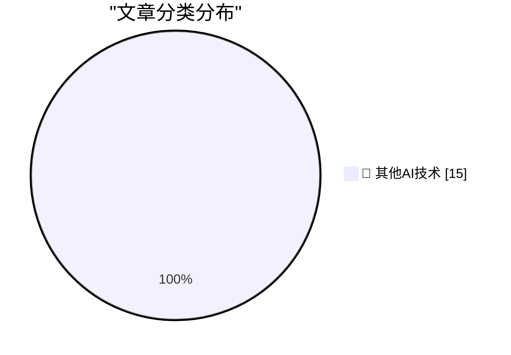

# 📰 AI 博客每日精选 — 2026-05-12

> 来自 98 个技术博客和社交媒体源，AI 精选 Top 15

## 🏆 今日必读

🥇 **Bambu Lab is abusing the open source social contract**

[Bambu Lab is abusing the open source social contract](https://www.jeffgeerling.com/blog/2026/bambu-lab-abusing-open-source-social-contract/) — jeffgeerling.com · 8 小时前 · 🔬 其他AI技术

> Bambu Lab is abusing the open source social contract

🥈 **Thinking Machines and interaction models**

[Thinking Machines and interaction models](https://seangoedecke.com/interaction-models/) — seangoedecke.com · 22 小时前 · 🔬 其他AI技术

> Thinking Machines and interaction models

🥉 **Kagi Snaps**

[Kagi Snaps](https://help.kagi.com/kagi/features/snaps.html) — daringfireball.net · 1 小时前 · 🔬 其他AI技术

> Kagi Snaps

4️⃣ **Seriously, Give Kagi a Try**

[Seriously, Give Kagi a Try](https://daringfireball.net/2025/04/try_switching_to_kagi) — daringfireball.net · 1 小时前 · 🔬 其他AI技术

> Seriously, Give Kagi a Try

5️⃣ **Search Ads as a Vector for Travel Scams**

[Search Ads as a Vector for Travel Scams](https://www.wsj.com/lifestyle/travel/the-simple-travel-scam-that-cost-a-seasoned-traveler-over-12-000-7d317f20?st=WDTpv5) — daringfireball.net · 1 小时前 · 🔬 其他AI技术

> Search Ads as a Vector for Travel Scams

---

## 📊 数据概览

| 扫描源 | 抓取文章 | 时间范围 | 精选 |
|:---:|:---:|:---:|:---:|
| 77/98 | 2757 篇 → 26 篇 | 24h | **15 篇** |

### 分类分布

---

====================

## 🔬 其他AI技术

### 1. Bambu Lab is abusing the open source social contract

[Bambu Lab is abusing the open source social contract](https://www.jeffgeerling.com/blog/2026/bambu-lab-abusing-open-source-social-contract/) — **jeffgeerling.com** · 8 小时前 · ⭐ 15/25

> Bambu Lab is abusing the open source social contract

📌 其他AI技术

---

### 2. Thinking Machines and interaction models

[Thinking Machines and interaction models](https://seangoedecke.com/interaction-models/) — **seangoedecke.com** · 22 小时前 · ⭐ 15/25

> Thinking Machines and interaction models

📌 其他AI技术

---

### 3. Kagi Snaps

[Kagi Snaps](https://help.kagi.com/kagi/features/snaps.html) — **daringfireball.net** · 1 小时前 · ⭐ 15/25

> Kagi Snaps

📌 其他AI技术

---

### 4. Seriously, Give Kagi a Try

[Seriously, Give Kagi a Try](https://daringfireball.net/2025/04/try_switching_to_kagi) — **daringfireball.net** · 1 小时前 · ⭐ 15/25

> Seriously, Give Kagi a Try

📌 其他AI技术

---

### 5. Search Ads as a Vector for Travel Scams

[Search Ads as a Vector for Travel Scams](https://www.wsj.com/lifestyle/travel/the-simple-travel-scam-that-cost-a-seasoned-traveler-over-12-000-7d317f20?st=WDTpv5) — **daringfireball.net** · 1 小时前 · ⭐ 15/25

> Search Ads as a Vector for Travel Scams

📌 其他AI技术

---

### 6. Teresa Ribera Visited the U.S. and No One Noticed

[Teresa Ribera Visited the U.S. and No One Noticed](https://www.politico.eu/article/eu-big-tech-rulebook-shifting-digital-economy-ribera-dma-pulse-forum/) — **daringfireball.net** · 2 小时前 · ⭐ 15/25

> Teresa Ribera Visited the U.S. and No One Noticed

📌 其他AI技术

---

### 7. Broadcasters Urge EU to Use the DMA to Go After Smart TV Platforms, None of Which Are From European Companies

[Broadcasters Urge EU to Use the DMA to Go After Smart TV Platforms, None of Which Are From European Companies](https://www.reuters.com/sustainability/boards-policy-regulation/eu-digital-rules-should-apply-big-techs-smart-tvs-broadcasters-tell-antitrust-2026-03-23/) — **daringfireball.net** · 2 小时前 · ⭐ 15/25

> Broadcasters Urge EU to Use the DMA to Go After Smart TV Platforms, None of Which Are From European Companies

📌 其他AI技术

---

### 8. New DMA Compliance Features for EU Users in iOS 26.5 (and Perhaps the EU Has Finally Come to Their Senses on Tech Regulation)

[New DMA Compliance Features for EU Users in iOS 26.5 (and Perhaps the EU Has Finally Come to Their Senses on Tech Regulation)](https://www.macrumors.com/2026/05/11/ios-26-5-eu-third-party-wearable-changes/) — **daringfireball.net** · 3 小时前 · ⭐ 15/25

> New DMA Compliance Features for EU Users in iOS 26.5 (and Perhaps the EU Has Finally Come to Their Senses on Tech Regulation)

📌 其他AI技术

---

### 9. [Sponsor] Drata

[[Sponsor] Drata](https://drata.com/daring) — **daringfireball.net** · 21 小时前 · ⭐ 15/25

> [Sponsor] Drata

📌 其他AI技术

---

### 10. iOS 26.5 Includes Beta Support for End-to-End Encrypted RCS Messaging

[iOS 26.5 Includes Beta Support for End-to-End Encrypted RCS Messaging](https://www.apple.com/newsroom/2026/05/end-to-end-encrypted-rcs-messaging-begins-rolling-out-today-in-beta/) — **daringfireball.net** · 23 小时前 · ⭐ 15/25

> iOS 26.5 Includes Beta Support for End-to-End Encrypted RCS Messaging

📌 其他AI技术

---

### 11. Pluralistic: A fascist paradigm (12 May 2026)

[Pluralistic: A fascist paradigm (12 May 2026)](https://pluralistic.net/2026/05/12/donella-meadows/) — **pluralistic.net** · 14 小时前 · ⭐ 15/25

> Pluralistic: A fascist paradigm (12 May 2026)

📌 其他AI技术

---

### 12. Learning Software Architecture

[Learning Software Architecture](https://matklad.github.io/2026/05/12/software-architecture.html) — **matklad.github.io** · 22 小时前 · ⭐ 15/25

> Learning Software Architecture

📌 其他AI技术

---

### 13. Not a Security Issue

[Not a Security Issue](https://nesbitt.io/2026/05/12/not-a-security-issue.html) — **nesbitt.io** · 12 小时前 · ⭐ 15/25

> Not a Security Issue

📌 其他AI技术

---

### 14. Where Are All The Data Centers?

[Where Are All The Data Centers?](https://www.wheresyoured.at/where-are-all-the-data-centers/) — **wheresyoured.at** · 5 小时前 · ⭐ 15/25

> Where Are All The Data Centers?

📌 其他AI技术

---

### 15. Building Software Requires Digestion

[Building Software Requires Digestion](https://blog.jim-nielsen.com/2026/software-requires-digestion/) — **blog.jim-nielsen.com** · 3 小时前 · ⭐ 15/25

> Building Software Requires Digestion

📌 其他AI技术

---

====================

*生成于 2026-05-12 22:10 | 扫描 77 源 → 获取 2757 篇 → 精选 15 篇*
*基于 [Hacker News Popularity Contest 2025](https://refactoringenglish.com/tools/hn-popularity/) RSS 源列表，由 [Andrej Karpathy](https://x.com/karpathy) 推荐*
*由「懂点儿AI」制作，欢迎关注同名微信公众号获取更多 AI 实用技巧 💡*
