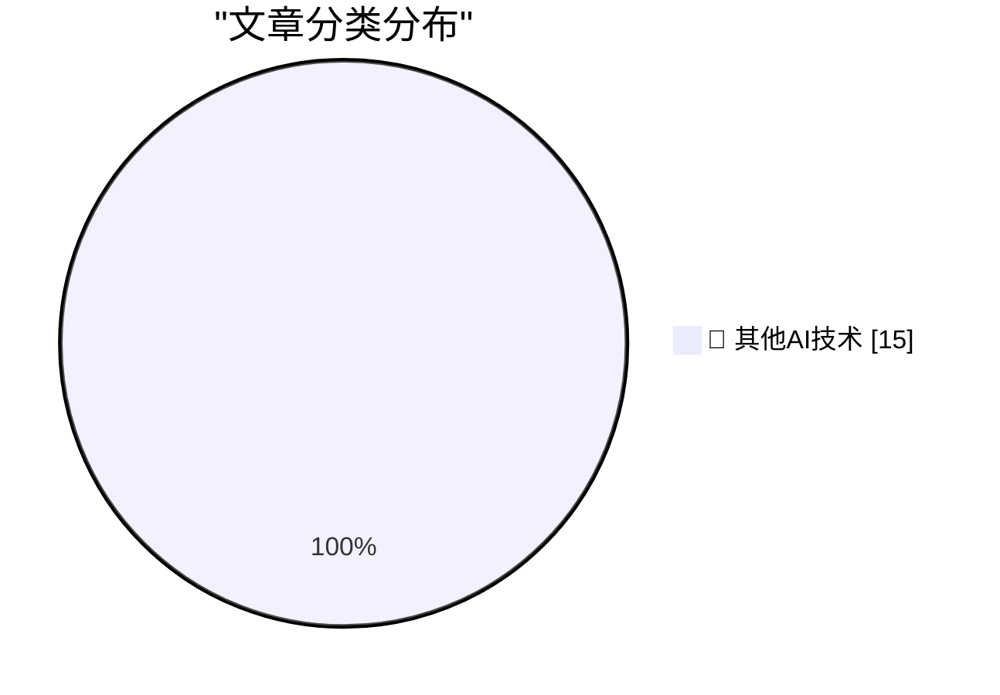

# 📰 AI 博客每日精选 — 2026-05-13

> 来自 98 个技术博客和社交媒体源，AI 精选 Top 15

## 🏆 今日必读

🥇 **AI datacenters in space do not have a cooling problem**

[AI datacenters in space do not have a cooling problem](https://seangoedecke.com/space-ai-datacenters-do-not-have-a-cooling-problem/) — seangoedecke.com · 22 小时前 · 🔬 其他AI技术

> AI datacenters in space do not have a cooling problem

🥈 **★ Nextpad++**

[★ Nextpad++](https://daringfireball.net/2026/05/nextpad) — daringfireball.net · 19 小时前 · 🔬 其他AI技术

> ★ Nextpad++

🥉 **Pluralistic: Billionaire solipsism, dictator solipsism, AI, and the fascist paradigm (13 May 2026)**

[Pluralistic: Billionaire solipsism, dictator solipsism, AI, and the fascist paradigm (13 May 2026)](https://pluralistic.net/2026/05/13/vibe-governance/) — pluralistic.net · 6 小时前 · 🔬 其他AI技术

> Pluralistic: Billionaire solipsism, dictator solipsism, AI, and the fascist paradigm (13 May 2026)

4️⃣ **Stupidly Simple SVG Sparklines**

[Stupidly Simple SVG Sparklines](https://shkspr.mobi/blog/2026/05/stupidly-simple-svg-sparklines/) — shkspr.mobi · 10 小时前 · 🔬 其他AI技术

> Stupidly Simple SVG Sparklines

5️⃣ **What’s with all the slide decks?**

[What’s with all the slide decks?](https://dynomight.net/slides/) — dynomight.net · 22 小时前 · 🔬 其他AI技术

> What’s with all the slide decks?

---

## 📊 数据概览

| 扫描源 | 抓取文章 | 时间范围 | 精选 |
|:---:|:---:|:---:|:---:|
| 78/98 | 2781 篇 → 27 篇 | 24h | **15 篇** |

### 分类分布

---

====================

## 🔬 其他AI技术

### 1. AI datacenters in space do not have a cooling problem

[AI datacenters in space do not have a cooling problem](https://seangoedecke.com/space-ai-datacenters-do-not-have-a-cooling-problem/) — **seangoedecke.com** · 22 小时前 · ⭐ 15/25

> AI datacenters in space do not have a cooling problem

📌 其他AI技术

---

### 2. ★ Nextpad++

[★ Nextpad++](https://daringfireball.net/2026/05/nextpad) — **daringfireball.net** · 19 小时前 · ⭐ 15/25

> ★ Nextpad++

📌 其他AI技术

---

### 3. Pluralistic: Billionaire solipsism, dictator solipsism, AI, and the fascist paradigm (13 May 2026)

[Pluralistic: Billionaire solipsism, dictator solipsism, AI, and the fascist paradigm (13 May 2026)](https://pluralistic.net/2026/05/13/vibe-governance/) — **pluralistic.net** · 6 小时前 · ⭐ 15/25

> Pluralistic: Billionaire solipsism, dictator solipsism, AI, and the fascist paradigm (13 May 2026)

📌 其他AI技术

---

### 4. Stupidly Simple SVG Sparklines

[Stupidly Simple SVG Sparklines](https://shkspr.mobi/blog/2026/05/stupidly-simple-svg-sparklines/) — **shkspr.mobi** · 10 小时前 · ⭐ 15/25

> Stupidly Simple SVG Sparklines

📌 其他AI技术

---

### 5. What’s with all the slide decks?

[What’s with all the slide decks?](https://dynomight.net/slides/) — **dynomight.net** · 22 小时前 · ⭐ 15/25

> What’s with all the slide decks?

📌 其他AI技术

---

### 6. The case of the hang when the user changed keyboard layouts

[The case of the hang when the user changed keyboard layouts](https://devblogs.microsoft.com/oldnewthing/20260513-00/?p=112318) — **devblogs.microsoft.com/oldnewthing** · 8 小时前 · ⭐ 15/25

> The case of the hang when the user changed keyboard layouts

📌 其他AI技术

---

### 7. Open Link in Unloaded Tab, a little Firefox extension

[Open Link in Unloaded Tab, a little Firefox extension](https://evanhahn.com/open-link-in-unloaded-tab-for-firefox/) — **evanhahn.com** · 22 小时前 · ⭐ 15/25

> Open Link in Unloaded Tab, a little Firefox extension

📌 其他AI技术

---

### 8. Showing Our Work

[Showing Our Work](https://nesbitt.io/2026/05/13/showing-our-work.html) — **nesbitt.io** · 12 小时前 · ⭐ 15/25

> Showing Our Work

📌 其他AI技术

---

### 9. Commenting Guidelines

[Commenting Guidelines](https://susam.net/commenting.html) — **susam.net** · -112 分钟前 · ⭐ 15/25

> Commenting Guidelines

📌 其他AI技术

---

### 10. Points are a weird and inconsistent unit of measure

[Points are a weird and inconsistent unit of measure](https://buttondown.com/hillelwayne/archive/points-are-a-weird-and-inconsistent-unit-of/) — **buttondown.com/hillelwayne** · 6 小时前 · ⭐ 15/25

> Points are a weird and inconsistent unit of measure

📌 其他AI技术

---

### 11. How Shark Tank’s Kevin O’Leary became rich

[How Shark Tank’s Kevin O’Leary became rich](https://dfarq.homeip.net/how-shark-tanks-kevin-oleary-became-rich/?utm_source=rss&#038;utm_medium=rss&#038;utm_campaign=how-shark-tanks-kevin-oleary-became-rich) — **dfarq.homeip.net** · 11 小时前 · ⭐ 15/25

> How Shark Tank’s Kevin O’Leary became rich

📌 其他AI技术

---

### 12. Ideal failures

[Ideal failures](https://danieldelaney.net/ideal-failures/) — **danieldelaney.net** · 22 小时前 · ⭐ 15/25

> Ideal failures

📌 其他AI技术

---

### 13. Another reason to switch to Codex.

[Another reason to switch to Codex.](https://x.com/OpenAI/status/2054620621255192719) — **𝕏 @OpenAI** · 4 小时前 · ⭐ 15/25

> Another reason to switch to Codex.

📌 其他AI技术

---

### 14. RT Kayla Cinnamon ☕: GitHub Copilot CLI now has a statusline feature! Here's how to set it up with Oh My Posh ❤️‍🔥

[RT Kayla Cinnamon ☕: GitHub Copilot CLI now has a statusline feature! Here's how to set it up with Oh My Posh ❤️‍🔥](https://x.com/github/status/2054603238809509918) — **𝕏 @GitHub** · 5 小时前 · ⭐ 15/25

> RT Kayla Cinnamon ☕: GitHub Copilot CLI now has a statusline feature! Here's how to set it up with Oh My Posh ❤️‍🔥

📌 其他AI技术

---

### 15. Caught the launch of our Developer Platform? Pull up a chair 🪑 Our expert in residence is here to help you build your first sync: pull data from an...

[Caught the launch of our Developer Platform? Pull up a chair 🪑 Our expert in residence is here to help you build your first sync: pull data from an...](https://x.com/NotionHQ/status/2054647790060609922) — **𝕏 @NotionHQ** · 2 小时前 · ⭐ 15/25

> Caught the launch of our Developer Platform? Pull up a chair 🪑 Our expert in residence is here to help you build your first sync: pull data from an...

📌 其他AI技术

---

====================

*生成于 2026-05-13 22:08 | 扫描 78 源 → 获取 2781 篇 → 精选 15 篇*
*基于 [Hacker News Popularity Contest 2025](https://refactoringenglish.com/tools/hn-popularity/) RSS 源列表，由 [Andrej Karpathy](https://x.com/karpathy) 推荐*
*由「懂点儿AI」制作，欢迎关注同名微信公众号获取更多 AI 实用技巧 💡*
