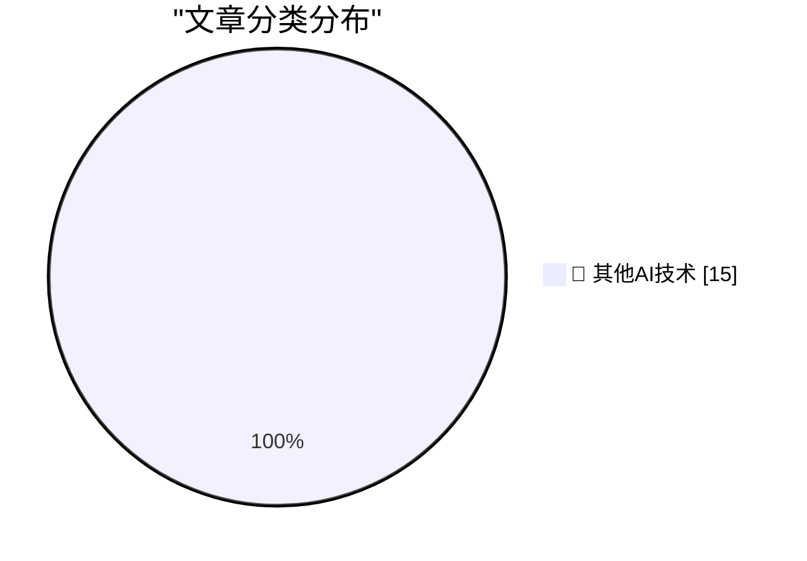

# 📰 AI 博客每日精选 — 2026-05-16

> 来自 98 个技术博客和社交媒体源，AI 精选 Top 15

## 🏆 今日必读

🥇 **How I use LLMs as a staff engineer in 2026**

[How I use LLMs as a staff engineer in 2026](https://seangoedecke.com/how-i-use-llms-in-2026/) — seangoedecke.com · -135 分钟前 · 🔬 其他AI技术

> How I use LLMs as a staff engineer in 2026

🥈 **DeepSeek-V4-Flash means LLM steering is interesting again**

[DeepSeek-V4-Flash means LLM steering is interesting again](https://seangoedecke.com/steering-vectors/) — seangoedecke.com · 21 小时前 · 🔬 其他AI技术

> DeepSeek-V4-Flash means LLM steering is interesting again

🥉 **Reddit Is Blocking Some Users From Accessing Its Website From Mobile Devices**

[Reddit Is Blocking Some Users From Accessing Its Website From Mobile Devices](https://arstechnica.com/information-technology/2026/05/why-reddit-blocked-my-daily-visit-to-its-mobile-website/) — daringfireball.net · 22 分钟前 · 🔬 其他AI技术

> Reddit Is Blocking Some Users From Accessing Its Website From Mobile Devices

4️⃣ **Santa Clara County Sues Meta Over Alleged Scam Ads**

[Santa Clara County Sues Meta Over Alleged Scam Ads](https://sanjosespotlight.com/santa-clara-county-sues-meta-over-alleged-scam-ads/) — daringfireball.net · 27 分钟前 · 🔬 其他AI技术

> Santa Clara County Sues Meta Over Alleged Scam Ads

5️⃣ **★ AI Is Technology, Not a Product**

[★ AI Is Technology, Not a Product](https://daringfireball.net/2026/05/ai_is_technology_not_a_product) — daringfireball.net · 1 小时前 · 🔬 其他AI技术

> ★ AI Is Technology, Not a Product

---

## 📊 数据概览

| 扫描源 | 抓取文章 | 时间范围 | 精选 |
|:---:|:---:|:---:|:---:|
| 75/98 | 2741 篇 → 18 篇 | 24h | **15 篇** |

### 分类分布

---

====================

## 🔬 其他AI技术

### 1. How I use LLMs as a staff engineer in 2026

[How I use LLMs as a staff engineer in 2026](https://seangoedecke.com/how-i-use-llms-in-2026/) — **seangoedecke.com** · -135 分钟前 · ⭐ 15/25

> How I use LLMs as a staff engineer in 2026

📌 其他AI技术

---

### 2. DeepSeek-V4-Flash means LLM steering is interesting again

[DeepSeek-V4-Flash means LLM steering is interesting again](https://seangoedecke.com/steering-vectors/) — **seangoedecke.com** · 21 小时前 · ⭐ 15/25

> DeepSeek-V4-Flash means LLM steering is interesting again

📌 其他AI技术

---

### 3. Reddit Is Blocking Some Users From Accessing Its Website From Mobile Devices

[Reddit Is Blocking Some Users From Accessing Its Website From Mobile Devices](https://arstechnica.com/information-technology/2026/05/why-reddit-blocked-my-daily-visit-to-its-mobile-website/) — **daringfireball.net** · 22 分钟前 · ⭐ 15/25

> Reddit Is Blocking Some Users From Accessing Its Website From Mobile Devices

📌 其他AI技术

---

### 4. Santa Clara County Sues Meta Over Alleged Scam Ads

[Santa Clara County Sues Meta Over Alleged Scam Ads](https://sanjosespotlight.com/santa-clara-county-sues-meta-over-alleged-scam-ads/) — **daringfireball.net** · 27 分钟前 · ⭐ 15/25

> Santa Clara County Sues Meta Over Alleged Scam Ads

📌 其他AI技术

---

### 5. ★ AI Is Technology, Not a Product

[★ AI Is Technology, Not a Product](https://daringfireball.net/2026/05/ai_is_technology_not_a_product) — **daringfireball.net** · 1 小时前 · ⭐ 15/25

> ★ AI Is Technology, Not a Product

📌 其他AI技术

---

### 6. ArXiv to Ban Researchers for a Year if They Submit AI Slop

[ArXiv to Ban Researchers for a Year if They Submit AI Slop](https://www.404media.co/new-arxiv-rules-ai-generated-papers-ban/) — **daringfireball.net** · 2 小时前 · ⭐ 15/25

> ArXiv to Ban Researchers for a Year if They Submit AI Slop

📌 其他AI技术

---

### 7. The Talk Show: ‘A Sociopathic Father’

[The Talk Show: ‘A Sociopathic Father’](https://daringfireball.net/thetalkshow/2026/05/15/ep-447) — **daringfireball.net** · 20 小时前 · ⭐ 15/25

> The Talk Show: ‘A Sociopathic Father’

📌 其他AI技术

---

### 8. Greg Brockman Officially Takes Control of Products at OpenAI, a Very Stable Well-Run Company

[Greg Brockman Officially Takes Control of Products at OpenAI, a Very Stable Well-Run Company](https://www.wired.com/story/openai-reorg-greg-brockman-product/) — **daringfireball.net** · 20 小时前 · ⭐ 15/25

> Greg Brockman Officially Takes Control of Products at OpenAI, a Very Stable Well-Run Company

📌 其他AI技术

---

### 9. Pluralistic: Making sense of Trump's unscheduled sudden midair disassembly of the American empire (16 May 2026)

[Pluralistic: Making sense of Trump's unscheduled sudden midair disassembly of the American empire (16 May 2026)](https://pluralistic.net/2026/05/16/technopoly/) — **pluralistic.net** · 13 小时前 · ⭐ 15/25

> Pluralistic: Making sense of Trump's unscheduled sudden midair disassembly of the American empire (16 May 2026)

📌 其他AI技术

---

### 10. Make ZIP files smaller with ZIP Shrinker

[Make ZIP files smaller with ZIP Shrinker](https://evanhahn.com/make-zip-files-smaller-with-zip-shrinker/) — **evanhahn.com** · 21 小时前 · ⭐ 15/25

> Make ZIP files smaller with ZIP Shrinker

📌 其他AI技术

---

### 11. Five Minutes of Prime Time

[Five Minutes of Prime Time](https://susam.net/five-minutes-of-prime-time.html) — **susam.net** · 21 小时前 · ⭐ 15/25

> Five Minutes of Prime Time

📌 其他AI技术

---

### 12. The mistake of conflating intelligence and power

[The mistake of conflating intelligence and power](https://www.dwarkesh.com/p/the-mistake-of-conflating-intelligence) — **dwarkesh.com** · 2 小时前 · ⭐ 15/25

> The mistake of conflating intelligence and power

📌 其他AI技术

---

### 13. Notes on pretraining parallelisms and failed training runs.

[Notes on pretraining parallelisms and failed training runs.](https://www.dwarkesh.com/p/notes-on-pretraining-parallelisms) — **dwarkesh.com** · 2 小时前 · ⭐ 15/25

> Notes on pretraining parallelisms and failed training runs.

📌 其他AI技术

---

### 14. RLVR might be disproportionately bad at science

[RLVR might be disproportionately bad at science](https://www.dwarkesh.com/p/rlvr-might-be-disproportionately) — **dwarkesh.com** · 2 小时前 · ⭐ 15/25

> RLVR might be disproportionately bad at science

📌 其他AI技术

---

### 15. SQLAlchemy 2 In Practice - Chapter 8: SQLAlchemy and the Web

[SQLAlchemy 2 In Practice - Chapter 8: SQLAlchemy and the Web](https://blog.miguelgrinberg.com/post/sqlalchemy-2-in-practice---chapter-8-sqlalchemy-and-the-web) — **miguelgrinberg.com** · 8 小时前 · ⭐ 15/25

> SQLAlchemy 2 In Practice - Chapter 8: SQLAlchemy and the Web

📌 其他AI技术

---

====================

*生成于 2026-05-16 21:45 | 扫描 75 源 → 获取 2741 篇 → 精选 15 篇*
*基于 [Hacker News Popularity Contest 2025](https://refactoringenglish.com/tools/hn-popularity/) RSS 源列表，由 [Andrej Karpathy](https://x.com/karpathy) 推荐*
*由「懂点儿AI」制作，欢迎关注同名微信公众号获取更多 AI 实用技巧 💡*
