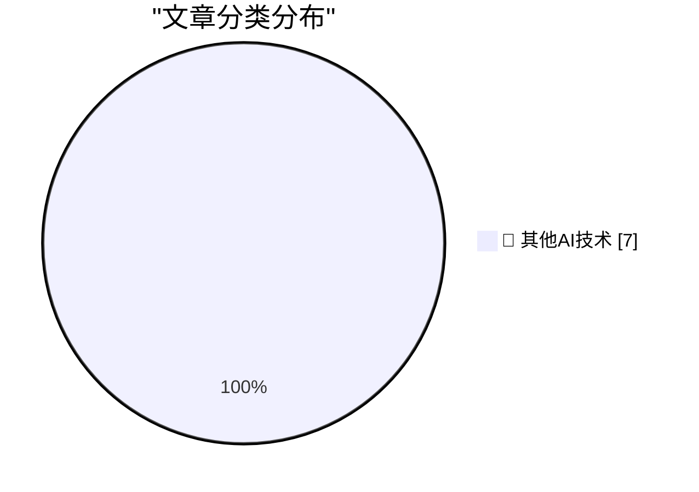

# 📰 AI 博客每日精选 — 2026-05-17

> 来自 98 个技术博客和社交媒体源，AI 精选 Top 7

## 🏆 今日必读

🥇 **How I use LLMs as a staff engineer in 2026**

[How I use LLMs as a staff engineer in 2026](https://seangoedecke.com/how-i-use-llms-in-2026/) — seangoedecke.com · 21 小时前 · 🔬 其他AI技术

> How I use LLMs as a staff engineer in 2026

🥈 **Drata**

[Drata](https://drata.com/daring) — daringfireball.net · 3 小时前 · 🔬 其他AI技术

> Drata

🥉 **In the Empire's Defense**

[In the Empire's Defense](https://idiallo.com/blog/the-empire-won?src=feed) — idiallo.com · 9 小时前 · 🔬 其他AI技术

> In the Empire's Defense

4️⃣ **GDS weighs in on the NHS's decision to retreat from Open Source**

[GDS weighs in on the NHS's decision to retreat from Open Source](https://shkspr.mobi/blog/2026/05/gds-weighs-in-on-the-nhss-decision-to-retreat-from-open-source/) — shkspr.mobi · 10 小时前 · 🔬 其他AI技术

> GDS weighs in on the NHS's decision to retreat from Open Source

5️⃣ **The Applicability of Spaced Repetition**

[The Applicability of Spaced Repetition](https://borretti.me/article/the-applicability-of-spaced-repetition) — borretti.me · 21 小时前 · 🔬 其他AI技术

> The Applicability of Spaced Repetition

---

## 📊 数据概览

| 扫描源 | 抓取文章 | 时间范围 | 精选 |
|:---:|:---:|:---:|:---:|
| 77/98 | 2772 篇 → 7 篇 | 24h | **7 篇** |

### 分类分布

---

====================

## 🔬 其他AI技术

### 1. How I use LLMs as a staff engineer in 2026

[How I use LLMs as a staff engineer in 2026](https://seangoedecke.com/how-i-use-llms-in-2026/) — **seangoedecke.com** · 21 小时前 · ⭐ 15/25

> How I use LLMs as a staff engineer in 2026

📌 其他AI技术

---

### 2. Drata

[Drata](https://drata.com/daring) — **daringfireball.net** · 3 小时前 · ⭐ 15/25

> Drata

📌 其他AI技术

---

### 3. In the Empire's Defense

[In the Empire's Defense](https://idiallo.com/blog/the-empire-won?src=feed) — **idiallo.com** · 9 小时前 · ⭐ 15/25

> In the Empire's Defense

📌 其他AI技术

---

### 4. GDS weighs in on the NHS's decision to retreat from Open Source

[GDS weighs in on the NHS's decision to retreat from Open Source](https://shkspr.mobi/blog/2026/05/gds-weighs-in-on-the-nhss-decision-to-retreat-from-open-source/) — **shkspr.mobi** · 10 小时前 · ⭐ 15/25

> GDS weighs in on the NHS's decision to retreat from Open Source

📌 其他AI技术

---

### 5. The Applicability of Spaced Repetition

[The Applicability of Spaced Repetition](https://borretti.me/article/the-applicability-of-spaced-repetition) — **borretti.me** · 21 小时前 · ⭐ 15/25

> The Applicability of Spaced Repetition

📌 其他AI技术

---

### 6. Interactive and non-interactive: these are the two main modes in Copilot CLI. 💻 Our beginner series breaks down the difference, plus how and when t...

[Interactive and non-interactive: these are the two main modes in Copilot CLI. 💻 Our beginner series breaks down the difference, plus how and when t...](https://x.com/github/status/2056077292812526006) — **𝕏 @GitHub** · 3 小时前 · ⭐ 15/25

> Interactive and non-interactive: these are the two main modes in Copilot CLI. 💻 Our beginner series breaks down the difference, plus how and when t...

📌 其他AI技术

---

### 7. RT kazuki🄽Notion: Notion東京オフィス、先週引っ越しました。チームの規模に合わせて広い場所に移った。入社して2年半、この速度で大きくなるとは正直思って...

[RT kazuki🄽Notion: Notion東京オフィス、先週引っ越しました。チームの規模に合わせて広い場所に移った。入社して2年半、この速度で大きくなるとは正直思って...](https://x.com/NotionHQ/status/2055837276501127347) — **𝕏 @NotionHQ** · 21 小时前 · ⭐ 15/25

> RT kazuki🄽Notion: Notion東京オフィス、先週引っ越しました。チームの規模に合わせて広い場所に移った。入社して2年半、この速度で大きくなるとは正直思って...

📌 其他AI技术

---

====================

*生成于 2026-05-17 21:52 | 扫描 77 源 → 获取 2772 篇 → 精选 7 篇*
*基于 [Hacker News Popularity Contest 2025](https://refactoringenglish.com/tools/hn-popularity/) RSS 源列表，由 [Andrej Karpathy](https://x.com/karpathy) 推荐*
*由「懂点儿AI」制作，欢迎关注同名微信公众号获取更多 AI 实用技巧 💡*
