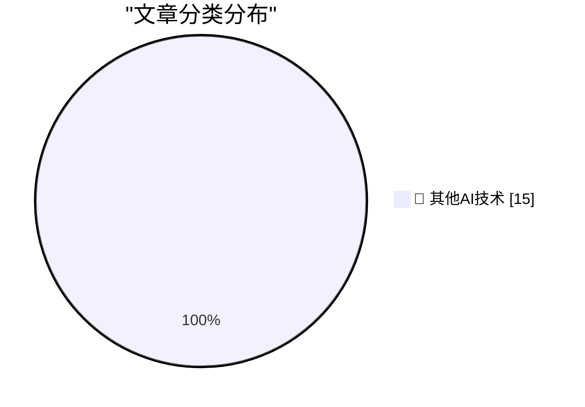

# 📰 AI 博客每日精选 — 2026-05-18

> 来自 98 个技术博客和社交媒体源，AI 精选 Top 15

## 🏆 今日必读

🥇 **The just-say-no engineer was a ZIRP phenomenon**

[The just-say-no engineer was a ZIRP phenomenon](https://seangoedecke.com/the-just-say-no-engineer-was-a-zirp-phenomenon/) — seangoedecke.com · 22 小时前 · 🔬 其他AI技术

> The just-say-no engineer was a ZIRP phenomenon

🥈 **Jury Rejects Elon Musk’s Claim Against Sam Altman in Unanimous Verdict**

[Jury Rejects Elon Musk’s Claim Against Sam Altman in Unanimous Verdict](https://www.nytimes.com/live/2026/05/18/technology/openai-trial-verdict-altman-musk?unlocked_article_code=1.jVA.Cc2V.IwYuu2r4SJfQ) — daringfireball.net · 4 小时前 · 🔬 其他AI技术

> Jury Rejects Elon Musk’s Claim Against Sam Altman in Unanimous Verdict

🥉 **‘John Appleseed’**

[‘John Appleseed’](https://om.co/2026/04/20/john-appleseed/) — daringfireball.net · 4 小时前 · 🔬 其他AI技术

> ‘John Appleseed’

4️⃣ **Define ‘Boom’ Please**

[Define ‘Boom’ Please](https://www.nytimes.com/2026/04/21/business/how-apple-became-a-4-trillion-company-under-tim-cook.html?unlocked_article_code=1.jVA.MV8m.0JfUOJOME5WH) — daringfireball.net · 4 小时前 · 🔬 其他AI技术

> Define ‘Boom’ Please

5️⃣ **Ted Turner’s Small Apartment Above the Former CNN Center**

[Ted Turner’s Small Apartment Above the Former CNN Center](https://www.youtube.com/watch?v=OUIVs58oyPI) — daringfireball.net · 5 小时前 · 🔬 其他AI技术

> Ted Turner’s Small Apartment Above the Former CNN Center

---

## 📊 数据概览

| 扫描源 | 抓取文章 | 时间范围 | 精选 |
|:---:|:---:|:---:|:---:|
| 79/98 | 2795 篇 → 25 篇 | 24h | **15 篇** |

### 分类分布

---

====================

## 🔬 其他AI技术

### 1. The just-say-no engineer was a ZIRP phenomenon

[The just-say-no engineer was a ZIRP phenomenon](https://seangoedecke.com/the-just-say-no-engineer-was-a-zirp-phenomenon/) — **seangoedecke.com** · 22 小时前 · ⭐ 15/25

> The just-say-no engineer was a ZIRP phenomenon

📌 其他AI技术

---

### 2. Jury Rejects Elon Musk’s Claim Against Sam Altman in Unanimous Verdict

[Jury Rejects Elon Musk’s Claim Against Sam Altman in Unanimous Verdict](https://www.nytimes.com/live/2026/05/18/technology/openai-trial-verdict-altman-musk?unlocked_article_code=1.jVA.Cc2V.IwYuu2r4SJfQ) — **daringfireball.net** · 4 小时前 · ⭐ 15/25

> Jury Rejects Elon Musk’s Claim Against Sam Altman in Unanimous Verdict

📌 其他AI技术

---

### 3. ‘John Appleseed’

[‘John Appleseed’](https://om.co/2026/04/20/john-appleseed/) — **daringfireball.net** · 4 小时前 · ⭐ 15/25

> ‘John Appleseed’

📌 其他AI技术

---

### 4. Define ‘Boom’ Please

[Define ‘Boom’ Please](https://www.nytimes.com/2026/04/21/business/how-apple-became-a-4-trillion-company-under-tim-cook.html?unlocked_article_code=1.jVA.MV8m.0JfUOJOME5WH) — **daringfireball.net** · 4 小时前 · ⭐ 15/25

> Define ‘Boom’ Please

📌 其他AI技术

---

### 5. Ted Turner’s Small Apartment Above the Former CNN Center

[Ted Turner’s Small Apartment Above the Former CNN Center](https://www.youtube.com/watch?v=OUIVs58oyPI) — **daringfireball.net** · 5 小时前 · ⭐ 15/25

> Ted Turner’s Small Apartment Above the Former CNN Center

📌 其他AI技术

---

### 6. Existing Stakeholders Have a Say in the Future

[Existing Stakeholders Have a Say in the Future](https://daringfireball.net/2026/05/ai_is_technology_not_a_product) — **daringfireball.net** · 5 小时前 · ⭐ 15/25

> Existing Stakeholders Have a Say in the Future

📌 其他AI技术

---

### 7. ‘AI, “Humanity”, and Dr. Manhattan Syndrome’

[‘AI, “Humanity”, and Dr. Manhattan Syndrome’](https://www.personfamiliar.com/p/ai-humanity-and-dr-manhattan-syndrome) — **daringfireball.net** · 5 小时前 · ⭐ 15/25

> ‘AI, “Humanity”, and Dr. Manhattan Syndrome’

📌 其他AI技术

---

### 8. The Alaska Permanent Fund as Loose Precedent for AI Data Center ‘UBI’ Payments

[The Alaska Permanent Fund as Loose Precedent for AI Data Center ‘UBI’ Payments](https://en.wikipedia.org/wiki/Alaska_Permanent_Fund) — **daringfireball.net** · 6 小时前 · ⭐ 15/25

> The Alaska Permanent Fund as Loose Precedent for AI Data Center ‘UBI’ Payments

📌 其他AI技术

---

### 9. AI Data Centers Are Deeply Unpopular, Across the Political Spectrum

[AI Data Centers Are Deeply Unpopular, Across the Political Spectrum](https://news.gallup.com/poll/709772/americans-oppose-data-centers-area.aspx) — **daringfireball.net** · 7 小时前 · ⭐ 15/25

> AI Data Centers Are Deeply Unpopular, Across the Political Spectrum

📌 其他AI技术

---

### 10. How I Use My Index 01 + Production Update

[How I Use My Index 01 + Production Update](https://repebble.com/blog/how-i-use-my-index-01-production-update) — **ericmigi.com** · 22 小时前 · ⭐ 15/25

> How I Use My Index 01 + Production Update

📌 其他AI技术

---

### 11. Don't call yourself a Software Engineer, you are an AI Enabled Engineer.

[Don't call yourself a Software Engineer, you are an AI Enabled Engineer.](https://idiallo.com/blog/you-are-an-ai-enabled-engineer-now?src=feed) — **idiallo.com** · 10 小时前 · ⭐ 15/25

> Don't call yourself a Software Engineer, you are an AI Enabled Engineer.

📌 其他AI技术

---

### 12. 10Gb/s Ethernet: using mini-heatsinks with a 10GBASE-T SFP+ module

[10Gb/s Ethernet: using mini-heatsinks with a 10GBASE-T SFP+ module](https://www.gilesthomas.com/2026/05/10g-ethernet-sfpplus-mini-heatsinks) — **gilesthomas.com** · 2 小时前 · ⭐ 15/25

> 10Gb/s Ethernet: using mini-heatsinks with a 10GBASE-T SFP+ module

📌 其他AI技术

---

### 13. Always Be Blaming

[Always Be Blaming](https://matklad.github.io/2026/05/18/always-be-blaming.html) — **matklad.github.io** · 22 小时前 · ⭐ 15/25

> Always Be Blaming

📌 其他AI技术

---

### 14. Something’s Rotten in the State of macOS Icon Design

[Something’s Rotten in the State of macOS Icon Design](https://blog.jim-nielsen.com/2026/rotten-macos-icon-design/) — **blog.jim-nielsen.com** · 3 小时前 · ⭐ 15/25

> Something’s Rotten in the State of macOS Icon Design

📌 其他AI技术

---

### 15. Cyberrebate.com: The worst dotcom-era idea?

[Cyberrebate.com: The worst dotcom-era idea?](https://dfarq.homeip.net/cyberrebate-com-the-worst-dotcom-era-idea/?utm_source=rss&#038;utm_medium=rss&#038;utm_campaign=cyberrebate-com-the-worst-dotcom-era-idea) — **dfarq.homeip.net** · 11 小时前 · ⭐ 15/25

> Cyberrebate.com: The worst dotcom-era idea?

📌 其他AI技术

---

====================

*生成于 2026-05-18 22:01 | 扫描 79 源 → 获取 2795 篇 → 精选 15 篇*
*基于 [Hacker News Popularity Contest 2025](https://refactoringenglish.com/tools/hn-popularity/) RSS 源列表，由 [Andrej Karpathy](https://x.com/karpathy) 推荐*
*由「懂点儿AI」制作，欢迎关注同名微信公众号获取更多 AI 实用技巧 💡*
