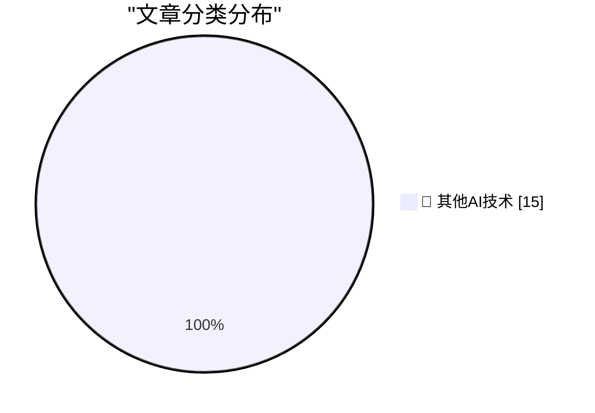

# 📰 AI 博客每日精选 — 2026-05-19

> 来自 98 个技术博客和社交媒体源，AI 精选 Top 15

## 🏆 今日必读

🥇 **Wi-Wi Is Wireless Time Sync at 1 nanosecond**

[Wi-Wi Is Wireless Time Sync at 1 nanosecond](https://www.jeffgeerling.com/blog/2026/wi-wi-is-wireless-time-sync-less-than-5ns/) — jeffgeerling.com · 8 小时前 · 🔬 其他AI技术

> Wi-Wi Is Wireless Time Sync at 1 nanosecond

🥈 **Andrej Karpathy Joined Anthropic**

[Andrej Karpathy Joined Anthropic](https://x.com/karpathy/status/2056753169888334312) — daringfireball.net · 6 小时前 · 🔬 其他AI技术

> Andrej Karpathy Joined Anthropic

🥉 **[Sponsor] WorkOS: Agents Need Context. Ship the Integrations That Give It to Them.**

[[Sponsor] WorkOS: Agents Need Context. Ship the Integrations That Give It to Them.](https://workos.com/docs/pipes?utm_source=daringfireball&amp;utm_medium=newsletter&amp;utm_campaign=q22026) — daringfireball.net · 20 小时前 · 🔬 其他AI技术

> [Sponsor] WorkOS: Agents Need Context. Ship the Integrations That Give It to Them.

4️⃣ **Pluralistic: There's no such thing as "age verification" (19 May 2026)**

[Pluralistic: There's no such thing as "age verification" (19 May 2026)](https://pluralistic.net/2026/05/19/shes-dead-of-course/) — pluralistic.net · 14 小时前 · 🔬 其他AI技术

> Pluralistic: There's no such thing as "age verification" (19 May 2026)

5️⃣ **Book Review: Terrible Worlds: Destinations by Adrian Tchaikovsky ★★★★★**

[Book Review: Terrible Worlds: Destinations by Adrian Tchaikovsky ★★★★★](https://shkspr.mobi/blog/2026/05/book-review-terrible-worlds-destinations-by-adrian-tchaikovsky/) — shkspr.mobi · 10 小时前 · 🔬 其他AI技术

> Book Review: Terrible Worlds: Destinations by Adrian Tchaikovsky ★★★★★

---

## 📊 数据概览

| 扫描源 | 抓取文章 | 时间范围 | 精选 |
|:---:|:---:|:---:|:---:|
| 76/98 | 2760 篇 → 25 篇 | 24h | **15 篇** |

### 分类分布

---

====================

## 🔬 其他AI技术

### 1. Wi-Wi Is Wireless Time Sync at 1 nanosecond

[Wi-Wi Is Wireless Time Sync at 1 nanosecond](https://www.jeffgeerling.com/blog/2026/wi-wi-is-wireless-time-sync-less-than-5ns/) — **jeffgeerling.com** · 8 小时前 · ⭐ 15/25

> Wi-Wi Is Wireless Time Sync at 1 nanosecond

📌 其他AI技术

---

### 2. Andrej Karpathy Joined Anthropic

[Andrej Karpathy Joined Anthropic](https://x.com/karpathy/status/2056753169888334312) — **daringfireball.net** · 6 小时前 · ⭐ 15/25

> Andrej Karpathy Joined Anthropic

📌 其他AI技术

---

### 3. [Sponsor] WorkOS: Agents Need Context. Ship the Integrations That Give It to Them.

[[Sponsor] WorkOS: Agents Need Context. Ship the Integrations That Give It to Them.](https://workos.com/docs/pipes?utm_source=daringfireball&amp;utm_medium=newsletter&amp;utm_campaign=q22026) — **daringfireball.net** · 20 小时前 · ⭐ 15/25

> [Sponsor] WorkOS: Agents Need Context. Ship the Integrations That Give It to Them.

📌 其他AI技术

---

### 4. Pluralistic: There's no such thing as "age verification" (19 May 2026)

[Pluralistic: There's no such thing as "age verification" (19 May 2026)](https://pluralistic.net/2026/05/19/shes-dead-of-course/) — **pluralistic.net** · 14 小时前 · ⭐ 15/25

> Pluralistic: There's no such thing as "age verification" (19 May 2026)

📌 其他AI技术

---

### 5. Book Review: Terrible Worlds: Destinations by Adrian Tchaikovsky ★★★★★

[Book Review: Terrible Worlds: Destinations by Adrian Tchaikovsky ★★★★★](https://shkspr.mobi/blog/2026/05/book-review-terrible-worlds-destinations-by-adrian-tchaikovsky/) — **shkspr.mobi** · 10 小时前 · ⭐ 15/25

> Book Review: Terrible Worlds: Destinations by Adrian Tchaikovsky ★★★★★

📌 其他AI技术

---

### 6. Dumb Ways for an Open Source Project to Die

[Dumb Ways for an Open Source Project to Die](https://nesbitt.io/2026/05/19/dumb-ways-for-an-open-source-project-to-die.html) — **nesbitt.io** · 12 小时前 · ⭐ 15/25

> Dumb Ways for an Open Source Project to Die

📌 其他AI技术

---

### 7. AI Is Too Expensive

[AI Is Too Expensive](https://www.wheresyoured.at/ai-is-too-expensive/) — **wheresyoured.at** · 6 小时前 · ⭐ 15/25

> AI Is Too Expensive

📌 其他AI技术

---

### 8. Microsoft Antitrust case of 1998

[Microsoft Antitrust case of 1998](https://dfarq.homeip.net/microsoft-antitrust-case-of-1998/?utm_source=rss&#038;utm_medium=rss&#038;utm_campaign=microsoft-antitrust-case-of-1998) — **dfarq.homeip.net** · 11 小时前 · ⭐ 15/25

> Microsoft Antitrust case of 1998

📌 其他AI技术

---

### 9. Introducing OpenAI Guaranteed Capacity: a new offering that enables customers to guarantee long-term access to OpenAI compute. We’ve made long-term i...

[Introducing OpenAI Guaranteed Capacity: a new offering that enables customers to guarantee long-term access to OpenAI compute. We’ve made long-term i...](https://x.com/OpenAI/status/2056823271774101907) — **𝕏 @OpenAI** · 2 小时前 · ⭐ 15/25

> Introducing OpenAI Guaranteed Capacity: a new offering that enables customers to guarantee long-term access to OpenAI compute. We’ve made long-term i...

📌 其他AI技术

---

### 10. RT Sam Altman: if this tweet gets 1 like, tibo will reset codex rate limits

[RT Sam Altman: if this tweet gets 1 like, tibo will reset codex rate limits](https://x.com/OpenAI/status/2056805428261183789) — **𝕏 @OpenAI** · 3 小时前 · ⭐ 15/25

> RT Sam Altman: if this tweet gets 1 like, tibo will reset codex rate limits

📌 其他AI技术

---

### 11. We’re adding new ways for people to identify AI-generated images and understand where they came from. In addition to C2PA Content Credentials, images...

[We’re adding new ways for people to identify AI-generated images and understand where they came from. In addition to C2PA Content Credentials, images...](https://x.com/OpenAI/status/2056793648571011232) — **𝕏 @OpenAI** · 4 小时前 · ⭐ 15/25

> We’re adding new ways for people to identify AI-generated images and understand where they came from. In addition to C2PA Content Credentials, images...

📌 其他AI技术

---

### 12. 📣 @GoogleAI’s Gemini 3.5 Flash is now generally available and rolling out in GitHub Copilot. Early testing shows ➡️ It has strong tool use, fast...

[📣 @GoogleAI’s Gemini 3.5 Flash is now generally available and rolling out in GitHub Copilot. Early testing shows ➡️ It has strong tool use, fast...](https://x.com/github/status/2056801675042779279) — **𝕏 @GitHub** · 3 小时前 · ⭐ 15/25

> 📣 @GoogleAI’s Gemini 3.5 Flash is now generally available and rolling out in GitHub Copilot. Early testing shows ➡️ It has strong tool use, fast...

📌 其他AI技术

---

### 13. 

 — **𝕏 @GitHub** · 21 小时前 · ⭐ 15/25

> 

📌 其他AI技术

---

### 14. Fourth year on CNBC's Disruptor 50… and we're #10 (up from #34 last year) 💥 Proud to be recognized alongside so many great companies (and customer...

[Fourth year on CNBC's Disruptor 50… and we're #10 (up from #34 last year) 💥 Proud to be recognized alongside so many great companies (and customer...](https://x.com/NotionHQ/status/2056790443476783580) — **𝕏 @NotionHQ** · 4 小时前 · ⭐ 15/25

> Fourth year on CNBC's Disruptor 50… and we're #10 (up from #34 last year) 💥 Proud to be recognized alongside so many great companies (and customer...

📌 其他AI技术

---

### 15. Ciao! Notion is now available in Italian. Finalmente!

[Ciao! Notion is now available in Italian. Finalmente!](https://x.com/NotionHQ/status/2056755032666824891) — **𝕏 @NotionHQ** · 7 小时前 · ⭐ 15/25

> Ciao! Notion is now available in Italian. Finalmente!

📌 其他AI技术

---

====================

*生成于 2026-05-19 22:13 | 扫描 76 源 → 获取 2760 篇 → 精选 15 篇*
*基于 [Hacker News Popularity Contest 2025](https://refactoringenglish.com/tools/hn-popularity/) RSS 源列表，由 [Andrej Karpathy](https://x.com/karpathy) 推荐*
*由「懂点儿AI」制作，欢迎关注同名微信公众号获取更多 AI 实用技巧 💡*
