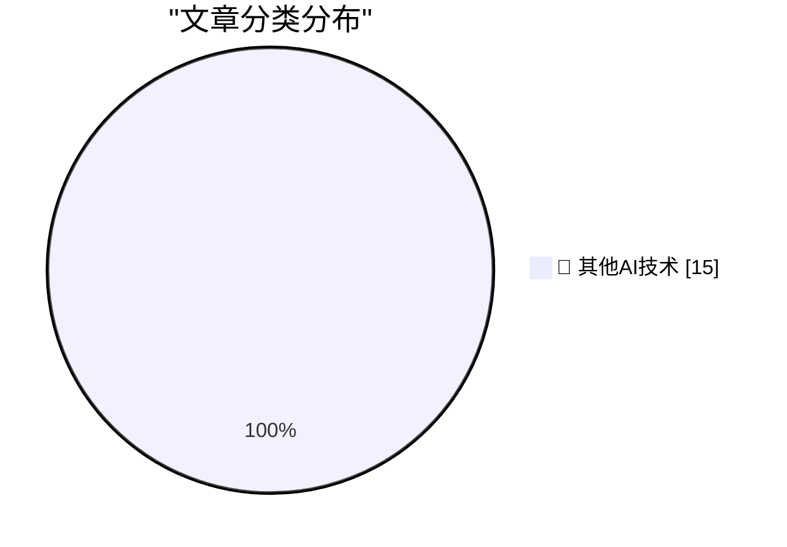

# 📰 AI 博客每日精选 — 2026-05-20

> 来自 98 个技术博客和社交媒体源，AI 精选 Top 15

## 🏆 今日必读

🥇 **Prompts are technical debt too**

[Prompts are technical debt too](https://seangoedecke.com/prompts-are-technical-debt-too/) — seangoedecke.com · 22 小时前 · 🔬 其他AI技术

> Prompts are technical debt too

🥈 **NYT: ‘Powered by A.I., Google Changes Its Search Box for the First Time in 25 Years’**

[NYT: ‘Powered by A.I., Google Changes Its Search Box for the First Time in 25 Years’](https://www.nytimes.com/2026/05/19/business/google-seach-bar-ai-gemini.html?unlocked_article_code=1.jlA.95yh.ptfBUHf-rBtB&amp;smid=url-share) — daringfireball.net · 1 小时前 · 🔬 其他AI技术

> NYT: ‘Powered by A.I., Google Changes Its Search Box for the First Time in 25 Years’

🥉 **‘You Do Not Need Fancy Equipment, You Do Not Need a Degree, to Make Money and to Do This as Your Job’**

[‘You Do Not Need Fancy Equipment, You Do Not Need a Degree, to Make Money and to Do This as Your Job’](https://www.tiktok.com/@brye.shhh/video/7641047549758934285) — daringfireball.net · 1 小时前 · 🔬 其他AI技术

> ‘You Do Not Need Fancy Equipment, You Do Not Need a Degree, to Make Money and to Do This as Your Job’

4️⃣ **[RSS Club] Let's meet up AFK**

[[RSS Club] Let's meet up AFK](https://shkspr.mobi/blog/2026/05/rss-club-lets-meet-up-afk/) — shkspr.mobi · 10 小时前 · 🔬 其他AI技术

> [RSS Club] Let's meet up AFK

5️⃣ **"No way to prevent this" say users of only language where this regularly happens**

["No way to prevent this" say users of only language where this regularly happens](https://xeiaso.net/shitposts/no-way-to-prevent-this/CVE-2026-45584/) — xeiaso.net · 22 小时前 · 🔬 其他AI技术

> "No way to prevent this" say users of only language where this regularly happens

---

## 📊 数据概览

| 扫描源 | 抓取文章 | 时间范围 | 精选 |
|:---:|:---:|:---:|:---:|
| 79/98 | 2806 篇 → 15 篇 | 24h | **15 篇** |

### 分类分布

---

====================

## 🔬 其他AI技术

### 1. Prompts are technical debt too

[Prompts are technical debt too](https://seangoedecke.com/prompts-are-technical-debt-too/) — **seangoedecke.com** · 22 小时前 · ⭐ 15/25

> Prompts are technical debt too

📌 其他AI技术

---

### 2. NYT: ‘Powered by A.I., Google Changes Its Search Box for the First Time in 25 Years’

[NYT: ‘Powered by A.I., Google Changes Its Search Box for the First Time in 25 Years’](https://www.nytimes.com/2026/05/19/business/google-seach-bar-ai-gemini.html?unlocked_article_code=1.jlA.95yh.ptfBUHf-rBtB&amp;smid=url-share) — **daringfireball.net** · 1 小时前 · ⭐ 15/25

> NYT: ‘Powered by A.I., Google Changes Its Search Box for the First Time in 25 Years’

📌 其他AI技术

---

### 3. ‘You Do Not Need Fancy Equipment, You Do Not Need a Degree, to Make Money and to Do This as Your Job’

[‘You Do Not Need Fancy Equipment, You Do Not Need a Degree, to Make Money and to Do This as Your Job’](https://www.tiktok.com/@brye.shhh/video/7641047549758934285) — **daringfireball.net** · 1 小时前 · ⭐ 15/25

> ‘You Do Not Need Fancy Equipment, You Do Not Need a Degree, to Make Money and to Do This as Your Job’

📌 其他AI技术

---

### 4. [RSS Club] Let's meet up AFK

[[RSS Club] Let's meet up AFK](https://shkspr.mobi/blog/2026/05/rss-club-lets-meet-up-afk/) — **shkspr.mobi** · 10 小时前 · ⭐ 15/25

> [RSS Club] Let's meet up AFK

📌 其他AI技术

---

### 5. "No way to prevent this" say users of only language where this regularly happens

["No way to prevent this" say users of only language where this regularly happens](https://xeiaso.net/shitposts/no-way-to-prevent-this/CVE-2026-45584/) — **xeiaso.net** · 22 小时前 · ⭐ 15/25

> "No way to prevent this" say users of only language where this regularly happens

📌 其他AI技术

---

### 6. Assumptions weaken properties

[Assumptions weaken properties](https://buttondown.com/hillelwayne/archive/assumptions-weaken-properties/) — **buttondown.com/hillelwayne** · 7 小时前 · ⭐ 15/25

> Assumptions weaken properties

📌 其他AI技术

---

### 7. What will better AI mean?

[What will better AI mean?](https://geohot.github.io//blog/jekyll/update/2026/05/20/what-will-better-mean.html) — **geohot.github.io** · 15 小时前 · ⭐ 15/25

> What will better AI mean?

📌 其他AI技术

---

### 8. Kaypro II launched May 20, 1982

[Kaypro II launched May 20, 1982](https://dfarq.homeip.net/kaypro-ii-launched-may-20-1982/?utm_source=rss&#038;utm_medium=rss&#038;utm_campaign=kaypro-ii-launched-may-20-1982) — **dfarq.homeip.net** · 11 小时前 · ⭐ 15/25

> Kaypro II launched May 20, 1982

📌 其他AI技术

---

### 9. The day has come… you can (finally) merge cells in tables. Merge. Unmerge. Merge merges into BIGGER MERGES 😤

[The day has come… you can (finally) merge cells in tables. Merge. Unmerge. Merge merges into BIGGER MERGES 😤](https://x.com/NotionHQ/status/2057133421177254116) — **𝕏 @NotionHQ** · 6 小时前 · ⭐ 15/25

> The day has come… you can (finally) merge cells in tables. Merge. Unmerge. Merge merges into BIGGER MERGES 😤

📌 其他AI技术

---

### 10. RT Ivan Zhao: Big jump this year! #34 -> #10 for CNBC's Disruptor. Among good companies and customers.

[RT Ivan Zhao: Big jump this year! #34 -> #10 for CNBC's Disruptor. Among good companies and customers.](https://x.com/NotionHQ/status/2056960927459852777) — **𝕏 @NotionHQ** · 18 小时前 · ⭐ 15/25

> RT Ivan Zhao: Big jump this year! #34 -> #10 for CNBC's Disruptor. Among good companies and customers.

📌 其他AI技术

---

### 11. Stop juggling agents. Just ask Slackbot. 💬 With the MCP client, Slackbot can work with all your apps and agents so you can stay in the flow of work...

[Stop juggling agents. Just ask Slackbot. 💬 With the MCP client, Slackbot can work with all your apps and agents so you can stay in the flow of work...](https://x.com/SlackHQ/status/2057191217213894790) — **𝕏 @SlackHQ** · 2 小时前 · ⭐ 15/25

> Stop juggling agents. Just ask Slackbot. 💬 With the MCP client, Slackbot can work with all your apps and agents so you can stay in the flow of work...

📌 其他AI技术

---

### 12. Calling all builders! 📣 If you’re exploring how AI agents can improve everyday workflows in Slack, the Slack Agent Builder Challenge is a great wa...

[Calling all builders! 📣 If you’re exploring how AI agents can improve everyday workflows in Slack, the Slack Agent Builder Challenge is a great wa...](https://x.com/SlackHQ/status/2057174596214821170) — **𝕏 @SlackHQ** · 3 小时前 · ⭐ 15/25

> Calling all builders! 📣 If you’re exploring how AI agents can improve everyday workflows in Slack, the Slack Agent Builder Challenge is a great wa...

📌 其他AI技术

---

### 13. RT Salesforce: .@ParkerHarris suggests these Slackbot questions: 👇 Based on my @SlackHQ history: → What animal am I? → What’s my communication s...

[RT Salesforce: .@ParkerHarris suggests these Slackbot questions: 👇 Based on my @SlackHQ history: → What animal am I? → What’s my communication s...](https://x.com/SlackHQ/status/2057203209392037985) — **𝕏 @SlackHQ** · 4 小时前 · ⭐ 15/25

> RT Salesforce: .@ParkerHarris suggests these Slackbot questions: 👇 Based on my @SlackHQ history: → What animal am I? → What’s my communication s...

📌 其他AI技术

---

### 14. Click "Add to Slack" — it's as easy as that. ✅ Shorten the time between building an agent and putting it to work with the "Add to Slack" option in p...

[Click "Add to Slack" — it's as easy as that. ✅ Shorten the time between building an agent and putting it to work with the "Add to Slack" option in p...](https://x.com/SlackHQ/status/2057129542511132855) — **𝕏 @SlackHQ** · 6 小时前 · ⭐ 15/25

> Click "Add to Slack" — it's as easy as that. ✅ Shorten the time between building an agent and putting it to work with the "Add to Slack" option in p...

📌 其他AI技术

---

### 15. Just talk to Keep to organize your thoughts. Announced at #GoogleIO, a new conversational feature in Google Keep turns what you say into organized not...

[Just talk to Keep to organize your thoughts. Announced at #GoogleIO, a new conversational feature in Google Keep turns what you say into organized not...](https://x.com/GoogleWorkspace/status/2057160405194043872) — **𝕏 @GoogleWorkspace** · 4 小时前 · ⭐ 15/25

> Just talk to Keep to organize your thoughts. Announced at #GoogleIO, a new conversational feature in Google Keep turns what you say into organized not...

📌 其他AI技术

---

====================

*生成于 2026-05-20 22:23 | 扫描 79 源 → 获取 2806 篇 → 精选 15 篇*
*基于 [Hacker News Popularity Contest 2025](https://refactoringenglish.com/tools/hn-popularity/) RSS 源列表，由 [Andrej Karpathy](https://x.com/karpathy) 推荐*
*由「懂点儿AI」制作，欢迎关注同名微信公众号获取更多 AI 实用技巧 💡*
