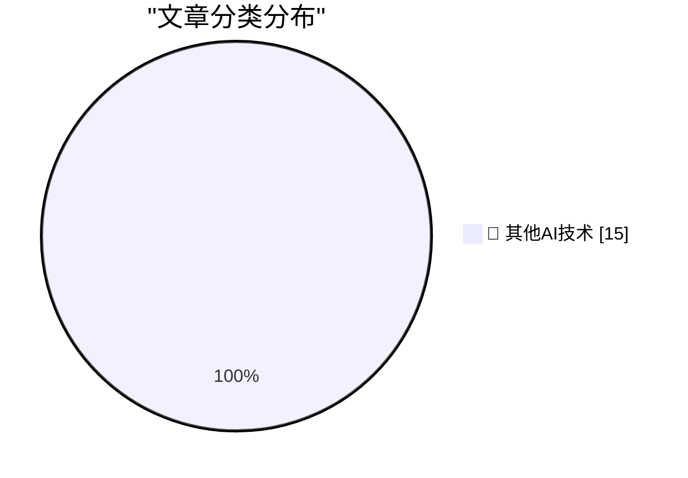

# 📰 AI 博客每日精选 — 2026-05-22

> 来自 98 个技术博客和社交媒体源，AI 精选 Top 15

## 🏆 今日必读

🥇 **★ The Fonts of the U.S. Federal Courts**

[★ The Fonts of the U.S. Federal Courts](https://daringfireball.net/2026/05/the_fonts_of_the_us_federal_courts) — daringfireball.net · 1 小时前 · 🔬 其他AI技术

> ★ The Fonts of the U.S. Federal Courts

🥈 **The Ninth Circuit Appeal Ruling in ‘Epic v. Apple’ That Apple Is Seeking to Overturn at the Supreme Court (PDF)**

[The Ninth Circuit Appeal Ruling in ‘Epic v. Apple’ That Apple Is Seeking to Overturn at the Supreme Court (PDF)](https://cdn.ca9.uscourts.gov/datastore/opinions/2025/12/11/25-2935.pdf) — daringfireball.net · 4 小时前 · 🔬 其他AI技术

> The Ninth Circuit Appeal Ruling in ‘Epic v. Apple’ That Apple Is Seeking to Overturn at the Supreme Court (PDF)

🥉 **Zero Sum Problems and Apple Sports**

[Zero Sum Problems and Apple Sports](https://kieranhealy.org/blog/archives/2026/05/21/zero-sum-problems/) — daringfireball.net · 4 小时前 · 🔬 其他AI技术

> Zero Sum Problems and Apple Sports

4️⃣ **Stephen Colbert’s ‘The Late Show’ Finale**

[Stephen Colbert’s ‘The Late Show’ Finale](https://www.nytimes.com/2026/05/22/arts/television/colbert-last-late-show.html?unlocked_article_code=1.kVA.GO3I.gVq9KeUrHEyM) — daringfireball.net · 4 小时前 · 🔬 其他AI技术

> Stephen Colbert’s ‘The Late Show’ Finale

5️⃣ **Apple Seeks Supreme Court Review of Contempt Finding and Injunction Scope in Epic Games Case**

[Apple Seeks Supreme Court Review of Contempt Finding and Injunction Scope in Epic Games Case](https://9to5mac.com/2026/05/21/apple-seeks-supreme-court-review-of-contempt-finding-and-injunction-scope-in-epic-games-case/) — daringfireball.net · 21 小时前 · 🔬 其他AI技术

> Apple Seeks Supreme Court Review of Contempt Finding and Injunction Scope in Epic Games Case

---

## 📊 数据概览

| 扫描源 | 抓取文章 | 时间范围 | 精选 |
|:---:|:---:|:---:|:---:|
| 76/98 | 2766 篇 → 19 篇 | 24h | **15 篇** |

### 分类分布

---

====================

## 🔬 其他AI技术

### 1. ★ The Fonts of the U.S. Federal Courts

[★ The Fonts of the U.S. Federal Courts](https://daringfireball.net/2026/05/the_fonts_of_the_us_federal_courts) — **daringfireball.net** · 1 小时前 · ⭐ 15/25

> ★ The Fonts of the U.S. Federal Courts

📌 其他AI技术

---

### 2. The Ninth Circuit Appeal Ruling in ‘Epic v. Apple’ That Apple Is Seeking to Overturn at the Supreme Court (PDF)

[The Ninth Circuit Appeal Ruling in ‘Epic v. Apple’ That Apple Is Seeking to Overturn at the Supreme Court (PDF)](https://cdn.ca9.uscourts.gov/datastore/opinions/2025/12/11/25-2935.pdf) — **daringfireball.net** · 4 小时前 · ⭐ 15/25

> The Ninth Circuit Appeal Ruling in ‘Epic v. Apple’ That Apple Is Seeking to Overturn at the Supreme Court (PDF)

📌 其他AI技术

---

### 3. Zero Sum Problems and Apple Sports

[Zero Sum Problems and Apple Sports](https://kieranhealy.org/blog/archives/2026/05/21/zero-sum-problems/) — **daringfireball.net** · 4 小时前 · ⭐ 15/25

> Zero Sum Problems and Apple Sports

📌 其他AI技术

---

### 4. Stephen Colbert’s ‘The Late Show’ Finale

[Stephen Colbert’s ‘The Late Show’ Finale](https://www.nytimes.com/2026/05/22/arts/television/colbert-last-late-show.html?unlocked_article_code=1.kVA.GO3I.gVq9KeUrHEyM) — **daringfireball.net** · 4 小时前 · ⭐ 15/25

> Stephen Colbert’s ‘The Late Show’ Finale

📌 其他AI技术

---

### 5. Apple Seeks Supreme Court Review of Contempt Finding and Injunction Scope in Epic Games Case

[Apple Seeks Supreme Court Review of Contempt Finding and Injunction Scope in Epic Games Case](https://9to5mac.com/2026/05/21/apple-seeks-supreme-court-review-of-contempt-finding-and-injunction-scope-in-epic-games-case/) — **daringfireball.net** · 21 小时前 · ⭐ 15/25

> Apple Seeks Supreme Court Review of Contempt Finding and Injunction Scope in Epic Games Case

📌 其他AI技术

---

### 6. Apple TV to Broadcast Entire MLS Match Shot Using iPhones

[Apple TV to Broadcast Entire MLS Match Shot Using iPhones](https://www.apple.com/newsroom/2026/05/apple-tv-to-air-first-major-live-pro-sports-event-shot-on-iphone-17-pro/) — **daringfireball.net** · 22 小时前 · ⭐ 15/25

> Apple TV to Broadcast Entire MLS Match Shot Using iPhones

📌 其他AI技术

---

### 7. How to Talk to Your Coworkers

[How to Talk to Your Coworkers](https://idiallo.com/blog/how-to-talk-to-your-coworkers?src=feed) — **idiallo.com** · 3 小时前 · ⭐ 15/25

> How to Talk to Your Coworkers

📌 其他AI技术

---

### 8. Dependency Pruning

[Dependency Pruning](https://nesbitt.io/2026/05/22/dependency-pruning.html) — **nesbitt.io** · 12 小时前 · ⭐ 15/25

> Dependency Pruning

📌 其他AI技术

---

### 9. Reiner Pope – Chip design from the bottom up

[Reiner Pope – Chip design from the bottom up](https://www.dwarkesh.com/p/reiner-pope-2) — **dwarkesh.com** · 6 小时前 · ⭐ 15/25

> Reiner Pope – Chip design from the bottom up

📌 其他AI技术

---

### 10. Premium: What If...We're In An AI Bubble? (Part 2)

[Premium: What If...We're In An AI Bubble? (Part 2)](https://www.wheresyoured.at/premium-what-if-were-in-an-ai-bubble-part-2/) — **wheresyoured.at** · 5 小时前 · ⭐ 15/25

> Premium: What If...We're In An AI Bubble? (Part 2)

📌 其他AI技术

---

### 11. News: OpenAI Had A Negative 122% Non-GAAP Operating Margin In Q1 2026, and ChatGPT Growth Has Stalled

[News: OpenAI Had A Negative 122% Non-GAAP Operating Margin In Q1 2026, and ChatGPT Growth Has Stalled](https://www.wheresyoured.at/news-openai-had-a-negative-122-operating-margin-in-q1-2026-and-chatgpt-growth-has-stalled/) — **wheresyoured.at** · 7 小时前 · ⭐ 15/25

> News: OpenAI Had A Negative 122% Non-GAAP Operating Margin In Q1 2026, and ChatGPT Growth Has Stalled

📌 其他AI技术

---

### 12. Planescape: Torment, Part 1: From the Tabletop…

[Planescape: Torment, Part 1: From the Tabletop…](https://www.filfre.net/2026/05/planescape-torment-part-1-from-the-tabletop/) — **filfre.net** · 5 小时前 · ⭐ 15/25

> Planescape: Torment, Part 1: From the Tabletop…

📌 其他AI技术

---

### 13. Advantages and disadvantages of Windows 3.0

[Advantages and disadvantages of Windows 3.0](https://dfarq.homeip.net/advantages-disadvantages-windows-3-0/?utm_source=rss&#038;utm_medium=rss&#038;utm_campaign=advantages-disadvantages-windows-3-0) — **dfarq.homeip.net** · 11 小时前 · ⭐ 15/25

> Advantages and disadvantages of Windows 3.0

📌 其他AI技术

---

### 14. StubZero: $148,337 RCE in Google Cloud Production

[StubZero: $148,337 RCE in Google Cloud Production](https://brutecat.com/articles/google-cloud-rce) — **brutecat.com** · -13075 分钟前 · ⭐ 15/25

> StubZero: $148,337 RCE in Google Cloud Production

📌 其他AI技术

---

### 15. RT Laura Sandoval: Collaborated with @andrewaashen to bring a refreshed visual language to Notion’s mobile apps 🌸 You’ll start seeing it in our s...

[RT Laura Sandoval: Collaborated with @andrewaashen to bring a refreshed visual language to Notion’s mobile apps 🌸 You’ll start seeing it in our s...](https://x.com/NotionHQ/status/2057868011818905881) — **𝕏 @NotionHQ** · 5 小时前 · ⭐ 15/25

> RT Laura Sandoval: Collaborated with @andrewaashen to bring a refreshed visual language to Notion’s mobile apps 🌸 You’ll start seeing it in our s...

📌 其他AI技术

---

====================

*生成于 2026-05-22 22:05 | 扫描 76 源 → 获取 2766 篇 → 精选 15 篇*
*基于 [Hacker News Popularity Contest 2025](https://refactoringenglish.com/tools/hn-popularity/) RSS 源列表，由 [Andrej Karpathy](https://x.com/karpathy) 推荐*
*由「懂点儿AI」制作，欢迎关注同名微信公众号获取更多 AI 实用技巧 💡*
