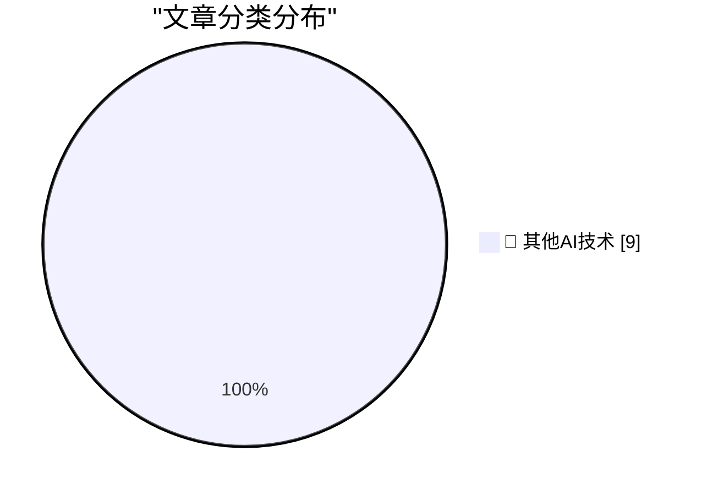

# 📰 AI 博客每日精选 — 2026-05-23

> 来自 98 个技术博客和社交媒体源，AI 精选 Top 9

## 🏆 今日必读

🥇 **The commencement speech that shook the world**

[The commencement speech that shook the world](https://idiallo.com/blog/the-commencement-speech-that-shook-the-world?src=feed) — idiallo.com · 20 小时前 · 🔬 其他AI技术

> The commencement speech that shook the world

🥈 **Which age-gates should be skill-gates and vice-versa?**

[Which age-gates should be skill-gates and vice-versa?](https://shkspr.mobi/blog/2026/05/which-age-gates-should-be-skill-gates-and-vice-versa/) — shkspr.mobi · 10 小时前 · 🔬 其他AI技术

> Which age-gates should be skill-gates and vice-versa?

🥉 **This Week in Package Management: 23 May 2026**

[This Week in Package Management: 23 May 2026](https://nesbitt.io/2026/05/23/this-week-in-package-management.html) — nesbitt.io · 11 小时前 · 🔬 其他AI技术

> This Week in Package Management: 23 May 2026

4️⃣ **Don't Roll Your Own ...**

[Don't Roll Your Own ...](https://susam.net/do-not-roll-your-own.html) — susam.net · 21 小时前 · 🔬 其他AI技术

> Don't Roll Your Own ...

5️⃣ **There is only one bad AI scenario**

[There is only one bad AI scenario](https://geohot.github.io//blog/jekyll/update/2026/05/23/one-bad-scenario.html) — geohot.github.io · 14 小时前 · 🔬 其他AI技术

> There is only one bad AI scenario

---

## 📊 数据概览

| 扫描源 | 抓取文章 | 时间范围 | 精选 |
|:---:|:---:|:---:|:---:|
| 75/98 | 2743 篇 → 9 篇 | 24h | **9 篇** |

### 分类分布

---

====================

## 🔬 其他AI技术

### 1. The commencement speech that shook the world

[The commencement speech that shook the world](https://idiallo.com/blog/the-commencement-speech-that-shook-the-world?src=feed) — **idiallo.com** · 20 小时前 · ⭐ 15/25

> The commencement speech that shook the world

📌 其他AI技术

---

### 2. Which age-gates should be skill-gates and vice-versa?

[Which age-gates should be skill-gates and vice-versa?](https://shkspr.mobi/blog/2026/05/which-age-gates-should-be-skill-gates-and-vice-versa/) — **shkspr.mobi** · 10 小时前 · ⭐ 15/25

> Which age-gates should be skill-gates and vice-versa?

📌 其他AI技术

---

### 3. This Week in Package Management: 23 May 2026

[This Week in Package Management: 23 May 2026](https://nesbitt.io/2026/05/23/this-week-in-package-management.html) — **nesbitt.io** · 11 小时前 · ⭐ 15/25

> This Week in Package Management: 23 May 2026

📌 其他AI技术

---

### 4. Don't Roll Your Own ...

[Don't Roll Your Own ...](https://susam.net/do-not-roll-your-own.html) — **susam.net** · 21 小时前 · ⭐ 15/25

> Don't Roll Your Own ...

📌 其他AI技术

---

### 5. There is only one bad AI scenario

[There is only one bad AI scenario](https://geohot.github.io//blog/jekyll/update/2026/05/23/one-bad-scenario.html) — **geohot.github.io** · 14 小时前 · ⭐ 15/25

> There is only one bad AI scenario

📌 其他AI技术

---

### 6. Some notes on how we ended up with Palantir & how to replace it

[Some notes on how we ended up with Palantir & how to replace it](https://berthub.eu/articles/posts/some-notes-on-palantir/) — **berthub.eu** · 13 小时前 · ⭐ 15/25

> Some notes on how we ended up with Palantir & how to replace it

📌 其他AI技术

---

### 7. New project idea but left the laptop at home? 😬 Create a repo right from your phone. Name it, set visibility, and adjust the details in the GitHub ...

[New project idea but left the laptop at home? 😬 Create a repo right from your phone. Name it, set visibility, and adjust the details in the GitHub ...](https://x.com/github/status/2058253004797522424) — **𝕏 @GitHub** · 3 小时前 · ⭐ 15/25

> New project idea but left the laptop at home? 😬 Create a repo right from your phone. Name it, set visibility, and adjust the details in the GitHub ...

📌 其他AI技术

---

### 8. RT Simon Last: 1/ Some things I've learned recently running coding agents on large-scale projects. Most of this contradicts advice from 6 months ago!

[RT Simon Last: 1/ Some things I've learned recently running coding agents on large-scale projects. Most of this contradicts advice from 6 months ago!](https://x.com/NotionHQ/status/2058009389429293367) — **𝕏 @NotionHQ** · 21 小时前 · ⭐ 15/25

> RT Simon Last: 1/ Some things I've learned recently running coding agents on large-scale projects. Most of this contradicts advice from 6 months ago!

📌 其他AI技术

---

### 9. RT hope hopes hoping: thank you so much for the jacket 🐶❤️ @NotionHQ

[RT hope hopes hoping: thank you so much for the jacket 🐶❤️ @NotionHQ](https://x.com/NotionHQ/status/2057991794101772499) — **𝕏 @NotionHQ** · 22 小时前 · ⭐ 15/25

> RT hope hopes hoping: thank you so much for the jacket 🐶❤️ @NotionHQ

📌 其他AI技术

---

====================

*生成于 2026-05-23 21:52 | 扫描 75 源 → 获取 2743 篇 → 精选 9 篇*
*基于 [Hacker News Popularity Contest 2025](https://refactoringenglish.com/tools/hn-popularity/) RSS 源列表，由 [Andrej Karpathy](https://x.com/karpathy) 推荐*
*由「懂点儿AI」制作，欢迎关注同名微信公众号获取更多 AI 实用技巧 💡*
