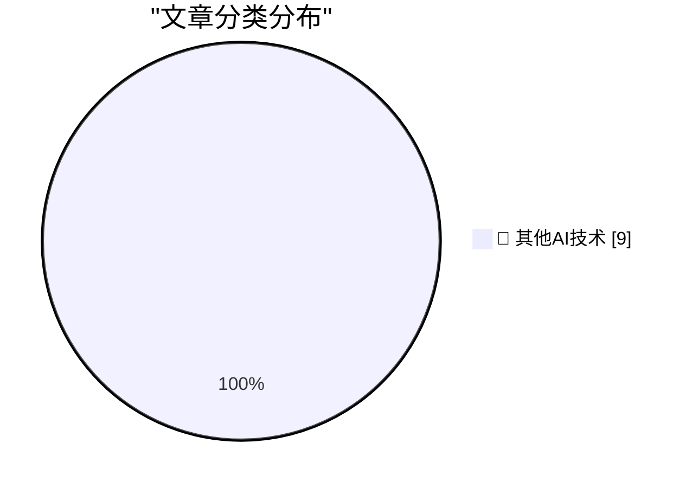

# 📰 AI 博客每日精选 — 2026-05-24

> 来自 98 个技术博客和社交媒体源，AI 精选 Top 9

## 🏆 今日必读

🥇 **Building Pi With Pi**

[Building Pi With Pi](https://lucumr.pocoo.org/2026/5/24/pi-oss/) — lucumr.pocoo.org · 21 小时前 · 🔬 其他AI技术

> Building Pi With Pi

🥈 **Walking the dog with Claude**

[Walking the dog with Claude](http://xania.org/202605/walking-the-dog?utm_source=feed&amp;utm_medium=rss) — xania.org · 4 小时前 · 🔬 其他AI技术

> Walking the dog with Claude

🥉 **Signing is for the bad days**

[Signing is for the bad days](https://nesbitt.io/2026/05/24/signing-is-for-the-bad-days.html) — nesbitt.io · 11 小时前 · 🔬 其他AI技术

> Signing is for the bad days

4️⃣ **Childhood Computing**

[Childhood Computing](https://susam.net/childhood-computing.html) — susam.net · 21 小时前 · 🔬 其他AI技术

> Childhood Computing

5️⃣ **The Eternal Sloptember**

[The Eternal Sloptember](https://geohot.github.io//blog/jekyll/update/2026/05/24/the-eternal-sloptember.html) — geohot.github.io · 14 小时前 · 🔬 其他AI技术

> The Eternal Sloptember

---

## 📊 数据概览

| 扫描源 | 抓取文章 | 时间范围 | 精选 |
|:---:|:---:|:---:|:---:|
| 75/98 | 2724 篇 → 9 篇 | 24h | **9 篇** |

### 分类分布

---

====================

## 🔬 其他AI技术

### 1. Building Pi With Pi

[Building Pi With Pi](https://lucumr.pocoo.org/2026/5/24/pi-oss/) — **lucumr.pocoo.org** · 21 小时前 · ⭐ 15/25

> Building Pi With Pi

📌 其他AI技术

---

### 2. Walking the dog with Claude

[Walking the dog with Claude](http://xania.org/202605/walking-the-dog?utm_source=feed&amp;utm_medium=rss) — **xania.org** · 4 小时前 · ⭐ 15/25

> Walking the dog with Claude

📌 其他AI技术

---

### 3. Signing is for the bad days

[Signing is for the bad days](https://nesbitt.io/2026/05/24/signing-is-for-the-bad-days.html) — **nesbitt.io** · 11 小时前 · ⭐ 15/25

> Signing is for the bad days

📌 其他AI技术

---

### 4. Childhood Computing

[Childhood Computing](https://susam.net/childhood-computing.html) — **susam.net** · 21 小时前 · ⭐ 15/25

> Childhood Computing

📌 其他AI技术

---

### 5. The Eternal Sloptember

[The Eternal Sloptember](https://geohot.github.io//blog/jekyll/update/2026/05/24/the-eternal-sloptember.html) — **geohot.github.io** · 14 小时前 · ⭐ 15/25

> The Eternal Sloptember

📌 其他AI技术

---

### 6. How my minimal, memory-safe Go rsync steers clear of vulnerabilities

[How my minimal, memory-safe Go rsync steers clear of vulnerabilities](https://michael.stapelberg.ch/posts/2026-05-24-minimal-memory-safe-go-rsync-vulns/) — **michael.stapelberg.ch** · 7 小时前 · ⭐ 15/25

> How my minimal, memory-safe Go rsync steers clear of vulnerabilities

📌 其他AI技术

---

### 7. There's more to making a game than the engine. 🎮 Check out 10 open-source projects helping developers with art, audio, animation, level design, and...

[There's more to making a game than the engine. 🎮 Check out 10 open-source projects helping developers with art, audio, animation, level design, and...](https://x.com/github/status/2058655530395042254) — **𝕏 @GitHub** · 49 分钟前 · ⭐ 15/25

> There's more to making a game than the engine. 🎮 Check out 10 open-source projects helping developers with art, audio, animation, level design, and...

📌 其他AI技术

---

### 8. RT Zach Tratar: Ahem… things you can do in Notion beyond “write notes”: - Create databases that model your business - Project management - CRM - AI...

[RT Zach Tratar: Ahem… things you can do in Notion beyond “write notes”: - Create databases that model your business - Project management - CRM - AI...](https://x.com/NotionHQ/status/2058660631633674741) — **𝕏 @NotionHQ** · 1 小时前 · ⭐ 15/25

> RT Zach Tratar: Ahem… things you can do in Notion beyond “write notes”: - Create databases that model your business - Project management - CRM - AI...

📌 其他AI技术

---

### 9. RT John Hong: AI Agent Demo @NotionHQ

[RT John Hong: AI Agent Demo @NotionHQ](https://x.com/NotionHQ/status/2058660193555427487) — **𝕏 @NotionHQ** · 23 小时前 · ⭐ 15/25

> RT John Hong: AI Agent Demo @NotionHQ

📌 其他AI技术

---

====================

*生成于 2026-05-24 21:54 | 扫描 75 源 → 获取 2724 篇 → 精选 9 篇*
*基于 [Hacker News Popularity Contest 2025](https://refactoringenglish.com/tools/hn-popularity/) RSS 源列表，由 [Andrej Karpathy](https://x.com/karpathy) 推荐*
*由「懂点儿AI」制作，欢迎关注同名微信公众号获取更多 AI 实用技巧 💡*
