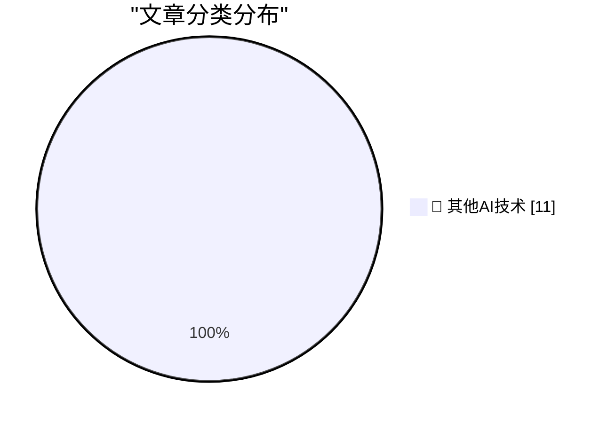

# 📰 AI 博客每日精选 — 2026-05-25

> 来自 98 个技术博客和社交媒体源，AI 精选 Top 11

## 🏆 今日必读

🥇 **Awarding Jay Haynes His Being Right Points for Predicting Apple Hitting $3 Trillion in Market Cap**

[Awarding Jay Haynes His Being Right Points for Predicting Apple Hitting $3 Trillion in Market Cap](https://daringfireball.net/linked/2014/01/29/haynes-aapl) — daringfireball.net · 1 小时前 · 🔬 其他AI技术

> Awarding Jay Haynes His Being Right Points for Predicting Apple Hitting $3 Trillion in Market Cap

🥈 **Thieves Are Texting Threats to Victims of iPhone Theft in London**

[Thieves Are Texting Threats to Victims of iPhone Theft in London](https://www.nytimes.com/2026/05/23/world/europe/phone-theft-threats-london.html?unlocked_article_code=1.lFA.OUt7.VJ_FoDpINr0L) — daringfireball.net · 2 小时前 · 🔬 其他AI技术

> Thieves Are Texting Threats to Victims of iPhone Theft in London

🥉 **Trump Mobile Website Exposed the Number of Pre-Orders — Both Completed and Abandoned — and the Associated Customer Information**

[Trump Mobile Website Exposed the Number of Pre-Orders — Both Completed and Abandoned — and the Associated Customer Information](https://www.theguardian.com/us-news/2026/may/23/trump-mobile-investigating-potential-exposure-of-would-be-customers-personal-information) — daringfireball.net · 3 小时前 · 🔬 其他AI技术

> Trump Mobile Website Exposed the Number of Pre-Orders — Both Completed and Abandoned — and the Associated Customer Information

4️⃣ **The History of ‘OK’**

[The History of ‘OK’](https://www.merriam-webster.com/wordplay/the-hilarious-history-of-ok-okay) — daringfireball.net · 4 小时前 · 🔬 其他AI技术

> The History of ‘OK’

5️⃣ **WorkOS: ‘Agents Need Context. Ship the Integrations That Give It to Them.’**

[WorkOS: ‘Agents Need Context. Ship the Integrations That Give It to Them.’](https://workos.com/docs/pipes?utm_source=daringfireball&amp;utm_medium=newsletter&amp;utm_campaign=q22026) — daringfireball.net · 6 小时前 · 🔬 其他AI技术

> WorkOS: ‘Agents Need Context. Ship the Integrations That Give It to Them.’

---

## 📊 数据概览

| 扫描源 | 抓取文章 | 时间范围 | 精选 |
|:---:|:---:|:---:|:---:|
| 78/98 | 2802 篇 → 11 篇 | 24h | **11 篇** |

### 分类分布

---

====================

## 🔬 其他AI技术

### 1. Awarding Jay Haynes His Being Right Points for Predicting Apple Hitting $3 Trillion in Market Cap

[Awarding Jay Haynes His Being Right Points for Predicting Apple Hitting $3 Trillion in Market Cap](https://daringfireball.net/linked/2014/01/29/haynes-aapl) — **daringfireball.net** · 1 小时前 · ⭐ 15/25

> Awarding Jay Haynes His Being Right Points for Predicting Apple Hitting $3 Trillion in Market Cap

📌 其他AI技术

---

### 2. Thieves Are Texting Threats to Victims of iPhone Theft in London

[Thieves Are Texting Threats to Victims of iPhone Theft in London](https://www.nytimes.com/2026/05/23/world/europe/phone-theft-threats-london.html?unlocked_article_code=1.lFA.OUt7.VJ_FoDpINr0L) — **daringfireball.net** · 2 小时前 · ⭐ 15/25

> Thieves Are Texting Threats to Victims of iPhone Theft in London

📌 其他AI技术

---

### 3. Trump Mobile Website Exposed the Number of Pre-Orders — Both Completed and Abandoned — and the Associated Customer Information

[Trump Mobile Website Exposed the Number of Pre-Orders — Both Completed and Abandoned — and the Associated Customer Information](https://www.theguardian.com/us-news/2026/may/23/trump-mobile-investigating-potential-exposure-of-would-be-customers-personal-information) — **daringfireball.net** · 3 小时前 · ⭐ 15/25

> Trump Mobile Website Exposed the Number of Pre-Orders — Both Completed and Abandoned — and the Associated Customer Information

📌 其他AI技术

---

### 4. The History of ‘OK’

[The History of ‘OK’](https://www.merriam-webster.com/wordplay/the-hilarious-history-of-ok-okay) — **daringfireball.net** · 4 小时前 · ⭐ 15/25

> The History of ‘OK’

📌 其他AI技术

---

### 5. WorkOS: ‘Agents Need Context. Ship the Integrations That Give It to Them.’

[WorkOS: ‘Agents Need Context. Ship the Integrations That Give It to Them.’](https://workos.com/docs/pipes?utm_source=daringfireball&amp;utm_medium=newsletter&amp;utm_campaign=q22026) — **daringfireball.net** · 6 小时前 · ⭐ 15/25

> WorkOS: ‘Agents Need Context. Ship the Integrations That Give It to Them.’

📌 其他AI技术

---

### 6. Pluralistic: No honor among (ad-tech) thieves (25 May 2026)

[Pluralistic: No honor among (ad-tech) thieves (25 May 2026)](https://pluralistic.net/2026/05/25/lying-spies/) — **pluralistic.net** · 13 小时前 · ⭐ 15/25

> Pluralistic: No honor among (ad-tech) thieves (25 May 2026)

📌 其他AI技术

---

### 7. PHP - simple way to send HTTP headers before a script ends

[PHP - simple way to send HTTP headers before a script ends](https://shkspr.mobi/blog/2026/05/php-simple-way-to-send-http-headers-before-a-script-ends/) — **shkspr.mobi** · 10 小时前 · ⭐ 15/25

> PHP - simple way to send HTTP headers before a script ends

📌 其他AI技术

---

### 8. GitHub Actions security in Python packages

[GitHub Actions security in Python packages](https://nesbitt.io/2026/05/25/github-actions-security-in-python-packages.html) — **nesbitt.io** · 12 小时前 · ⭐ 15/25

> GitHub Actions security in Python packages

📌 其他AI技术

---

### 9. Quantum Link: AOL before it was AOL

[Quantum Link: AOL before it was AOL](https://dfarq.homeip.net/quantum-link-aol-before-it-was-aol/?utm_source=rss&#038;utm_medium=rss&#038;utm_campaign=quantum-link-aol-before-it-was-aol) — **dfarq.homeip.net** · 11 小时前 · ⭐ 15/25

> Quantum Link: AOL before it was AOL

📌 其他AI技术

---

### 10. FediMeteo, timezones, and the art of not breaking what already works

[FediMeteo, timezones, and the art of not breaking what already works](https://it-notes.dragas.net/2026/05/25/fedimeteo-timezones-and-the-art-of-not-breaking-what-already-works/) — **it-notes.dragas.net** · 12 小时前 · ⭐ 15/25

> FediMeteo, timezones, and the art of not breaking what already works

📌 其他AI技术

---

### 11. RT Aaron Makelky: I thought the @NotionHQ AI standalone app was silly but then I realized it’s the new way to interface with all your context, no mor...

[RT Aaron Makelky: I thought the @NotionHQ AI standalone app was silly but then I realized it’s the new way to interface with all your context, no mor...](https://x.com/NotionHQ/status/2058983611559534822) — **𝕏 @NotionHQ** · 4 小时前 · ⭐ 15/25

> RT Aaron Makelky: I thought the @NotionHQ AI standalone app was silly but then I realized it’s the new way to interface with all your context, no mor...

📌 其他AI技术

---

====================

*生成于 2026-05-25 22:06 | 扫描 78 源 → 获取 2802 篇 → 精选 11 篇*
*基于 [Hacker News Popularity Contest 2025](https://refactoringenglish.com/tools/hn-popularity/) RSS 源列表，由 [Andrej Karpathy](https://x.com/karpathy) 推荐*
*由「懂点儿AI」制作，欢迎关注同名微信公众号获取更多 AI 实用技巧 💡*
