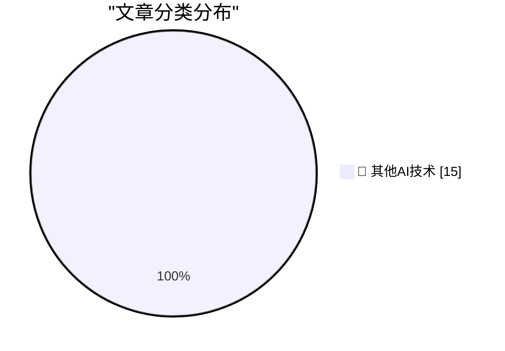

# 📰 AI 博客每日精选 — 2026-05-27

> 来自 98 个技术博客和社交媒体源，AI 精选 Top 15

## 🏆 今日必读

🥇 **I patched iozone for better disk benchmarks on modern macOS**

[I patched iozone for better disk benchmarks on modern macOS](https://www.jeffgeerling.com/blog/2026/i-patched-iozone-for-better-disk-benchmarks-on-modern-macos/) — jeffgeerling.com · 20 小时前 · 🔬 其他AI技术

> I patched iozone for better disk benchmarks on modern macOS

🥈 **How Many Tokens Did You Burn Today**

[How Many Tokens Did You Burn Today](https://idiallo.com/blog/how-many-tokens-did-you-burn-today?src=feed) — idiallo.com · 21 小时前 · 🔬 其他AI技术

> How Many Tokens Did You Burn Today

🥉 **Pluralistic: AI and a world without migrants (27 May 2026)**

[Pluralistic: AI and a world without migrants (27 May 2026)](https://pluralistic.net/2026/05/27/unnecessariat/) — pluralistic.net · 14 小时前 · 🔬 其他AI技术

> Pluralistic: AI and a world without migrants (27 May 2026)

4️⃣ **Gadget Review: Chuwi Minibook X N150 + Linux ★★★★☆**

[Gadget Review: Chuwi Minibook X N150 + Linux ★★★★☆](https://shkspr.mobi/blog/2026/05/gadget-review-chuwi-minibook-x-n150-linux/) — shkspr.mobi · 10 小时前 · 🔬 其他AI技术

> Gadget Review: Chuwi Minibook X N150 + Linux ★★★★☆

5️⃣ **Sharing the result of a single Windows Runtime IAsyncOperation among multiple coroutines, part 1**

[Sharing the result of a single Windows Runtime IAsyncOperation among multiple coroutines, part 1](https://devblogs.microsoft.com/oldnewthing/20260527-00/?p=112361) — devblogs.microsoft.com/oldnewthing · 8 小时前 · 🔬 其他AI技术

> Sharing the result of a single Windows Runtime IAsyncOperation among multiple coroutines, part 1

---

## 📊 数据概览

| 扫描源 | 抓取文章 | 时间范围 | 精选 |
|:---:|:---:|:---:|:---:|
| 77/98 | 2791 篇 → 27 篇 | 24h | **15 篇** |

### 分类分布

---

====================

## 🔬 其他AI技术

### 1. I patched iozone for better disk benchmarks on modern macOS

[I patched iozone for better disk benchmarks on modern macOS](https://www.jeffgeerling.com/blog/2026/i-patched-iozone-for-better-disk-benchmarks-on-modern-macos/) — **jeffgeerling.com** · 20 小时前 · ⭐ 15/25

> I patched iozone for better disk benchmarks on modern macOS

📌 其他AI技术

---

### 2. How Many Tokens Did You Burn Today

[How Many Tokens Did You Burn Today](https://idiallo.com/blog/how-many-tokens-did-you-burn-today?src=feed) — **idiallo.com** · 21 小时前 · ⭐ 15/25

> How Many Tokens Did You Burn Today

📌 其他AI技术

---

### 3. Pluralistic: AI and a world without migrants (27 May 2026)

[Pluralistic: AI and a world without migrants (27 May 2026)](https://pluralistic.net/2026/05/27/unnecessariat/) — **pluralistic.net** · 14 小时前 · ⭐ 15/25

> Pluralistic: AI and a world without migrants (27 May 2026)

📌 其他AI技术

---

### 4. Gadget Review: Chuwi Minibook X N150 + Linux ★★★★☆

[Gadget Review: Chuwi Minibook X N150 + Linux ★★★★☆](https://shkspr.mobi/blog/2026/05/gadget-review-chuwi-minibook-x-n150-linux/) — **shkspr.mobi** · 10 小时前 · ⭐ 15/25

> Gadget Review: Chuwi Minibook X N150 + Linux ★★★★☆

📌 其他AI技术

---

### 5. Sharing the result of a single Windows Runtime IAsyncOperation among multiple coroutines, part 1

[Sharing the result of a single Windows Runtime IAsyncOperation among multiple coroutines, part 1](https://devblogs.microsoft.com/oldnewthing/20260527-00/?p=112361) — **devblogs.microsoft.com/oldnewthing** · 8 小时前 · ⭐ 15/25

> Sharing the result of a single Windows Runtime IAsyncOperation among multiple coroutines, part 1

📌 其他AI技术

---

### 6. Using My Fucking Brain

[Using My Fucking Brain](https://terriblesoftware.org/2026/05/27/using-my-fucking-brain/) — **terriblesoftware.org** · 9 小时前 · ⭐ 15/25

> Using My Fucking Brain

📌 其他AI技术

---

### 7. CHAOSS Metrics in 2026

[CHAOSS Metrics in 2026](https://nesbitt.io/2026/05/27/chaoss-metrics-in-2026.html) — **nesbitt.io** · 12 小时前 · ⭐ 15/25

> CHAOSS Metrics in 2026

📌 其他AI技术

---

### 8. AMD K6-2 released May 28, 1998

[AMD K6-2 released May 28, 1998](https://dfarq.homeip.net/amd-k6-2-released-may-26-1998/?utm_source=rss&#038;utm_medium=rss&#038;utm_campaign=amd-k6-2-released-may-26-1998) — **dfarq.homeip.net** · 11 小时前 · ⭐ 15/25

> AMD K6-2 released May 28, 1998

📌 其他AI技术

---

### 9. Bill Gates’ Internet Tidal Wave Microsoft memo

[Bill Gates’ Internet Tidal Wave Microsoft memo](https://dfarq.homeip.net/bill-gates-internet-tidal-wave-microsoft-memo/?utm_source=rss&#038;utm_medium=rss&#038;utm_campaign=bill-gates-internet-tidal-wave-microsoft-memo) — **dfarq.homeip.net** · 11 小时前 · ⭐ 15/25

> Bill Gates’ Internet Tidal Wave Microsoft memo

📌 其他AI技术

---

### 10. Het Solvinity besluit in detail, en de mogelijke gevolgen

[Het Solvinity besluit in detail, en de mogelijke gevolgen](https://berthub.eu/articles/posts/het-solvinity-besluit-gevolgen/) — **berthub.eu** · 14 小时前 · ⭐ 15/25

> Het Solvinity besluit in detail, en de mogelijke gevolgen

📌 其他AI技术

---

### 11. SQLAlchemy 2 In Practice - Solutions to the Exercises

[SQLAlchemy 2 In Practice - Solutions to the Exercises](https://blog.miguelgrinberg.com/post/sqlalchemy-2-in-practice---solutions-to-the-exercises) — **miguelgrinberg.com** · 3 小时前 · ⭐ 15/25

> SQLAlchemy 2 In Practice - Solutions to the Exercises

📌 其他AI技术

---

### 12. RT Scott Hanselman 🌮: Trying the new @github App on my workflow

[RT Scott Hanselman 🌮: Trying the new @github App on my workflow](https://x.com/github/status/2059744929262227947) — **𝕏 @GitHub** · 2 小时前 · ⭐ 15/25

> RT Scott Hanselman 🌮: Trying the new @github App on my workflow

📌 其他AI技术

---

### 13. You may be missing out on these helpful slash commands in GitHub Copilot CLI. 💡

[You may be missing out on these helpful slash commands in GitHub Copilot CLI. 💡](https://x.com/github/status/2059702542288736442) — **𝕏 @GitHub** · 4 小时前 · ⭐ 15/25

> You may be missing out on these helpful slash commands in GitHub Copilot CLI. 💡

📌 其他AI技术

---

### 14. RT Andrea: Got nerd-sniped by @cassidoo's magnatile clustering algorithm. I fed the blog post to the new GitHub Copilot app and watched it write cassi...

[RT Andrea: Got nerd-sniped by @cassidoo's magnatile clustering algorithm. I fed the blog post to the new GitHub Copilot app and watched it write cassi...](https://x.com/github/status/2059717814194180521) — **𝕏 @GitHub** · 4 小时前 · ⭐ 15/25

> RT Andrea: Got nerd-sniped by @cassidoo's magnatile clustering algorithm. I fed the blog post to the new GitHub Copilot app and watched it write cassi...

📌 其他AI技术

---

### 15. 📣 Join us for a special Maintainer AMA in our GitHub Community tomorrow, May 27, from 8 a.m. to 1 p.m. PT. Ask your favorite projects like OpenClaw...

[📣 Join us for a special Maintainer AMA in our GitHub Community tomorrow, May 27, from 8 a.m. to 1 p.m. PT. Ask your favorite projects like OpenClaw...](https://x.com/github/status/2059413023735869624) — **𝕏 @GitHub** · 23 小时前 · ⭐ 15/25

> 📣 Join us for a special Maintainer AMA in our GitHub Community tomorrow, May 27, from 8 a.m. to 1 p.m. PT. Ask your favorite projects like OpenClaw...

📌 其他AI技术

---

====================

*生成于 2026-05-27 22:29 | 扫描 77 源 → 获取 2791 篇 → 精选 15 篇*
*基于 [Hacker News Popularity Contest 2025](https://refactoringenglish.com/tools/hn-popularity/) RSS 源列表，由 [Andrej Karpathy](https://x.com/karpathy) 推荐*
*由「懂点儿AI」制作，欢迎关注同名微信公众号获取更多 AI 实用技巧 💡*
