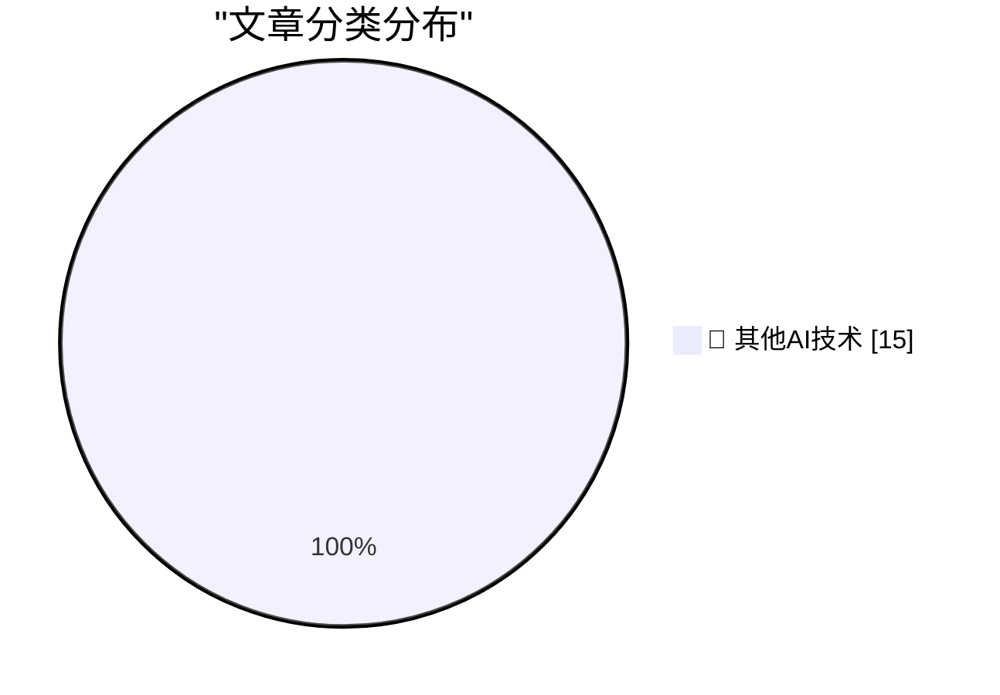

# 📰 AI 博客每日精选 — 2026-05-28

> 来自 98 个技术博客和社交媒体源，AI 精选 Top 15

## 🏆 今日必读

🥇 **Tuning in FM Radio on a 3D Printer Heatbed**

[Tuning in FM Radio on a 3D Printer Heatbed](https://www.jeffgeerling.com/blog/2026/tuning-in-fm-radio-on-a-3d-printer-heatbed/) — jeffgeerling.com · 8 小时前 · 🔬 其他AI技术

> Tuning in FM Radio on a 3D Printer Heatbed

🥈 **Footage From the LA-Houston MLS Match That Apple Shot Using iPhone 17 Pro Cameras**

[Footage From the LA-Houston MLS Match That Apple Shot Using iPhone 17 Pro Cameras](https://tv.apple.com/us/sporting-event/mls-wrap-up/umc.cse.3a198p24hrehwhonbhgx2zvhv) — daringfireball.net · 5 小时前 · 🔬 其他AI技术

> Footage From the LA-Houston MLS Match That Apple Shot Using iPhone 17 Pro Cameras

🥉 **Researchers Publish Method to Surveil Web Page Visitors by Analyzing Their SSD Activity**

[Researchers Publish Method to Surveil Web Page Visitors by Analyzing Their SSD Activity](https://arstechnica.com/security/2026/05/websites-have-a-new-way-to-spy-on-visitors-analyzing-their-ssd-activity/) — daringfireball.net · 8 小时前 · 🔬 其他AI技术

> Researchers Publish Method to Surveil Web Page Visitors by Analyzing Their SSD Activity

4️⃣ **Pluralistic: Hold on for dear life (28 May 2026)**

[Pluralistic: Hold on for dear life (28 May 2026)](https://pluralistic.net/2026/05/28/we-live-in-a-society/) — pluralistic.net · 11 小时前 · 🔬 其他AI技术

> Pluralistic: Hold on for dear life (28 May 2026)

5️⃣ **Dancing mad with sandboxing**

[Dancing mad with sandboxing](https://xeiaso.net/blog/2026/dancing-mad-sandboxing/) — xeiaso.net · 22 小时前 · 🔬 其他AI技术

> Dancing mad with sandboxing

---

## 📊 数据概览

| 扫描源 | 抓取文章 | 时间范围 | 精选 |
|:---:|:---:|:---:|:---:|
| 77/98 | 2782 篇 → 22 篇 | 24h | **15 篇** |

### 分类分布

---

====================

## 🔬 其他AI技术

### 1. Tuning in FM Radio on a 3D Printer Heatbed

[Tuning in FM Radio on a 3D Printer Heatbed](https://www.jeffgeerling.com/blog/2026/tuning-in-fm-radio-on-a-3d-printer-heatbed/) — **jeffgeerling.com** · 8 小时前 · ⭐ 15/25

> Tuning in FM Radio on a 3D Printer Heatbed

📌 其他AI技术

---

### 2. Footage From the LA-Houston MLS Match That Apple Shot Using iPhone 17 Pro Cameras

[Footage From the LA-Houston MLS Match That Apple Shot Using iPhone 17 Pro Cameras](https://tv.apple.com/us/sporting-event/mls-wrap-up/umc.cse.3a198p24hrehwhonbhgx2zvhv) — **daringfireball.net** · 5 小时前 · ⭐ 15/25

> Footage From the LA-Houston MLS Match That Apple Shot Using iPhone 17 Pro Cameras

📌 其他AI技术

---

### 3. Researchers Publish Method to Surveil Web Page Visitors by Analyzing Their SSD Activity

[Researchers Publish Method to Surveil Web Page Visitors by Analyzing Their SSD Activity](https://arstechnica.com/security/2026/05/websites-have-a-new-way-to-spy-on-visitors-analyzing-their-ssd-activity/) — **daringfireball.net** · 8 小时前 · ⭐ 15/25

> Researchers Publish Method to Surveil Web Page Visitors by Analyzing Their SSD Activity

📌 其他AI技术

---

### 4. Pluralistic: Hold on for dear life (28 May 2026)

[Pluralistic: Hold on for dear life (28 May 2026)](https://pluralistic.net/2026/05/28/we-live-in-a-society/) — **pluralistic.net** · 11 小时前 · ⭐ 15/25

> Pluralistic: Hold on for dear life (28 May 2026)

📌 其他AI技术

---

### 5. Dancing mad with sandboxing

[Dancing mad with sandboxing](https://xeiaso.net/blog/2026/dancing-mad-sandboxing/) — **xeiaso.net** · 22 小时前 · ⭐ 15/25

> Dancing mad with sandboxing

📌 其他AI技术

---

### 6. Sharing the result of a single Windows Runtime IAsyncOperation among multiple coroutines, part 2

[Sharing the result of a single Windows Runtime IAsyncOperation among multiple coroutines, part 2](https://devblogs.microsoft.com/oldnewthing/20260528-00/?p=112365) — **devblogs.microsoft.com/oldnewthing** · 8 小时前 · ⭐ 15/25

> Sharing the result of a single Windows Runtime IAsyncOperation among multiple coroutines, part 2

📌 其他AI技术

---

### 7. Protestware for coding agents

[Protestware for coding agents](https://nesbitt.io/2026/05/28/protestware-for-coding-agents.html) — **nesbitt.io** · 7 小时前 · ⭐ 15/25

> Protestware for coding agents

📌 其他AI技术

---

### 8. Package managers that package package managers

[Package managers that package package managers](https://nesbitt.io/2026/05/28/package-managers-that-package-package-managers.html) — **nesbitt.io** · 12 小时前 · ⭐ 15/25

> Package managers that package package managers

📌 其他AI技术

---

### 9. Knowing about things is cheaper than knowing things

[Knowing about things is cheaper than knowing things](https://buttondown.com/hillelwayne/archive/knowing-about-things-is-cheaper-than-knowing/) — **buttondown.com/hillelwayne** · 6 小时前 · ⭐ 15/25

> Knowing about things is cheaper than knowing things

📌 其他AI技术

---

### 10. Notes on Fourier series

[Notes on Fourier series](https://eli.thegreenplace.net/2026/notes-on-fourier-series/) — **eli.thegreenplace.net** · 20 小时前 · ⭐ 15/25

> Notes on Fourier series

📌 其他AI技术

---

### 11. R&D Part 1: Here to Win

[R&D Part 1: Here to Win](https://x.com/OpenAI/status/2060032839991914619) — **𝕏 @OpenAI** · 6 小时前 · ⭐ 15/25

> R&D Part 1: Here to Win

📌 其他AI技术

---

### 12. Build data pipelines without the complexity. Tomorrow on Open Source Friday, dev advocate Elvis Kahoro explains how @dltHub, an open-source Python lib...

[Build data pipelines without the complexity. Tomorrow on Open Source Friday, dev advocate Elvis Kahoro explains how @dltHub, an open-source Python lib...](https://x.com/github/status/2060107625216328071) — **𝕏 @GitHub** · 1 小时前 · ⭐ 15/25

> Build data pipelines without the complexity. Tomorrow on Open Source Friday, dev advocate Elvis Kahoro explains how @dltHub, an open-source Python lib...

📌 其他AI技术

---

### 13. 🆕 @AnthropicAI's Claude Opus 4.8 is now generally available and rolling out in GitHub Copilot. Early testing shows: • It demonstrates a clear step...

[🆕 @AnthropicAI's Claude Opus 4.8 is now generally available and rolling out in GitHub Copilot. Early testing shows: • It demonstrates a clear step...](https://x.com/github/status/2060050235754242178) — **𝕏 @GitHub** · 5 小时前 · ⭐ 15/25

> 🆕 @AnthropicAI's Claude Opus 4.8 is now generally available and rolling out in GitHub Copilot. Early testing shows: • It demonstrates a clear step...

📌 其他AI技术

---

### 14. Before I learned Git, my version control strategy was _________. Fill in the blank. (Be honest. "final_FINAL_v3.zip" counts. 📁) Just starting and r...

[Before I learned Git, my version control strategy was _________. Fill in the blank. (Be honest. "final_FINAL_v3.zip" counts. 📁) Just starting and r...](https://x.com/github/status/2059869789909033387) — **𝕏 @GitHub** · 17 小时前 · ⭐ 15/25

> Before I learned Git, my version control strategy was _________. Fill in the blank. (Be honest. "final_FINAL_v3.zip" counts. 📁) Just starting and r...

📌 其他AI技术

---

### 15. RT Geoffrey Litt: Re @mschoening and I are starting a podcast where we nerd out about human-AI collaboration and malleable software. In this episode: ...

[RT Geoffrey Litt: Re @mschoening and I are starting a podcast where we nerd out about human-AI collaboration and malleable software. In this episode: ...](https://x.com/NotionHQ/status/2060128212815118638) — **𝕏 @NotionHQ** · 8 分钟前 · ⭐ 15/25

> RT Geoffrey Litt: Re @mschoening and I are starting a podcast where we nerd out about human-AI collaboration and malleable software. In this episode: ...

📌 其他AI技术

---

====================

*生成于 2026-05-28 22:40 | 扫描 77 源 → 获取 2782 篇 → 精选 15 篇*
*基于 [Hacker News Popularity Contest 2025](https://refactoringenglish.com/tools/hn-popularity/) RSS 源列表，由 [Andrej Karpathy](https://x.com/karpathy) 推荐*
*由「懂点儿AI」制作，欢迎关注同名微信公众号获取更多 AI 实用技巧 💡*
