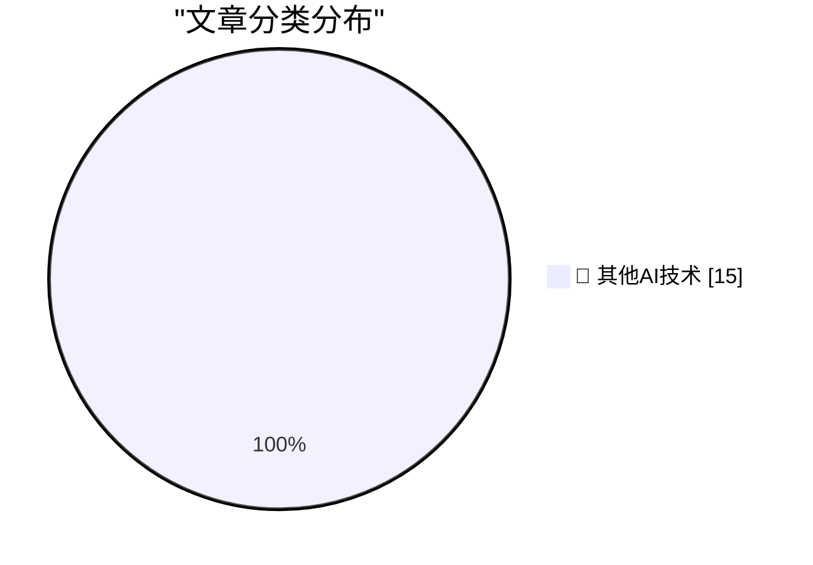

# 📰 AI 博客每日精选 — 2026-05-29

> 来自 98 个技术博客和社交媒体源，AI 精选 Top 15

## 🏆 今日必读

🥇 **It's hard to justify buying a Framework 12**

[It's hard to justify buying a Framework 12](https://www.jeffgeerling.com/blog/2026/its-hard-to-justify-framework-12/) — jeffgeerling.com · 8 小时前 · 🔬 其他AI技术

> It's hard to justify buying a Framework 12

🥈 **One Group, Clearly, Is Deranged**

[One Group, Clearly, Is Deranged](https://paulkrugman.substack.com/p/whos-deranged-exactly) — daringfireball.net · 6 小时前 · 🔬 其他AI技术

> One Group, Clearly, Is Deranged

🥉 **The UK Government's Low Value Purchase System is a Waste of Time**

[The UK Government's Low Value Purchase System is a Waste of Time](https://shkspr.mobi/blog/2026/05/the-uk-governments-low-value-purchase-system-is-a-waste-of-time/) — shkspr.mobi · 10 小时前 · 🔬 其他AI技术

> The UK Government's Low Value Purchase System is a Waste of Time

4️⃣ **Composer’s dependency policies**

[Composer’s dependency policies](https://nesbitt.io/2026/05/29/composer-dependency-policies.html) — nesbitt.io · 12 小时前 · 🔬 其他AI技术

> Composer’s dependency policies

5️⃣ **Premium: What If...We're In An AI Bubble? (Part 3)**

[Premium: What If...We're In An AI Bubble? (Part 3)](https://www.wheresyoured.at/premium-what-if-were-in-an-ai-bubble-part-3/) — wheresyoured.at · 5 小时前 · 🔬 其他AI技术

> Premium: What If...We're In An AI Bubble? (Part 3)

---

## 📊 数据概览

| 扫描源 | 抓取文章 | 时间范围 | 精选 |
|:---:|:---:|:---:|:---:|
| 78/98 | 2809 篇 → 25 篇 | 24h | **15 篇** |

### 分类分布

---

====================

## 🔬 其他AI技术

### 1. It's hard to justify buying a Framework 12

[It's hard to justify buying a Framework 12](https://www.jeffgeerling.com/blog/2026/its-hard-to-justify-framework-12/) — **jeffgeerling.com** · 8 小时前 · ⭐ 15/25

> It's hard to justify buying a Framework 12

📌 其他AI技术

---

### 2. One Group, Clearly, Is Deranged

[One Group, Clearly, Is Deranged](https://paulkrugman.substack.com/p/whos-deranged-exactly) — **daringfireball.net** · 6 小时前 · ⭐ 15/25

> One Group, Clearly, Is Deranged

📌 其他AI技术

---

### 3. The UK Government's Low Value Purchase System is a Waste of Time

[The UK Government's Low Value Purchase System is a Waste of Time](https://shkspr.mobi/blog/2026/05/the-uk-governments-low-value-purchase-system-is-a-waste-of-time/) — **shkspr.mobi** · 10 小时前 · ⭐ 15/25

> The UK Government's Low Value Purchase System is a Waste of Time

📌 其他AI技术

---

### 4. Composer’s dependency policies

[Composer’s dependency policies](https://nesbitt.io/2026/05/29/composer-dependency-policies.html) — **nesbitt.io** · 12 小时前 · ⭐ 15/25

> Composer’s dependency policies

📌 其他AI技术

---

### 5. Premium: What If...We're In An AI Bubble? (Part 3)

[Premium: What If...We're In An AI Bubble? (Part 3)](https://www.wheresyoured.at/premium-what-if-were-in-an-ai-bubble-part-3/) — **wheresyoured.at** · 5 小时前 · ⭐ 15/25

> Premium: What If...We're In An AI Bubble? (Part 3)

📌 其他AI技术

---

### 6. This Week on The Analog Antiquarian

[This Week on The Analog Antiquarian](https://www.filfre.net/2026/05/this-week-on-the-analog-antiquarian/) — **filfre.net** · 5 小时前 · ⭐ 15/25

> This Week on The Analog Antiquarian

📌 其他AI技术

---

### 7. Why people say CRTs don’t have pixels

[Why people say CRTs don’t have pixels](https://dfarq.homeip.net/why-people-say-crts-dont-have-pixels/?utm_source=rss&#038;utm_medium=rss&#038;utm_campaign=why-people-say-crts-dont-have-pixels) — **dfarq.homeip.net** · 11 小时前 · ⭐ 15/25

> Why people say CRTs don’t have pixels

📌 其他AI技术

---

### 8. DR DOS: Revenge of CP/M

[DR DOS: Revenge of CP/M](https://dfarq.homeip.net/dr-dos-revenge-of-cp-m/?utm_source=rss&#038;utm_medium=rss&#038;utm_campaign=dr-dos-revenge-of-cp-m) — **dfarq.homeip.net** · 11 小时前 · ⭐ 15/25

> DR DOS: Revenge of CP/M

📌 其他AI技术

---

### 9. What's going on with Gemini?

[What's going on with Gemini?](https://martinalderson.com/posts/whats-going-on-with-gemini/?utm_source=rss&amp;utm_medium=rss&amp;utm_campaign=feed) — **martinalderson.com** · 22 小时前 · ⭐ 15/25

> What's going on with Gemini?

📌 其他AI技术

---

### 10. Windows users, this one’s for you. Computer use now works on Windows, so Codex can take action on your Windows computer. And with Windows support for...

[Windows users, this one’s for you. Computer use now works on Windows, so Codex can take action on your Windows computer. And with Windows support for...](https://x.com/OpenAI/status/2060428604727771421) — **𝕏 @OpenAI** · 3 小时前 · ⭐ 15/25

> Windows users, this one’s for you. Computer use now works on Windows, so Codex can take action on your Windows computer. And with Windows support for...

📌 其他AI技术

---

### 11. We’re taking steps to accelerate defensive progress in biology: - Launching Rosalind Biodefense to help trusted builders develop new biodefense and p...

[We’re taking steps to accelerate defensive progress in biology: - Launching Rosalind Biodefense to help trusted builders develop new biodefense and p...](https://x.com/OpenAI/status/2060376598642405492) — **𝕏 @OpenAI** · 7 小时前 · ⭐ 15/25

> We’re taking steps to accelerate defensive progress in biology: - Launching Rosalind Biodefense to help trusted builders develop new biodefense and p...

📌 其他AI技术

---

### 12. The GitHub Innovation Graph is fun to watch (who doesn't love a bar race? 🏁) but it's also a source of compelling economic data. It's helping resea...

[The GitHub Innovation Graph is fun to watch (who doesn't love a bar race? 🏁) but it's also a source of compelling economic data. It's helping resea...](https://x.com/github/status/2060437607947911282) — **𝕏 @GitHub** · 3 小时前 · ⭐ 15/25

> The GitHub Innovation Graph is fun to watch (who doesn't love a bar race? 🏁) but it's also a source of compelling economic data. It's helping resea...

📌 其他AI技术

---

### 13. Mona drink float, cabana set, that <body> tee you've all been asking for: it's all here. Plus, a tiny hoodie for your drink. You're welcome. The ESC C...

[Mona drink float, cabana set, that <body> tee you've all been asking for: it's all here. Plus, a tiny hoodie for your drink. You're welcome. The ESC C...](https://x.com/github/status/2060144175085945222) — **𝕏 @GitHub** · 22 小时前 · ⭐ 15/25

> Mona drink float, cabana set, that <body> tee you've all been asking for: it's all here. Plus, a tiny hoodie for your drink. You're welcome. The ESC C...

📌 其他AI技术

---

### 14. Hello Gemini 3.5 Flash ⚡ Now available for Custom Agents. Hover to compare speed, smarts, and cost between models.

[Hello Gemini 3.5 Flash ⚡ Now available for Custom Agents. Hover to compare speed, smarts, and cost between models.](https://x.com/NotionHQ/status/2060459471445659866) — **𝕏 @NotionHQ** · 1 小时前 · ⭐ 15/25

> Hello Gemini 3.5 Flash ⚡ Now available for Custom Agents. Hover to compare speed, smarts, and cost between models.

📌 其他AI技术

---

### 15. Bet you forgot about this...

[Bet you forgot about this...](https://x.com/NotionHQ/status/2060431448356917615) — **𝕏 @NotionHQ** · 3 小时前 · ⭐ 15/25

> Bet you forgot about this...

📌 其他AI技术

---

====================

*生成于 2026-05-29 22:27 | 扫描 78 源 → 获取 2809 篇 → 精选 15 篇*
*基于 [Hacker News Popularity Contest 2025](https://refactoringenglish.com/tools/hn-popularity/) RSS 源列表，由 [Andrej Karpathy](https://x.com/karpathy) 推荐*
*由「懂点儿AI」制作，欢迎关注同名微信公众号获取更多 AI 实用技巧 💡*
