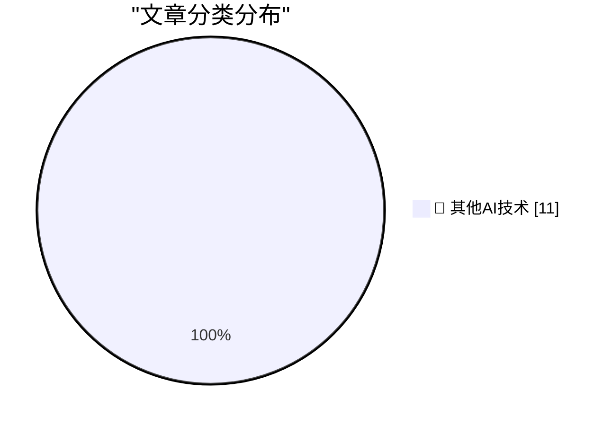

# 📰 AI 博客每日精选 — 2026-05-30

> 来自 98 个技术博客和社交媒体源，AI 精选 Top 11

## 🏆 今日必读

🥇 **Meta Is Launching Instagram, Facebook, and WhatsApp Subscriptions for ‘Fun Features’**

[Meta Is Launching Instagram, Facebook, and WhatsApp Subscriptions for ‘Fun Features’](https://techcrunch.com/2026/05/27/meta-officially-launches-instagram-facebook-and-whatsapp-subscriptions-with-more-to-come-including-ai-plans/) — daringfireball.net · 6 小时前 · 🔬 其他AI技术

> Meta Is Launching Instagram, Facebook, and WhatsApp Subscriptions for ‘Fun Features’

🥈 **Daniel Jalkut on AI**

[Daniel Jalkut on AI](https://mastodon.social/@danielpunkass/116639318125898071) — daringfireball.net · 6 小时前 · 🔬 其他AI技术

> Daniel Jalkut on AI

🥉 **Yours Truly on TBPN Yesterday**

[Yours Truly on TBPN Yesterday](https://www.youtube.com/live/sQVwLUxFdMY?t=1997) — daringfireball.net · 9 小时前 · 🔬 其他AI技术

> Yours Truly on TBPN Yesterday

4️⃣ **Arp 114:**

[Arp 114:](https://maurycyz.com/astro/arp114/) — maurycyz.com · 21 小时前 · 🔬 其他AI技术

> Arp 114:

5️⃣ **Pluralistic: Carneyism without Carney (30 May 2026)**

[Pluralistic: Carneyism without Carney (30 May 2026)](https://pluralistic.net/2026/05/30/rupture/) — pluralistic.net · 12 小时前 · 🔬 其他AI技术

> Pluralistic: Carneyism without Carney (30 May 2026)

---

## 📊 数据概览

| 扫描源 | 抓取文章 | 时间范围 | 精选 |
|:---:|:---:|:---:|:---:|
| 78/98 | 2812 篇 → 11 篇 | 24h | **11 篇** |

### 分类分布

---

====================

## 🔬 其他AI技术

### 1. Meta Is Launching Instagram, Facebook, and WhatsApp Subscriptions for ‘Fun Features’

[Meta Is Launching Instagram, Facebook, and WhatsApp Subscriptions for ‘Fun Features’](https://techcrunch.com/2026/05/27/meta-officially-launches-instagram-facebook-and-whatsapp-subscriptions-with-more-to-come-including-ai-plans/) — **daringfireball.net** · 6 小时前 · ⭐ 15/25

> Meta Is Launching Instagram, Facebook, and WhatsApp Subscriptions for ‘Fun Features’

📌 其他AI技术

---

### 2. Daniel Jalkut on AI

[Daniel Jalkut on AI](https://mastodon.social/@danielpunkass/116639318125898071) — **daringfireball.net** · 6 小时前 · ⭐ 15/25

> Daniel Jalkut on AI

📌 其他AI技术

---

### 3. Yours Truly on TBPN Yesterday

[Yours Truly on TBPN Yesterday](https://www.youtube.com/live/sQVwLUxFdMY?t=1997) — **daringfireball.net** · 9 小时前 · ⭐ 15/25

> Yours Truly on TBPN Yesterday

📌 其他AI技术

---

### 4. Arp 114:

[Arp 114:](https://maurycyz.com/astro/arp114/) — **maurycyz.com** · 21 小时前 · ⭐ 15/25

> Arp 114:

📌 其他AI技术

---

### 5. Pluralistic: Carneyism without Carney (30 May 2026)

[Pluralistic: Carneyism without Carney (30 May 2026)](https://pluralistic.net/2026/05/30/rupture/) — **pluralistic.net** · 12 小时前 · ⭐ 15/25

> Pluralistic: Carneyism without Carney (30 May 2026)

📌 其他AI技术

---

### 6. On first looking into JAX

[On first looking into JAX](https://www.gilesthomas.com/2026/05/on-first-looking-into-jax) — **gilesthomas.com** · 3 小时前 · ⭐ 15/25

> On first looking into JAX

📌 其他AI技术

---

### 7. Notes from May 2026

[Notes from May 2026](https://evanhahn.com/notes-from-may-2026/) — **evanhahn.com** · 21 小时前 · ⭐ 15/25

> Notes from May 2026

📌 其他AI技术

---

### 8. This Week in Package Management: 30 May 2026

[This Week in Package Management: 30 May 2026](https://nesbitt.io/2026/05/30/this-week-in-package-management.html) — **nesbitt.io** · 11 小时前 · ⭐ 15/25

> This Week in Package Management: 30 May 2026

📌 其他AI技术

---

### 9. GitHub is heading to Microsoft Build. Coding, AI, workflows, and more are on the docket. 💻 Join in person or virtually June 2-3. 👇 https://githu...

[GitHub is heading to Microsoft Build. Coding, AI, workflows, and more are on the docket. 💻 Join in person or virtually June 2-3. 👇 https://githu...](https://x.com/github/status/2060792256269828261) — **𝕏 @GitHub** · 3 小时前 · ⭐ 15/25

> GitHub is heading to Microsoft Build. Coding, AI, workflows, and more are on the docket. 💻 Join in person or virtually June 2-3. 👇 https://githu...

📌 其他AI技术

---

### 10. Maintainers, have you checked out the 2026 Partner Pack? 👀 These exclusive discounts, freebies, and perks are waiting for you. 🎁 https://maintai...

[Maintainers, have you checked out the 2026 Partner Pack? 👀 These exclusive discounts, freebies, and perks are waiting for you. 🎁 https://maintai...](https://x.com/github/status/2060492656837304596) — **𝕏 @GitHub** · 23 小时前 · ⭐ 15/25

> Maintainers, have you checked out the 2026 Partner Pack? 👀 These exclusive discounts, freebies, and perks are waiting for you. 🎁 https://maintai...

📌 其他AI技术

---

### 11. RT Amelia Salyers: In @NotionHQ SF office, there are stacks of 1930s and 40s @FortuneMagazine on every side table, like bait for the taste-seekers. Cc...

[RT Amelia Salyers: In @NotionHQ SF office, there are stacks of 1930s and 40s @FortuneMagazine on every side table, like bait for the taste-seekers. Cc...](https://x.com/NotionHQ/status/2060766303640531057) — **𝕏 @NotionHQ** · 5 小时前 · ⭐ 15/25

> RT Amelia Salyers: In @NotionHQ SF office, there are stacks of 1930s and 40s @FortuneMagazine on every side table, like bait for the taste-seekers. Cc...

📌 其他AI技术

---

====================

*生成于 2026-05-30 21:58 | 扫描 78 源 → 获取 2812 篇 → 精选 11 篇*
*基于 [Hacker News Popularity Contest 2025](https://refactoringenglish.com/tools/hn-popularity/) RSS 源列表，由 [Andrej Karpathy](https://x.com/karpathy) 推荐*
*由「懂点儿AI」制作，欢迎关注同名微信公众号获取更多 AI 实用技巧 💡*
