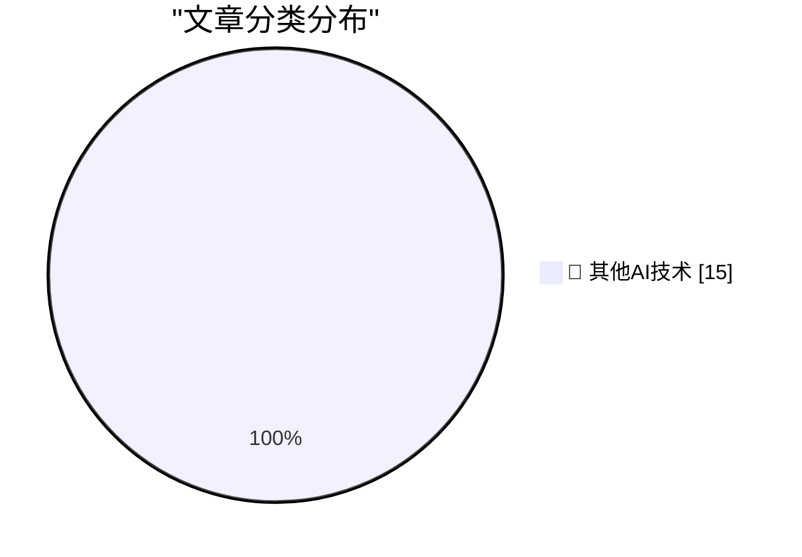

# 📰 AI 博客每日精选 — 2026-06-01

> 来自 98 个技术博客和社交媒体源，AI 精选 Top 15

## 🏆 今日必读

🥇 **Weird projects I shipped with AI**

[Weird projects I shipped with AI](https://seangoedecke.com/weird-projects-i-shipped-with-ai/) — seangoedecke.com · 22 小时前 · 🔬 其他AI技术

> Weird projects I shipped with AI

🥈 **‘We Are Living in Pinocchio’s World’**

[‘We Are Living in Pinocchio’s World’](https://om.co/2026/05/25/we-are-living-in-pinocchios-world/) — daringfireball.net · 2 小时前 · 🔬 其他AI技术

> ‘We Are Living in Pinocchio’s World’

🥉 **Amazon Made AI Podcasts for Products**

[Amazon Made AI Podcasts for Products](https://www.businessinsider.com/amazon-ai-generated-podcasts-products-2026-4) — daringfireball.net · 6 小时前 · 🔬 其他AI技术

> Amazon Made AI Podcasts for Products

4️⃣ **The Talk Show Live From WWDC 2026: Tuesday June 9**

[The Talk Show Live From WWDC 2026: Tuesday June 9](https://ti.to/daringfireball/the-talk-show-live-from-wwdc-2026) — daringfireball.net · 21 小时前 · 🔬 其他AI技术

> The Talk Show Live From WWDC 2026: Tuesday June 9

5️⃣ **exe.dev**

[exe.dev](https://exe.dev/?df) — daringfireball.net · 21 小时前 · 🔬 其他AI技术

> exe.dev

---

## 📊 数据概览

| 扫描源 | 抓取文章 | 时间范围 | 精选 |
|:---:|:---:|:---:|:---:|
| 78/98 | 2816 篇 → 21 篇 | 24h | **15 篇** |

### 分类分布

---

====================

## 🔬 其他AI技术

### 1. Weird projects I shipped with AI

[Weird projects I shipped with AI](https://seangoedecke.com/weird-projects-i-shipped-with-ai/) — **seangoedecke.com** · 22 小时前 · ⭐ 15/25

> Weird projects I shipped with AI

📌 其他AI技术

---

### 2. ‘We Are Living in Pinocchio’s World’

[‘We Are Living in Pinocchio’s World’](https://om.co/2026/05/25/we-are-living-in-pinocchios-world/) — **daringfireball.net** · 2 小时前 · ⭐ 15/25

> ‘We Are Living in Pinocchio’s World’

📌 其他AI技术

---

### 3. Amazon Made AI Podcasts for Products

[Amazon Made AI Podcasts for Products](https://www.businessinsider.com/amazon-ai-generated-podcasts-products-2026-4) — **daringfireball.net** · 6 小时前 · ⭐ 15/25

> Amazon Made AI Podcasts for Products

📌 其他AI技术

---

### 4. The Talk Show Live From WWDC 2026: Tuesday June 9

[The Talk Show Live From WWDC 2026: Tuesday June 9](https://ti.to/daringfireball/the-talk-show-live-from-wwdc-2026) — **daringfireball.net** · 21 小时前 · ⭐ 15/25

> The Talk Show Live From WWDC 2026: Tuesday June 9

📌 其他AI技术

---

### 5. exe.dev

[exe.dev](https://exe.dev/?df) — **daringfireball.net** · 21 小时前 · ⭐ 15/25

> exe.dev

📌 其他AI技术

---

### 6. Take Two

[Take Two](https://x.com/markgurman/status/2061236259843182813) — **daringfireball.net** · 22 小时前 · ⭐ 15/25

> Take Two

📌 其他AI技术

---

### 7. The web is changing, and we are not going back

[The web is changing, and we are not going back](https://idiallo.com/blog/web-is-changing-we-are-not-going-back?src=feed) — **idiallo.com** · 3 小时前 · ⭐ 15/25

> The web is changing, and we are not going back

📌 其他AI技术

---

### 8. Pluralistic: Molly Crabapple's 'Here Where We Live Is Our Country' (01 Jun 2026)

[Pluralistic: Molly Crabapple's 'Here Where We Live Is Our Country' (01 Jun 2026)](https://pluralistic.net/2026/06/01/doikayt/) — **pluralistic.net** · 13 小时前 · ⭐ 15/25

> Pluralistic: Molly Crabapple's 'Here Where We Live Is Our Country' (01 Jun 2026)

📌 其他AI技术

---

### 9. "No way to prevent this" say users of only package manager where this regularly happens

["No way to prevent this" say users of only package manager where this regularly happens](https://xeiaso.net/shitposts/no-way-to-prevent-this/supply-chain/2026-redhat-javascript-clients/) — **xeiaso.net** · 22 小时前 · ⭐ 15/25

> "No way to prevent this" say users of only package manager where this regularly happens

📌 其他AI技术

---

### 10. The Infosec Phrasebook

[The Infosec Phrasebook](https://nesbitt.io/2026/06/01/the-infosec-phrasebook.html) — **nesbitt.io** · 12 小时前 · ⭐ 15/25

> The Infosec Phrasebook

📌 其他AI技术

---

### 11. Intel 8088s and non-Intel non-clones

[Intel 8088s and non-Intel non-clones](https://dfarq.homeip.net/intel-8088s-and-non-intel-non-clones/?utm_source=rss&#038;utm_medium=rss&#038;utm_campaign=intel-8088s-and-non-intel-non-clones) — **dfarq.homeip.net** · 11 小时前 · ⭐ 15/25

> Intel 8088s and non-Intel non-clones

📌 其他AI技术

---

### 12. Micro Instrumentation and Telemetry Systems

[Micro Instrumentation and Telemetry Systems](https://www.abortretry.fail/p/micro-instrumentation-and-telemetry) — **abortretry.fail** · 21 小时前 · ⭐ 15/25

> Micro Instrumentation and Telemetry Systems

📌 其他AI技术

---

### 13. The art and engineering of Silpheed

[The art and engineering of Silpheed](https://fabiensanglard.net/silpheed/index.html) — **fabiensanglard.net** · 22 小时前 · ⭐ 15/25

> The art and engineering of Silpheed

📌 其他AI技术

---

### 14. Checking assembly with Z3

[Checking assembly with Z3](https://bernsteinbear.com/blog/asm-z3/?utm_source=rss) — **bernsteinbear.com** · 22 小时前 · ⭐ 15/25

> Checking assembly with Z3

📌 其他AI技术

---

### 15. OpenAI frontier models and Codex are now generally available on AWS, giving enterprises a new way to build on Amazon Bedrock with OpenAI through the s...

[OpenAI frontier models and Codex are now generally available on AWS, giving enterprises a new way to build on Amazon Bedrock with OpenAI through the s...](https://x.com/OpenAI/status/2061564502160892138) — **𝕏 @OpenAI** · 1 小时前 · ⭐ 15/25

> OpenAI frontier models and Codex are now generally available on AWS, giving enterprises a new way to build on Amazon Bedrock with OpenAI through the s...

📌 其他AI技术

---

====================

*生成于 2026-06-01 22:59 | 扫描 78 源 → 获取 2816 篇 → 精选 15 篇*
*基于 [Hacker News Popularity Contest 2025](https://refactoringenglish.com/tools/hn-popularity/) RSS 源列表，由 [Andrej Karpathy](https://x.com/karpathy) 推荐*
*由「懂点儿AI」制作，欢迎关注同名微信公众号获取更多 AI 实用技巧 💡*
